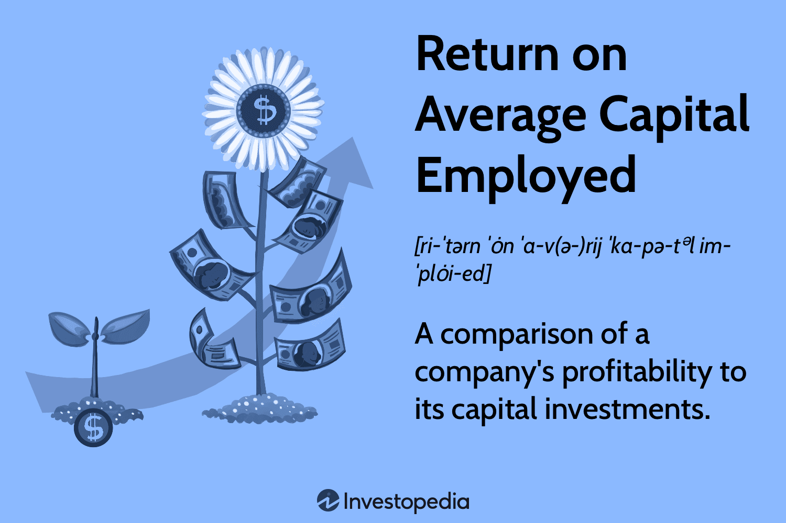

## Table of Contents

## What is Return on Average Capital Employed (ROACE)?

Return on Average Capital Employed, or ROACE, is a financial metric that shows how well a company is using its money to make profits. It tells investors how much profit a company is making compared to the money it has put into its business. To find ROACE, you take the company's earnings before interest and taxes (EBIT) and divide it by the average capital employed. The average capital employed is usually the average of the company's total assets minus its current liabilities at the start and end of a period.

ROACE is important because it helps investors see if a company is good at turning its investments into profits. A high ROACE means the company is using its money efficiently, which is good for investors. On the other hand, a low ROACE might mean the company is not using its money well. By comparing the ROACE of different companies, investors can decide which ones are better at making money from their investments.

## How is ROACE calculated?

ROACE is calculated by dividing a company's earnings before interest and taxes (EBIT) by its average capital employed. EBIT is the money a company makes from its normal business activities before it pays interest on loans or taxes. Average capital employed is found by taking the total assets of the company and subtracting its current liabilities, then averaging this number over a period, usually a year. This gives you the average amount of money the company has used in its operations.

To find the average capital employed, you add the capital employed at the beginning of the period to the capital employed at the end of the period, then divide by two. For example, if a company had capital employed of $100,000 at the start of the year and $120,000 at the end, the average capital employed would be ($100,000 + $120,000) / 2 = $110,000. Once you have the EBIT and the average capital employed, you can calculate ROACE by dividing EBIT by the average capital employed. If the EBIT was $22,000, then ROACE would be $22,000 / $110,000 = 0.20 or 20%.

## Why is ROACE important for investors and companies?

ROACE is important for investors because it helps them see how well a company is using its money to make profits. When a company has a high ROACE, it means the company is good at turning the money it has invested into more money. This is important for investors because they want their money to grow. By comparing the ROACE of different companies, investors can decide which ones are better at making money from their investments. This helps them choose where to put their money for the best return.

For companies, ROACE is important because it shows them how well they are managing their money. If a company's ROACE is low, it might mean they need to find better ways to use their money or invest in different projects. A high ROACE can also make a company look good to investors, which can help the company get more money to grow. By keeping an eye on their ROACE, companies can make smarter decisions about where to put their money to keep making profits.

## What is considered a good ROACE percentage?

A good ROACE percentage depends on the industry the company is in. Generally, a ROACE of around 15% or higher is considered good. This means the company is doing a good job of using its money to make profits. But, some industries might have a higher or lower average ROACE because of the way they work or how much money they need to invest.

For example, industries like technology or pharmaceuticals might have higher ROACE percentages because they can make a lot of money from their products. On the other hand, industries like utilities or retail might have lower ROACE because they need to spend a lot of money on things like buildings or equipment. So, when looking at ROACE, it's important to compare a company's ROACE to others in the same industry to see if it's doing well.

## How does ROACE differ from Return on Capital Employed (ROCE)?

ROACE and ROCE are similar because they both measure how well a company uses its money to make profits. The main difference is in how they calculate the capital employed. ROCE uses the capital employed at a specific point in time, usually at the end of the year. On the other hand, ROACE uses the average capital employed over a period, which is usually the average of the capital employed at the start and end of the year. This makes ROACE a bit more accurate because it takes into account changes in the company's capital over time.

Both ROACE and ROCE are important for investors and companies. They help show how good a company is at turning its investments into profits. But because ROACE uses an average, it can give a smoother picture of a company's performance over time. This can be helpful when a company's capital changes a lot during the year. ROCE might be easier to calculate, but ROACE might give a better idea of how well a company is doing overall.

## Can ROACE be used to compare companies in different industries?

ROACE can be used to compare companies in different industries, but it's important to be careful. Each industry has its own way of working and needs different amounts of money to run. For example, a tech company might have a high ROACE because it doesn't need to spend as much on big things like factories or stores. On the other hand, a utility company might have a lower ROACE because it needs a lot of money to build power plants and maintain them. So, when comparing ROACE across industries, it's good to know what's normal for each industry.

Even though it's tricky, ROACE can still give you a general idea of how well a company is using its money to make profits. If you see a company with a much higher ROACE than others in different industries, it might mean that company is doing something really well. But, to get a fair comparison, it's better to look at companies within the same industry. This way, you can see if a company is doing better or worse than its direct competitors.

## What are the limitations of using ROACE as a performance metric?

ROACE is a useful way to see how well a company is using its money to make profits, but it has some problems. One big problem is that ROACE doesn't tell you everything about a company's health. It only looks at how much profit a company makes compared to the money it has put into its business. This means it might not show if a company has a lot of debt or if it's having trouble paying its bills. Also, ROACE can be affected by things like how a company decides to value its assets, which can make it hard to compare different companies fairly.

Another issue with ROACE is that it can change a lot from year to year. This can happen because of changes in the economy, new laws, or even because a company decides to invest a lot of money in new projects. These changes can make ROACE go up or down even if the company is doing the same kind of work. This makes it hard to use ROACE to predict how a company will do in the future. So, while ROACE can give you a good idea of how well a company is using its money right now, it's not perfect and should be used with other ways of looking at a company's performance.

## How can a company improve its ROACE?

A company can improve its ROACE by focusing on increasing its earnings before interest and taxes (EBIT). One way to do this is by finding ways to make more money, like selling more products or services, or raising prices if the market allows it. Another way is to cut costs. This could mean finding cheaper ways to make things, using less energy, or spending less on things that aren't needed. By making more money or spending less, the company's EBIT goes up, which can make the ROACE higher.

The other way to improve ROACE is by managing the capital employed more carefully. This means being smart about how the company uses its money. If the company can sell off assets it doesn't need, like old equipment or buildings, it can reduce the amount of money tied up in the business. Also, if the company can find ways to use its money more efficiently, like investing in projects that make more money than they cost, it can lower the average capital employed. By keeping the capital employed down while keeping or increasing EBIT, the company's ROACE will go up.

## What role does depreciation and amortization play in calculating ROACE?

Depreciation and amortization are important when calculating ROACE because they affect the company's earnings before interest and taxes (EBIT). Depreciation is the way a company spreads out the cost of things like buildings and equipment over time. Amortization does the same thing but for things like patents or software. Both of these reduce the company's EBIT because they are costs that the company has to account for, even though they don't involve spending actual money right away. So, when you calculate ROACE, you have to include depreciation and amortization in the EBIT number to get a true picture of the company's profits.

These costs also affect the capital employed part of the ROACE calculation. When a company buys something like a new factory, it adds to the total assets, which is part of the capital employed. But as the factory gets older, its value goes down because of depreciation. This means the capital employed can change over time. The same goes for amortization with intangible assets. So, when figuring out the average capital employed for ROACE, you need to think about how depreciation and amortization change the value of the company's assets over the period you're looking at.

## How does the use of debt affect ROACE?

Using debt can make a company's ROACE look better because it increases the money the company can use to make profits without increasing the capital employed as much. When a company borrows money, it doesn't count as capital employed in the ROACE calculation. So, if the company uses that borrowed money to make more profits, its EBIT goes up, which can make the ROACE higher. This is why some companies might choose to use debt to try to improve their ROACE.

But, using a lot of debt can also be risky. If a company can't make enough money to pay back the debt, it might have problems. Also, the interest the company has to pay on the debt isn't counted in the EBIT part of ROACE, but it still affects the company's overall health. So, while debt can make ROACE look good in the short term, it's important for companies to use it wisely and not too much, or it could lead to bigger problems later.

## How can ROACE be manipulated and what are the signs of such manipulation?

A company can make its ROACE look better by changing how it reports its earnings or its capital employed. For example, a company might decide to sell off some of its assets that aren't making money. This can lower the capital employed, making the ROACE go up even if the company's profits stay the same. Another way is by using accounting tricks to make the earnings look higher. This could mean moving costs to a different time period or counting money from one-time events as regular earnings.

You can spot these tricks by looking at a few things. If a company's ROACE suddenly jumps up a lot without a clear reason, it might be a sign of manipulation. Also, if the company is selling off a lot of its assets, this could be a way to make the capital employed number smaller. It's a good idea to compare the company's ROACE with others in the same industry and to look at other financial numbers, like how much debt the company has, to get a full picture.

## What advanced techniques can be used to analyze ROACE trends over time?

To analyze ROACE trends over time, one advanced technique is to use a moving average. This means you take the ROACE numbers from several years and average them out. This smooths out the ups and downs and helps you see the overall trend more clearly. For example, if you use a three-year moving average, you would take the ROACE from year one, two, and three, add them up, and divide by three. Then, you would do the same for year two, three, and four, and so on. This way, you can see if the company's ROACE is getting better or worse over time without being thrown off by one good or bad year.

Another technique is to use regression analysis. This is a bit more complicated, but it can help you understand how different things affect ROACE. For example, you could look at how changes in the company's sales, costs, or investments affect its ROACE over time. By putting all this data into a computer program, you can find out which factors are most important for the company's ROACE. This can help you predict how the company's ROACE might change in the future if certain things happen. It's like trying to guess what will happen to the ROACE if the company starts selling more products or if it decides to buy new equipment.

## What is the understanding of Capital Employed and ROACE?

Capital employed is a crucial concept in financial analysis, representing the total amount of capital that a company utilizes in order to generate profits. This includes both equity and debt capital invested in the company. Essentially, it is the sum of shareholders’ equity and debt liabilities, providing a comprehensive view of the capital structure used for operational activities.

Return on Average Capital Employed (ROACE) is a key performance metric that evaluates how effectively a company is using its capital, by considering the average capital over a given period of time. By using average capital, ROACE smooths out fluctuations and seasonal variances that may occur within a financial period, offering a more stable and realistic measure of capital utilization. This is particularly valuable in industries where inventory levels and sales can vary significantly throughout the year.

The formula for calculating ROACE is given by:

$$
\text{ROACE} = \frac{\text{EBIT}}{\text{Average Total Assets} - \text{Average Current Liabilities}}
$$

In this formula, EBIT represents earnings before interest and taxes, a measure of a company's profitability that excludes expenses related to debt interest and tax liabilities. The average total assets are the mean of the beginning and ending total assets for the period, and the average current liabilities are calculated similarly. These average figures help mitigate the effects of short-term fluctuations in asset and liability values, thus providing a more accurate reflection of capital employed over the period.

By applying the ROACE formula, financial analysts can assess whether a company is generating sufficient returns relative to the capital it employs. A higher ROACE indicates a more efficient use of capital, leading to better returns for investors and stakeholders. In summary, the concept of capital employed and its measurement through ROACE are fundamental to understanding a company’s capital efficiency and operational effectiveness.

## How is ROACE calculated?

ROACE (Return on Average Capital Employed) is a financial metric that assesses a company's profitability in relation to its capital investments over a specified period. It is calculated by dividing the company's Earnings Before Interest and Taxes (EBIT) by the difference between the average total assets and average current liabilities over that period. The formula is expressed mathematically as follows:

$$
\text{ROACE} = \frac{\text{EBIT}}{\text{Average Total Assets} - \text{Average Current Liabilities}}
$$

To compute ROACE accurately, several steps must be followed. Initially, the company's EBIT must be determined. EBIT is a measure of a company's profitability that excludes interest and income tax expenses, providing a clearer picture of operating performance.

Subsequently, average total assets and average current liabilities need to be calculated. This involves determining the total assets and current liabilities at the beginning and end of the financial period and then averaging these figures. This approach is beneficial as it mitigates the impact of short-term fluctuations and provides a more consistent view of the company's financial status throughout the financial period, as opposed to evaluating it at a single point in time.

For example, let's consider a company with the following simplified balance sheet data:

- Total assets at the beginning of the year: $500,000
- Total assets at the end of the year: $600,000
- Current liabilities at the beginning of the year: $100,000
- Current liabilities at the end of the year: $150,000

The average total assets would be:

$$
\text{Average Total Assets} = \frac{500,000 + 600,000}{2} = 550,000
$$

Similarly, the average current liabilities would be:

$$
\text{Average Current Liabilities} = \frac{100,000 + 150,000}{2} = 125,000
$$

If the EBIT for the period was $50,000, the ROACE would be calculated as:

$$
\text{ROACE} = \frac{50,000}{550,000 - 125,000} = \frac{50,000}{425,000} \approx 11.76\%
$$

This calculation demonstrates how ROACE offers a realistic assessment of capital utilization by smoothing out temporary discrepancies and ensuring that decisions are based on a comprehensive view of the company’s financial activities over an entire period. This metric proves valuable for analysts and investors looking for consistent and realistic indicators of operational efficiency and profitability.

## What is the comparison between ROACE and other financial metrics?

Return on Average Capital Employed (ROACE), Return on Capital Employed (ROCE), and Return on Assets (ROA) are pivotal metrics used to assess a firm's capital utilization and profitability, yet they differ in their calculation methodologies and insights they provide.

ROACE is characterized by its use of average capital values over a period, smoothing out fluctuations common in financial figures, especially for firms with significant seasonal variations. This metric helps in providing a more stable and realistic picture of how effectively the capital is being utilized to generate earnings throughout the financial cycle. The formula for ROACE is:

$$
\text{ROACE} = \frac{\text{EBIT}}{\text{Average Total Assets} - \text{Average Current Liabilities}}
$$

In contrast, ROCE evaluates the efficiency and profitability of a company relative to its total capital employed, defined at a single point in time. The calculation does not account for potential variability in figures throughout the period, potentially leading to skewed interpretations if significant changes occur in the capital structure. ROCE is calculated as:

$$
\text{ROCE} = \frac{\text{EBIT}}{\text{Total Assets} - \text{Current Liabilities}}
$$

On the other hand, ROA measures a company's ability to generate earnings from its assets, without considering the liability structure. Unlike ROACE and ROCE, ROA gives an indication of how well the assets are being deployed to produce profit, irrespective of the capital financing source. The formula for ROA is:

$$
\text{ROA} = \frac{\text{Net Income}}{\text{Total Assets}}
$$

The comparison between ROACE, ROCE, and ROA provides deeper insights into a company’s financial health. ROACE, by using average figures, can present a comprehensive view of profitability over time, mitigating one-time liabilities or asset inflations that may distort ROCE or ROA. In environments with highly variable capital demands, such as manufacturing or industries with large-scale infrastructure projects, ROACE presents a more reliable measure of sustained performance than its counterparts. 

Understanding these distinctions is crucial, as they allow analysts and investors to tailor their assessment rooted in the specific financial dynamics of the company or sector being analyzed. Companies with fluctuating capital demands may appear less volatile under ROACE analysis compared to ROCE or ROA, offering a clearer picture of ongoing operational efficiency and profitability.

## What are the implications of ROACE in algorithmic trading?

In [algorithmic trading](/wiki/algorithmic-trading), the integration of Return on Average Capital Employed (ROACE) as a financial metric addresses the necessity to evaluate and predict historical and future profitability trends. ROACE is calculated as:

$$
\text{ROACE} = \frac{\text{EBIT}}{\text{Average Total Assets} - \text{Average Current Liabilities}}
$$

This formula aligns well with algorithmic trading systems that are designed to process large datasets, enabling them to derive meaningful insights regarding capital efficiency. Algorithmic strategies examine this metric alongside other financial indicators to identify potential investment opportunities. By utilizing ROACE, algorithms can differentiate between companies based on how effectively they manage and utilize capital, providing an additional layer of analysis beyond basic profitability.

An effective algorithmic trading strategy will score companies based on their historical ROACE data. Python, with its robust libraries such as NumPy and pandas, serves well for such data analysis. Here's a basic example of how such a computation might be approached in Python:

```python
import pandas as pd

# Assume df is a DataFrame containing necessary financial information
# Columns: 'EBIT', 'Assets_Start', 'Assets_End', 'Liabilities_Start', 'Liabilities_End'

def calculate_roace(df):
    df['Average_Assets'] = (df['Assets_Start'] + df['Assets_End']) / 2
    df['Average_Liabilities'] = (df['Liabilities_Start'] + df['Liabilities_End']) / 2
    df['ROACE'] = df['EBIT'] / (df['Average_Assets'] - df['Average_Liabilities'])
    return df['ROACE']

# Example usage
financial_data = {
    'EBIT': [1000, 1200],
    'Assets_Start': [8000, 8500],
    'Assets_End': [8200, 8700],
    'Liabilities_Start': [2000, 2200],
    'Liabilities_End': [2100, 2300]
}

df = pd.DataFrame(financial_data)
df['ROACE'] = calculate_roace(df)
print(df['ROACE'])
```

Incorporating ROACE into these systems allows traders to backtest strategies using historical data, optimizing for maximum return on capital employed. Given its industry-specific relevance, ROACE helps in painting a picture of a company’s operational efficiency and strategic management over time. This capability of robustly identifying superior capital allocators makes it an indispensable tool in the arsenal of algorithmic traders aiming to enhance the precision of their market predictions and to devise strategies pinpointing long-term profitably viable investments.

## References & Further Reading

[1]: ["Financial Statement Analysis"](https://www.investopedia.com/terms/f/financial-statement-analysis.asp) by Martin S. Fridson and Fernando Alvarez

[2]: ["Corporate Finance: Theory and Practice"](https://www.amazon.com/Corporate-Finance-Practice-Steve-Lumby/dp/1473758386) by Aswath Damodaran

[3]: ["Business Analysis and Valuation: Using Financial Statements"](https://www.hbs.edu/faculty/Pages/item.aspx?num=31772) by Krishna G. Palepu, Paul M. Healy, and Erik Peek

[4]: Petrin, A. (2008). ["Algorithmic Trading and Information Efficiency in Financial Markets."](https://www.sciencedirect.com/science/article/pii/S016517652400466X) The Journal of Finance, 63(5), 2105-2138.

[5]: ["The Intelligent Investor"](https://en.wikipedia.org/wiki/The_Intelligent_Investor) by Benjamin Graham

[6]: ["Valuation: Measuring and Managing the Value of Companies"](https://www.amazon.com/Valuation-Measuring-Managing-Companies-Finance/dp/1119610885) by McKinsey & Company Inc., Tim Koller, Marc Goedhart, and David Wessels