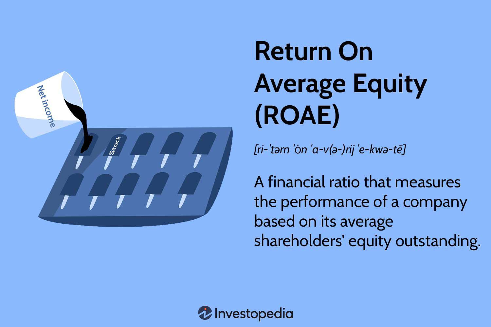

## Table of Contents

## What is Return on Average Equity (ROAE)?

Return on Average Equity (ROAE) is a financial ratio that measures how well a company is using the money invested by its shareholders to generate profit. It shows the percentage of profit a company makes compared to the average amount of equity it has over a certain period, usually a year. This helps investors see how efficiently their money is being used to grow the company's earnings.

ROAE is calculated by dividing the company's net income by its average shareholders' equity. The average equity is found by adding the equity at the start and end of the period and then dividing by two. A higher ROAE means the company is doing a good job at turning shareholder investments into profits. This makes it an important measure for investors who want to know if their money is being used effectively.

## How is ROAE calculated?

ROAE is calculated by dividing a company's net income by its average shareholders' equity. Net income is the profit a company makes after all expenses are paid. Shareholders' equity is the money that belongs to the shareholders, which is what's left after you subtract the company's debts from its assets.

To find the average shareholders' equity, you add the equity at the start of the period to the equity at the end of the period, then divide by two. This gives you a middle ground that represents the equity over time. Once you have the average equity, you divide the net income by this number to get the ROAE. This tells you how well the company is using the money from shareholders to make a profit.

## Why is ROAE important for investors?

ROAE is important for investors because it shows how well a company is using their money to make profits. When investors put money into a company, they want to know if that money is being used well. ROAE tells them if the company is good at turning their investment into more money. A high ROAE means the company is doing a great job at this, which can make investors feel confident about their investment.

Investors also use ROAE to compare different companies. If one company has a higher ROAE than another, it might be a better choice for investment. This helps investors decide where to put their money to get the best return. By looking at ROAE, investors can see which companies are using their money the most effectively and make smarter choices about where to invest.

## How does ROAE differ from Return on Equity (ROE)?

ROAE and ROE are both important numbers that tell investors how well a company is doing with the money they invest. ROE, or Return on Equity, looks at the profit a company makes compared to the money shareholders have in the company at one point in time, usually the end of the year. It's calculated by dividing the net income by the shareholders' equity at the end of the period. This gives a quick snapshot of how well the company is using the money invested in it.

ROAE, or Return on Average Equity, is a bit different because it looks at the average amount of money shareholders have in the company over a whole period, not just at the end. To find ROAE, you take the net income and divide it by the average shareholders' equity, which is the equity at the start of the period plus the equity at the end, divided by two. This gives a more complete picture of how the company is using the money over time, which can be more accurate if the equity changes a lot during the year. Both ROE and ROAE help investors see how good a company is at making money from their investment, but ROAE gives a smoother, more balanced view.

## What does a high ROAE indicate about a company?

A high ROAE means a company is doing a great job at using the money from its shareholders to make profits. When a company has a high ROAE, it shows that it's good at turning the money people invest into more money. This is important because it tells investors that their money is being used well and that the company is growing its earnings effectively.

Investors like to see a high ROAE because it means their investment is working hard for them. If a company keeps a high ROAE over time, it can be a sign that the company is strong and knows how to make money. This can make investors feel more confident about putting their money into the company and expecting good returns in the future.

## Can ROAE be negative, and what does that signify?

Yes, ROAE can be negative. This happens when a company loses money instead of making a profit. If the net income is negative, and you divide it by the average equity, you get a negative ROAE. This means the company is not using the money from shareholders well and is actually losing money.

A negative ROAE is a warning sign for investors. It shows that the company is not doing a good job at turning the money people invest into more money. Instead, the company is losing value, which can make investors worried about their investment. They might decide to take their money out or look for other places to invest where their money can grow.

## How can ROAE be used to compare companies within the same industry?

ROAE is a helpful tool for comparing how well companies in the same industry are doing with the money from their shareholders. When you look at the ROAE of different companies, you can see which ones are better at turning that money into profits. If one company has a higher ROAE than another, it means they are using the money more effectively. This can help investors decide which company might be a better choice for their money.

For example, if you are looking at two companies in the tech industry, and one has a ROAE of 15% while the other has a ROAE of 10%, the first company is doing a better job at making money from the investments. This doesn't mean the second company is bad, but it shows that the first one is more efficient at using shareholder money. By comparing ROAE, investors can get a clear picture of which companies are performing well and make smarter choices about where to invest their money.

## What are the limitations of using ROAE as a performance metric?

ROAE can be a good way to see how well a company is using the money from shareholders, but it has some problems. One big problem is that it can be affected by how much debt a company has. If a company borrows a lot of money, it can make the ROAE look higher because the debt isn't counted in the equity part of the calculation. This can make a company look better than it really is. Also, ROAE doesn't tell you anything about the risks the company is taking to get those profits. A high ROAE might come from taking big risks, which could be bad for investors if things go wrong.

Another problem with ROAE is that it can be hard to compare across different industries. What's a good ROAE in one industry might not be good in another. For example, a tech company might have a different ROAE than a company that makes cars, even if both are doing well. This makes it tricky to use ROAE to compare companies in different fields. Also, ROAE looks at the past and doesn't tell you much about what might happen in the future. A company might have a high ROAE now, but that doesn't mean it will keep doing well. Investors need to think about other things too, not just ROAE, to get a full picture of a company's health.

## How does leverage affect ROAE?

Leverage, which is when a company borrows money, can make ROAE look higher. This happens because ROAE is calculated by dividing the company's net income by its average shareholders' equity. When a company uses debt, it doesn't count that debt as part of the equity. So, if the company makes money using the borrowed money, the profit gets divided by a smaller equity number, making the ROAE go up. This can make a company seem like it's doing better at using shareholder money than it really is.

But using a lot of debt can be risky. If the company can't pay back the money it borrowed, it could get into big trouble. Even though the ROAE might look good, the company could be taking big risks. So, investors need to be careful and look at other things too, not just ROAE, to see if the company is really doing well.

## What role does the time period play in calculating and interpreting ROAE?

The time period is important when calculating and understanding ROAE. ROAE looks at the average equity over a certain time, usually a year. This helps give a more accurate picture of how well the company is doing with the money from shareholders over that time. If the time period is too short, like a month, the ROAE might not show the full story because things can change a lot in a short time. A longer time period, like a year, gives a better idea of how the company is doing overall.

When you interpret ROAE, the time period matters because it affects what you can learn from it. A high ROAE over one year might mean the company is doing well, but you need to look at several years to see if it's a trend or just a good year. Also, different time periods might show different results. For example, a company might have a high ROAE in a good year but a low one in a bad year. So, looking at ROAE over several years helps investors understand if the company is consistently good at making money from their investments.

## How can a company improve its ROAE?

A company can improve its ROAE by making more money or by using less money from shareholders. One way to make more money is by selling more products or services. The company can do this by making better products, advertising more, or finding new customers. Another way is by cutting costs. This means spending less on things like making the product, paying employees, or running the business. When the company makes more money and spends less, the net income goes up, which can make the ROAE higher.

The company can also work on using less money from shareholders. This can be done by paying back some of the money it owes or by not asking for more money from investors. If the company can do well with less equity, the average equity number in the ROAE calculation goes down. When you divide the net income by a smaller equity number, the ROAE goes up. It's like making the same amount of money but with less help from shareholders, which makes the company look better at using their money.

## What advanced financial analysis techniques can be applied to enhance the understanding of ROAE?

To understand ROAE better, you can use something called DuPont analysis. This breaks down ROAE into smaller parts to see what's really making it high or low. DuPont analysis looks at three things: how much profit the company makes from its sales, how well it uses its assets to make those sales, and how much of the company is paid for with money from shareholders instead of debt. By looking at these parts, you can see if the company is good at making money, using its stuff well, or if it's using too much debt. This helps you understand what the company needs to do to make its ROAE better.

Another way to get a deeper look at ROAE is by using trend analysis. This means looking at the ROAE over many years to see if it's going up, down, or staying the same. If the ROAE is going up, it might mean the company is getting better at using the money from shareholders. If it's going down, there might be problems that need to be fixed. By comparing the ROAE to other companies in the same industry, you can also see if the company is doing better or worse than others. This helps you understand if the company's ROAE is good or if it needs to improve to keep up with others.

## What is ROAE and how can it be understood?

Return on Average Equity (ROAE) is a financial metric that evaluates a company's ability to generate profits using its average shareholders' equity over a given fiscal year. Unlike the traditional Return on Equity (ROE) that typically uses the equity value at the end of the period, ROAE provides a broader perspective by incorporating both the beginning and ending equity values in its calculation. This approach mitigates the distortions that might arise from fluctuations in equity within the financial period, making ROAE a potentially more stable and accurate reflection of a company's profitability.

The calculation of ROAE is based on the formula:

$$
\text{ROAE} = \frac{\text{Net Income}}{\left( \frac{\text{Beginning Equity} + \text{Ending Equity}}{2} \right)}
$$

By taking the average of the shareholders' equity at the start and the end of the period, ROAE accounts for any equity injections or buybacks, better reflecting the equity environment in which a company operates throughout the year. This makes ROAE particularly useful in analyzing companies with significant changes in equity levels within a short period.

ROAE's distinct approach provides investors and analysts with insights that traditional ROE might overlook. For example, if a company experiences substantial equity growth or reduction due to acquisitions, share issuances, or buybacks, the average equity approach smoothens these variations. As a result, ROAE can serve as a more reliable measure of a firm's financial performance, offering investors a clearer picture of management's effectiveness in deploying equity to generate income.

In summary, by averaging the equity over a fiscal period, ROAE improves upon the limitations of traditional ROE, leading to enhanced accuracy in evaluating a company's profitability. This characteristic of ROAE makes it an indispensable tool for financial analysis, offering a more comprehensive and dynamic assessment of a company's ability to generate returns for its shareholders over time.

## How do you calculate ROAE?

Return on Average Equity (ROAE) is a financial metric used to assess a company's efficiency in generating profits from its average shareholders' equity over a period. The calculation for ROAE is straightforward yet provides a nuanced view of a company's profitability. The formula for computing ROAE is expressed as:

$$
\text{ROAE} = \frac{\text{Net Income}}{\left(\frac{\text{Beginning Equity} + \text{Ending Equity}}{2}\right)}
$$

This equation highlights the significance of using the average equity, which offers a more balanced reflection of the equity utilized during the period compared to the traditional ROE approach, which might utilize only the ending equity balance.

**Example Calculation:**
Consider a company with a net income of $200,000. If the shareholders' equity at the beginning of the period is $1,500,000 and $1,700,000 at the end of the period, the average shareholders' equity is calculated as follows:

$$
\text{Average Equity} = \frac{1,500,000 + 1,700,000}{2} = 1,600,000
$$

By applying the ROAE formula, we get:

$$
\text{ROAE} = \frac{200,000}{1,600,000} = 0.125 \text{ or } 12.5\%
$$

This 12.5% return on average equity indicates the company's effectiveness in utilizing equity to generate profits within the specified period.

**Python Example:**

Here's a simple Python function to calculate ROAE:

```python
def calculate_roae(net_income, beginning_equity, ending_equity):
    average_equity = (beginning_equity + ending_equity) / 2
    roae = net_income / average_equity
    return roae

# Example usage
net_income = 200000
beginning_equity = 1500000
ending_equity = 1700000
roae = calculate_roae(net_income, beginning_equity, ending_equity)
print(f"ROAE: {roae:.2%}")  # Output: ROAE: 12.50%
```

This Python code snippet effectively automates the calculation, underscoring the simplicity and efficiency of integrating ROAE computations into financial analysis tools.

**Nuances and Benefits:**
The calculation of ROAE considers equity at both the beginning and end of the period, providing a smoothed assessment that mitigates the distortion caused by fluctuations in shareholder equity. This attribute makes ROAE particularly useful in scenarios where equity levels might significantly change within the fiscal period due to actions like stock buybacks or significant [capital raising](/wiki/hedge-fund-capital-raising) activities. By averaging equity values, ROAE offers a more stable and reliable indicator of profitability, enabling analysts and investors to perform a more precise and insightful financial analysis.

## What is the importance of ROAE in investment decisions?

Return on Average Equity (ROAE) is a pivotal financial metric for investors as it evaluates how effectively a company utilizes its average equity to produce profits over a specific period. This metric is particularly advantageous over the traditional Return on Equity (ROE), which only considers the equity at the end of a period. While ROE might offer a snapshot at a single point in time, ROAE provides a more nuanced view by accounting for changes in equity throughout the fiscal period. This approach is beneficial in assessing companies with significant fluctuations in their equity bases, as it offers a more stable and realistic picture of profitability.

The formula for calculating ROAE is:

$$
\text{ROAE} = \frac{\text{Net Income}}{\left(\frac{\text{Beginning Equity} + \text{Ending Equity}}{2}\right)}
$$

This calculation allows investors to discern how well a company is managing its resources to generate returns, regardless of temporary equity spikes or declines. For example, a company with a high ROAE reveals its proficiency in leveraging shareholder equity for profit generation, which is a positive indicator for potential and existing investors.

Furthermore, ROAE is instrumental in identifying trends in financial performance. By analyzing ROAE over multiple periods, investors can detect improvements or deteriorations in financial efficiency. This trend analysis helps in making informed decisions regarding the viability of continued investment or the need for reevaluation of investment strategies. Also, it aids in comparing companies within the same industry, providing a benchmark for assessing which companies yield better returns from their equity.

The variability in equity levels, due to issues like stock buybacks or equity issuances, can obscure the true financial performance when using ROE. In such scenarios, ROAE offers a clearer picture, reducing the noise created by such events. As ROAE smooths out anomalies by considering average equity, it helps investors focus on consistent performance metrics rather than one-off financial occurrences.

In summary, ROAE is a valuable tool in making strategic investment decisions due to its ability to offer a comprehensive and dynamic view of a company’s financial performance. It enables investors to see beyond static figures and understand better how companies manage equity investments over time. By incorporating ROAE into investment analysis, investors gain a more reliable indicator of a company's long-term profitability and financial health.

## What is ROAE in Financial Analysis?

Incorporating Return on Average Equity (ROAE) into financial analysis provides analysts with a crucial metric for evaluating a company's proficiency in utilizing its equity to generate income. By focusing on the average equity rather than just the ending value, ROAE offers a refined perspective on a company's operational efficiency over a specific period. This metric addresses potential distortions that may arise from equity fluctuations due to issuances or buybacks within the same financial cycle, thus offering a more stable basis for analysis.

Complementary to ROAE, DuPont Analysis stands out as a powerful tool for dissecting the components that contribute to a company's return on equity. The DuPont model breaks down ROE into three parts: profit margin, asset turnover, and financial leverage. By integrating ROAE into this framework, analysts can gain a more comprehensive understanding of the impacts of average equity levels on each component. This expanded view helps identify whether changes in profitability, operational efficiency, or capital structure drive a company's performance variations.

For instance, ROAE's integration with DuPont Analysis allows examination of how effectively a company converts sales into profits (profit margin), how efficiently assets generate revenue (asset turnover), and how a company employs debt to magnify returns (financial leverage). The equation is expressed as:

$$
\text{ROE} = \left(\frac{\text{Net Income}}{\text{Sales}}\right) \times \left(\frac{\text{Sales}}{\text{Assets}}\right) \times \left(\frac{\text{Assets}}{\text{Equity}}\right)
$$

By considering average equity in place of ending equity, this analysis reflects more consistent observations of performance, especially in industries prone to significant equity fluctuations.

This comprehensive approach is beneficial for discerning corporate efficiency and assessing investment risks. Analysts and investors can better interpret how operational strategies and capital structuring affect earnings generation and sustainability. Furthermore, using ROAE alongside other financial metrics like Debt to Equity Ratio or Interest Coverage Ratio can provide deeper insights into a company's risk profile and financial health.

Overall, incorporating ROAE into financial analysis enriches the evaluative framework analysts and investors use to assess corporate performance, leading to more informed and strategic decision-making processes.

## What are the challenges and limitations of ROAE?

Return on Average Equity (ROAE) is a valuable metric for assessing a company's profitability, but it has certain challenges and limitations. One significant issue is its sensitivity to short-term equity changes. As ROAE averages the equity at the start and end of a period, fluctuations within that period can distort the metric, especially if there are significant equity infusions or buybacks. This sensitivity can lead to misleading interpretations of a company’s true financial performance if not analyzed carefully.

Another limitation of ROAE is its inability to account for the levels of debt within a company's capital structure. While it measures profitability relative to equity, it does not consider how a company's use of debt can affect overall returns. High levels of debt can increase financial risk, which ROAE does not reflect, potentially leading to overly optimistic evaluations of companies with substantial leverage.

To address these challenges, it is beneficial to use complementary financial metrics. For example:

1. **Return on Invested Capital (ROIC)**: This metric provides a more comprehensive view by incorporating both equity and debt into the analysis of profitability. ROIC is calculated as:
$$
   \text{ROIC} = \frac{\text{Net Operating Profit After Taxes (NOPAT)}}{\text{Invested Capital}}

$$

   This formula accounts for all capital invested in the company, offering insights into how well the overall capital (equity plus debt) is being utilized.

2. **Debt to Equity Ratio**: This ratio measures the proportion of company financing that comes from debt and equity. It serves as an indicator of financial leverage and helps assess risk:
$$
   \text{Debt to Equity Ratio} = \frac{\text{Total Debt}}{\text{Total Equity}}

$$

3. **Interest Coverage Ratio**: This metric evaluates a company’s ability to pay interest on its debt, providing an additional layer of financial health analysis:
$$
   \text{Interest Coverage Ratio} = \frac{\text{EBIT}}{\text{Interest Expense}}

$$

Incorporating these metrics with ROAE gives a more rounded view of a company’s financial standing and helps avoid potential pitfalls in investment evaluations. Understanding the interplay between these metrics allows investors to better gauge not just profitability, but also the financial risks associated with a company's capital structure.

## References & Further Reading

[1]: ["Measuring Company Performance: Return on Equity and Other Metrics"](https://hbr.org/2010/03/the-best-way-to-measure-compan) by David Young, Harvard Business Review

[2]: ["Principles of Corporate Finance"](https://en.wikipedia.org/wiki/Principles_of_Corporate_Finance) by Richard A. Brealey, Stewart C. Myers, and Franklin Allen

[3]: ["Investment Valuation: Tools and Techniques for Determining the Value of Any Asset"](https://archive.org/details/investmentvaluat0000damo_n6k9) by Aswath Damodaran

[4]: ["Financial Statement Analysis and Security Valuation"](https://books.google.com/books/about/Financial_Statement_Analysis_and_Securit.html?id=U_4AQQAACAAJ) by Stephen Penman

[5]: ["Financial Modeling"](https://en.wikipedia.org/wiki/Financial_modeling) by Simon Benninga