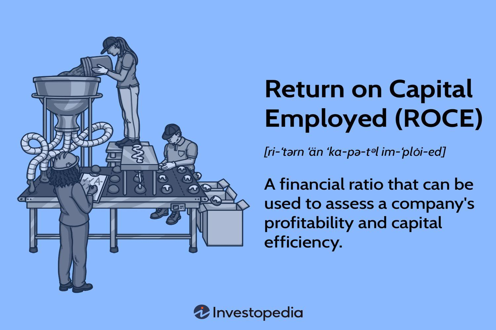

## Table of Contents

## What is Return on Capital Employed (ROCE)?

Return on Capital Employed (ROCE) is a financial ratio that measures how well a company is using its capital to generate profits. It is calculated by dividing the company's earnings before interest and taxes (EBIT) by the total capital employed, which includes both equity and debt. This ratio helps investors understand how efficiently a company is using the money invested in it to produce earnings.

ROCE is useful because it gives a clear picture of a company's profitability and efficiency. A higher ROCE indicates that a company is using its capital more effectively to generate profits. For example, if a company has a ROCE of 15%, it means that for every dollar of capital employed, the company is generating 15 cents in earnings. Investors often compare the ROCE of different companies to decide where to invest their money, as a higher ROCE can signal a better investment opportunity.

## How is ROCE calculated?

ROCE is calculated by dividing a company's earnings before interest and taxes (EBIT) by its total capital employed. EBIT is the profit a company makes from its operations before it pays interest on any loans or taxes. Capital employed is the total amount of money the company uses to run its business, which includes both the money from shareholders (equity) and the money it has borrowed (debt).

To find the ROCE, you take the EBIT number from the company's income statement and divide it by the capital employed, which you can find on the balance sheet. For example, if a company has an EBIT of $100,000 and its capital employed is $500,000, the ROCE would be $100,000 divided by $500,000, which equals 0.2 or 20%. This means the company is [earning](/wiki/earning-announcement) 20 cents for every dollar of capital it uses.

## Why is ROCE important for investors?

ROCE is important for investors because it shows how well a company is using its money to make profits. When a company uses its money well, it can make more money for its owners. If a company has a high ROCE, it means it is good at turning the money it has into more money. This is something investors like to see because it means their investment could grow.

Investors also use ROCE to compare different companies. If one company has a higher ROCE than another, it might be a better place to put money. This helps investors decide where to invest to get the best return on their money. By looking at ROCE, investors can see which companies are using their money the smartest and are likely to do well in the future.

## What does a high ROCE indicate?

A high ROCE means a company is good at using its money to make more money. It shows that the company is taking the money it has from owners and loans and turning it into profits really well. When a company has a high ROCE, it means it is efficient and can make a lot of money from the money it uses.

Investors like to see a high ROCE because it tells them the company is doing a good job with their money. If a company has a high ROCE, it might be a good place for investors to put their money because it could grow more. A high ROCE can also mean the company is better than other companies at using money to make profits.

## What does a low ROCE indicate?

A low ROCE means a company is not very good at using its money to make more money. It shows that the company is not turning the money it has from owners and loans into profits as well as it could. When a company has a low ROCE, it means it is not efficient and might not be making much money from the money it uses.

Investors might not want to put their money into a company with a low ROCE because it tells them the company is not doing a good job with their money. If a company has a low ROCE, it might not be a good place for investors to put their money because it might not grow much. A low ROCE can also mean the company is not as good as other companies at using money to make profits.

## How can ROCE be used to compare companies within the same industry?

ROCE is a good way to compare companies in the same industry because it shows how well each company uses its money to make profits. When you look at the ROCE of different companies, you can see which ones are better at turning their money into more money. For example, if Company A has a ROCE of 15% and Company B has a ROCE of 10%, it means Company A is using its money more efficiently to make profits.

This comparison helps investors decide where to put their money. If an investor wants to invest in a company that will grow their money, they might choose the company with the higher ROCE. By comparing ROCE, investors can see which companies in the same industry are the best at using their money to make more money, and this can help them make smarter investment choices.

## What are the limitations of using ROCE as a financial metric?

ROCE can be a helpful tool, but it has some problems. One big problem is that it might not show the whole picture of a company's money situation. For example, ROCE looks at how much profit a company makes compared to how much money it uses, but it doesn't tell you about the company's debts or if it has a lot of money that it's not using. This means that a company might have a high ROCE but still have a lot of debt, which can be risky.

Another issue with ROCE is that it can be hard to compare between different industries. What is considered a good ROCE in one industry might not be good in another. For example, a tech company might have a different ROCE than a company that makes cars because they use their money in different ways. So, if you're trying to compare companies from different industries using ROCE, you might not get a fair comparison.

Lastly, ROCE can be affected by how a company decides to spend its money. If a company decides to buy a big new factory, this might lower its ROCE for a while because it's using more money but not making more profit right away. But this doesn't mean the company is doing badly; it might just be investing in its future. So, ROCE can sometimes give a short-term view that might not show the long-term health of a company.

## How does ROCE differ from Return on Equity (ROE)?

ROCE and ROE are both ways to see how well a company is doing with its money, but they look at different things. ROCE, or Return on Capital Employed, looks at how well a company uses all its money, both from owners and from loans, to make profits. It shows how efficient a company is at turning all the money it has into more money. On the other hand, ROE, or Return on Equity, only looks at how well a company uses the money from its owners, or shareholders, to make profits. It tells you how much profit a company makes for every dollar that shareholders have put in.

The main difference between ROCE and ROE is what kind of money they focus on. ROCE includes both the money from shareholders and the money the company has borrowed, while ROE only includes the money from shareholders. This means that ROCE gives you a bigger picture of how a company uses all its money to make profits, while ROE is more focused on how well the company is doing for its shareholders. Both are useful, but they give you different information about a company's financial health.

## Can ROCE be used to assess a company's efficiency over time?

Yes, ROCE can be used to see how well a company is using its money to make profits over time. By looking at the ROCE for different years, you can tell if the company is getting better or worse at turning its money into more money. If the ROCE goes up over time, it means the company is becoming more efficient and better at using its money. If the ROCE goes down, it might mean the company is not using its money as well as before.

However, it's important to remember that other things can affect ROCE over time. For example, if a company spends a lot of money on new projects or equipment, its ROCE might go down for a while because it's using more money but not making more profit right away. But this doesn't always mean the company is doing badly; it might just be investing in its future. So, when using ROCE to look at a company's efficiency over time, it's good to think about what else might be happening in the company.

## How might changes in accounting policies affect ROCE?

Changes in accounting policies can make a big difference in how ROCE is calculated and what it shows about a company. For example, if a company changes how it counts its earnings before interest and taxes (EBIT), this can change the top part of the ROCE formula. If the company decides to include or exclude certain costs, the EBIT number will be different, and so will the ROCE. Also, if a company changes how it values its assets, this can change the bottom part of the ROCE formula, which is the total capital employed. If the company decides to use a different way to value its buildings or equipment, the capital employed number will change, and so will the ROCE.

These changes can make it hard to compare ROCE over time or between different companies. If a company changes its accounting policies, the ROCE from one year might not be the same as the ROCE from another year, even if the company is doing the same things. This can make it look like the company is getting better or worse at using its money, when really it's just the accounting that's different. So, when looking at ROCE, it's important to know if the company has changed its accounting policies, because this can affect what the ROCE number really means.

## What role does capital structure play in interpreting ROCE?

The way a company gets its money, or its capital structure, can change how we look at ROCE. Capital structure means the mix of money a company gets from its owners and the money it borrows. If a company uses a lot of borrowed money, it might have a higher ROCE because it's using less of its own money to make profits. But, having a lot of debt can also be risky because the company has to pay back the money it borrowed, and this can affect how safe the company is.

When we look at ROCE, we need to think about the capital structure to understand what the number really means. A high ROCE might look good, but if it's because the company is using a lot of borrowed money, it might not be as good as it seems. It's important to look at both the ROCE and the capital structure to get a full picture of how well a company is doing and how much risk it's taking.

## How can a company improve its ROCE?

A company can improve its ROCE by making more money from its operations. This means finding ways to sell more products or services, or to charge more for them. The company could also try to cut costs. By spending less money on things like materials or workers, the company can keep more of its earnings. Another way to boost ROCE is to use the money it has more smartly. For example, the company could sell off things it doesn't need anymore, like old buildings or machines, and use that money to buy new things that will help it make more profit.

A company can also work on its capital structure to improve ROCE. This means looking at how much money it gets from owners and how much it borrows. If the company is using too much borrowed money, it might want to use less and rely more on money from owners. This can make the company safer because it won't have to pay back as much money. On the other hand, if the company is not using enough borrowed money, it might want to borrow more if it can use that money to make more profit. By balancing the money from owners and borrowed money in the right way, the company can improve its ROCE.

## What is the understanding of Capital Efficiency and ROCE?

Capital efficiency is a critical concept in the financial evaluation of businesses. It reflects a company's ability to generate revenues and profits using its capital resources optimally. This efficiency determines how well a company can make the most out of its available assets, ultimately enhancing shareholder value. In this context, Return on Capital Employed (ROCE) emerges as a pivotal financial metric.

ROCE is a financial ratio that measures a company's profitability and the ability to create value from its capital investments. Specifically, it assesses how efficiently a business can generate earnings from the capital at its disposal. The formula to calculate ROCE is:

$$
\text{ROCE} = \frac{\text{Earnings Before Interest and Taxes (EBIT)}}{\text{Capital Employed}}
$$

Capital Employed is generally defined as the total assets of a company minus its current liabilities. This calculation allows investors and analysts to gain insights into how effectively a company uses its available capital to generate profits. A higher ROCE indicates better efficiency in using capital, suggesting that the company is generating more earnings per unit of capital employed.

A key advantage of ROCE is its utility in comparing the performance of companies within the same industry. When businesses operate in similar environments, ROCE provides a clear indication of which firm is using its capital most effectively. This comparability facilitates investors in making informed decisions regarding which firms may be more efficient and, consequently, offer better returns on their investment.

Moreover, ROCE offers several benefits over other metrics such as Return on Investment (ROI) and Return on Equity (ROE). While ROI focuses on the return of specific investments and ROE highlights the return generated from shareholders' equity, ROCE provides a comprehensive assessment of a company's overall efficiency in utilizing both debt and equity financing. By encompassing all long-term sources of capital, ROCE delivers a holistic view of a company's financial health and operational efficiency.

This comprehensive evaluation is essential for stakeholders aiming to understand how effectively a company is leveraging its resources to achieve profitability and sustain growth. Analysts and investors thus prioritize ROCE when analyzing enterprise performance, especially in capital-intensive industries where the efficient use of capital is paramount.

## How do you calculate and interpret ROCE?

Return on Capital Employed (ROCE) is a pivotal metric used to gauge a company's efficiency in generating profits from its capital base. To calculate ROCE, the formula is as follows:

$$
\text{ROCE} = \frac{\text{EBIT}}{\text{Capital Employed}}
$$

Where:
- EBIT (Earnings Before Interest and Taxes) is a measure of a company's profitability that excludes interest and income tax expenses.
- Capital Employed is calculated by subtracting current liabilities from total assets.

The ROCE formula underscores the importance of both profitability and the effective use of capital. A higher ROCE indicates more efficient use of capital in generating earnings.

Industry norms are crucial when interpreting ROCE. Different industries have varying capital requirements; for instance, capital-intensive sectors like manufacturing may naturally exhibit lower ROCE compared to service-oriented industries due to their substantial asset bases. Thus, it's advisable to compare ROCE values among companies within the same industry to ensure an accurate performance assessment.

Long-term trends in ROCE provide a normalized view of a company's efficiency and performance over time, which can help smooth out short-term fluctuations and offer a clearer picture of the company's operational health. Consistently high ROCE over longer periods suggests a sustainable and efficient capital employment strategy.

When analyzing a company's financial health, ROCE should not be examined in isolation. Integrating it with other financial ratios such as Return on Equity (ROE), Return on Investment (ROI), and leverage ratios affords a more holistic understanding of the company's overall performance. By combining these metrics, investors can gauge the effectiveness of the company's management in deploying capital to generate returns, ensuring a balanced appraisal of the organization's financial position.

## What is ROCE's Role in Different Industries?

Different industries exhibit varying Return on Capital Employed (ROCE) due to differences in capital intensity and operational dynamics. High capital-intensive industries, such as manufacturing, utilities, and telecommunications, often register lower ROCE figures. This is primarily due to their substantial investments in fixed assets, like machinery and infrastructure, which increase the capital employed component in the ROCE formula:

$$
\text{ROCE} = \frac{\text{Earnings Before Interest and Taxes (EBIT)}}{\text{Capital Employed}}
$$

In contrast, service-oriented industries, which include sectors like technology, consulting, and financial services, typically demonstrate higher ROCE. These industries require less capital investment in physical assets, leading to a more efficient use of capital relative to their earnings. The lower capital requirements enhance their ability to generate higher profitability with lesser employed capital.

Investors aiming to glean accurate performance insights from ROCE should focus on comparisons within the same industry. Such intra-industry evaluations account for the inherent capital requirements and operational dynamics unique to each sector. For instance, comparing the ROCE of a software firm with that of a steel manufacturer may not yield meaningful insights due to their distinct capital structures.

Industry context holds paramount importance when analyzing ROCE values, as it provides the background necessary to assess the efficiency with which capital is used. For example, a lower ROCE in a capital-heavy industry might still indicate efficient capital utilization relative to industry peers. Conversely, a high ROCE in a capital-light industry could suggest superior profitability and operational excellence.

In summary, understanding the industry-specific factors that influence ROCE enables a more nuanced evaluation of a company's financial performance and capital efficiency. Investors can use these insights to make informed decisions about the relative attractiveness of investment opportunities.

## References & Further Reading

Penman, S.H. "Financial Statement Analysis and Security Valuation" provides a comprehensive understanding of how financial statements can be analyzed to determine a firm's value. This resource is essential for those seeking to enhance their skills in evaluating company performance through various financial metrics, including ROCE.

Damodaran, A. "Return on Capital: Measurement and Implications" offers an in-depth exploration of the return on capital metric, examining its calculation, significance, and impact on business valuation and investment decisions. This work highlights the implications of ROCE in assessing a firm's capital efficiency and strategic positioning.

Kearns, M., & Nevmyvaka, Y. "Machine Learning for Market Microstructure and High Frequency Trading" focuses on the intersection of advanced computational techniques and finance. This text is valuable for understanding how [algorithmic trading](/wiki/algorithmic-trading) systems operate, leveraging [machine learning](/wiki/machine-learning) to navigate the complexities of high-frequency trading and improve investment outcomes.

Banerjee, S., Gryglewicz, S., & Luca, G. D. "Return on Capital, Risk, and Expected Returns" discusses the nuanced relationship between capital returns, associated risks, and investors' expected benefit. This scholarly work offers insights into balancing return on capital with risk management to optimize investment strategies.

Explore more resources to deepen the understanding of ROCE and algorithmic trading, which are crucial for maximizing investment performance and making informed financial decisions. Further readings can expand knowledge on the practical application of these concepts and foster a comprehensive strategy for investments in varying market conditions.

