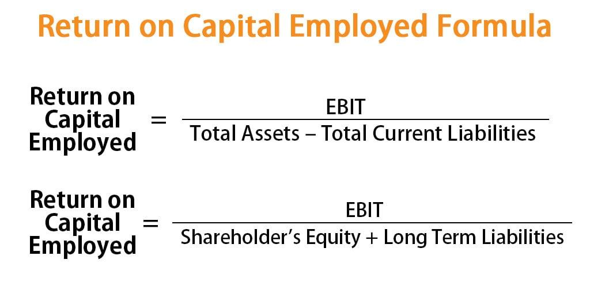

## Table of Contents

## What is Return on Capital Employed (ROCE)?

Return on Capital Employed (ROCE) is a financial ratio that shows how well a company is using its money to make profits. It tells investors how much profit a company is making from the capital it has put into its business. To calculate ROCE, you take the company's earnings before interest and taxes (EBIT) and divide it by the capital employed, which is the total amount of money the company has used to run its operations. This includes things like buildings, equipment, and working capital.

ROCE is important because it helps investors see if a company is good at turning the money it uses into more money. A high ROCE means the company is using its capital efficiently to generate profits. On the other hand, a low ROCE might mean the company is not using its money well. By comparing the ROCE of different companies, investors can decide which ones are better at making money from their investments.

## How is ROCE calculated?

ROCE, or Return on Capital Employed, is calculated by dividing a company's earnings before interest and taxes (EBIT) by its capital employed. EBIT is the profit a company makes from its operations before it pays interest on any loans or taxes. Capital employed is the total amount of money a company uses to run its business. This includes things like buildings, machines, and the money it uses day-to-day to keep things running.

To find the ROCE, you take the EBIT number and divide it by the capital employed number. For example, if a company has an EBIT of $100,000 and its capital employed is $500,000, the ROCE would be $100,000 divided by $500,000, which equals 0.2 or 20%. This percentage shows how well the company is using its money to make profits. A higher percentage means the company is good at turning its investments into more money.

## Why is ROCE important for investors?

ROCE is important for investors because it helps them see how well a company is using its money to make profits. It shows if a company is good at turning the money it uses into more money. When investors look at ROCE, they can tell if a company is efficient with its investments. A high ROCE means the company is doing a great job at making money from the money it has put into its business. This is a good sign for investors because it means their money is being used well.

Investors also use ROCE to compare different companies. By looking at the ROCE of different companies, investors can decide which ones are better at making money from their investments. If one company has a higher ROCE than another, it might be a better choice for investment. This helps investors make smarter choices about where to put their money, aiming to get the best return on their investment.

## How does ROCE differ from Return on Equity (ROE)?

ROCE and ROE are both ways to see how well a company is doing, but they look at different things. ROCE, or Return on Capital Employed, shows how much profit a company makes from all the money it uses to run its business. This includes everything from buildings and machines to the money it uses day-to-day. It's a good way to see if a company is good at turning all its money into more money.

On the other hand, ROE, or Return on Equity, only looks at how much profit a company makes from the money that shareholders have put into the company. It shows how well a company is using the money that comes from its owners. ROE is important because it tells shareholders how well their money is being used to make more money. While ROCE gives a broader view of how a company uses all its money, ROE focuses just on the money from shareholders.

## What is a good ROCE percentage?

A good ROCE percentage depends on the industry and the company, but generally, a ROCE higher than 15% is considered good. This means the company is doing a great job at using its money to make profits. But, it's important to compare the ROCE with other companies in the same industry. What might be a good ROCE in one industry might not be as good in another.

For example, industries like technology or pharmaceuticals might have higher ROCE because they can make a lot of money from their investments. On the other hand, industries like utilities or retail might have lower ROCE because they need a lot of money to run their business but don't make as much profit from it. So, when looking at ROCE, it's always a good idea to compare it with what's normal for that industry.

## Can ROCE be used to compare companies in different industries?

ROCE can be used to compare companies, but it's not always the best way to compare companies in different industries. Each industry has its own way of making money and using money. For example, a tech company might have a high ROCE because it can make a lot of money from its investments. But a utility company might have a lower ROCE because it needs a lot of money to run its business but doesn't make as much profit from it. So, when you look at ROCE, it's important to think about what's normal for that industry.

Even though ROCE can give you some ideas about how well companies are using their money, it's better to compare companies within the same industry. This way, you can see if a company is doing better or worse than others in its field. If you use ROCE to compare companies in different industries, you might not get a clear picture of how well they are doing because their business models and costs can be very different.

## How does ROCE relate to a company's efficiency?

ROCE shows how well a company uses its money to make profits. It tells us if a company is good at turning the money it uses into more money. When a company has a high ROCE, it means it is using its money efficiently. This is because it is making a lot of profit from the money it has put into its business. A high ROCE is a good sign that the company is doing a great job with its money.

On the other hand, if a company has a low ROCE, it might mean it's not using its money well. It's not turning its investments into profits as well as it could. This could be because the company is spending too much money on things that don't make a lot of profit, or it's not making enough money from what it's spending on. So, ROCE is a helpful way to see how efficient a company is with its money.

## What are the limitations of using ROCE as a performance metric?

ROCE is a useful way to see how well a company is using its money, but it has some limits. One big limit is that ROCE doesn't tell you everything about a company's health. It focuses on how much profit a company makes from its money, but it doesn't show if the company is growing or if it has a lot of debt. A company might have a high ROCE but still have problems with growing its business or paying off its loans.

Another limit of ROCE is that it can be hard to compare across different industries. What's a good ROCE in one industry might not be as good in another. For example, a tech company might have a high ROCE because it can make a lot of money from its investments. But a utility company might have a lower ROCE because it needs a lot of money to run its business but doesn't make as much profit from it. So, when you look at ROCE, you need to think about what's normal for that industry.

## How can a company improve its ROCE?

A company can improve its ROCE by making more profit from the money it uses. One way to do this is by cutting costs. If a company can spend less money on things like making its products or running its business, it can keep more of its money as profit. Another way is by making more money from what it sells. If a company can sell more products or charge more for them, it can make more profit without needing to spend more money.

Another way to improve ROCE is by using its money more wisely. This means the company should put its money into things that will make a lot of profit. For example, if a company invests in new machines that help it make products faster and cheaper, it can make more money from the same amount of money it used before. Also, a company can sell things it doesn't need, like old buildings or equipment, and use that money to invest in things that will make more profit. By doing these things, a company can make its ROCE higher and show that it's using its money well.

## What impact does debt have on ROCE?

Debt can change a company's ROCE in different ways. When a company uses debt to buy things it needs to run its business, it can make its capital employed number bigger. If the company can use that money to make more profit, its ROCE might go up. But if the company can't make enough profit from the money it borrowed, its ROCE might go down.

Debt also means the company has to pay interest on the money it borrowed. This interest is taken out of the company's earnings before it calculates ROCE. So, if a company has a lot of debt and has to pay a lot of interest, its earnings before interest and taxes (EBIT) will be smaller. This can make the ROCE lower, even if the company is using its money well. So, debt can make ROCE go up or down, depending on how the company uses the money and how much interest it has to pay.

## How does ROCE influence stock valuation?

ROCE can influence stock valuation because it shows how well a company is using its money to make profits. When a company has a high ROCE, it means it is good at turning the money it uses into more money. This is a good sign for investors because it means the company is efficient with its investments. Investors might be willing to pay more for the company's stock if they see a high ROCE, thinking that the company will keep making good profits in the future.

On the other hand, if a company has a low ROCE, it might mean it's not using its money well. This could make investors think the company is not as good at making money from its investments. If investors think the company won't make good profits in the future, they might not want to pay as much for the stock. So, a low ROCE can lead to a lower stock valuation.

## Can ROCE be manipulated by management, and if so, how?

Yes, ROCE can be manipulated by management. One way they might do this is by changing how they report their earnings before interest and taxes (EBIT). For example, they could use accounting tricks to make their profits look bigger than they really are. This would make the ROCE look higher because the top part of the ROCE formula, which is EBIT, would be bigger.

Another way management might manipulate ROCE is by changing the capital employed number. They could do this by selling off assets that aren't making much profit, which would make the capital employed smaller. A smaller capital employed number in the bottom part of the ROCE formula would make the ROCE look higher, even if the company isn't really doing better at making money from its investments.

## What is the understanding of Capital Efficiency and ROCE?

Capital efficiency is a measure of how effectively a company utilizes its capital to generate revenues and profits. This concept is integral to understanding the financial health and operational success of a business. A company that is capital efficient is able to produce higher revenues or profits with relatively less capital investment, which can lead to enhanced profitability and competitive advantage.

Return on Capital Employed (ROCE) is a fundamental metric in evaluating capital efficiency. It measures the profitability and value creation of a company by calculating how much profit is generated from the capital invested in the business. ROCE is expressed as a percentage and is calculated using the formula:

$$
\text{ROCE} = \frac{\text{Earnings Before Interest and Taxes (EBIT)}}{\text{Capital Employed}}
$$

Where:
- EBIT is the profit before taxes and interest, providing a clear picture of the earnings derived from the core operations of the business.
- Capital Employed is the total capital invested in the company, typically the sum of shareholders' equity and debt liabilities.

A higher ROCE indicates a more efficient use of capital in generating earnings. Investors and analysts often use ROCE to compare the performance of companies within the same industry, as it provides insights into which firms are effectively converting their investments into sustainable profitability.

In comparison with other profitability ratios, ROCE offers specific advantages. Return on Investment (ROI) is another widely used metric that assesses the gain or loss generated by an investment relative to its cost. While ROI is useful, it often focuses on specific projects or investments with a relatively short-term perspective. ROCE, on the other hand, presents a broader view, capturing the longer-term efficiency and profitability of the entire operation.

Return on Equity (ROE) is another related metric that measures a company’s profitability by revealing how much profit a company generates with the money shareholders have invested. Although ROE is valuable for understanding the return generated on shareholders' equity, it can sometimes be influenced by financial leverage, potentially skewing the true efficiency of capital use. ROCE mitigates this issue by considering both equity and debt, offering a more comprehensive view of how effectively capital from all funding sources is employed.

In summary, ROCE is a robust metric for assessing capital efficiency in investment decisions. It evaluates a company’s ability to generate profits from its total capital base, providing a significant insight that can inform strategic financial assessment and decision-making. While it is important to consider ROCE alongside other financial ratios like ROI and ROE, its comprehensive nature can offer substantial value in analyzing the operational efficiency and potential long-term success of a company.

## How do you calculate and interpret ROCE?

The calculation of Return on Capital Employed (ROCE) is an essential aspect of financial analysis, enabling investors and analysts to evaluate a company's efficiency in utilizing its capital to generate profits. The formula for ROCE is given by:

$$
\text{ROCE} = \frac{\text{EBIT}}{\text{Capital Employed}}
$$

where EBIT stands for Earnings Before Interest and Taxes, and Capital Employed represents the total capital used for generating earnings, typically calculated as the difference between total assets and current liabilities.

A key aspect of interpreting ROCE lies in its ability to indicate how well a company uses its available capital to generate earnings before interest and taxes. A higher ROCE value signifies greater capital utilization efficiency, suggesting that the company is generating higher returns from its capital. This efficiency is reflective of the operational success of management in employing the company's resources to produce maximum value.

When analyzing ROCE, it is crucial to consider it in the context of industry norms. Different industries have varying capital requirements and operational peculiarities, which can influence typical ROCE values. For instance, industries with high capital expenditure would generally have lower ROCE values compared to service-based sectors with minimal capital investment. Therefore, a comparative analysis against industry averages provides clearer insights into whether a company's ROCE is truly indicative of superior performance.

Moreover, investors must account for long-term trends when interpreting ROCE. Temporary fluctuations in EBIT or capital employed can cause short-term variances in ROCE, which may not reflect the inherent efficiency of a company's operations. Therefore, analyzing ROCE over several fiscal periods can give a more normalized view of a company’s operational efficiency and profitability.

Overall, ROCE serves as a critical metric in evaluating a company's financial and operational prowess. By extrapolating the nuances of ROCE interpretation, investors can better assess which companies are likely to offer sustained returns on their capital investments. It is recommended to pair ROCE analysis with other financial indicators for a comprehensive understanding of a company’s financial health.

## What are the challenges and considerations?

While Return on Capital Employed (ROCE) serves as a vital metric in evaluating a company's capital efficiency, its application is not devoid of challenges. One significant issue is the variability of ROCE across different industries. Industries that are capital-intensive, such as manufacturing or utilities, typically have higher capital requirements, which can result in lower ROCE values compared to sectors like technology or services, where capital needs are comparatively minimal. Consequently, comparing ROCE across different industries may not provide an accurate representation of a company's efficiency in capital utilization.

Another challenge is the potential for financial manipulation. ROCE is calculated as:

$$
\text{ROCE} = \frac{\text{EBIT}}{\text{Capital Employed}}
$$

where EBIT is Earnings Before Interest and Taxes, and capital employed is calculated as total assets minus current liabilities. Companies might attempt to enhance their ROCE by inflating EBIT through aggressive accounting practices or reducing capital employed by manipulating asset values. This concern makes it essential for investors to scrutinize financial statements carefully and consider qualitative factors alongside quantitative measures.

Furthermore, ROCE does not account for external economic factors or company-specific circumstances that may affect profitability. Temporary market conditions, regulatory changes, or shifts in consumer demand can all impact a company’s earnings and capital investment needs, potentially skewing ROCE results. Investors need to contextualize ROCE figures within broader economic and industry-specific trends rather than relying solely on historical data.

Considering these challenges is crucial for investors seeking to accurately assess a company's financial health and investment potential. A nuanced interpretation of ROCE, alongside other financial metrics, will provide a more comprehensive understanding of a company's performance and future prospects.

## References & Further Reading

[1]: ["Financial Statement Analysis and Security Valuation"](https://www.mheducation.com/highered/product/financial-statement-analysis-security-valuation-penman/M9780078025310.html) by Stephen H. Penman

[2]: Damodaran, A. (2007). ["Return on Capital (ROC), Return on Invested Capital (ROIC), and Return on Equity (ROE): Measurement and Implications."](https://papers.ssrn.com/sol3/papers.cfm?abstract_id=1105499) 

[3]: Hirsa, A. (2013). ["Algorithmic Trading and DMA: An Introduction to Direct Access Trading Strategies."](https://www.gbv.de/dms/zbw/626979455.pdf)

[4]: Kearns, M., & Nevmyvaka, Y. (2015). ["Machine Learning for Market Microstructure and High Frequency Trading."](https://www.cis.upenn.edu/~mkearns/papers/KearnsNevmyvakaHFTRiskBooks.pdf) Annual Review of Financial Economics, 7, 581-604.

[5]: Banerjee, S., Gryglewicz, S., & Luca, G. D. (2021). ["Return on capital, risk, and expected returns."](https://www.semanticscholar.org/paper/Harnessing-the-Overconfidence-of-the-Crowd:-A-of-Banerjee-Szydlowski/3454e505ec5d96eee39e2c8f591042067189f96e) Journal of Financial Economics, 140(1), 62-81.