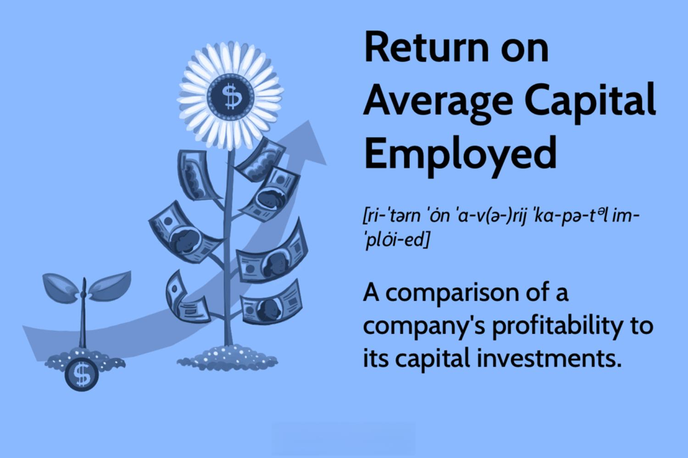

In today's fast-paced financial landscape, investors and traders are consistently seeking the best strategies to maximize their returns. The modern marketplace demands an intelligent approach to investing, one that balances efficiency and precision. Two crucial elements emerge in this quest: capital efficiency and algorithmic trading. Capital efficiency refers to the optimal leveraging of funds to generate the highest possible returns. It underscores the importance of making strategic financial decisions to ensure that every dollar employed in investment is working towards the generation of profits.

Algorithmic trading, on the other hand, revolutionizes the way trades are executed. Leveraging advanced algorithms and data analytics, this approach automates trading processes, ensuring swift, informed, and often profitable decision-making. The integration of technological advancements into trading practices enables investors to not only capitalize on market trends rapidly but also mitigate human error and emotional biases.



This article focuses on the interplay between Return on Capital Employed (ROCE), investment strategies, and algorithmic trading. Understanding how these elements interact will provide valuable insights into improving investment returns through capital efficiency. ROCE is a pivotal metric that assesses how well a company utilizes its capital to generate profits. By examining ROCE alongside algorithmic trading strategies, investors can craft balanced, high-performing portfolios. The coordinated use of ROCE and algorithmic tools represents a sophisticated approach to navigating today's complex markets, promising enhanced financial outcomes while optimizing resource allocation. Through a comprehensive exploration of these elements, investors can develop robust strategies designed to capture superior returns.

## Table of Contents

## Understanding Capital Efficiency and ROCE

Capital efficiency is a measure of how effectively a company utilizes its capital to generate revenues and profits. This concept is integral to understanding the financial health and operational success of a business. A company that is capital efficient is able to produce higher revenues or profits with relatively less capital investment, which can lead to enhanced profitability and competitive advantage.

Return on Capital Employed (ROCE) is a fundamental metric in evaluating capital efficiency. It measures the profitability and value creation of a company by calculating how much profit is generated from the capital invested in the business. ROCE is expressed as a percentage and is calculated using the formula:

$$
\text{ROCE} = \frac{\text{Earnings Before Interest and Taxes (EBIT)}}{\text{Capital Employed}}
$$

Where:
- EBIT is the profit before taxes and interest, providing a clear picture of the earnings derived from the core operations of the business.
- Capital Employed is the total capital invested in the company, typically the sum of shareholders' equity and debt liabilities.

A higher ROCE indicates a more efficient use of capital in generating earnings. Investors and analysts often use ROCE to compare the performance of companies within the same industry, as it provides insights into which firms are effectively converting their investments into sustainable profitability.

In comparison with other profitability ratios, ROCE offers specific advantages. Return on Investment (ROI) is another widely used metric that assesses the gain or loss generated by an investment relative to its cost. While ROI is useful, it often focuses on specific projects or investments with a relatively short-term perspective. ROCE, on the other hand, presents a broader view, capturing the longer-term efficiency and profitability of the entire operation.

Return on Equity (ROE) is another related metric that measures a company’s profitability by revealing how much profit a company generates with the money shareholders have invested. Although ROE is valuable for understanding the return generated on shareholders' equity, it can sometimes be influenced by financial leverage, potentially skewing the true efficiency of capital use. ROCE mitigates this issue by considering both equity and debt, offering a more comprehensive view of how effectively capital from all funding sources is employed.

In summary, ROCE is a robust metric for assessing capital efficiency in investment decisions. It evaluates a company’s ability to generate profits from its total capital base, providing a significant insight that can inform strategic financial assessment and decision-making. While it is important to consider ROCE alongside other financial ratios like ROI and ROE, its comprehensive nature can offer substantial value in analyzing the operational efficiency and potential long-term success of a company.

## How to Calculate and Interpret ROCE

The calculation of Return on Capital Employed (ROCE) is an essential aspect of financial analysis, enabling investors and analysts to evaluate a company's efficiency in utilizing its capital to generate profits. The formula for ROCE is given by:

$$
\text{ROCE} = \frac{\text{EBIT}}{\text{Capital Employed}}
$$

where EBIT stands for Earnings Before Interest and Taxes, and Capital Employed represents the total capital used for generating earnings, typically calculated as the difference between total assets and current liabilities.

A key aspect of interpreting ROCE lies in its ability to indicate how well a company uses its available capital to generate earnings before interest and taxes. A higher ROCE value signifies greater capital utilization efficiency, suggesting that the company is generating higher returns from its capital. This efficiency is reflective of the operational success of management in employing the company's resources to produce maximum value.

When analyzing ROCE, it is crucial to consider it in the context of industry norms. Different industries have varying capital requirements and operational peculiarities, which can influence typical ROCE values. For instance, industries with high capital expenditure would generally have lower ROCE values compared to service-based sectors with minimal capital investment. Therefore, a comparative analysis against industry averages provides clearer insights into whether a company's ROCE is truly indicative of superior performance.

Moreover, investors must account for long-term trends when interpreting ROCE. Temporary fluctuations in EBIT or capital employed can cause short-term variances in ROCE, which may not reflect the inherent efficiency of a company's operations. Therefore, analyzing ROCE over several fiscal periods can give a more normalized view of a company’s operational efficiency and profitability.

Overall, ROCE serves as a critical metric in evaluating a company's financial and operational prowess. By extrapolating the nuances of ROCE interpretation, investors can better assess which companies are likely to offer sustained returns on their capital investments. It is recommended to pair ROCE analysis with other financial indicators for a comprehensive understanding of a company’s financial health.

## ROCE's Role in Different Industries

Capital efficiency, as measured by Return on Capital Employed (ROCE), varies notably across different industries due to differing capital intensities and operational dynamics. Industries characterized by high capital intensity, such as manufacturing, utilities, and telecommunications, typically require substantial investments in fixed assets like machinery and infrastructure. These sectors typically present a lower ROCE due to the significant capital employed, which can extend the time needed to generate returns on these investments. 

Manufacturing businesses, for instance, need extensive plant and equipment to produce goods, which can lead to higher fixed costs. These large capital expenditures can suppress ROCE, especially if production efficiencies or market conditions lag. However, firms that optimize their capital allocation and operations might still achieve competitive ROCE figures, potentially making them attractive to investors focused on capital efficiency.

Conversely, service-oriented industries like technology, consulting, and asset-light business models often display higher ROCE values. These sectors generally rely more on human capital and digital infrastructure, requiring less fixed asset investment. As a result, they can generate higher profit margins with lower capital requirements, enhancing ROCE. Consider technology companies, which can scale their services rapidly without massive capital deployment, thus achieving superior ROCE compared to capital-intensive counterparts.

For investors, understanding these industry-specific ROCE trends is vital in assessing company performance and investment potential. By comparing ROCE within the same industry, investors can discern companies that stand out in their capital efficiency. Additionally, adjusting for industry-specific factors enables a more nuanced evaluation of a company's ability to generate returns from its employed capital.

Therefore, while ROCE is a useful indicator of capital utilization, its interpretation should always account for the industry context. Evaluating ROCE against industry averages helps investors make informed decisions, identifying entities that effectively employ their capital to generate sustainable returns.

## Algorithmic Trading: Enhancing Investment Returns

Algorithmic trading utilizes automated systems to execute trades with precision, maximizing the timing and pricing of transactions. This innovative approach leverages high-frequency trading ([HFT](/wiki/high-frequency-trading-strategies)) and sophisticated algorithms to process vast data sets and make trading decisions within milliseconds. The core advantage of [algorithmic trading](/wiki/algorithmic-trading) lies in its ability to reduce human error, enhance market [liquidity](/wiki/liquidity-risk-premium), and achieve better price execution owing to its systematic and computational nature.

A significant benefit of integrating Return on Capital Employed (ROCE) metrics with algorithmic strategies is the potential improvement in decision-making and profit margins. By incorporating financial metrics like ROCE, which measures the efficiency of capital utilization, algorithms can be fine-tuned to prioritize companies that demonstrate strong capital efficiency. For instance, algorithms could be coded to filter potential stock picks by calculating ROCE for each asset and favor those with higher values, indicating superior capital usage.

```python
# Example of a simple Python code snippet to filter stocks based on ROCE
companies = [
    {'name': 'Company A', 'EBIT': 500000, 'Capital Employed': 2000000},
    {'name': 'Company B', 'EBIT': 1200000, 'Capital Employed': 4000000},
    {'name': 'Company C', 'EBIT': 300000, 'Capital Employed': 1000000}
]

# Calculate the ROCE for each company
for company in companies:
    company['ROCE'] = company['EBIT'] / company['Capital Employed']

# Filter companies with ROCE greater than a given threshold
threshold = 0.15
high_roce_companies = [company for company in companies if company['ROCE'] > threshold]

high_roce_companies
```

This quantitative approach not only streamlines the analysis process but also assists in identifying promising investment opportunities based on reliable financial metrics. Moreover, algorithmic trading accommodates real-time data integration, further honing the accuracy and responsiveness of trading activities. It can analyze dynamic market conditions and adjust strategies in real time, offering a competitive edge to investors.

Practical applications of algorithmic trading extend across multiple asset classes, including equities, commodities, and foreign exchange. By systematically integrating qualitative and quantitative data, these algorithms improve the overall trading performance by reacting swiftly to both market opportunities and threats. The quick adaptability of algorithms can significantly boost returns, especially in volatile or rapidly changing markets, where human decision-making might lag.

Overall, the fusion of ROCE metrics with algorithmic trading harnesses the strengths of computational finance, providing a robust framework for investors to enhance returns while efficiently managing capital resources.

## Strategic Investment Decisions Using ROCE

Return on Capital Employed (ROCE) serves as a powerful tool for investors aiming to craft strategic investment portfolios. ROCE provides a comprehensive measure of a company's efficiency and profitability relative to its capital employed, thereby offering insights into its potential for growth. By selecting companies that exhibit high ROCE, investors can identify firms that are adept at utilizing their capital to generate returns, which can be a hallmark of operational excellence and financial health.

To effectively leverage ROCE in making strategic investment decisions, investors should combine it with other financial metrics. Metrics such as Return on Equity (ROE), Earnings Before Interest, Taxes, Depreciation, and Amortization (EBITDA), and Free Cash Flow (FCF) offer additional depth to investment analysis, creating a multi-faceted view of a company's performance. For example, a high ROCE coupled with strong FCF can indicate that a company not only generates significant profits from its capital but also efficiently converts these profits into cash, thus enhancing its ability to reinvest or distribute dividends.

Incorporating long-term trends and economic cycles into investment strategies can further refine the selection of companies based on ROCE. Economic conditions play a significant role in influencing a firm’s capital efficiency. During periods of economic expansion, firms with high ROCE tend to outperform, as they efficiently leverage favorable conditions to maximize growth. Conversely, in economic downturns, high ROCE companies may demonstrate resilience due to their superior capital management practices.

Investors should also consider industry-specific nuances when applying ROCE. Capital-intensive industries might inherently report lower ROCE due to substantial fixed asset investments, while service-oriented industries typically exhibit higher ROCE. Understanding these industry dynamics is critical to making informed comparisons among companies. For instance, comparing ROCE across sectors without accounting for these variances might lead to inaccurate conclusions about a company's performance relative to its peers.

Python offers a practical tool for calculating and analyzing ROCE within a broader portfolio management system. By integrating Python scripts to gather financial data, compute ROCE, and cross-reference it with other metrics, investors can automate part of the decision-making process. Here's a simple Python example to calculate ROCE:

```python
def calculate_roce(ebit, capital_employed):
    if capital_employed != 0:
        return ebit / capital_employed
    else:
        return None

# Example usage
ebit = 500000  # Earnings Before Interest and Taxes
capital_employed = 2000000  # Total assets minus current liabilities
roce = calculate_roce(ebit, capital_employed)
print("ROCE:", roce)
```

Utilizing ROCE in conjunction with a robust analysis of financial ratios and economic trends positions investors to make strategic, informed decisions. This balanced approach assists in selecting companies that are not only operating efficiently but are also poised for sustainable growth, ultimately aligning investment portfolios with long-term financial objectives.

## Challenges and Considerations

While Return on Capital Employed (ROCE) serves as a vital metric in evaluating a company's capital efficiency, its application is not devoid of challenges. One significant issue is the variability of ROCE across different industries. Industries that are capital-intensive, such as manufacturing or utilities, typically have higher capital requirements, which can result in lower ROCE values compared to sectors like technology or services, where capital needs are comparatively minimal. Consequently, comparing ROCE across different industries may not provide an accurate representation of a company's efficiency in capital utilization.

Another challenge is the potential for financial manipulation. ROCE is calculated as:

$$
\text{ROCE} = \frac{\text{EBIT}}{\text{Capital Employed}}
$$

where EBIT is Earnings Before Interest and Taxes, and capital employed is calculated as total assets minus current liabilities. Companies might attempt to enhance their ROCE by inflating EBIT through aggressive accounting practices or reducing capital employed by manipulating asset values. This concern makes it essential for investors to scrutinize financial statements carefully and consider qualitative factors alongside quantitative measures.

Furthermore, ROCE does not account for external economic factors or company-specific circumstances that may affect profitability. Temporary market conditions, regulatory changes, or shifts in consumer demand can all impact a company’s earnings and capital investment needs, potentially skewing ROCE results. Investors need to contextualize ROCE figures within broader economic and industry-specific trends rather than relying solely on historical data.

Considering these challenges is crucial for investors seeking to accurately assess a company's financial health and investment potential. A nuanced interpretation of ROCE, alongside other financial metrics, will provide a more comprehensive understanding of a company's performance and future prospects.

## Conclusion: Maximizing Returns with a Balanced Approach

Balancing capital efficiency, ROCE analysis, and algorithmic trading can significantly enhance investment outcomes. In this complex financial environment, establishing a unified strategy that combines these elements is crucial for investors looking to optimize returns. Capital efficiency, quantified through metrics like Return on Capital Employed (ROCE), provides a crucial indication of how effectively a company utilizes its capital to generate profits. Integrating this analysis with algorithmic trading offers a dynamic approach to making timely and informed decisions, thus enhancing the potential for profitability.

For an effective investment strategy, adopting a holistic approach is essential. This involves incorporating a range of financial metrics beyond ROCE, such as Return on Equity (ROE) and Return on Investment (ROI), to provide a comprehensive view of a company's financial health. These metrics, when combined with real-time data analytics and algorithmic models, can guide investment choices and improve risk management.

Algorithmic trading, specifically, automates transactions and takes advantage of opportunities swiftly and precisely. Python, with libraries like pandas and NumPy, facilitates the construction of such models. For example:

```python
import pandas as pd
import numpy as np

# Sample function to calculate ROCE
def calculate_roce(ebit, capital_employed):
    return ebit / capital_employed

# Example data
data = {'EBIT': [200000, 250000, 300000], 'Capital Employed': [1000000, 1250000, 1500000]}
df = pd.DataFrame(data)

# Calculate ROCE
df['ROCE'] = df.apply(lambda row: calculate_roce(row['EBIT'], row['Capital Employed']), axis=1)

print(df)
```
By continuously evaluating these metrics and refining algorithmic models, investors can react swiftly to market changes, ensuring optimal capital allocation. Advanced techniques, such as [machine learning](/wiki/machine-learning), can further enhance these strategies by identifying patterns and trends that may not be immediately visible.

Ultimately, understanding and leveraging these elements empower investors to achieve superior returns while effectively managing risk. A balanced approach not only maximizes profitability but also provides a robust framework for navigating economic fluctuations and industry-specific challenges.

## References & Further Reading

[1]: ["Financial Statement Analysis and Security Valuation"](https://www.mheducation.com/highered/product/financial-statement-analysis-security-valuation-penman/M9780078025310.html) by Stephen H. Penman

[2]: Damodaran, A. (2007). ["Return on Capital (ROC), Return on Invested Capital (ROIC), and Return on Equity (ROE): Measurement and Implications."](https://papers.ssrn.com/sol3/papers.cfm?abstract_id=1105499) 

[3]: Hirsa, A. (2013). ["Algorithmic Trading and DMA: An Introduction to Direct Access Trading Strategies."](https://www.gbv.de/dms/zbw/626979455.pdf)

[4]: Kearns, M., & Nevmyvaka, Y. (2015). ["Machine Learning for Market Microstructure and High Frequency Trading."](https://www.cis.upenn.edu/~mkearns/papers/KearnsNevmyvakaHFTRiskBooks.pdf) Annual Review of Financial Economics, 7, 581-604.

[5]: Banerjee, S., Gryglewicz, S., & Luca, G. D. (2021). ["Return on capital, risk, and expected returns."](https://www.semanticscholar.org/paper/Harnessing-the-Overconfidence-of-the-Crowd:-A-of-Banerjee-Szydlowski/3454e505ec5d96eee39e2c8f591042067189f96e) Journal of Financial Economics, 140(1), 62-81.