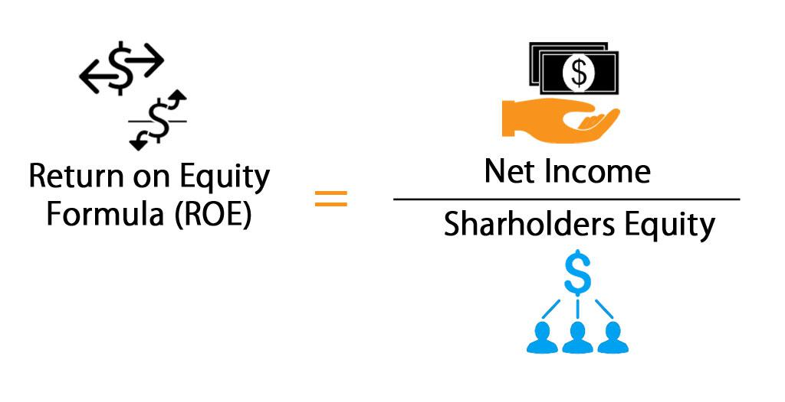

The financial domain is a complex environment where metrics and ratios are indispensable for informed decision-making. Among these metrics, Return on Equity (ROE) stands out as a critical indicator used by investors and analysts to evaluate a company's financial performance. ROE measures a firm's ability to generate profit from its shareholders' equity, providing insights into how effectively management is utilizing the capital invested by shareholders.

Gaining a thorough understanding of ROE is crucial, especially for those engaged in trading and investment activities. In algorithmic trading, where decisions are often driven by quantifiable data, ROE serves as a valuable metric that can refine trading strategies and enhance portfolio management. This article will cover the essential aspects of ROE, including its calculation, significance, and limitations, as well as its strategic application in algorithmic trading.



Furthermore, we will contrast ROE with other essential financial metrics such as Return on Invested Capital (ROIC), which offers a broader view by also including debt in its assessment of a firm's efficiency in using capital. The article will also introduce advanced analytical tools like the DuPont Analysis, which breaks down ROE into components to provide deeper insights into the factors driving equity returns. Understanding these concepts and their interrelations will equip investors and analysts with the knowledge necessary to make more informed investment decisions.

## Table of Contents

## Understanding Return on Equity (ROE)

Return on Equity (ROE) is a critical financial metric used to gauge a company's efficiency in generating profits from its shareholders' equity. It provides insight into how well a company's management is utilizing its equity base to produce net income. The formula for calculating ROE is straightforward: ROE = Net Income / Shareholders' Equity. This formula highlights the return generated on each unit of shareholders' equity, serving as an indicator of financial performance and management efficiency.

A high ROE is generally viewed positively as it suggests that the company is effectively using its resources to generate earnings growth. This efficiency not only reflects on the performance of management but also signifies potential value creation for existing and prospective investors. However, it is crucial to understand that ROE should be evaluated in the context of industry sectors. Different industries have varying average ROE levels, influenced by the nature of their operations, capital intensity, and competitive dynamics. Thus, an ROE that is considered high in one sector might be average or even low in another.

By comparing ROE within the same industry, investors can better assess how a particular company stands relative to its peers. This comparison helps in identifying companies that are outperforming others in the sector, which could be indicative of competitive advantages or superior management practices. Overall, ROE serves as a fundamental tool for investors and analysts, aiding in the assessment of a company's financial health and operational capabilities.

## Calculating Return on Equity

The calculation of Return on Equity (ROE) involves the utilization of net income from a company's income statement and shareholders' equity from its balance sheet. This metric is calculated as follows:

$$
\text{ROE} = \frac{\text{Net Income}}{\text{Shareholders' Equity}}
$$

Net income represents the profits a company has earned after all expenses and taxes have been deducted, and it provides insights into a company's profitability. Shareholders' equity is the difference between total assets and total liabilities and reflects the residual interest in the assets of the entity.

### Best Practices in ROE Calculation

To ensure a more accurate depiction of a company’s financial performance over time, it is advisable to use average shareholders' equity. This approach accounts for fluctuations in equity during the period under review. The formula can be adjusted as follows:

$$
\text{Average Shareholders' Equity} = \frac{\text{Beginning Equity} + \text{Ending Equity}}{2}
$$

Thus, the adjusted ROE formula becomes:

$$
\text{Adjusted ROE} = \frac{\text{Net Income}}{\text{Average Shareholders' Equity}}
$$

### Hypothetical Example

Consider a hypothetical company with a net income of $500,000 for the fiscal year. The equity at the beginning of the year was $1,000,000 and $1,200,000 at the end of the year.

1. Calculate the average shareholders' equity:

   \[ \text{Average Shareholders' Equity} = \frac{1,000,000 + 1,200,000}{2} = 1,100,000
$$

2. Compute the ROE:

   \[ \text{ROE} = \frac{500,000}{1,100,000} \approx 0.4545 \text{ or } 45.45\%
$$

This ROE indicates that the company is generating 45.45% return on the equity holders' investments.

### Challenges in ROE Calculation

Calculating ROE can be straightforward, but complexities arise under certain conditions, such as:

- **Negative Equity**: When liabilities exceed assets, resulting in negative shareholders' equity. In such situations, the ROE formula becomes less meaningful or even misleading.

- **Fluctuating Profits**: Companies with volatile net income can display significant variances in ROE, which might not accurately reflect long-term performance.

- **Extraordinary Items**: One-time gains or losses that can distort net income and impact ROE calculations.

Careful consideration of these challenges is necessary to ensure that the ROE reflects a true measure of a company’s operational efficiency and profitability.

## Using ROE in Algorithmic Trading

Algorithmic trading, a method that employs computing power and algorithms to make trading decisions, depends heavily on accurate and reliable financial metrics. Return on Equity (ROE) stands out as a critical measure in this context, helping traders evaluate the potential of various stocks. ROE is pivotal as it reflects management efficiency by illustrating how effectively a company is using its shareholders' equity to generate profits.

In [algorithmic trading](/wiki/algorithmic-trading), ROE data can be employed to pinpoint companies that are both efficient and potentially profitable. A high ROE may suggest that a company is skillfully using its resources to generate earnings, which can be a signal of solid management practices and prudent financial management. Such characteristics are integral for developing robust trading strategies, as they provide insights into the company's growth potential and viability as an investment.

To craft nuanced algorithms, traders often integrate ROE with other financial indicators. This combination enriches the evaluation process and can enhance the prediction accuracy of stock performance. For instance, coupling ROE with metrics like the Price-to-Earnings (P/E) ratio or the Debt-to-Equity (D/E) ratio extends the analytical scope, offering a more comprehensive picture of a company's financial health. A balanced approach ensures that decisions are not based solely on ROE, which, while informative, provides a limited view when isolated.

For practical implementation in algorithmic trading, a trader could use a Python script to filter and analyze stocks based on their ROE, perhaps setting a threshold to identify stocks with a ROE exceeding a specific value. Here is a simplistic example:

```python
import pandas as pd

# Sample data for demonstration purposes
data = {
    'Company': ['Company A', 'Company B', 'Company C'],
    'Net Income': [100000, 150000, 200000],
    'Shareholders Equity': [500000, 1000000, 300000]
}

df = pd.DataFrame(data)

# Calculate ROE
df['ROE'] = df['Net Income'] / df['Shareholders Equity']

# Filter companies with ROE greater than a given threshold
high_roe_threshold = 0.15
high_roe_companies = df[df['ROE'] > high_roe_threshold]

print(high_roe_companies)
```

This script calculates the ROE for each company and identifies those surpassing the set threshold, representing efficient value generation for shareholders. Incorporating ROE into algorithmic trading strategies not only sharpens stock selection but also aids in managing risk by providing additional layers of performance verification.

Overall, by blending ROE with a suite of other financial metrics, algorithmic traders can develop a diversified strategy that evaluates various aspects of a company's operations, facilitating informed investment decisions.

## Identifying Risks with ROE

While a high Return on Equity (ROE) often signals successful management and profitability, it may also mask underlying risks and financial vulnerabilities. It is important to consider the factors driving a high ROE, as excessive reliance on debt or unstable profit margins can distort the true financial health of a company. When interpreting ROE, it is crucial to analyze it alongside other financial metrics to avoid misleading conclusions.

One potential risk associated with a high ROE is excessive debt. Companies can artificially inflate their ROE by increasing leverage (i.e., using more debt relative to equity). This involves risk because high debt levels can lead to financial distress during economic downturns or periods of fluctuating profits. The equity multiplier, a component of the DuPont Analysis, often highlights how much debt is employed. An inflated equity multiplier indicates that the ROE is being driven by leverage rather than genuine profitability improvements.

```python
# Example calculation to show the effect of leverage on ROE

net_income = 1000000  # Net income
equity = 2000000  # Shareholders' equity
debt = 3000000  # Company's debt

# ROE calculation
roe = net_income / equity
print(f"ROE without leverage: {roe:.2f}")

# Adjusted equity for high leverage scenario
adjusted_equity = equity + debt
roe_leverage = net_income / adjusted_equity
print(f"ROE with leverage: {roe_leverage:.2f}")
```

Another consideration is fluctuating profitability. Companies with inconsistent profit margins may experience high ROE figures in periods of peak performance, only to see them fall dramatically during less profitable times. Therefore, analyzing historical profit trends and stability is essential to assessing the quality of a company's ROE.

Negative net income can also pose a problem for ROE as a performance indicator. When a company reports a negative net income, it can produce a negative ROE, which may signal challenges in profitability or significant restructuring costs. However, it's vital to understand the context of these losses; temporary setbacks might not reflect the company's long-term potential.

Finally, to mitigate these risks and gain a more accurate understanding of a company's financial health, it is advisable to consider other financial ratios, such as the debt-to-equity ratio, return on assets (ROA), and cash flow metrics. These additional perspectives help to paint a comprehensive picture of a company's operational efficiency and financial stability, ensuring that investment decisions are grounded in a thorough analysis rather than a single metric like ROE.

## Limitations of ROE

Return on Equity (ROE) is a widely used financial metric, yet it comes with notable limitations that can obscure the full financial picture of a company. One key limitation is the fluctuation of ROE based on industry characteristics. For example, technology firms often have different capital structures and profitability metrics compared to manufacturing companies. This variability means that comparing ROE across different industries can lead to misleading conclusions. A technology company may have a high ROE due to an asset-light model and high profit margins. In contrast, a manufacturing firm with significant fixed assets might naturally exhibit a lower ROE even if it's performing well in its sector.

This variability underscores the importance of industry-specific context when utilizing ROE. A direct comparison of ROE between a software company and a utility company is unlikely to provide meaningful insights due to their disparate operating models and financial structures. Therefore, ROE should primarily be used to compare companies within the same industry, where business models and financial characteristics are more aligned.

Additionally, ROE can be distorted by financial leverage. Companies may elevate their ROE through significant debt, creating an illusion of operational efficiency. However, this increased leverage also raises financial risk, which is not immediately apparent through ROE alone. Consequently, a high ROE driven by debt rather than genuine profitability improvements might expose investors to elevated risks, which underscores the importance of a multi-faceted analysis.

Investors should consider other financial metrics alongside ROE to obtain a comprehensive view of a company’s financial health. Metrics such as Return on Invested Capital (ROIC), which accounts for both equity and debt, or the current ratio and debt to equity ratio, can offer additional insights into a company’s financial dynamics.

In summary, while ROE is a valuable indicator of financial performance, it should not be used in isolation. Its limitations necessitate the inclusion of other financial metrics for a holistic assessment, avoiding misleading interpretations that could arise from industry differences or financial leverage.

## ROE vs. ROIC

Return on Equity (ROE) and Return on Invested Capital (ROIC) are both pivotal metrics in assessing a company's financial efficiency, but they differ in scope and application. ROE, as mentioned earlier, calculates the profitability concerning shareholders' equity using the formula: 

$$
\text{ROE} = \frac{\text{Net Income}}{\text{Shareholders' Equity}}
$$

Conversely, ROIC is broader as it accounts for both equity and debt in evaluating how effectively a company generates returns on its capital base. The formula for ROIC is:

$$
\text{ROIC} = \frac{\text{Net Operating Profit After Taxes (NOPAT)}}{\text{Invested Capital}}
$$

The invested capital typically includes total equity and all interest-bearing debt, providing insights that encompass the entire capital structure of a company.

### Why ROIC Can Be More Comprehensive

1. **Inclusion of Debt:** While ROE focuses solely on equity, ROIC incorporates debt, making it more applicable for companies with significant borrowing. A firm might have a high ROE due to minimal equity and high leverage, which could mislead investors about its real profitability potential if they rely on ROE alone.

2. **Whole Capital Utilization:** ROIC offers a holistic view by showing how well a company utilizes its entire pool of finances, including equity and debt. This encompasses all aspects of operational capital efficiency, from profit generation to resource allocation.

3. **Uniformity Across Industries:** ROIC facilitates comparisons across industries better than ROE. Different industries have varying levels of debt, and ROIC's comprehensive nature allows for more equitable assessments.

### Preferred Use Cases for ROIC Over ROE

- **Highly Leveraged Companies:** For companies that operate with significant debt levels, relying solely on ROE can give an incomplete picture of financial health. ROIC, by incorporating this debt, indicates whether these companies are generating enough returns to justify their capital structure.

- **Capital-Intensive Industries:** In sectors like utilities or manufacturing, where capital expenditures and debt are considerable, ROIC is more relevant. It assesses outcomes of large investments and provides transparency in companies' capabilities to manage their finances effectively.

- **Cross-Sector Comparison:** For analysts and investors comparing firms from different industries, ROIC mitigates the discrepancies caused by varying industry debt norms, granting a clearer view of intrinsic operational efficiency.

In conclusion, while ROE is crucial for assessing shareholder returns, ROIC offers a more encompassing analysis of financial performance by integrating debt into the evaluation matrix. Investors aiming for a comprehensive understanding of a company's operational efficacy might prioritize ROIC, particularly in scenarios involving cross-sector evaluations and high-leverage environments.

## DuPont Analysis

DuPont Analysis is a valuable financial tool used to break down Return on Equity (ROE) into distinct components to gain insights into the specific factors influencing a company's financial performance. This method enables analysts to pinpoint the operational efficiencies and decide on leverage strategies that impact ROE.

The DuPont Analysis decomposes ROE into three critical components: net profit margin, asset turnover, and equity multiplier. The equation can be expressed as:

$$
\text{ROE} = \text{Net Profit Margin} \times \text{Asset Turnover} \times \text{Equity Multiplier}
$$

Each element plays a unique role:

1. **Net Profit Margin**: This indicates the profitability of the company by showing the percentage of revenue that translates into profit after expenses. It's calculated as:

   \[ \text{Net Profit Margin} = \frac{\text{Net Income}}{\text{Revenue}}
$$

   A higher net profit margin implies better efficiency in cost control and profitability.

2. **Asset Turnover**: This reflects the company’s ability to generate sales from its assets, evaluating how efficiently the assets are used. It's calculated through:

   \[ \text{Asset Turnover} = \frac{\text{Revenue}}{\text{Average Total Assets}}
$$

   A higher asset turnover ratio suggests more effective use of assets in generating revenue.

3. **Equity Multiplier**: This measures the company's financial leverage by examining the extent to which a company is using debt to finance its assets. The formula is:

   \[ \text{Equity Multiplier} = \frac{\text{Average Total Assets}}{\text{Average Equity}}
$$

   A higher equity multiplier indicates a greater level of debt utilization.

By analyzing these components individually, DuPont Analysis offers insights into whether a company's high or low ROE is the result of operational efficiency, asset utilization, or financial leverage. For instance, a high ROE driven primarily by a high equity multiplier may signal dependence on debt, potentially increasing financial risk. Conversely, if the ROE is attributed mainly to a high asset turnover or net profit margin, it typically reflects genuine business efficiency and profitability.

DuPont Analysis is particularly helpful for identifying areas where management's attention is required. It can guide investment decisions by aligning ROE components with strategic objectives, whether enhancing profitability, optimizing asset use, or managing debt levels efficiently. This makes DuPont Analysis a crucial instrument in nuanced financial performance evaluations.

## Conclusion

Return on Equity (ROE) is an indispensable tool in evaluating a company's financial health, yet it carries inherent challenges and limitations. While ROE serves as a key indicator of management efficiency in generating profits from shareholders' equity, it does not provide a complete picture when used in isolation. A nuanced approach is necessary, contextualizing ROE with other financial metrics to gain a holistic understanding of a company's performance.

Incorporating Return on Invested Capital (ROIC) into the analysis extends the evaluation to include debt, offering a more comprehensive view of operational efficiency. This is particularly useful in assessing how well a company is utilizing all of its capital sources. Combining ROE with ROIC allows investors to discern the subtleties of financial leverage and risk, thereby facilitating a more informed investment decision.

Moreover, tools like the DuPont Analysis can be instrumental in dissecting ROE into its constituent components: net profit margin, asset turnover, and equity multiplier. This breakdown aids in pinpointing the specific operational or financial factors driving a company's performance. By analyzing these components, investors can identify areas of strength and potential risk, enhancing their decision-making process.

Ultimately, while ROE is a significant metric, its true value lies in being a part of a broader analytical framework. The effectiveness of financial analysis is maximized when ROE is used alongside other evaluative tools and metrics. This comprehensive approach enables investors and analysts to form a more substantiated view of a company's financial prowess, mitigating risks and optimizing investment outcomes.

## References & Further Reading

[1]: Damodaran, A. (2002). ["Investment Valuation: Tools and Techniques for Determining the Value of Any Asset"](https://archive.org/details/investmentvaluat0000damo_n6k9). Wiley Finance.

[2]: Higgins, R. C. (2018). ["Analysis for Financial Management"](https://www.mheducation.com/highered/product/analysis-financial-management-higgins-koski/M9781260772364.html). McGraw-Hill Education.

[3]: Penman, S. H. (2013). ["Financial Statement Analysis and Security Valuation"](https://www.mheducation.com/highered/product/financial-statement-analysis-security-valuation-penman/M9780078025310.html). McGraw-Hill Education.

[4]: Malkiel, B. G. (2015). ["A Random Walk Down Wall Street: The Time-Tested Strategy for Successful Investing"](https://yourknowledgedigest.org/wp-content/uploads/2020/04/a-random-walk-down-wall-street.pdf). W.W. Norton & Company.

[5]: ["Return on Equity: The DuPont Model"](https://www.investopedia.com/terms/d/dupontanalysis.asp) by Harvard Business Review

[6]: ["Return on Equity (ROE): A Robust Success Metric"](https://www.investopedia.com/terms/r/returnonequity.asp) by Investopedia

[7]: ["Financial Ratio Analysis"](https://www.investopedia.com/terms/r/ratioanalysis.asp) by CFA Institute

[8]: Damodaran, A. (2011). ["The Little Book of Valuation: How to Value a Company, Pick a Stock and Profit"](https://www.amazon.com/Little-Book-Valuation-Company-Profit/dp/1118004779). Wiley Finance.