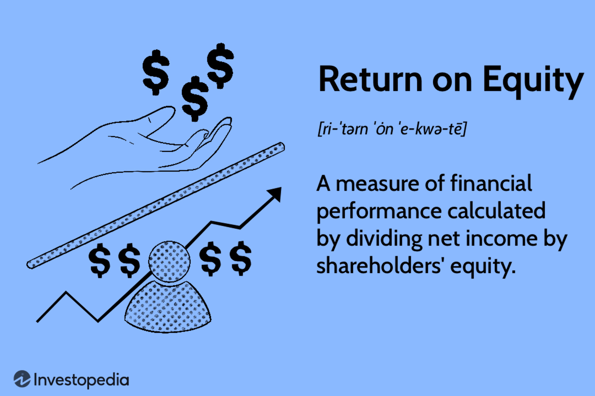

## Table of Contents

## What is Return on Equity (ROE)?

Return on Equity (ROE) is a financial ratio that shows how well a company uses the money invested by its shareholders to generate profit. It is calculated by dividing the company's net income by the shareholders' equity. This ratio is expressed as a percentage and helps investors understand how efficiently their capital is being used.

ROE is an important measure because it gives a quick snapshot of a company's profitability in relation to the equity. A higher ROE indicates that the company is more effective at turning shareholder investments into profits. For example, if a company has an ROE of 15%, it means that for every dollar of equity, the company generates 15 cents in profit. Investors often compare the ROE of different companies to decide where to invest their money.

## How is ROE calculated?

ROE is calculated by dividing a company's net income by its shareholders' equity. Net income is the money a company makes after paying all its expenses. Shareholders' equity is the total value of the company that belongs to the shareholders. It's what's left after you subtract all the company's debts from its total assets.

To find ROE, you take the net income number from the company's income statement and divide it by the shareholders' equity number from the balance sheet. The result is then multiplied by 100 to turn it into a percentage. For example, if a company's net income is $1 million and its shareholders' equity is $10 million, the ROE would be ($1 million / $10 million) * 100 = 10%. This means the company makes 10 cents of profit for every dollar of equity.

## Why is ROE important for investors?

ROE is important for investors because it tells them how well a company is using their money to make more money. When investors put money into a company, they want to know if that company can turn their investment into profit. ROE shows this by comparing the profit the company makes to the money the investors have put in. A higher ROE means the company is doing a good job at turning the investors' money into profit.

Investors also use ROE to compare different companies. If one company has a higher ROE than another, it might be a better place to invest. But it's not just about picking the company with the highest ROE. Investors also need to look at other things like how much risk there is and what the company does with its profits. Still, ROE is a quick and easy way to see how well a company is doing with the money it gets from investors.

## What does a high ROE indicate about a company?

A high ROE indicates that a company is good at making money from the money that shareholders have invested. When a company has a high ROE, it means it's using the shareholders' money efficiently to make profits. For example, if a company's ROE is 20%, it's making 20 cents of profit for every dollar that shareholders have put in. This is a sign that the company is doing well and might be a good place for investors to put their money.

But a high ROE isn't always a sure sign that a company is doing great. Sometimes, a company might have a high ROE because it's taking on a lot of debt. Debt can make a company's equity smaller, which can make the ROE look higher even if the company isn't really doing better. So, investors need to look at other things too, like how much debt the company has and how it's growing, to really understand if a high ROE is a good sign.

## Can ROE be too high? What might that suggest?

Yes, ROE can be too high, and it might suggest that something is not quite right with the company. If a company's ROE is much higher than other companies in the same industry, it could mean that the company is taking on a lot of debt. When a company borrows money, it can make its equity smaller, which makes the ROE look bigger. But having a lot of debt can be risky because the company has to pay back the money it borrowed, and if it can't, it might get into trouble.

It's also possible that a high ROE comes from doing things that won't last long. For example, a company might sell off some of its assets to make a quick profit, which can boost the ROE for a short time. But selling off assets isn't a good way to keep making money in the long run. So, if a company's ROE is really high, investors need to look closely at why it's so high and whether it's a sign of good management or something else.

## How does ROE differ from Return on Assets (ROA)?

ROE and ROA are two ways to measure how well a company is doing, but they look at different things. ROE shows how well a company is using the money that shareholders have put in to make a profit. It's calculated by dividing the company's net income by the shareholders' equity. So, if you want to know how good a company is at turning your investment into profit, you look at ROE.

ROA, on the other hand, shows how well a company is using all its assets to make money. It's calculated by dividing the company's net income by its total assets. This tells you how well the company is using everything it owns, like buildings, machines, and money, to make a profit. While ROE focuses on the money from shareholders, ROA looks at the whole picture of the company's resources.

## What are the limitations of using ROE as a performance metric?

One limitation of using ROE as a performance metric is that it can be misleading if a company has a lot of debt. When a company borrows money, it can make its equity smaller, which makes the ROE look higher. But having a lot of debt is risky because the company has to pay it back. So, a high ROE might not mean the company is doing well if it's using a lot of borrowed money to get that high number.

Another limitation is that ROE doesn't tell you how the company is making its profits. A company might have a high ROE because it sold off some of its assets, which can make a quick profit but isn't a good way to keep making money in the long run. So, investors need to look at other things too, like how the company is growing and what it's doing with its profits, to really understand if a high ROE is a good sign.

Also, ROE can be different from one industry to another. What's a good ROE in one industry might not be good in another. So, comparing ROE across different industries can be tricky. It's better to compare companies within the same industry to get a fair idea of how well they're doing.

## How can ROE be used to compare companies within the same industry?

ROE can be used to compare companies within the same industry by looking at how well each company is using the money from shareholders to make profits. If two companies in the same industry have different ROEs, the one with the higher ROE is usually better at turning the money investors put in into profit. For example, if Company A has an ROE of 15% and Company B has an ROE of 10%, it means that Company A is making more money for each dollar of equity than Company B.

But it's important to look at other things too, not just ROE. Sometimes, a company might have a high ROE because it's using a lot of debt, which can be risky. So, investors should also check how much debt a company has and how it's growing. Comparing ROE within the same industry helps give a better picture of how well a company is doing compared to its competitors, but it's just one piece of the puzzle.

## What factors can affect a company's ROE?

A company's ROE can be affected by many things. One big thing is how much profit the company makes. If a company can make more money from what it sells, its net income goes up, which can make its ROE higher. Another thing that can affect ROE is how the company uses the money it gets from shareholders. If it uses that money well to make more money, like by investing in good projects or growing the business, the ROE can go up.

Another factor is how much debt the company has. If a company borrows a lot of money, it can make its equity smaller, which makes the ROE look higher. But having a lot of debt can be risky. Also, the industry the company is in can affect its ROE. Different industries have different average ROEs, so a company might have a high ROE compared to others in its industry, but not compared to companies in other industries.

## How do leverage and debt influence ROE?

Leverage and debt can really change a company's ROE. When a company borrows money, it's using leverage. This can make the company's equity smaller because debt is subtracted from the total assets to find equity. A smaller equity number means the ROE can look bigger, even if the company isn't making more profit. So, a company might have a high ROE just because it's using a lot of debt, not because it's doing a great job with the money from shareholders.

But using a lot of debt can be risky. If a company can't pay back the money it borrowed, it might get into trouble. So, a high ROE that comes from a lot of debt might not be a good sign. Investors need to look at how much debt a company has and how it's using that debt to really understand if a high ROE is a good thing or not. It's important to see the whole picture, not just the ROE number.

## What is the DuPont analysis and how does it break down ROE?

The DuPont analysis is a way to break down ROE into smaller parts to understand what's making it high or low. It helps investors see how different things like profit margins, how well a company uses its assets, and how much debt it has can affect ROE. The DuPont formula splits ROE into three pieces: net profit margin, asset turnover, and equity multiplier. By looking at these three parts, you can see where a company is doing well or where it needs to improve.

The first part, net profit margin, shows how much profit a company makes from each dollar of sales. If a company has a high net profit margin, it means it's good at turning sales into profit. The second part, asset turnover, shows how well a company uses its assets to make sales. A high asset turnover means the company is using its assets efficiently. The third part, the equity multiplier, shows how much debt a company is using. A higher equity multiplier means the company is using more debt, which can make ROE look higher but also means more risk. By looking at these three parts together, you can get a better idea of what's driving a company's ROE.

## How can a company improve its ROE?

A company can improve its ROE by making more profit from what it sells. This means finding ways to make more money or spend less money on making and selling things. For example, a company could try to sell more stuff, raise prices, or find cheaper ways to make its products. If a company can make its net profit margin bigger, its ROE will go up because it's making more money from each dollar of sales.

Another way to improve ROE is by using its assets better. If a company can make more sales with the same amount of stuff it owns, like buildings and machines, its asset turnover will go up. This means the company is using what it has more efficiently, which can make ROE higher. For example, a company could use its machines more often or find new ways to use its buildings to make more sales.

A company can also try to use less debt or use it in smarter ways. If a company has a lot of debt, it might look like it has a high ROE, but it's risky. By paying down debt or using debt in a way that helps the company grow, a company can make its equity bigger and its ROE better. But it's important to balance this because too much debt can be dangerous. By working on these three things—making more profit, using assets better, and managing debt wisely—a company can improve its ROE and make its shareholders happier.

## How do you calculate Return on Equity?

The calculation of Return on Equity (ROE) involves the utilization of net income from a company's income statement and shareholders' equity from its balance sheet. This metric is calculated as follows:

$$
\text{ROE} = \frac{\text{Net Income}}{\text{Shareholders' Equity}}
$$

Net income represents the profits a company has earned after all expenses and taxes have been deducted, and it provides insights into a company's profitability. Shareholders' equity is the difference between total assets and total liabilities and reflects the residual interest in the assets of the entity.

### Best Practices in ROE Calculation

To ensure a more accurate depiction of a company’s financial performance over time, it is advisable to use average shareholders' equity. This approach accounts for fluctuations in equity during the period under review. The formula can be adjusted as follows:

$$
\text{Average Shareholders' Equity} = \frac{\text{Beginning Equity} + \text{Ending Equity}}{2}
$$

Thus, the adjusted ROE formula becomes:

$$
\text{Adjusted ROE} = \frac{\text{Net Income}}{\text{Average Shareholders' Equity}}
$$

### Hypothetical Example

Consider a hypothetical company with a net income of $500,000 for the fiscal year. The equity at the beginning of the year was $1,000,000 and $1,200,000 at the end of the year.

1. Calculate the average shareholders' equity:

   \[ \text{Average Shareholders' Equity} = \frac{1,000,000 + 1,200,000}{2} = 1,100,000
$$

2. Compute the ROE:

   \[ \text{ROE} = \frac{500,000}{1,100,000} \approx 0.4545 \text{ or } 45.45\%
$$

This ROE indicates that the company is generating 45.45% return on the equity holders' investments.

### Challenges in ROE Calculation

Calculating ROE can be straightforward, but complexities arise under certain conditions, such as:

- **Negative Equity**: When liabilities exceed assets, resulting in negative shareholders' equity. In such situations, the ROE formula becomes less meaningful or even misleading.

- **Fluctuating Profits**: Companies with volatile net income can display significant variances in ROE, which might not accurately reflect long-term performance.

- **Extraordinary Items**: One-time gains or losses that can distort net income and impact ROE calculations.

Careful consideration of these challenges is necessary to ensure that the ROE reflects a true measure of a company’s operational efficiency and profitability.

## What are the differences between ROE and ROIC?

Return on Equity (ROE) and Return on Invested Capital (ROIC) are both pivotal metrics in assessing a company's financial efficiency, but they differ in scope and application. ROE, as mentioned earlier, calculates the profitability concerning shareholders' equity using the formula: 

$$
\text{ROE} = \frac{\text{Net Income}}{\text{Shareholders' Equity}}
$$

Conversely, ROIC is broader as it accounts for both equity and debt in evaluating how effectively a company generates returns on its capital base. The formula for ROIC is:

$$
\text{ROIC} = \frac{\text{Net Operating Profit After Taxes (NOPAT)}}{\text{Invested Capital}}
$$

The invested capital typically includes total equity and all interest-bearing debt, providing insights that encompass the entire capital structure of a company.

### Why ROIC Can Be More Comprehensive

1. **Inclusion of Debt:** While ROE focuses solely on equity, ROIC incorporates debt, making it more applicable for companies with significant borrowing. A firm might have a high ROE due to minimal equity and high leverage, which could mislead investors about its real profitability potential if they rely on ROE alone.

2. **Whole Capital Utilization:** ROIC offers a holistic view by showing how well a company utilizes its entire pool of finances, including equity and debt. This encompasses all aspects of operational capital efficiency, from profit generation to resource allocation.

3. **Uniformity Across Industries:** ROIC facilitates comparisons across industries better than ROE. Different industries have varying levels of debt, and ROIC's comprehensive nature allows for more equitable assessments.

### Preferred Use Cases for ROIC Over ROE

- **Highly Leveraged Companies:** For companies that operate with significant debt levels, relying solely on ROE can give an incomplete picture of financial health. ROIC, by incorporating this debt, indicates whether these companies are generating enough returns to justify their capital structure.

- **Capital-Intensive Industries:** In sectors like utilities or manufacturing, where capital expenditures and debt are considerable, ROIC is more relevant. It assesses outcomes of large investments and provides transparency in companies' capabilities to manage their finances effectively.

- **Cross-Sector Comparison:** For analysts and investors comparing firms from different industries, ROIC mitigates the discrepancies caused by varying industry debt norms, granting a clearer view of intrinsic operational efficiency.

In conclusion, while ROE is crucial for assessing shareholder returns, ROIC offers a more encompassing analysis of financial performance by integrating debt into the evaluation matrix. Investors aiming for a comprehensive understanding of a company's operational efficacy might prioritize ROIC, particularly in scenarios involving cross-sector evaluations and high-leverage environments.

## What is DuPont Analysis?

DuPont Analysis is a valuable financial tool used to break down Return on Equity (ROE) into distinct components to gain insights into the specific factors influencing a company's financial performance. This method enables analysts to pinpoint the operational efficiencies and decide on leverage strategies that impact ROE.

The DuPont Analysis decomposes ROE into three critical components: net profit margin, asset turnover, and equity multiplier. The equation can be expressed as:

$$
\text{ROE} = \text{Net Profit Margin} \times \text{Asset Turnover} \times \text{Equity Multiplier}
$$

Each element plays a unique role:

1. **Net Profit Margin**: This indicates the profitability of the company by showing the percentage of revenue that translates into profit after expenses. It's calculated as:

   \[ \text{Net Profit Margin} = \frac{\text{Net Income}}{\text{Revenue}}
$$

   A higher net profit margin implies better efficiency in cost control and profitability.

2. **Asset Turnover**: This reflects the company’s ability to generate sales from its assets, evaluating how efficiently the assets are used. It's calculated through:

   \[ \text{Asset Turnover} = \frac{\text{Revenue}}{\text{Average Total Assets}}
$$

   A higher asset turnover ratio suggests more effective use of assets in generating revenue.

3. **Equity Multiplier**: This measures the company's financial leverage by examining the extent to which a company is using debt to finance its assets. The formula is:

   \[ \text{Equity Multiplier} = \frac{\text{Average Total Assets}}{\text{Average Equity}}
$$

   A higher equity multiplier indicates a greater level of debt utilization.

By analyzing these components individually, DuPont Analysis offers insights into whether a company's high or low ROE is the result of operational efficiency, asset utilization, or financial leverage. For instance, a high ROE driven primarily by a high equity multiplier may signal dependence on debt, potentially increasing financial risk. Conversely, if the ROE is attributed mainly to a high asset turnover or net profit margin, it typically reflects genuine business efficiency and profitability.

DuPont Analysis is particularly helpful for identifying areas where management's attention is required. It can guide investment decisions by aligning ROE components with strategic objectives, whether enhancing profitability, optimizing asset use, or managing debt levels efficiently. This makes DuPont Analysis a crucial instrument in nuanced financial performance evaluations.

## References & Further Reading

[1]: Damodaran, A. (2002). ["Investment Valuation: Tools and Techniques for Determining the Value of Any Asset"](https://archive.org/details/investmentvaluat0000damo_n6k9). Wiley Finance.

[2]: Higgins, R. C. (2018). ["Analysis for Financial Management"](https://www.mheducation.com/highered/product/analysis-financial-management-higgins-koski/M9781260772364.html). McGraw-Hill Education.

[3]: Penman, S. H. (2013). ["Financial Statement Analysis and Security Valuation"](https://www.mheducation.com/highered/product/financial-statement-analysis-security-valuation-penman/M9780078025310.html). McGraw-Hill Education.

[4]: Malkiel, B. G. (2015). ["A Random Walk Down Wall Street: The Time-Tested Strategy for Successful Investing"](https://yourknowledgedigest.org/wp-content/uploads/2020/04/a-random-walk-down-wall-street.pdf). W.W. Norton & Company.

[5]: ["Return on Equity: The DuPont Model"](https://www.investopedia.com/terms/d/dupontanalysis.asp) by Harvard Business Review

[6]: ["Return on Equity (ROE): A Robust Success Metric"](https://www.investopedia.com/terms/r/returnonequity.asp) by Investopedia

[7]: ["Financial Ratio Analysis"](https://www.investopedia.com/terms/r/ratioanalysis.asp) by CFA Institute

[8]: Damodaran, A. (2011). ["The Little Book of Valuation: How to Value a Company, Pick a Stock and Profit"](https://www.amazon.com/Little-Book-Valuation-Company-Profit/dp/1118004779). Wiley Finance.