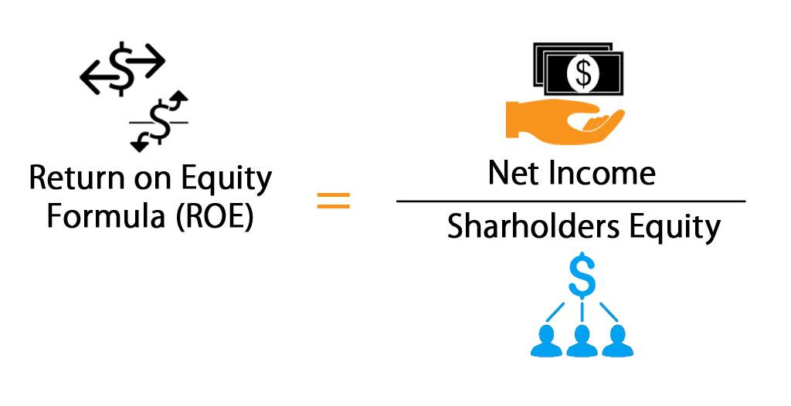

Return on Equity (ROE) is a pivotal metric in financial analysis used to measure a company's ability to generate profits from its shareholders' equity. It serves as an indicator of financial performance, reflecting how efficiently management is utilizing the equity capital provided by shareholders. The computation of ROE is expressed through the formula: 

$$
\text{ROE} = \frac{\text{Net Income}}{\text{Shareholder's Equity}}
$$



This formula illustrates the percentage of profit a company earns from every unit of equity, thereby serving as an indicator of operational efficiency. ROE is integral in financial analysis because it provides insights into the effectiveness with which a company converts the invested capital into profits.

Investors and analysts often employ ROE to compare the financial performance of companies within the same industry. A higher ROE is generally favorable, signifying that the company is capable of generating substantial profits with relatively lower equity investment. However, ROE must be interpreted carefully as it can vary significantly across different industries due to differing capital requirements and market conditions.

In algorithmic trading, ROE is utilized as a key metric for developing investment strategies. Its incorporation into trading algorithms aids in identifying companies with high performance potential, offering traders a systematic approach to investment decisions. This reflects the broader application of financial metrics in advanced trading technologies.

The article will explore several facets of ROE, starting with a detailed understanding of its calculation and interpretation. It will delve into its importance in financial analysis, especially in assisting investors to gauge the efficiency of a company’s equity utilization. The section on algorithmic trading will highlight the role of ROE in automated trading systems. Further, a step-by-step guide will clarify the precise calculation process, followed by advanced analysis techniques like the DuPont analysis. Lastly, the challenges and limitations of relying solely on ROE will be addressed, emphasizing the importance of considering a comprehensive range of financial metrics.

## Table of Contents

## Understanding ROE: Return on Equity

Return on Equity (ROE) is a key financial metric used to evaluate a company's efficiency at generating profits from its shareholders' equity. The formula for calculating ROE is expressed as:

$$
\text{ROE} = \frac{\text{Net Income}}{\text{Shareholder's Equity}}
$$

**Components Involved in ROE Calculation**

1. **Net Income**: This is the profit a company has earned over a specific period, typically after tax, and is usually available in the company’s income statement. Net income reflects the company’s profitability.

2. **Shareholder’s Equity**: This component is located on the balance sheet and represents the amount shareholders have invested in the company. It includes the initial amount invested and retained earnings, which are profits not distributed as dividends.

The calculation of ROE provides stakeholders with insights into how well a company is employing its equity to generate profits. A higher ROE indicates more efficient use of equity capital in profit generation, making it an attractive metric for investors.

**Variations Across Industries**

ROE varies significantly across industries, reflecting the diverse capital structures and business models. Capital-intensive industries, such as utilities and manufacturing, generally have lower ROEs due to high asset bases and slower growth rates. In contrast, technology and pharmaceuticals often report higher ROEs, driven by lower capital requirements and innovative growth potential.

**Importance of Industry Averages**

Comparing a company’s ROE with industry averages is important for a fair assessment. For instance, a ROE of 15% might be excellent in the utility sector but considered subpar in the tech industry. Investors and analysts often use industry benchmarks to evaluate a company’s performance more accurately.

**Examples of ROE Calculation**

For practical application, consider a company with a net income of $200,000 and total shareholders' equity of $1,000,000. The ROE can be calculated as follows:

$$
\text{ROE} = \frac{200,000}{1,000,000} = 0.20 \text{ or } 20\%
$$

This result implies that the company generates a return of 20% on its equity, indicating the efficiency of the firm's equity utilization in generating income.

Applying this formula across different industries provides valuable insight into the operational and financial efficacy of a company.

## Importance of ROE in Financial Analysis

Return on Equity (ROE) is a crucial metric for investors seeking to evaluate the efficiency of a company's use of equity capital. ROE is calculated as the ratio of net income to shareholder's equity, and it provides a direct measure of the company's profitability relative to the equity shareholders have invested.

### Efficiency of Equity Capital

ROE illustrates how effectively a company converts shareholders' equity into net income. A higher ROE indicates that the company is more efficient at generating profits from every dollar of equity. For investors, this efficiency is a key [factor](/wiki/factor-investing) in assessing a firm's potential for sustainable growth and profitability. The formula for calculating ROE is:

$$
\text{ROE} = \frac{\text{Net Income}}{\text{Shareholder's Equity}}
$$

### Perception of High ROE

A high ROE is generally perceived positively by investors as it signifies robust management performance and potentially high returns on investment. Companies with consistently high ROE are often deemed well-managed and capable of generating significant returns for their shareholders. However, this is contingent upon other factors, such as the company's leverage and industry context.

### Potential Pitfalls

Relying solely on ROE for investment decisions can be problematic. Higher ROE values, though attractive, might be driven by excessive leverage rather than operational efficiency. This leverage increases financial risk, potentially compromising the company's long-term stability. Companies that engage in share buybacks can also artificially inflate ROE by reducing the equity base, leading to misleading conclusions about their financial health.

### Identifying High-Performance Stocks

ROE plays an instrumental role in identifying high-performance stocks. Investors often use ROE to screen for companies that deliver superior returns on equity capital. High ROE stocks are typically considered high-performance due to their capacity to generate higher earnings with the equity available. However, prudent assessment requires cross-referencing ROE with other financial metrics and market conditions to ensure comprehensive analysis.

### ROE Trends and Growth Potential

Tracking ROE trends over time can provide insight into a company’s growth potential. Increasing ROE can be a positive indicator of a company's ability to enhance profitability and capitalize on its equity, suggesting potential for expansion. On the contrary, a declining ROE may signal underlying operational or strategic challenges, flagging potential investor concern. Understanding the reasons behind these trends is instrumental for making informed investment decisions.

In conclusion, while ROE is a valuable tool for assessing a company's financial performance and potential, it should be used in conjunction with other financial metrics to mitigate risks associated with over-reliance on a single indicator. It can offer insights into equity efficiency, but investors must remain vigilant to the broader financial context and underlying factors influencing ROE values.

## ROE in Algo Trading

Algorithmic trading, often referred to as algo trading, involves the use of complex algorithms and mathematical models to make high-speed trading decisions in financial markets. This method leverages computational power to analyze vast datasets, identify trading opportunities, and execute trades with minimal human intervention. Algorithmic trading has gained significant prominence due to its ability to enhance trading efficiency, reduce costs, and mitigate emotional biases inherent in manual trading.

Return on Equity (ROE) is a critical performance metric that can be effectively utilized within [algorithmic trading](/wiki/algorithmic-trading) systems. By definition, ROE measures a company's ability to generate profits from shareholders' equity and is calculated using the formula:

$$
\text{ROE} = \frac{\text{Net Income}}{\text{Shareholder's Equity}}
$$

Incorporating ROE into investment algorithms offers several advantages. Firstly, it serves as a reliable indicator of a company's financial health and operational efficiency, guiding investors toward potentially high-performance stocks. By identifying firms with consistently high ROE, algorithms can target stocks that are likely to offer superior returns relative to equity capital. 

Moreover, the use of ROE in trading algorithms allows for a comparative assessment across firms and industries. By integrating ROE with other financial ratios, such as the Price-to-Earnings (P/E) ratio or the Debt-to-Equity ratio, traders can develop more comprehensive strategies. This multidimensional approach helps in understanding a company's valuation, growth potential, and financial leverage, thereby enabling more informed trading decisions.

A case study examining ROE-based algorithmic strategies reveals insightful performance trends in the stock market. For instance, historically, algorithms that prioritize high ROE stocks have demonstrated an ability to outperform market benchmarks. A notable example can be seen in quantitative strategies deployed by hedge funds, where the integration of ROE with [momentum](/wiki/momentum) indicators and earnings revisions has led to significant alpha generation.

The integration of ROE into algorithmic trading strategies can be illustrated through a simple Python script that screens for stocks with high ROE values:

```python
import pandas as pd
import yfinance as yf  # For more datasets, visit: https://paperswithbacktest.com/datasets

# Fetching stock data
tickers = ['AAPL', 'MSFT', 'GOOGL']  # Sample stock tickers
data = yf.download(tickers, period='5y')

# Calculate ROE
def calculate_roe(net_income, equity):
    return net_income / equity

# Sample financial data
financials = {'AAPL': {'Net Income': 60000000000, 'Equity': 89000000000},
              'MSFT': {'Net Income': 50000000000, 'Equity': 80000000000},
              'GOOGL': {'Net Income': 40000000000, 'Equity': 90000000000}}

# Screening for high ROE stocks
high_roe_stocks = {}
for ticker, fin in financials.items():
    roe = calculate_roe(fin['Net Income'], fin['Equity'])
    if roe > 0.15:  # Threshold for high ROE
        high_roe_stocks[ticker] = roe

print("High ROE Stocks:", high_roe_stocks)
```

In conclusion, while ROE serves as a valuable metric for identifying potentially lucrative investments, it should be integrated with other financial indicators to enhance the robustness of trading strategies. Algorithmic trading systems, by leveraging ROE alongside a suite of financial ratios, can effectively navigate the complexities of financial markets and generate substantial returns.

## Calculating ROE: Step-by-Step Guide

Calculating Return on Equity (ROE) effectively requires an understanding of both the formula and the elements that comprise it. ROE is defined by the formula:

$$
\text{ROE} = \frac{\text{Net Income}}{\text{Shareholder's Equity}}
$$

### Step-by-Step Process to Calculate ROE

1. **Determine Net Income:**
   - Net Income is the profit after all expenses, taxes, and costs have been subtracted from total revenue. This figure is typically found at the bottom of a company’s income statement.

2. **Identify Shareholder's Equity:**
   - Shareholder's Equity represents the net assets of the company, calculated as total assets minus total liabilities. This figure can be found on the company's balance sheet.

3. **Carry Out the Division:**
   - Divide the net income by the shareholder's equity to get the ROE percentage. This result reflects the efficiency with which a company is using its equity base to generate profits.

### Tools and Software for ROE Calculation

Several financial analysis tools and software can simplify the calculation of ROE. Excel and Google Sheets offer built-in functionalities for large data-handling and formula calculations. For automation and complex data analysis, financial software like Bloomberg Terminal, QuickBooks, or Python libraries (such as Pandas for data manipulation) are recommended.

### Common Challenges and Mistakes

- **Incorrect Data Retrieval:** Using incorrect values from financial statements can skew results. It is crucial to ensure that both net income and shareholder's equity are correctly identified.

- **Inconsistent Time Periods:** Ensuring that the net income and equity are from the same reporting period is critical for an accurate ROE.

- **Non-recurring Events:** Adjusting for one-time events or unusual gains/losses will provide a more sustainable picture of a company's performance.

### Interpretation of the Results

A higher ROE indicates a company is efficient at generating profits from every unit of shareholder equity. However, it is important to compare the ROE to industry benchmarks for context. An unusually high ROE might point to excessive leverage, which can imply higher risks.

### Tips on Improving ROE

- **Enhancing Profit Margins:** Companies can focus on cost reduction strategies and increasing sales to bolster profit margins.

- **Effective Asset Management:** Increasing asset turnover by efficiently managing assets to generate more sales revenue improves ROE.

- **Strategic Leverage Use:** While increasing debt can enhance ROE, it should be used judiciously to avoid financial distress.

- **Optimizing Equity Structure:** Managing the equity base through activities like share buybacks can also positively influence ROE. However, this strategy needs careful consideration regarding long-term operational needs and financial health. 

By understanding and accurately calculating ROE, businesses can make informed decisions that enhance their financial performance, while investors can better assess investment opportunities.

## Advanced ROE Analysis Techniques

Advanced techniques in analyzing Return on Equity (ROE) provide deeper insights into a company's financial health, beyond the basic ROE formula. One of the most recognized approaches is the DuPont Analysis, which expands ROE into three distinct components: profit margin, asset turnover, and financial leverage. These components are represented in the formula:

$$
\text{ROE} = \left( \frac{\text{Net Income}}{\text{Sales}} \right) \times \left( \frac{\text{Sales}}{\text{Total Assets}} \right) \times \left( \frac{\text{Total Assets}}{\text{Shareholder's Equity}} \right)
$$

By examining each element separately, analysts gain a clearer understanding of how operational efficiency, asset efficiency, and leverage contribute to overall ROE.

Leverage, represented by the equity multiplier in the DuPont formula, has a significant influence on ROE. While higher leverage can amplify ROE, it also elevates financial risk. Companies with high leverage might boost ROE due to the increased use of debt financing, but this can also compromise financial stability, especially in volatile market conditions.

In predicting future ROE trends, regression analysis can be a valuable tool. It involves using statistical methods to determine the relationships between ROE and various financial indicators. By identifying patterns and correlations, financial analysts can make informed predictions about ROE's trajectory.

Moreover, [machine learning](/wiki/machine-learning) models offer advanced capabilities for forecasting ROE with greater precision. Techniques such as supervised learning can be employed to analyze historical financial data and predict future performance. Python, with libraries like Scikit-learn, can be used to implement machine learning algorithms for this purpose. A sample Python code snippet using linear regression might look like:

```python
from sklearn.model_selection import train_test_split
from sklearn.linear_model import LinearRegression
import pandas as pd

# Example dataframe
data = pd.DataFrame({
    'Sales': [10000, 11000, 9000, 10500],
    'Net Income': [2000, 2200, 1800, 2100],
    'Total Assets': [5000, 5500, 4800, 5300],
    'Equity': [2000, 2100, 1900, 2050]
})

# Calculate historical ROE
data['ROE'] = data['Net Income'] / data['Equity']

# Prepare data for regression
X = data[['Sales', 'Total Assets', 'Equity']]
y = data['ROE']

# Train-test splitting
X_train, X_test, y_train, y_test = train_test_split(X, y, test_size=0.2)

# Linear Regression model
model = LinearRegression()
model.fit(X_train, y_train)

# Predicting ROE
predictions = model.predict(X_test)

print("Predicted ROE:", predictions)
```

Machine learning models can also incorporate additional data dimensions, such as market trends and economic indicators, providing a comprehensive outlook on potential ROE variations. These advanced techniques, though complex, offer substantial benefits to financial analysis by refining ROE assessments and forecasts.

## Challenges and Limitations of ROE

Return on Equity (ROE) stands as a crucial metric in financial analysis, yet it presents several challenges and limitations when used in isolation. One common pitfall is the reliance on ROE as a standalone indicator of a company's financial health. While a high ROE can signify effective management and profitability, it can also be misleading if not contextualized within a broader financial analysis framework.

### Impact of Share Buybacks on ROE Calculations

Share buybacks can significantly affect ROE figures. When a company repurchases its shares, the number of outstanding shares decreases, which in turn reduces the denominator in the ROE equation, potentially inflating the ROE value without any real improvement in the company’s operational efficiency or profitability. This artificial enhancement can lead to a skewed perception of the company’s financial performance, resulting in investment decisions that may not align with the company's true financial condition.

### Limitations in Capturing Comprehensive Financial Health

ROE does not capture all dimensions of a company's financial health. It primarily focuses on profitability relative to shareholders' equity but ignores other critical factors such as cash flow, debt levels, and market conditions. Moreover, industries with capital-intensive operations often exhibit lower ROE owing to high asset bases, which may not necessarily indicate poor performance.

### Examples of Misleading ROE Figures

Misleading ROE figures can arise under several circumstances. For example, a company with substantial debt may have a high ROE due to significant leverage, yet this brings additional financial risk that ROE does not address. Similarly, short-term improvements in net income via cost-cutting measures or accounting adjustments may temporarily boost ROE, disguising underlying issues.

### Strategies to Mitigate High ROE Risks

Investors can mitigate the risks associated with focusing solely on high ROE by employing complementary financial metrics. Incorporating measures such as Return on Assets (ROA) and Return on Invested Capital (ROIC) provides a more balanced view. Using the DuPont Analysis, which decomposes ROE into its component parts – profit margin, asset turnover, and financial leverage – allows investors to identify the actual drivers of ROE and assess their sustainability.

Additionally, a prudent approach is to compare ROE against industry peers and historical performance, assessing it in conjunction with qualitative factors such as market trends, management competence, and economic conditions. By doing so, investors can better discern the quality of earnings and the sustainability of ROE, leading to more informed investment decisions.

## Conclusion

Return on Equity (ROE) is a pivotal metric in financial analysis and algorithmic trading due to its capacity to encapsulate a company's ability to generate profits from its shareholders' equity. Through this article, we have explored the multifaceted nature of ROE, its calculation, and its application across various investment strategies.

The discussion elucidated how ROE serves as a robust indicator of financial efficiency, allowing investors to gauge the effectiveness of management in utilizing equity capital. A higher ROE often signals robust performance, yet it is imperative not to rely solely on this metric. Potential distortions, such as those introduced by share buybacks, can obscure the true financial health of a company. Therefore, comparing a company's ROE with industry benchmarks remains crucial for comprehensive analysis.

In the context of algorithmic trading, ROE's integration as an indicator underscores its value in crafting high-performance trading algorithms. Its combined use with other financial ratios can enhance predictive accuracy and investment outcomes.

This article encourages investors and financial analysts to leverage ROE actively in their decision-making processes. However, a nuanced understanding of its implications and limitations is essential. Continuous learning and adaptation are necessary as market conditions evolve and more sophisticated analytical tools become available.

To maximize the benefits of ROE, readers should consider implementing the insights and strategies discussed, while remaining vigilant to the metric's inherent challenges. By doing so, they can enhance their analytical acumen and drive more informed investment decisions.

## References & Further Reading

[1]: ["Return on Equity (ROE) Analysis"](https://www.wallstreetprep.com/knowledge/return-on-equity-roe/) by CFA Institute

[2]: Damodaran, A. (2002). ["Investment Valuation: Tools and Techniques for Determining the Value of Any Asset"](https://archive.org/details/investmentvaluat0000damo_n6k9) by Aswath Damodaran

[3]: ["Financial Intelligence, Revised Edition: A Manager's Guide to Knowing What the Numbers Really Mean"](https://www.amazon.com/Financial-Intelligence-Revised-Managers-Knowing/dp/1422144119) by Karen Berman and Joe Knight

[4]: Haugen, R. A. (2001). ["Modern Investment Theory"](https://archive.org/details/moderninvestment00haug_0) by Robert A. Haugen

[5]: ["The Intelligent Investor: The Definitive Book on Value Investing"](https://www.amazon.com/Intelligent-Investor-Definitive-Investing-Essentials/dp/0060555661) by Benjamin Graham

[6]: ["The Little Book of Valuation: How to Value a Company, Pick a Stock, and Profit"](https://www.amazon.com/Little-Book-Valuation-Company-Profit/dp/1118004779) by Aswath Damodaran