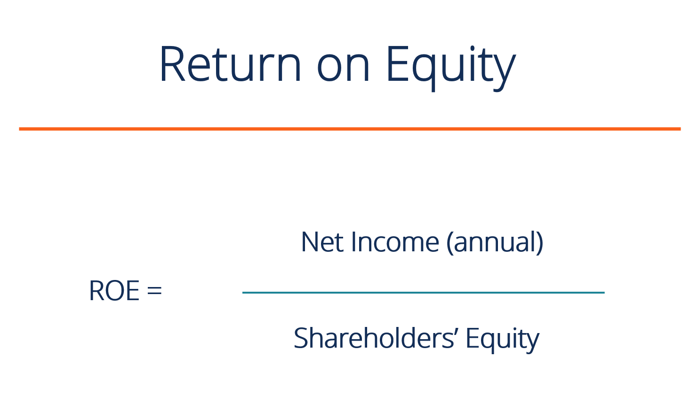

## Table of Contents

## What is Return on Equity (ROE)?

Return on Equity (ROE) is a financial ratio that measures how well a company is using the money invested by its shareholders to generate profit. It shows the percentage of profit a company earns compared to the total amount of shareholder equity. To calculate ROE, you divide the company's net income by the shareholders' equity. This ratio is important because it helps investors understand how effectively their money is being used to grow the company.

ROE is often used by investors to compare the performance of different companies. A higher ROE indicates that a company is more efficient at turning shareholder investments into profits. However, it's important to look at ROE alongside other financial metrics because a high ROE alone doesn't guarantee a good investment. Factors like debt levels and industry standards should also be considered to get a complete picture of a company's financial health.

## Why is ROE important for investors?

ROE is important for investors because it shows how well a company is using the money they put into it to make more money. Think of it like this: if you give your friend $100 and they turn it into $110, they did a good job. ROE tells you if a company is doing a good job with the money you invest. A high ROE means the company is good at making profits from the money shareholders give them.

But, ROE is not the only thing investors should look at. It's like a piece of a puzzle. You need to see the whole picture. Other things like how much debt the company has or how it compares to other companies in the same industry are also important. So, while ROE is a helpful tool, it's best used with other information to decide if a company is a good investment.

## How do you calculate ROE?

To calculate Return on Equity (ROE), you take the company's net income and divide it by the shareholders' equity. Net income is the money the company makes after paying all its bills. Shareholders' equity is the money that belongs to the people who own the company's stock. You can find these numbers on the company's financial statements. Once you have them, you just do the division: ROE = Net Income / Shareholders' Equity.

For example, if a company has a net income of $50,000 and shareholders' equity of $250,000, the ROE would be 20%. You get that by dividing $50,000 by $250,000. This means for every dollar the shareholders put into the company, the company made 20 cents in profit. It's a simple way to see how well the company is using the money it gets from its owners.

## What are the components of ROE?

The components of Return on Equity (ROE) are net income and shareholders' equity. Net income is the money a company makes after it pays all its bills and expenses. It's what's left over at the end of the year that the company can keep or give to shareholders. Shareholders' equity is the money that belongs to the people who own the company's stock. It's the total value of the company's assets minus its liabilities. 

To calculate ROE, you divide the net income by the shareholders' equity. This gives you a percentage that shows how well the company is using the money from its shareholders to make more money. For example, if a company has a net income of $100,000 and shareholders' equity of $500,000, the ROE would be 20%. This means for every dollar the shareholders put into the company, it made 20 cents in profit.

## Can you provide a simple example of ROE calculation?

Let's say a company made $10,000 in profit last year. This profit is called net income. The company also has $50,000 in shareholders' equity. Shareholders' equity is the money that belongs to the people who own the company's stock. To find the Return on Equity (ROE), you divide the net income by the shareholders' equity.

So, you take $10,000 and divide it by $50,000. This gives you an ROE of 0.20, or 20%. This means for every dollar the shareholders put into the company, it made 20 cents in profit. It's a simple way to see how well the company is using the money from its owners.

## What does a high ROE indicate about a company?

A high ROE means a company is good at making money from the cash its owners put in. If a company has a high ROE, it's like saying they're really smart with the money they get from shareholders. They're using it well to make more money, which is what investors want to see. It shows the company is efficient and can turn the money it gets into bigger profits.

But, a high ROE isn't always a perfect sign. Sometimes, a company might have a high ROE because they're using a lot of borrowed money, which can be risky. So, while a high ROE is usually good news, it's smart for investors to look at other things too, like how much debt the company has and how it compares to other companies in the same business. This way, they get a fuller picture of how healthy the company really is.

## What does a low ROE suggest about a company's performance?

A low ROE means a company isn't doing a great job at turning the money its shareholders give it into more money. It's like if you gave your friend $100 and they only turned it into $102. That's not very good. A low ROE can show that the company might not be using its resources well or that it's not making enough profit.

But, a low ROE isn't always a bad sign. Sometimes, a company might be in a stage where it's growing and needs to spend a lot of money on new things, which can make the ROE look low for a while. It's important for investors to look at other things too, like how the company is doing compared to others in its industry or if it's getting better over time. That way, they can understand the whole story and not just focus on one number.

## How does ROE differ across industries?

ROE can be very different from one industry to another because each industry has its own way of making money and using resources. For example, tech companies might have a high ROE because they don't need a lot of money to buy things like factories or machines. They can make a lot of profit with just their ideas and software. On the other hand, industries like utilities or heavy manufacturing might have lower ROEs because they need to spend a lot of money on big equipment and infrastructure, which can make it harder to turn a big profit quickly.

It's important for investors to compare a company's ROE with others in the same industry, not just look at the number by itself. A company in the tech industry might have an ROE of 20%, which is good for that industry. But the same ROE in the utility sector might be seen as low because utilities usually have lower ROEs. So, understanding what's normal for each industry helps investors make smarter choices about where to put their money.

## What are the limitations of using ROE as a performance metric?

ROE is a helpful number, but it's not perfect. One big problem is that it doesn't tell you about the company's debt. A company might have a high ROE because it borrowed a lot of money, not because it's good at making profits. This can be risky because if the company can't pay back the debt, it could be in trouble. Also, ROE can be different in different industries. What's a good ROE in one industry might be bad in another. So, if you just look at ROE, you might think a company is doing well when it's really not, compared to others in its field.

Another issue with ROE is that it can be affected by one-time events. For example, if a company sells a big piece of property, it might look like it's doing great because its net income goes up. But that's not the same as making money from selling products or services. ROE also doesn't show you if a company is growing or shrinking. A company might have a high ROE but be losing customers or market share. So, while ROE is a useful tool, it's best to use it with other information to get a full picture of how a company is doing.

## How can ROE be used in conjunction with other financial ratios?

ROE is a good tool, but it's even better when you use it with other financial ratios. For example, you can look at the debt-to-equity ratio to see if a company is using a lot of borrowed money to make its ROE look high. If a company has a high ROE but also a high debt-to-equity ratio, it might be taking on too much risk. Another useful ratio is the price-to-earnings (P/E) ratio, which shows how much investors are willing to pay for a company's earnings. If a company has a high ROE and a low P/E ratio, it might be a good investment because it's making good profits and the stock price isn't too high.

You can also use ROE with the return on assets (ROA) ratio. ROA tells you how well a company is using all its assets to make money, not just the money from shareholders. If a company has a high ROE but a low ROA, it might mean it's not using its assets efficiently. Another important ratio is the net profit margin, which shows how much profit a company makes from its sales. A company with a high ROE and a high net profit margin is probably doing a good job at turning sales into profits. By looking at these ratios together, you get a fuller picture of how well a company is doing and can make smarter investment choices.

## What are some advanced techniques for analyzing ROE trends over time?

To understand how a company's ROE is changing over time, you can use a few smart tricks. One way is to look at the DuPont analysis, which breaks down ROE into three parts: profit margin, asset turnover, and financial leverage. By looking at these parts, you can see if the company is getting better at making profits, using its assets, or managing its debt. Another trick is to use a moving average, like a 3-year or 5-year average, to smooth out any big jumps or drops in ROE. This helps you see the bigger picture and not get fooled by short-term changes.

Another useful technique is to compare the company's ROE to its industry average over time. This can tell you if the company is doing better or worse than its competitors. You can also look at how ROE changes with the company's growth rate. If ROE goes up as the company grows, that's a good sign. But if ROE stays the same or goes down while the company is growing, it might mean the company is not using its new money well. By using these advanced techniques, you can get a clearer picture of how the company is doing and make smarter decisions about investing.

## How do global economic factors affect ROE calculations and interpretations?

Global economic factors can change how we look at a company's ROE. Things like interest rates, inflation, and currency exchange rates can make a big difference. For example, if interest rates go up, it might be harder for a company to borrow money, which could lower its ROE. Or if a country's currency gets weaker, it might make a company's profits look smaller when they're changed into another currency. These global changes can make it tricky to compare ROE from one year to the next or between companies in different countries.

It's also important to think about how economic cycles affect ROE. During good economic times, companies might have higher ROEs because people are buying more and businesses are doing well. But in bad economic times, ROEs can drop because sales go down and profits shrink. So, when looking at ROE, it's smart to consider what's happening in the world economy. This helps you understand if a company's ROE is high or low because of its own performance or because of bigger economic changes.

## What is ROE and how does it relate to Return on Equity?

Return on Equity (ROE) is a key financial metric used to evaluate a company's efficiency at generating profits from its shareholders' equity. The formula for calculating ROE is expressed as:

$$
\text{ROE} = \frac{\text{Net Income}}{\text{Shareholder's Equity}}
$$

**Components Involved in ROE Calculation**

1. **Net Income**: This is the profit a company has earned over a specific period, typically after tax, and is usually available in the company’s income statement. Net income reflects the company’s profitability.

2. **Shareholder’s Equity**: This component is located on the balance sheet and represents the amount shareholders have invested in the company. It includes the initial amount invested and retained earnings, which are profits not distributed as dividends.

The calculation of ROE provides stakeholders with insights into how well a company is employing its equity to generate profits. A higher ROE indicates more efficient use of equity capital in profit generation, making it an attractive metric for investors.

**Variations Across Industries**

ROE varies significantly across industries, reflecting the diverse capital structures and business models. Capital-intensive industries, such as utilities and manufacturing, generally have lower ROEs due to high asset bases and slower growth rates. In contrast, technology and pharmaceuticals often report higher ROEs, driven by lower capital requirements and innovative growth potential.

**Importance of Industry Averages**

Comparing a company’s ROE with industry averages is important for a fair assessment. For instance, a ROE of 15% might be excellent in the utility sector but considered subpar in the tech industry. Investors and analysts often use industry benchmarks to evaluate a company’s performance more accurately.

**Examples of ROE Calculation**

For practical application, consider a company with a net income of $200,000 and total shareholders' equity of $1,000,000. The ROE can be calculated as follows:

$$
\text{ROE} = \frac{200,000}{1,000,000} = 0.20 \text{ or } 20\%
$$

This result implies that the company generates a return of 20% on its equity, indicating the efficiency of the firm's equity utilization in generating income.

Applying this formula across different industries provides valuable insight into the operational and financial efficacy of a company.

## What is the importance of ROE in financial analysis?

Return on Equity (ROE) is a crucial metric for investors seeking to evaluate the efficiency of a company's use of equity capital. ROE is calculated as the ratio of net income to shareholder's equity, and it provides a direct measure of the company's profitability relative to the equity shareholders have invested.

### Efficiency of Equity Capital

ROE illustrates how effectively a company converts shareholders' equity into net income. A higher ROE indicates that the company is more efficient at generating profits from every dollar of equity. For investors, this efficiency is a key [factor](/wiki/factor-investing) in assessing a firm's potential for sustainable growth and profitability. The formula for calculating ROE is:

$$
\text{ROE} = \frac{\text{Net Income}}{\text{Shareholder's Equity}}
$$

### Perception of High ROE

A high ROE is generally perceived positively by investors as it signifies robust management performance and potentially high returns on investment. Companies with consistently high ROE are often deemed well-managed and capable of generating significant returns for their shareholders. However, this is contingent upon other factors, such as the company's leverage and industry context.

### Potential Pitfalls

Relying solely on ROE for investment decisions can be problematic. Higher ROE values, though attractive, might be driven by excessive leverage rather than operational efficiency. This leverage increases financial risk, potentially compromising the company's long-term stability. Companies that engage in share buybacks can also artificially inflate ROE by reducing the equity base, leading to misleading conclusions about their financial health.

### Identifying High-Performance Stocks

ROE plays an instrumental role in identifying high-performance stocks. Investors often use ROE to screen for companies that deliver superior returns on equity capital. High ROE stocks are typically considered high-performance due to their capacity to generate higher earnings with the equity available. However, prudent assessment requires cross-referencing ROE with other financial metrics and market conditions to ensure comprehensive analysis.

### ROE Trends and Growth Potential

Tracking ROE trends over time can provide insight into a company’s growth potential. Increasing ROE can be a positive indicator of a company's ability to enhance profitability and capitalize on its equity, suggesting potential for expansion. On the contrary, a declining ROE may signal underlying operational or strategic challenges, flagging potential investor concern. Understanding the reasons behind these trends is instrumental for making informed investment decisions.

In conclusion, while ROE is a valuable tool for assessing a company's financial performance and potential, it should be used in conjunction with other financial metrics to mitigate risks associated with over-reliance on a single indicator. It can offer insights into equity efficiency, but investors must remain vigilant to the broader financial context and underlying factors influencing ROE values.

## What is ROE in Algo Trading?

Algorithmic trading, often referred to as algo trading, involves the use of complex algorithms and mathematical models to make high-speed trading decisions in financial markets. This method leverages computational power to analyze vast datasets, identify trading opportunities, and execute trades with minimal human intervention. Algorithmic trading has gained significant prominence due to its ability to enhance trading efficiency, reduce costs, and mitigate emotional biases inherent in manual trading.

Return on Equity (ROE) is a critical performance metric that can be effectively utilized within [algorithmic trading](/wiki/algorithmic-trading) systems. By definition, ROE measures a company's ability to generate profits from shareholders' equity and is calculated using the formula:

$$
\text{ROE} = \frac{\text{Net Income}}{\text{Shareholder's Equity}}
$$

Incorporating ROE into investment algorithms offers several advantages. Firstly, it serves as a reliable indicator of a company's financial health and operational efficiency, guiding investors toward potentially high-performance stocks. By identifying firms with consistently high ROE, algorithms can target stocks that are likely to offer superior returns relative to equity capital. 

Moreover, the use of ROE in trading algorithms allows for a comparative assessment across firms and industries. By integrating ROE with other financial ratios, such as the Price-to-Earnings (P/E) ratio or the Debt-to-Equity ratio, traders can develop more comprehensive strategies. This multidimensional approach helps in understanding a company's valuation, growth potential, and financial leverage, thereby enabling more informed trading decisions.

A case study examining ROE-based algorithmic strategies reveals insightful performance trends in the stock market. For instance, historically, algorithms that prioritize high ROE stocks have demonstrated an ability to outperform market benchmarks. A notable example can be seen in quantitative strategies deployed by hedge funds, where the integration of ROE with [momentum](/wiki/momentum) indicators and earnings revisions has led to significant alpha generation.

The integration of ROE into algorithmic trading strategies can be illustrated through a simple Python script that screens for stocks with high ROE values:

```python
import pandas as pd
import yfinance as yf  # For more datasets, visit: https://paperswithbacktest.com/datasets

# Fetching stock data
tickers = ['AAPL', 'MSFT', 'GOOGL']  # Sample stock tickers
data = yf.download(tickers, period='5y')

# Calculate ROE
def calculate_roe(net_income, equity):
    return net_income / equity

# Sample financial data
financials = {'AAPL': {'Net Income': 60000000000, 'Equity': 89000000000},
              'MSFT': {'Net Income': 50000000000, 'Equity': 80000000000},
              'GOOGL': {'Net Income': 40000000000, 'Equity': 90000000000}}

# Screening for high ROE stocks
high_roe_stocks = {}
for ticker, fin in financials.items():
    roe = calculate_roe(fin['Net Income'], fin['Equity'])
    if roe > 0.15:  # Threshold for high ROE
        high_roe_stocks[ticker] = roe

print("High ROE Stocks:", high_roe_stocks)
```

In conclusion, while ROE serves as a valuable metric for identifying potentially lucrative investments, it should be integrated with other financial indicators to enhance the robustness of trading strategies. Algorithmic trading systems, by leveraging ROE alongside a suite of financial ratios, can effectively navigate the complexities of financial markets and generate substantial returns.

## How do you calculate ROE: A Step-by-Step Guide?

Calculating Return on Equity (ROE) effectively requires an understanding of both the formula and the elements that comprise it. ROE is defined by the formula:

$$
\text{ROE} = \frac{\text{Net Income}}{\text{Shareholder's Equity}}
$$

### Step-by-Step Process to Calculate ROE

1. **Determine Net Income:**
   - Net Income is the profit after all expenses, taxes, and costs have been subtracted from total revenue. This figure is typically found at the bottom of a company’s income statement.

2. **Identify Shareholder's Equity:**
   - Shareholder's Equity represents the net assets of the company, calculated as total assets minus total liabilities. This figure can be found on the company's balance sheet.

3. **Carry Out the Division:**
   - Divide the net income by the shareholder's equity to get the ROE percentage. This result reflects the efficiency with which a company is using its equity base to generate profits.

### Tools and Software for ROE Calculation

Several financial analysis tools and software can simplify the calculation of ROE. Excel and Google Sheets offer built-in functionalities for large data-handling and formula calculations. For automation and complex data analysis, financial software like Bloomberg Terminal, QuickBooks, or Python libraries (such as Pandas for data manipulation) are recommended.

### Common Challenges and Mistakes

- **Incorrect Data Retrieval:** Using incorrect values from financial statements can skew results. It is crucial to ensure that both net income and shareholder's equity are correctly identified.

- **Inconsistent Time Periods:** Ensuring that the net income and equity are from the same reporting period is critical for an accurate ROE.

- **Non-recurring Events:** Adjusting for one-time events or unusual gains/losses will provide a more sustainable picture of a company's performance.

### Interpretation of the Results

A higher ROE indicates a company is efficient at generating profits from every unit of shareholder equity. However, it is important to compare the ROE to industry benchmarks for context. An unusually high ROE might point to excessive leverage, which can imply higher risks.

### Tips on Improving ROE

- **Enhancing Profit Margins:** Companies can focus on cost reduction strategies and increasing sales to bolster profit margins.

- **Effective Asset Management:** Increasing asset turnover by efficiently managing assets to generate more sales revenue improves ROE.

- **Strategic Leverage Use:** While increasing debt can enhance ROE, it should be used judiciously to avoid financial distress.

- **Optimizing Equity Structure:** Managing the equity base through activities like share buybacks can also positively influence ROE. However, this strategy needs careful consideration regarding long-term operational needs and financial health. 

By understanding and accurately calculating ROE, businesses can make informed decisions that enhance their financial performance, while investors can better assess investment opportunities.

## What are Advanced ROE Analysis Techniques?

Advanced techniques in analyzing Return on Equity (ROE) provide deeper insights into a company's financial health, beyond the basic ROE formula. One of the most recognized approaches is the DuPont Analysis, which expands ROE into three distinct components: profit margin, asset turnover, and financial leverage. These components are represented in the formula:

$$
\text{ROE} = \left( \frac{\text{Net Income}}{\text{Sales}} \right) \times \left( \frac{\text{Sales}}{\text{Total Assets}} \right) \times \left( \frac{\text{Total Assets}}{\text{Shareholder's Equity}} \right)
$$

By examining each element separately, analysts gain a clearer understanding of how operational efficiency, asset efficiency, and leverage contribute to overall ROE.

Leverage, represented by the equity multiplier in the DuPont formula, has a significant influence on ROE. While higher leverage can amplify ROE, it also elevates financial risk. Companies with high leverage might boost ROE due to the increased use of debt financing, but this can also compromise financial stability, especially in volatile market conditions.

In predicting future ROE trends, regression analysis can be a valuable tool. It involves using statistical methods to determine the relationships between ROE and various financial indicators. By identifying patterns and correlations, financial analysts can make informed predictions about ROE's trajectory.

Moreover, [machine learning](/wiki/machine-learning) models offer advanced capabilities for forecasting ROE with greater precision. Techniques such as supervised learning can be employed to analyze historical financial data and predict future performance. Python, with libraries like Scikit-learn, can be used to implement machine learning algorithms for this purpose. A sample Python code snippet using linear regression might look like:

```python
from sklearn.model_selection import train_test_split
from sklearn.linear_model import LinearRegression
import pandas as pd

# Example dataframe
data = pd.DataFrame({
    'Sales': [10000, 11000, 9000, 10500],
    'Net Income': [2000, 2200, 1800, 2100],
    'Total Assets': [5000, 5500, 4800, 5300],
    'Equity': [2000, 2100, 1900, 2050]
})

# Calculate historical ROE
data['ROE'] = data['Net Income'] / data['Equity']

# Prepare data for regression
X = data[['Sales', 'Total Assets', 'Equity']]
y = data['ROE']

# Train-test splitting
X_train, X_test, y_train, y_test = train_test_split(X, y, test_size=0.2)

# Linear Regression model
model = LinearRegression()
model.fit(X_train, y_train)

# Predicting ROE
predictions = model.predict(X_test)

print("Predicted ROE:", predictions)
```

Machine learning models can also incorporate additional data dimensions, such as market trends and economic indicators, providing a comprehensive outlook on potential ROE variations. These advanced techniques, though complex, offer substantial benefits to financial analysis by refining ROE assessments and forecasts.

## References & Further Reading

[1]: ["Return on Equity (ROE) Analysis"](https://www.wallstreetprep.com/knowledge/return-on-equity-roe/) by CFA Institute

[2]: Damodaran, A. (2002). ["Investment Valuation: Tools and Techniques for Determining the Value of Any Asset"](https://archive.org/details/investmentvaluat0000damo_n6k9) by Aswath Damodaran

[3]: ["Financial Intelligence, Revised Edition: A Manager's Guide to Knowing What the Numbers Really Mean"](https://www.amazon.com/Financial-Intelligence-Revised-Managers-Knowing/dp/1422144119) by Karen Berman and Joe Knight

[4]: Haugen, R. A. (2001). ["Modern Investment Theory"](https://archive.org/details/moderninvestment00haug_0) by Robert A. Haugen

[5]: ["The Intelligent Investor: The Definitive Book on Value Investing"](https://www.amazon.com/Intelligent-Investor-Definitive-Investing-Essentials/dp/0060555661) by Benjamin Graham

[6]: ["The Little Book of Valuation: How to Value a Company, Pick a Stock, and Profit"](https://www.amazon.com/Little-Book-Valuation-Company-Profit/dp/1118004779) by Aswath Damodaran