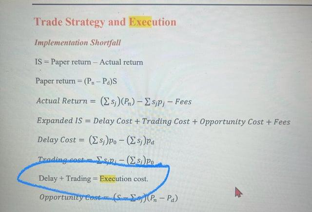

Algorithmic trading has transformed financial markets by utilizing automated systems to execute trades with precision and speed. This technological advancement enhances trading efficiency, allowing for quicker transactions that were previously impossible with manual methods. As a critical element in algorithmic trading, the understanding and optimization of execution costs are pivotal to maximizing profitability. These costs can significantly influence the net returns of trading strategies, making them a key consideration for traders and financial engineers.

Execution costs encompass the various expenses incurred during the process of buying and selling securities. These include bid-ask spreads, commissions, slippage, and potential market impact—all of which can erode the anticipated returns of a trading strategy. As a result, successfully managing execution costs can enhance the financial outcomes of algorithmic strategies, particularly within high-frequency trading environments where transaction volumes are extensive.



This article investigates the concept of return on execution costs in algorithmic trading, providing insights into optimizing these costs for better returns. Through an examination of the factors that drive execution costs and the methodologies to manage them, traders can refine their strategies to ensure they yield desired financial outcomes.

Understanding execution costs as a function of various market conditions—such as order size, market volatility, and execution speed—provides traders with the ability to fine-tune their algorithms. This comprehension is crucial, especially given the rapid erosion of profit margins due to execution costs in high-frequency trading scenarios.

In this discussion, we aim to unpack these concepts and offer strategies for optimizing execution costs, helping traders navigate the complexities of algorithmic trading with greater skill and confidence. By adopting effective cost management techniques, traders can enhance their ability to achieve superior returns, thereby capitalizing on the efficiencies algorithmic trading offers.

## Table of Contents

## What are Execution Costs?

Execution costs, also known as transaction costs, are the expenses associated with executing trades in financial markets. These costs are critical considerations for algorithmic traders as they directly affect the net returns of trades. Execution costs encompass several components, each of which plays a role in determining the overall cost of a trade.

One primary component of execution costs is the bid-ask spread, which is the difference between the price a buyer is willing to pay (bid) and the price a seller is willing to accept (ask). The spread represents an immediate cost to traders, as they must buy at the ask price and sell at the bid price, effectively incurring the spread as a cost per transaction.

Commissions and fees are additional execution costs charged by brokers and exchanges. These fees vary depending on the broker, market, and the type of financial instrument being traded. While commissions are usually fixed costs, they can accumulate significantly with frequent trading, impacting overall profitability.

Slippage refers to the difference between the expected price of a trade and the actual price at which it is executed. Slippage occurs due to market [volatility](/wiki/volatility-trading-strategies) or delays in order execution, which can push the execution price away from the intended price. For example, if an algorithm attempts to buy shares at $100, but due to market fluctuations, the order is executed at $101, the $1 difference is the slippage cost.

Market impact is another component of execution costs and occurs when the act of placing a large order affects the market price of a security. For instance, a substantial buy order may drive the price up, resulting in a higher cost for the remaining shares in the order. Minimizing market impact is crucial, particularly in the execution of large trades.

Efficient management of execution costs is essential for optimizing trading performance. Algorithmic traders must develop strategies that mitigate these costs to improve profit margins. By understanding and minimizing execution costs, they can enhance the financial outcomes of their strategies, ensuring that the returns align with trading objectives.

## Impact of Execution Costs on Algorithmic Trading

Execution costs are a significant concern in [algorithmic trading](/wiki/algorithmic-trading) as they can substantially diminish profit margins, particularly within high-frequency trading ([HFT](/wiki/high-frequency-trading-strategies)) strategies. These costs impact not only the immediate outcomes of trades but also the broader strategic objectives of traders.

One of the primary factors influencing execution costs is the order size. Larger orders are more likely to affect market prices due to the market impact. This can cause prices to move unfavorably as a trade is executed, which is particularly problematic for traders operating under slim profit margins. To mitigate these impacts, algorithms must be adept at executing trades without causing significant market movement, often by breaking large orders into smaller, manageable chunks.

Market volatility is another critical [factor](/wiki/factor-investing). In highly volatile markets, prices can change rapidly, increasing the likelihood of slippage – the difference between the expected price of a trade and the actual price at which it is executed. Slippage can lead to higher execution costs and decreased profitability. Traders often employ volatility-adjusted algorithms that adapt to changing market conditions, aiming to minimize adverse cost variations.

The speed of trade execution also plays a vital role. Fast execution is essential in HFT, where trades are made on millisecond to microsecond scales. High latency, or delay in trade execution, can result in missed opportunities or increased costs, as market conditions may change during the delay. To address this, traders use low-latency trading systems designed to execute trades as quickly as possible, thus reducing the latency-related cost.

Latency can significantly impact execution costs. It's essential for algorithms to be optimized to operate with the lowest possible latency, often requiring sophisticated networking and data processing technologies to ensure trades are executed almost instantaneously. By achieving lower latency, traders minimize the risk of executing trades at less favorable prices.

The challenge then is to design algorithms that effectively minimize execution costs. This requires a balance between order execution speed and the potential for impacting market prices. Successful algorithms often incorporate predictive models that assess market conditions in real time, allowing for dynamic adjustments to order execution strategies. Computational techniques such as [reinforcement learning](/wiki/reinforcement-learning) and real-time data analytics further assist in optimizing trade execution to ensure higher net returns.

In summary, managing execution costs in algorithmic trading is crucial for maximizing profitability, particularly in HFT environments. By considering factors such as order size, market volatility, and execution speed, traders can better design algorithms that reduce execution costs and improve overall strategy performance.

## Optimizing Execution Costs for Better Returns

Traders aiming to optimize execution costs can leverage several strategies to enhance their returns. One fundamental approach is the use of limit orders instead of market orders. Limit orders allow traders to specify the price at which they are willing to buy or sell a security, mitigating the risk of adverse price movement and minimizing transaction costs. This method can effectively manage the bid-ask spread, especially in volatile markets.

Velocity-sensitive strategies such as VWAP (Volume Weighted Average Price) and TWAP (Time Weighted Average Price) are essential tools for reducing market impact. VWAP divides an order into smaller chunks to be executed over the day, weighted by trading [volume](/wiki/volume-trading-strategy), while TWAP spreads the trade evenly over a specified time. These strategies lessen the disruption large orders might cause in the market, promoting better price execution and lower market impact costs.

Enhancing trading strategies through [backtesting](/wiki/backtesting) against historical data is another key optimization technique. By simulating trades based on previously recorded data, traders can identify patterns and behaviors that result in lower execution costs. This process provides crucial insights into how different strategies perform, allowing traders to refine their approach to achieve cost efficiency.

Utilizing advanced technology, including [machine learning](/wiki/machine-learning), further refines the optimization of trade executions. Machine learning algorithms can analyze vast datasets to detect subtle patterns and anomalies that may not be immediately apparent to human traders. For example, machine learning can predict optimal execution times or detect market conditions that are likely to lead to higher slippage, thus informing decision-making and strategy adjustments. Python libraries such as scikit-learn and TensorFlow can be employed to build models that provide predictive insights into trade execution.

Here is a basic example of how machine learning can be implemented in this context:

```python
from sklearn.linear_model import LinearRegression
import numpy as np

# Example trading data
market_impact = np.array([0.1, 0.2, 0.15, 0.3, 0.25])
transaction_volume = np.array([1000, 1500, 1200, 1300, 1600])

# Reshape data for modeling
transaction_volume = transaction_volume.reshape(-1, 1)

# Create a linear regression model
model = LinearRegression()
model.fit(transaction_volume, market_impact)

# Predict market impact for a new transaction volume
new_volume = np.array([[1400]])
predicted_impact = model.predict(new_volume)

print(f"Predicted Market Impact: {predicted_impact[0]}")
```

By employing such modern practices, traders enhance their ability to manage execution costs effectively, leading to improved net returns. These strategies, when properly implemented, can substantially boost the profitability of algorithmic trading endeavors.

## Case Studies and Examples

Algorithmic trading has become a cornerstone of modern financial markets, enabling traders to exploit inefficiencies through strategies such as [arbitrage](/wiki/arbitrage). The success of these strategies heavily depends on managing execution costs, which can significantly impact profitability. Here, we discuss how high-frequency traders (HFTs) manage execution costs across multiple trading venues and examine case studies illustrating the role of data analytics in reducing slippage and market impact.

High-frequency traders are adept at using technology to exploit minuscule price discrepancies across different markets, executing a large number of orders in fractions of a second. Optimizing execution across multiple venues requires sophisticated algorithms that assess market conditions in real-time. By dynamically adjusting order strategies, such as employing limit orders and optimizing order sizes, HFTs can mitigate costs, including slippage and market impact.

Arbitrage algorithms, for instance, involve simultaneous buying and selling of related assets in different markets to capitalize on price differentials. Such strategies demand rapid execution and minimal costs to be profitable. An algorithm executing trades with a realized slippage of 0.01% could see differential returns compared to one with a 0.05% slippage. The formula for slippage $(S)$ can be represented as:

$$

S = \frac{(P_{actual} - P_{expected})}{P_{expected}}
$$

where $P_{actual}$ is the price at which the trade was executed, and $P_{expected}$ is the anticipated execution price. By minimizing this figure, traders ensure better alignment with expected returns.

Case studies highlight the effectiveness of employing data analytics and machine learning techniques to minimize execution costs. For example, a study by Kissell and Glantz (2013) demonstrated that incorporating predictive analytics to anticipate order flow and price movements can significantly reduce slippage. By analyzing historical data, traders can refine their algorithms to foresee and adapt to market dynamics, reducing adverse price movements.

Real-world scenarios reiterate the importance of execution cost management. During volatile market conditions, for instance, enhanced data processing capabilities enable traders to adjust strategies swiftly, avoiding the pitfalls of large market impacts. An algorithm analyzing both historical and real-time data can optimize execution paths more efficiently, ensuring trades are completed at intended prices, thereby securing intended profit margins.

Through effective execution cost management, as illustrated by these cases, traders can significantly improve their financial outcomes. The integration of cutting-edge technology and market analytics is crucial in achieving lower transaction costs and higher net returns. Understanding these cases provides valuable insights into developing cost-effective algorithmic trading strategies.

## Conclusion

Effective execution cost management is vital for achieving success in algorithmic trading. Execution costs, if not properly managed, can drastically diminish profits, particularly in environments involving frequent trading. By comprehensively understanding and optimizing these costs, traders can markedly enhance the returns of their trading strategies.

Central to managing execution costs effectively is the use of advanced technology. Technologies such as machine learning and data analytics provide traders with the means to predict and minimize costs associated with slippage, market impact, and other transaction-related expenses. These tools allow for the development of sophisticated execution algorithms that can adapt to and exploit market conditions for optimal performance.

In addition to technology, a robust understanding of market dynamics is crucial. Factors such as order size, timing, and market volatility all play significant roles in execution costs. Traders who are well-versed in these aspects can strategically plan their trades to minimize adverse costs. For instance, using limit orders instead of market orders can reduce slippage, while adjusting trade execution speed can better align with market [liquidity](/wiki/liquidity-risk-premium) and price movements.

Strategic backtesting is another essential practice in optimizing execution costs. By simulating trading strategies against historical data, traders can evaluate the effectiveness of their algorithms and refine them to ensure cost efficiency. This process provides insights into potential outcomes and adjustments needed to reduce unnecessary expenses.

In conclusion, achieving superior returns in algorithmic trading necessitates a combination of cutting-edge technology, strategic planning, and profound market insights. By carefully managing execution costs, traders can maximize their profits and maintain a competitive edge in the trading environment. Through continuous learning and adaptation, traders can effectively navigate the complexities associated with execution costs, leading to enhanced trading performance and profitability.

## FAQs

What are the main components of execution costs?

Execution costs encompass several direct and indirect expenses incurred during the trading process. The primary components include:

1. **Bid-Ask Spread**: This is the difference between the buying price (ask) and the selling price (bid) of a security. A narrower spread indicates lower cost.

2. **Commissions and Fees**: These are charges by brokers or trading platforms for executing trades. They vary depending on the broker's pricing structure.

3. **Slippage**: Slippage arises when a trade is executed at a different price than expected, often due to market volatility or latency in execution.

4. **Market Impact**: This cost reflects the price change triggered by the trade itself, typically significant in large order sizes.

How can algorithmic traders reduce slippage in their trades?

Reducing slippage involves strategies to mitigate unexpected discrepancies between the expected and executed trade prices:

- **Limit Orders**: Use limit orders to set a maximum or minimum allowable price for buy or sell orders, reducing exposure to adverse price movements.

- **Sophisticated Algorithms**: Algorithms like VWAP (Volume-Weighted Average Price) aim to minimize market impact by distributing orders over time.

- **Pre-Trade Analytics**: Utilize predictive analysis to anticipate price movements and optimal trade execution times.

What role does technology play in optimizing execution costs?

Technology is pivotal in enhancing the efficiency and precision of trade executions, leading to cost optimization:

- **High-Speed Connectivity**: Services like direct market access (DMA) and co-location reduce latency.

- **Machine Learning Algorithms**: These can analyze vast datasets to predict optimal entry and exit points.

- **Real-Time Data Analytics**: This allows traders to react swiftly to market changes and optimize order placement.

How significant is the impact of execution costs in high-frequency trading?

In high-frequency trading (HFT), execution costs can drastically affect profitability:

- **Rapid Trades**: The high volume of trades amplifies even minor cost inefficiencies, underscoring the need for ultra-low execution costs.

- **Importance of Latency**: Any latency can lead to adverse selection and increased slippage, eroding profits.

- **Cost Structures**: HFT firms often negotiate favorable rate structures to minimize commission costs due to their high trading volumes.

Why is backtesting important in managing execution costs?

Backtesting is a fundamental step in validating the effectiveness of trading strategies concerning execution costs:

- **Strategy Evaluation**: By simulating trades using historical data, traders can assess potential cost impacts before live execution.

- **Risk Mitigation**: Identifies vulnerabilities in a strategy's design related to market impact and slippage.

- **Optimization Insights**: Provides data-driven insights for refining algorithms to lower execution costs and improve strategy performance. 

Incorporating these approaches aids in navigating the complexities associated with execution costs, bolstering the effectiveness of algorithmic trading strategies.

## References & Further Reading

[1]: Almgren, R., & Chriss, N. (2001). ["Optimal Execution of Portfolio Transactions."](https://smallake.kr/wp-content/uploads/2016/03/optliq.pdf) Journal of Risk.

[2]: Kissell, R., & Glantz, M. (2013). ["Optimal Trading Strategies: Quantitative Approaches for Managing Market Impact and Trading Risk."](https://www.amazon.com/Optimal-Trading-Strategies-Quantitative-Approaches/dp/0814407242) AMACOM.

[3]: Lopez de Prado, M. (2018). ["Advances in Financial Machine Learning."](https://www.amazon.com/Advances-Financial-Machine-Learning-Marcos/dp/1119482089) Wiley.

[4]: Hasbrouck, J. (2007). ["Empirical Market Microstructure: The Institutions, Economics, and Econometrics of Securities Trading."](https://academic.oup.com/book/52241) Oxford University Press.

[5]: Jansen, S. (2020). ["Machine Learning for Algorithmic Trading: Predictive models to extract signals from market and alternative data for systematic trading strategies with Python."](https://www.amazon.com/Machine-Learning-Algorithmic-Trading-alternative/dp/1839217715) Packt Publishing.

[6]: Chan, E. P. (2009). ["Quantitative Trading: How to Build Your Own Algorithmic Trading Business."](https://github.com/ftvision/quant_trading_echan_book) Wiley Trading.

[7]: Bouchaud, J.-P., & Potters, M. (2003). ["Theory of Financial Risk and Derivative Pricing: From Statistical Physics to Risk Management."](https://www.cambridge.org/core/books/theory-of-financial-risk-and-derivative-pricing/5BBBA04CE72ED9E5E7C1C028D9A94FCB) Cambridge University Press.