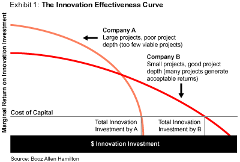

## Table of Contents

## What is Return on Innovation Investment (ROII)?

Return on Innovation Investment (ROII) is a way to measure how much money a company makes from its new ideas and projects. It helps businesses see if the time and money they spend on being creative and developing new products or services is worth it. By figuring out the ROII, a company can decide if it should keep investing in new ideas or if it should try something different.

Calculating ROII can be tricky because it involves guessing how much money new ideas will make in the future. Companies need to think about the costs of research, development, and marketing, and then compare these costs to the expected profits from the new products or services. Even though it's not always easy to get it right, ROII is a useful tool for businesses to make smart choices about where to put their money and effort.

## Why is ROII important for businesses?

ROII is important for businesses because it helps them figure out if their new ideas are worth the time and money they spend on them. By measuring ROII, a company can see if the money they put into creating new products or services is paying off. This helps them make better decisions about where to focus their efforts and resources. If a new project has a high ROII, it means the project is successful and profitable, so the company might decide to invest more in similar ideas.

On the other hand, if a project has a low ROII, it might mean that the company should stop spending money on it and try something different. This way, businesses can avoid wasting resources on ideas that don't work out. Knowing the ROII helps companies stay competitive by making sure they invest in the right projects. It's like a guide that helps them navigate the risky world of innovation and make smarter choices.

## How is ROII calculated?

Calculating Return on Innovation Investment (ROII) involves comparing the money a company makes from a new idea to the money it spent on that idea. First, you need to figure out all the costs of the project. This includes money spent on research, development, and marketing. Then, you need to guess how much money the new product or service will make in the future. This can be hard because it's about the future, and no one knows for sure what will happen.

Once you have the costs and the expected profits, you can find the ROII by subtracting the total costs from the total profits and then dividing that number by the total costs. The formula looks like this: ROII = (Total Profits - Total Costs) / Total Costs. If the ROII is a positive number, it means the new idea made more money than it cost. If it's a negative number, the idea lost money. This helps businesses decide if they should keep investing in new ideas or try something different.

## What are the key components of ROII?

The key components of Return on Innovation Investment (ROII) are the total costs and the total profits from a new idea. The total costs include everything a company spends on creating and selling a new product or service. This can be money used for research, development, and marketing. It's important to add up all these costs because they are what the company is trying to get back and more from the new idea.

The other key component is the total profits, which is the money the company expects to make from the new product or service in the future. This part can be tricky because it's a guess about what will happen. Companies need to think about how many people will buy the new product and how much they will pay for it. By comparing the total profits to the total costs, a company can see if the new idea is worth the investment.

## Can you provide examples of successful ROII in different industries?

In the tech industry, Apple's introduction of the iPhone is a great example of successful ROII. When Apple launched the iPhone in 2007, they spent a lot of money on research and development to create a new kind of smartphone. The costs were high, but the iPhone became very popular and made a lot of money for Apple. The profits from the iPhone were much bigger than the costs, so Apple's ROII was very good. This success helped Apple keep investing in new ideas and products.

In the automotive industry, Tesla's development of electric cars is another example of successful ROII. Tesla spent a lot of money to create electric vehicles that were different from traditional cars. At first, the costs were high and it was risky, but Tesla's electric cars became popular and sold well. The profits from these cars were much higher than the costs, which meant Tesla had a high ROII. This success showed that investing in electric cars was a good idea, and it helped Tesla grow and keep innovating.

## What are common challenges in measuring ROII?

Measuring ROII can be tough because it's hard to guess how much money a new idea will make in the future. When a company comes up with something new, they have to think about how many people will buy it and how much they will pay. But since this is all about the future, it's like trying to predict the weather. If the company guesses wrong, the ROII they calculate might not be right. This makes it tricky to know if the new idea is really worth the investment.

Another challenge is figuring out all the costs of the new idea. There are the obvious costs like research, development, and marketing, but there can also be hidden costs. For example, maybe the company has to train their workers to make the new product, or maybe they have to change their factory to fit the new idea. These costs can be hard to see and measure, but they still need to be part of the ROII calculation. If a company misses some of these costs, their ROII might look better than it really is, which can lead to bad decisions about where to put their money.

## How does ROII differ from traditional ROI?

ROII and traditional ROI both measure how much money a company makes from its investments, but they focus on different things. Traditional ROI looks at the money made from any kind of investment, like buying a new machine or a piece of land. It's all about comparing the money spent to the money made, no matter what the investment is. ROII, on the other hand, only looks at the money made from new ideas and projects. It's about figuring out if the time and money spent on being creative and coming up with new products or services is worth it.

One big difference between ROII and traditional ROI is how they deal with guessing the future. Traditional ROI often deals with things that are easier to predict, like how much money a new machine will save on costs. But ROII has to deal with the uncertainty of new ideas, where it's hard to know how many people will buy the new product or how much they will pay. This makes ROII trickier to calculate because it relies more on guesses about the future. Both measures help businesses make smart choices, but ROII is more focused on the risks and rewards of innovation.

## What strategies can improve ROII?

To improve ROII, a company should focus on making sure their new ideas are what people want. They can do this by asking customers what they need and what they like. This helps the company create products that people will buy. Also, companies should try to make their new ideas cost less to make. They can do this by finding cheaper ways to do research and development, or by using technology to save money. If a company can make a good product that people want, and make it without spending too much money, their ROII will be better.

Another way to improve ROII is to be quick about getting new products to the market. The faster a company can go from having an idea to selling the product, the more money they can make. This is because they can start earning money sooner and spend less on keeping the project going. Also, companies should keep checking how their new ideas are doing. If something isn't working, they should be ready to change it or stop it before they spend too much money. By being fast and flexible, a company can make their ROII better.

## How can companies foster a culture that supports innovation and ROII?

Companies can foster a culture that supports innovation and ROII by encouraging everyone to share their ideas. They should make it easy and safe for people to suggest new things, even if those ideas might not work out. Leaders should listen to these ideas and give people the tools and time they need to try them out. If someone's idea turns into a new product or service, the company should celebrate this and show that they value creativity. This way, everyone feels like they are part of the innovation process and are more likely to keep coming up with new ideas.

Another way to support innovation is by making sure that mistakes are seen as chances to learn, not as failures. If people are scared of getting in trouble for trying something new, they won't take risks. Companies should talk about what went wrong with new ideas and figure out how to do better next time. They should also keep learning about new technology and trends so they can use these in their own projects. By staying curious and open to change, a company can keep coming up with new ideas that lead to a good ROII.

## What role does data analytics play in enhancing ROII?

Data analytics helps companies make better decisions about their new ideas by showing them what people want and how they behave. By looking at data from customers, like what they buy and what they say online, companies can find out what new products or services might be popular. This helps them create things that people will actually buy, which can make their ROII better. For example, if data shows that a lot of people are interested in eco-friendly products, a company might decide to focus on making green products to meet that demand.

Using data analytics also helps companies see if their new ideas are working. They can track how well a new product is selling and how much it costs to make and sell it. This information helps them figure out if they need to change the product or how they sell it to make more money. By keeping an eye on the data, companies can quickly fix problems and make their new ideas more successful, which leads to a higher ROII.

## How can ROII be integrated into long-term business planning?

ROII can be a big part of long-term business planning because it helps companies decide where to put their money for the future. When a company makes a long-term plan, they need to think about what new ideas they want to work on and how much money they will spend on those ideas. By looking at the ROII, they can see which ideas might make the most money over time. This helps them choose the best projects to focus on and make sure they are spending their money wisely. If a company knows that a certain type of new product usually has a high ROII, they might decide to keep investing in similar products in the future.

Also, ROII can help a company keep track of how well their long-term plans are working. As the company moves forward with their plans, they can keep checking the ROII of their new projects. If the ROII is good, it means their long-term plan is working well. But if the ROII is not good, they might need to change their plan. This way, ROII helps the company stay on the right track and make smart choices about their future. By always thinking about ROII, a company can make sure they are always trying to do better and make more money from their new ideas.

## What advanced metrics or models are used to assess ROII at an expert level?

At an expert level, companies use advanced metrics like Net Present Value (NPV) and Internal Rate of Return (IRR) to assess ROII. NPV looks at the money a new idea will make in the future and brings it back to today's value. This helps companies see if the new idea will be worth more than it costs, even when they think about the time value of money. IRR, on the other hand, finds the rate at which the money spent on a new idea equals the money it makes. If the IRR is higher than the cost of money for the company, the new idea is a good investment. These metrics help companies make better guesses about the future and see if their new ideas will really pay off.

Another advanced model used is the Balanced Scorecard, which looks at more than just money. It checks how well a new idea does in areas like customer happiness, how the company works inside, and if it helps the company grow. By using the Balanced Scorecard, companies can see if their new ideas are good for the whole business, not just for making money. This helps them make sure their new ideas fit with their long-term goals and make the company better in many ways. Using these advanced metrics and models helps companies get a full picture of their ROII and make smarter choices about where to put their time and money.

## What is the relationship between ROI and innovation investment?

Return on Investment (ROI) is a critical financial metric used to assess the efficiency and profitability of an investment. It is calculated by dividing the net profit of an investment by its initial cost and is typically expressed as a percentage. The formula for ROI is as follows:

$$
\text{ROI} = \left( \frac{\text{Net Profit}}{\text{Cost of Investment}} \right) \times 100
$$

This measure enables investors to directly compare the profitability of various investments, facilitating informed decision-making.

Innovation investment, often referred to as Return on Innovation Investment (ROI2 or R2I), is an extended concept of ROI focused on evaluating the returns generated from expenditures on research, development, and new product initiatives. Many organizations allocate substantial resources towards innovation with the goal of enhancing their competitive edge. High R2I indicates that a company effectively converts its R&D spending into increased profitability and market value, implying successful innovation strategies.

Companies aiming for a high return on their innovation investments must align their innovation objectives with broader organizational goals. This alignment ensures that the outputs of innovation efforts support and enhance core business performance. Strategic initiatives often involve an iterative process of setting clear objectives, deploying resources efficiently, and measuring outcomes against the initial goals.

A key consideration is maintaining an optimal balance between investing in innovation and ensuring financial sustainability. Over-investing in R&D without measurable returns can strain an organization’s finances, while under-investing may lead to missed opportunities in a rapidly changing market. Therefore, companies should develop robust frameworks to regularly evaluate the effectiveness of their innovation expenditures, potentially involving performance metrics and feedback loops to optimize these investments.

To optimize innovation investment, organizations can implement strategies such as focusing on customer-centric innovation, which aligns product development closely with market demands. Additionally, fostering a culture of innovation where ideas can flow freely and employees are encouraged to experiment can lead to breakthroughs that significantly enhance R2I.

Innovation also benefits from collaboration, both internally across departments and externally with partners or even competitors, through co-creation or open innovation platforms. Such strategies can reduce costs, diversify risk, and lead to shared value creation.

Ultimately, the strategic management of ROI2 can significantly enhance a company's ability to generate profitable outcomes from its innovation endeavors, supporting sustainable growth and long-term success in the highly competitive global market.

## How is Algorithmic Trading Revolutionizing Investment Strategies?

Algorithmic trading utilizes advanced computational algorithms to execute trades at speeds that surpass human capabilities, effectively capitalizing on tiny fluctuations within financial markets. This technologically advanced strategy involves pre-set criteria and data-driven parameters to make systematic trading decisions, thus minimizing emotional biases that often affect traditional human trading. The speed and efficiency with which [algorithmic trading](/wiki/algorithmic-trading) can be conducted allow for rapid responses to market trends and opportunities, which is particularly advantageous in the highly volatile landscape of modern financial markets.

Algorithms are programmed to identify patterns and execute orders based on specific, predefined strategies. These strategies might include statistical [arbitrage](/wiki/arbitrage), [trend following](/wiki/trend-following), or mean reversion, among others. By leveraging these strategies, algorithmic traders can exploit temporary inefficiencies in the market, thus optimizing return on investment (ROI). For example, a common approach employed is "high-frequency trading" ([HFT](/wiki/high-frequency-trading-strategies)), where algorithms make thousands of trades per second to eke out profits from minute price differences across different markets or securities.

One of the significant advantages of algorithmic trading is its ability to process vast amounts of financial data from multiple sources in real-time. This capability to assimilate, analyze, and act upon data quickly is crucial for investors seeking an edge in fast-moving markets. Algorithms can be designed to incorporate a wide array of market indicators, news feeds, and even social media sentiments, allowing them to adapt trading strategies promptly in response to new information.

The computational models underpinning algorithmic trading are diverse and can range from straightforward moving averages to more sophisticated [machine learning](/wiki/machine-learning) models. For instance, an algorithm might employ a linear regression model to predict future price movements based on historical data:

$$
\text{Predicted Price} = \beta_0 + \beta_1 \times \text{Previous Price} + \epsilon
$$

Where $\beta_0$ is the intercept, $\beta_1$ is the slope of the line, and $\epsilon$ represents the error term. Machine learning techniques, such as neural networks, are increasingly being integrated into these algorithms to improve prediction accuracy by learning patterns from historical market behavior.

In summary, algorithmic trading represents a transformative approach to investment strategies by merging financial theory with cutting-edge technology. This integration allows for enhanced precision, speed, and adaptability in executing trades, ultimately aiming to maximize profitability for investors. As financial markets continue to evolve, the sophistication and efficiency offered by algorithmic trading and its reliance on quantitative methods are expected to play an integral role in shaping the future of investment strategies.

## References & Further Reading

[1]: Bergstra, J., Bardenet, R., Bengio, Y., & Kégl, B. (2011). ["Algorithms for Hyper-Parameter Optimization."](https://dl.acm.org/doi/10.5555/2986459.2986743) Advances in Neural Information Processing Systems 24.

[2]: ["Advances in Financial Machine Learning"](https://www.amazon.com/Advances-Financial-Machine-Learning-Marcos/dp/1119482089) by Marcos Lopez de Prado

[3]: ["Evidence-Based Technical Analysis: Applying the Scientific Method and Statistical Inference to Trading Signals"](https://www.amazon.com/Evidence-Based-Technical-Analysis-Scientific-Statistical/dp/0470008741) by David Aronson

[4]: ["Machine Learning for Algorithmic Trading"](https://github.com/stefan-jansen/machine-learning-for-trading) by Stefan Jansen

[5]: ["Quantitative Trading: How to Build Your Own Algorithmic Trading Business"](https://www.amazon.com/Quantitative-Trading-Build-Algorithmic-Business/dp/1119800064) by Ernest P. Chan