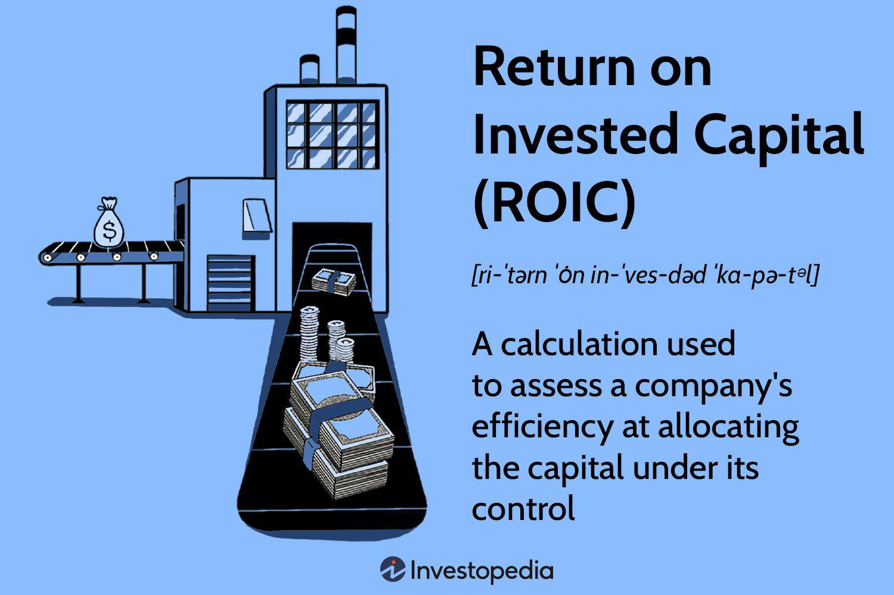

## Table of Contents

## What is Return on Invested Capital (ROIC)?

Return on Invested Capital (ROIC) is a financial measure that shows how well a company is using the money it has received from investors to make profits. It tells us how much money a company makes for every dollar it uses. To find ROIC, you take the company's net operating profit after taxes and divide it by the total amount of capital invested in the company. This includes money from shareholders and any debts the company has.

ROIC is important because it helps investors see if a company is a good place to put their money. If a company has a high ROIC, it means it is using its money well to make more money. This can be a sign that the company is doing well and might be a good investment. On the other hand, a low ROIC might mean the company is not using its money effectively, which could be a warning sign for investors.

## Why is ROIC important for investors?

ROIC is important for investors because it shows how well a company is using the money it gets from them. When a company has a high ROIC, it means it is good at turning the money it gets into more money. This is a good sign for investors because it means their money is being used well and they might get more money back in the future.

On the other hand, if a company has a low ROIC, it might mean the company is not using the money it gets very well. This can be a warning sign for investors. It tells them that the company might not be a good place to put their money because it is not making enough profit from the money it has. By looking at ROIC, investors can make smarter choices about where to invest their money.

## How do you calculate ROIC?

To calculate Return on Invested Capital (ROIC), you need to know two things: the company's net operating profit after taxes (NOPAT) and the total amount of capital invested in the company. NOPAT is the money the company makes from its operations after paying taxes. The total capital invested includes money from shareholders and any debts the company has. To find ROIC, you divide NOPAT by the total capital invested. This gives you a percentage that shows how much profit the company makes for every dollar of capital it uses.

For example, if a company has a NOPAT of $100,000 and its total invested capital is $1,000,000, you would calculate ROIC like this: $100,000 divided by $1,000,000 equals 0.10, or 10%. This means the company makes 10 cents of profit for every dollar of capital it uses. A higher ROIC percentage is better because it shows the company is using its money more effectively to make profits.

## What is the difference between ROIC and Return on Equity (ROE)?

Return on Invested Capital (ROIC) and Return on Equity (ROE) are two different ways to measure how well a company is doing with the money it gets. ROIC looks at all the money that has been put into the company, including money from shareholders and money the company borrowed. It shows how much profit the company makes for every dollar of this total money. To find ROIC, you take the company's net operating profit after taxes and divide it by the total capital invested.

On the other hand, ROE focuses only on the money that comes from shareholders. It shows how much profit the company makes for every dollar that shareholders put in. To calculate ROE, you take the company's net income and divide it by the shareholders' equity. So, ROIC gives a broader picture of how well a company uses all its money, while ROE tells you how well the company uses just the money from its owners.

## Can you provide an example of ROIC calculation for a real company?

Let's take a look at a simple example using Apple Inc. Imagine that in a certain year, Apple's net operating profit after taxes (NOPAT) was around $58 billion. The total capital invested in the company, which includes money from shareholders and any debts, was about $324 billion. To find Apple's ROIC, we divide the NOPAT by the total capital invested. So, $58 billion divided by $324 billion gives us an ROIC of about 18%. This means that for every dollar Apple used, it made about 18 cents in profit.

Now, let's compare this to another company to see how ROIC can help investors. Suppose we look at Walmart, another big company. In the same year, Walmart's NOPAT was around $15 billion, and its total capital invested was about $200 billion. When we do the math, Walmart's ROIC comes out to be around 7.5%. This is lower than Apple's ROIC. So, if you were an investor looking at these two companies, you might think that Apple is using its money more effectively to make profits than Walmart is.

## What is considered a good ROIC?

A good ROIC is usually thought to be anything above the cost of capital for a company. This means if a company can make more money than it costs them to get that money, they are doing well. For many companies, a good ROIC might be around 10% or higher. But this can change depending on the industry. Some industries, like technology or pharmaceuticals, might have higher ROICs because they need a lot of money to start but can make big profits later. Other industries, like retail or utilities, might have lower ROICs because they don't need as much money to start but also don't make as much profit.

When looking at ROIC, it's also important to compare it with other companies in the same industry. If a company's ROIC is higher than most other companies in its industry, it's doing a good job of using its money to make profits. For example, if the average ROIC in the tech industry is 15%, a company with a 20% ROIC is doing better than most. But if a company in the retail industry has a 20% ROIC and the average is 5%, that company is really standing out. So, a good ROIC depends on the company's cost of capital and how it compares to other companies in its field.

## How does ROIC relate to a company's competitive advantage?

ROIC can show how well a company is doing compared to others in its industry. If a company has a high ROIC, it means it is good at using the money it gets to make more money. This can be a sign that the company has a competitive advantage. A competitive advantage is something that makes a company better than its rivals, like having a special product or a way of doing things that others can't easily copy. When a company can keep making high profits from the money it uses, it shows it is doing something right that others are not.

For example, if a tech company has a high ROIC, it might mean it has a strong brand or unique technology that helps it make more money than other tech companies. This can help the company keep its lead over others in the market. On the other hand, if a company's ROIC is low, it might mean it is struggling to stand out or is not using its money as well as it could. This can be a warning sign that the company might not be able to keep up with its competitors in the long run.

## How can a company improve its ROIC?

A company can improve its ROIC by focusing on increasing its profits or by using its money more wisely. One way to do this is by cutting costs. If a company can make the same amount of money but spend less to do it, its profits will go up. This can be done by finding cheaper ways to make things, like using less expensive materials or finding ways to save on energy. Another way to increase profits is by selling more. This could mean coming up with new products, finding new customers, or making more people want to buy what the company already sells. By doing these things, a company can make more money without needing to use more capital.

Another way to improve ROIC is by being smarter with the money the company already has. This means making sure the money is used in the best way possible. For example, a company might decide to stop spending money on projects that don't make much profit and put that money into projects that do. It could also mean getting rid of old equipment and buying new, more efficient machines that help the company make more money. By using its money more effectively, a company can get a higher return on the capital it has invested, which will improve its ROIC.

## What are the limitations of using ROIC as a performance metric?

Using ROIC as a performance metric has some limitations. One big problem is that ROIC can be hard to compare across different companies or industries. This is because what counts as a good ROIC can be different depending on the type of business. For example, a tech company might have a high ROIC because it needs a lot of money to start but can make big profits later. But a retail company might have a lower ROIC because it doesn't need as much money to start and doesn't make as much profit. So, if you just look at the numbers, you might think one company is doing better than another when really they are just in different kinds of businesses.

Another limitation of ROIC is that it can be affected by how a company chooses to account for its money. Different companies might use different ways to figure out their profits and what counts as invested capital. This means that even if two companies are doing the same thing, their ROIC might look different just because they use different accounting methods. Also, ROIC doesn't tell you everything about a company. It's just one way to look at how well a company is doing. You need to look at other things too, like how fast the company is growing or how much risk it is taking, to get a full picture of its performance.

## How does ROIC impact valuation models like Discounted Cash Flow (DCF)?

ROIC plays a big role in valuation models like Discounted Cash Flow (DCF). In a DCF model, you try to figure out how much a company is worth by looking at how much money it will make in the future. ROIC helps with this because it shows how well the company is using its money to make more money. If a company has a high ROIC, it means it is good at turning the money it gets into profits. This makes the company look more valuable in a DCF model because it suggests the company will keep making good money in the future.

But ROIC isn't the only thing that matters in a DCF model. You also need to think about how long the company can keep its high ROIC. If a company can keep a high ROIC for a long time, it is worth more. But if the high ROIC is just for a short time, the company might not be as valuable. So, when using ROIC in a DCF model, you have to think about how the company will do in the future, not just how it is doing right now.

## How does industry affect the interpretation of ROIC?

The industry a company is in can change how we look at its ROIC. Different industries need different amounts of money to start and can make different amounts of profit. For example, a tech company might need a lot of money to start but can make big profits later, so a high ROIC is expected. But a retail company might not need as much money to start and doesn't make as much profit, so its ROIC might be lower but still good for its industry. So, when looking at ROIC, it's important to compare it with other companies in the same industry, not just look at the number by itself.

If you don't think about the industry, you might make a mistake. A high ROIC in one industry might not be as good as a lower ROIC in another industry. For example, a 15% ROIC might be great for a retail company but just okay for a tech company. By understanding the industry, you can see if a company is doing well compared to its competitors. This helps you know if the company is using its money well and if it has a good chance of making more money in the future.

## What advanced metrics or adjustments can be used to refine ROIC analysis?

To make ROIC analysis better, you can use some advanced metrics or make some changes to the basic calculation. One way to do this is by using a metric called Economic Value Added (EVA). EVA looks at how much money a company makes after taking away the cost of the money it used. This can give a clearer picture of how well a company is using its money. Another way to refine ROIC is by adjusting for things like non-operating assets or excess cash. These are things that don't help the company make money from its main business. By taking them out of the calculation, you can see how well the company is doing with the money it uses for its main work.

Another adjustment you can make is to look at the company's working capital. Working capital is the money a company uses to run its day-to-day business, like buying supplies or paying bills. If a company is good at managing its working capital, it can use less money to make the same amount of profit, which can make its ROIC look better. Also, you can look at the company's capital expenditures, which are the big purchases like new machines or buildings. If a company spends a lot on these things but they help it make more money later, you might want to adjust the ROIC to show this. By making these adjustments, you can get a more accurate idea of how well a company is using its money to make profits.

## What is Return on Invested Capital (ROIC) and how can it be understood?

Return on Invested Capital (ROIC) is a crucial profitability ratio utilized to assess the efficiency with which a company can generate returns from its invested capital. This metric is essential for understanding how well a company is able to transform its investments into profits for its bondholders and stockholders, thereby reflecting the firm's operational effectiveness and financial health.

The calculation of ROIC is straightforward:

$$
\text{ROIC} = \frac{\text{NOPAT}}{\text{Invested Capital}}
$$

Where:
- **NOPAT** stands for Net Operating Profit After Tax, which represents the profit a company makes from its operations after taxes but before financing costs and non-operating gains/losses.
- **Invested Capital** is the total amount of money that has been invested in the company by both equity investors and debt holders, essential for the company's ongoing operations and growth initiatives.

ROIC provides insight into a company’s ability to generate profit per unit of capital invested. It serves as a key determinant in assessing whether a firm is utilizing its capital effectively to yield returns that surpass the average cost associated with its capital, known as the Weighted Average Cost of Capital (WACC). When a company's ROIC exceeds its WACC, it implies that the company is generating more value than it costs to procure the capital, signaling value creation rather than value destruction.

This relationship between ROIC and WACC is pivotal for investors and analysts. A higher ROIC relative to WACC suggests that a company has a competitive advantage and is likely to sustain profitability growth over the long term. Conversely, if ROIC is below WACC, it might indicate inefficient capital utilization or impending financial difficulties unless corrective strategies are undertaken.

In the context of financial analysis and decision-making, ROIC is more than just a performance measure; it is a benchmark against which the effectiveness of capital allocation strategies and business models can be evaluated. Companies with consistently high ROICs are often seen as more attractive investment opportunities because of their ability to deliver superior returns to stakeholders.

## How do you calculate ROIC and what are its key components?

Return on Invested Capital (ROIC) is an essential metric for assessing a company's efficiency in allocating capital toward profitable ventures. To accurately calculate ROIC, a clear understanding of its components—Net Operating Profit After Tax (NOPAT) and invested capital—is vital.

**Net Operating Profit After Tax (NOPAT):**  
NOPAT represents the company's potential cash earnings if it had no debt. It is calculated by adjusting the operating income for taxes. The formula is:

$$
\text{NOPAT} = \text{Operating Income} \times (1 - \text{Tax Rate})
$$

This calculation provides an estimate of the earnings generated from a company’s core operations, excluding the influence of capital structure and tax policies. It allows a clear view of operational performance.

**Invested Capital:**  
The invested capital, central to the ROIC calculation, captures the total capital at a company’s disposal for generating NOPAT. There are multiple methods for computing invested capital:

1. **Asset-Based Approach:**
   \[ \text{Invested Capital} = \text{Total Assets} - \text{Cash} - \text{Non-Interest-Bearing Current Liabilities (NIBCLs)}
$$

2. **Financing-Based Approach:**
   \[ \text{Invested Capital} = \text{Book Value of Equity} + \text{Book Value of Debt} - \text{Nonoperating Assets}
$$

Each approach caters to different analytical perspectives. The asset-based approach considers all the assets minus cash and non-essential liabilities, while the financing-based approach focuses on the financial structure by summing equity and debt.

Understanding these components thoroughly enables analysts and investors to use ROIC as a reliable performance measure, reflecting the effectiveness of a company in deploying its capital resources. Accurate computation of NOPAT and invested capital provides a comprehensive analysis of how well a company leverages its physical and financial assets to create value. 

ROIC's precise calculation aids in separating efficient business models from less effective ones. An effective ROIC analysis serves as a strong indicator of a company's operational competence and potential for sustainable growth.

## What is the relationship between Algorithmic Trading and the Role of ROIC?

Algorithmic trading utilizes advanced computer systems to execute trading strategies by automating pre-programmed instructions based on a variety of financial metrics. One metric that can provide significant advantages within these systems is Return on Invested Capital (ROIC). ROIC can be integrated into algorithmic models to enhance both the timing of market entry and asset allocation decisions, taking into account a company's capital efficiency. By analyzing a company's ability to generate returns on its capital, algorithmic models can provide insights that drive more precise and profitable trades.

Integrating ROIC into trading algorithms involves processing both historical and current financial data. The historical aspect allows traders to understand trends in a company’s capital utilization and profitability, while real-time data helps in making immediate, informed trading decisions. This dual approach enables algorithms to perform predictive analytics, fostering improved trading outcomes. Modern algorithms can analyze massive data sets rapidly, applying [machine learning](/wiki/machine-learning) techniques to identify patterns associated with high or low ROIC, thus predicting potential market movements.

Algorithmic traders can leverage the calculation of ROIC as follows:

$$
\text{ROIC} = \frac{\text{NOPAT}}{\text{Invested Capital}}
$$

This formula is instrumental in the development of trading systems as it isolates the efficiency with which a company converts invested capital into profits, a key indicator of operational effectiveness. By assimilating ROIC into [algorithmic trading](/wiki/algorithmic-trading) frameworks, traders can perform comparative analyses among multiple companies, identifying those with superior capital efficiency and, consequently, higher potential returns.

Python, a widely used language in algorithmic trading, can be utilized to calculate and implement ROIC into a trading strategy. For example:

```python
def calculate_roic(nopat, invested_capital):
    return nopat / invested_capital

# Example Usage
nopat = 1500000  # Example Net Operating Profit After Tax
invested_capital = 10000000  # Example Invested Capital
roic = calculate_roic(nopat, invested_capital)
```

Such implementations support the automation and real-time analysis necessary for algorithmic trading, allowing for the systematic incorporation of ROIC as a benchmark for evaluating potential investments. This enables traders to exploit discrepancies and inefficiencies in the market based on a comprehensive understanding of a company’s capability to generate financial returns.

## References & Further Reading

[1]: ["The Little Book That Still Beats the Market"](https://www.amazon.com/Little-Book-Still-Beats-Market/dp/0470624159) by Joel Greenblatt

[2]: ["Return on Invested Capital (ROIC): Meaning, Formula, and Calculation."](https://www.investopedia.com/terms/r/returnoninvestmentcapital.asp) Wall Street Mojo.

[3]: ["The Intelligent Investor: The Definitive Book on Value Investing."](https://www.amazon.com/Intelligent-Investor-3rd-Ed/dp/0063356724) by Benjamin Graham.

[4]: Damodaran, A. (2002). ["Investment Valuation: Tools and Techniques for Determining the Value of Any Asset."](https://archive.org/details/investmentvaluat0000damo_n6k9) Wiley Finance.

[5]: Asness, C. S., Frazzini, A., & Pedersen, L. H. (2018). ["Quality Minus Junk."](https://papers.ssrn.com/sol3/papers.cfm?abstract_id=2312432) Review of Accounting Studies.

[6]: ["Measuring Economic Moats: Identifying Companies with a Competitive Advantage"](https://www.morningstar.com/stocks/how-measure-companys-competitive-advantage) Morningstar.

[7]: ["Principles for Navigating Big Debt Crises"](https://www.amazon.com/Principles-Navigating-Big-Debt-Crises/dp/1668009293) by Ray Dalio. 

[8]: ["The Little Book of Valuation: How to Value a Company, Pick a Stock and Profit"](https://www.wiley.com/en-us/The+Little+Book+of+Valuation%3A+How+to+Value+a+Company%2C+Pick+a+Stock%2C+and+Profit%2C+Updated+Edition-p-9781394244409) by Aswath Damodaran.