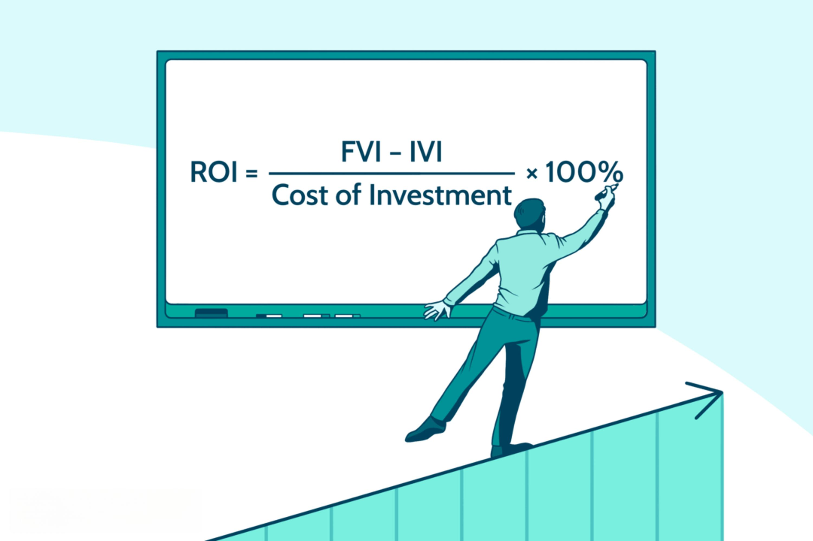

Rental property investments have emerged as a preferred option for generating passive income and building long-term wealth. For potential investors venturing into this domain, comprehending the intricacies involved is vital to making informed decisions that maximize returns. Central to these decisions is the calculation of Return on Investment (ROI), a pivotal metric used to gauge the profitability of rental properties. ROI offers insights into the efficiency of an investment, assisting investors in comparing potential returns against their financial outlays.

Traditionally, calculating ROI involves assessing factors such as purchase costs, operational expenses, and expected rental income. However, the advent of technology is reshaping how these calculations are both approached and optimized. One innovative advancement is the incorporation of algorithmic trading principles into real estate. This approach leverages sophisticated algorithms to enhance the precision and speed of ROI evaluations, presenting new opportunities for investors to fine-tune their investment strategies.



This article explores the essential processes and considerations involved in analyzing rental property ROI. Additionally, it examines the transformative impact of advanced trading algorithms on property investment decisions. By integrating algorithmic tools, investors stand to benefit from a more dynamic and responsive approach to property investment, potentially leading to more robust financial outcomes.

In the following sections, the article will systematically address the fundamentals of ROI in rental properties, traditional calculation methods, and the application of algorithmic trading strategies to refine these processes. The potential challenges and the promising future of technology in the real estate investment sphere will also be discussed, offering a comprehensive overview for investors keen on adapting to changing market landscapes.

## Table of Contents

## Understanding ROI in Rental Property Investments

Return on Investment (ROI) is a fundamental metric in assessing the profitability of rental property investments. It provides investors with a quantitative measure to evaluate the gains from an investment relative to its cost. In rental properties, ROI helps determine the efficiency of investment decisions, guiding investors to make informed decisions.

### Definition and Significance of ROI

ROI is typically expressed as a percentage, calculated by dividing the net profit of the investment by its initial cost. The formula is:

$$
\text{ROI} = \left(\frac{\text{Net Profit}}{\text{Total Investment Cost}}\right) \times 100
$$

The significance of ROI in rental property investments lies in its ability to provide insights into the potential return on invested capital. By calculating ROI, investors can compare different property investments and assess their profitability, making it a crucial tool for both short-term and long-term investment strategies.

### Types of ROI Relevant to Rental Properties

Several types of ROI calculations apply specifically to rental properties. One common variant is the cash-on-cash return, which measures the annual pre-tax cash flow earned on the actual cash invested. This is particularly useful for evaluating financing decisions:

$$
\text{Cash-on-Cash Return} = \left(\frac{\text{Annual Pre-Tax Cash Flow}}{\text{Total Cash Invested}}\right) \times 100
$$

This type of ROI focuses specifically on the cash flow aspect of investment, providing a direct assessment of how well the property generates cash relative to the cash put into it.

### Factors Influencing ROI in Rental Properties

ROI in rental property investments is influenced by numerous factors:

- **Location**: The location of a property can significantly affect its ROI. Properties in high-demand areas with low vacancy rates typically offer higher ROI.
- **Property Management**: Effective property management can ensure that properties remain rented and well-maintained, keeping steady cash flow and influencing ROI.
- **Market Conditions**: Fluctuations in the real estate market, such as changes in rental demand and property values, can impact ROI.
- **Operational Costs**: Maintenance, taxes, and insurance costs must be factored into calculations, as these influence the net return from a property.

### Importance of Calculating ROI Before Purchase

Calculating ROI before purchasing rental properties is essential as it helps investors anticipate the economic benefits and determine whether an investment aligns with their financial goals. By understanding the potential returns, investors can compare opportunities and choose investments that offer the most favorable outcomes. Moreover, pre-purchase ROI calculations can provide insights into the long-term sustainability and growth potential of a property investment, allowing investors to mitigate risks and optimize their portfolios.

## Methods for Calculating Property ROI

Calculating the Return on Investment (ROI) for rental properties is a fundamental task for investors looking to evaluate the profitability and viability of their investments. Several methods exist to determine ROI, each offering a unique perspective on investment performance. Understanding these approaches is essential for making informed real estate decisions.

### Traditional Approaches to Calculating ROI

1. **Simple ROI Calculation**: The simplest form of calculating ROI is to take the profit gained from the investment and divide it by the initial cost of the investment. This basic formula is expressed as:
$$
   \text{ROI} = \left( \frac{\text{Net Profit}}{\text{Cost of Investment}} \right) \times 100

$$

   This approach provides a basic percentage that indicates the return relative to the initial investment.

2. **Cash-on-Cash Return**: This method considers the cash income generated in relation to the cash invested. It's a useful metric for investors who finance their property purchases and want to measure the profitability against the actual cash outlay. The formula for cash-on-cash return is:
$$
   \text{Cash-on-Cash Return} = \left( \frac{\text{Annual Pre-Tax Cash Flow}}{\text{Total Cash Invested}} \right) \times 100

$$

3. **Capitalization Rate (Cap Rate)**: The Cap Rate method involves calculating the net operating income (NOI) as a percentage of the property’s current value. It provides insight into the potential return on the property independent of the purchase method:
$$
   \text{Cap Rate} = \left( \frac{\text{NOI}}{\text{Current Market Value}} \right) \times 100

$$

   Here, the Net Operating Income is determined by subtracting operating expenses from gross rental income.

### Step-by-step Methods Using Net Operating Income (NOI)

Calculating ROI using NOI involves the following steps:

- **Calculate Gross Rental Income**: Determine the total income generated from the property, including rent and other income sources.
- **Deduct Operating Expenses**: Subtract all operating costs associated with the property, such as maintenance, property management fees, insurance, and taxes, to compute NOI.
- **Determine ROI**: Use the formulas above, either for Cap Rate or simple ROI, depending on the investment scenario.

### Technology and Tools for Simplifying ROI Calculations

The calculation of ROI can be time-intensive, requiring attention to numerous financial variables. Fortunately, advancements in technology provide tools and software to simplify these calculations:

- **Real Estate Investment Software**: Platforms like Real Data, Property Evaluator, and others offer functionalities to input various parameters and automate complex calculations.
- **Spreadsheet Templates**: Pre-formulated spreadsheets in software like Excel allow for rapid ROI computation using built-in financial formulas and pivot tables.

### Limitations of Manual ROI Calculations

Manual ROI calculations, while traditional, come with several limitations that necessitate the use of enhanced solutions:

- **Human Error**: Manual computation increases the risk of calculation errors, which can lead to inaccurate profitability assessments.
- **Time-Consuming**: The process of gathering data, ensuring accuracy, and performing calculations manually is often inefficient.
- **Complex Variables**: Factors like tax implications, market fluctuations, and financing intricacies can complicate manual methods, suggesting the need for automated systems that can adapt to dynamic factors.

Hence, transitioning to technology-driven methods for ROI analysis not only mitigates the limitations of manual calculations but also enhances the precision and efficiency of property investment evaluations.

## Algorithmic Trading and Property Investment

Algorithmic trading refers to the use of computer algorithms to automatically execute trades based on predefined criteria, without the need for human intervention. This technique has been widely employed in financial markets to enhance the timing and precision of transactions, capitalize on market fluctuations, and manage large volumes of data instantaneously. By leveraging sophisticated mathematical models and comprehensive market analysis, [algorithmic trading](/wiki/algorithmic-trading) systems can make split-second decisions that human traders might struggle to achieve. 

The potential of applying algorithmic trading techniques to real estate investments lies in its capacity to process vast data sets and identify investment opportunities with improved speed and accuracy. In the context of rental property investments, algorithmic trading systems can analyze property values, rental income, market trends, and economic indicators to forecast returns on investment (ROI). By doing so, algorithms not only streamline the decision-making process but also enhance the precision of ROI calculations, providing a more solid basis for investment decisions.

For example, algorithms can employ [machine learning](/wiki/machine-learning) models to predict changes in property prices based on historical data and current market conditions. They can analyze factors such as interest rates, demographic shifts, and local economic developments to estimate future rental income and occupancy rates. By integrating these variables, algorithms provide investors with a comprehensive assessment of potential returns, minimizing the risks associated with property investments.

A successful integration of algorithmic techniques in property investment is demonstrated by platforms that combine big data analytics with real estate market insights. These platforms utilize algorithms to evaluate properties, manage investment portfolios, and optimize buying and selling strategies. For instance, technology-driven companies like Zillow and Redfin have incorporated algorithms to assess property values accurately and predict market trends, thereby aiding investors in making informed decisions about when to buy or sell properties.

Incorporating algorithms into property investment not only enhances the accuracy of financial predictions but also significantly reduces the time required for data processing. This increased efficiency allows investors to respond swiftly to market changes, potentially increasing their ROI. By automating complex calculations and continuously refining predictive models through machine learning, algorithmic tools offer a transformative approach to real estate investment, enabling investors to navigate the complexities of the market with greater confidence and precision.

## Enhancing ROI Calculation with Algorithmic Tools

Algorithmic tools are revolutionizing the calculation of Return on Investment (ROI) in the real estate markets by offering precision, efficiency, and advanced analytical capabilities. These tools range from simple ROI calculators to sophisticated platforms that utilize machine learning and [artificial intelligence](/wiki/ai-artificial-intelligence).

**Algorithmic Tools in Real Estate Markets**

1. **ROI Calculators and Analytical Software**: Basic tools available online help investors calculate ROI using inputs such as property price, rental income, and operating expenses. Enhanced platforms integrate historical data analysis, projections of cash flows, and scenario simulations to provide a comprehensive insight into future returns.

2. **Machine Learning Models**: Machine learning algorithms can analyze vast datasets to identify patterns and trends in market behavior. These insights help investors make data-driven decisions and optimize property selections. For example, predictive models can forecast property value appreciation rates, rental income potential, and maintenance costs.

3. **Portfolio Management Platforms**: These platforms assist investors in managing multiple properties, optimizing asset allocation, and maximizing overall ROI. They apply algorithms to assess the correlation between different assets, turning property investments into a cohesive portfolio strategy similar to equity markets.

**Features and Benefits of Algorithms in ROI Analysis**

Algorithms enhance ROI calculations by offering several key features:
- **Speed and Efficiency**: Automating data processing accelerates the calculation of ROI, enabling investors to make timely decisions.
- **Accuracy**: Advanced error-checking capabilities reduce human errors, ensuring precise calculations.
- **Data-Driven Insights**: Algorithms can process large volumes of data and provide insights beyond human analytical capabilities.
- **Continuous Monitoring and Adaptation**: Algorithms can continuously monitor market conditions and adapt recommendations in real-time.

**Implementing Algorithmic Strategies in Property Investment**

Integrating algorithmic strategies into routine property investment involves several steps:
- **Data Collection and Management**: Ensure that accurate and comprehensive data is available. This includes historical property performance data, macroeconomic indicators, and market conditions.

- **Integration with Investment Platforms**: Use platforms that support algorithmic trading principles, offering seamless integration with your existing real estate data management systems.

- **Customization and Strategy Development**: Develop bespoke algorithms tailored to specific investment goals and market segments. Investors might use Python to code algorithms that cater to their unique investment profiles, perhaps using libraries such as NumPy and Pandas for numerical and data manipulation.

```python
import numpy as np
import pandas as pd

def calculate_roi(property_price, rental_income, expenses):
    # An example ROI calculation
    annual_cash_flow = rental_income * 12 - expenses
    roi = (annual_cash_flow / property_price) * 100
    return roi

property_price = 300000
rental_income = 2500
expenses = 10000
roi = calculate_roi(property_price, rental_income, expenses)
print(f"The ROI is {roi:.2f}%")
```

**Case Studies of Algorithmic Tools Increasing ROI**

Case studies reveal numerous instances where algorithmic tools have resulted in higher ROIs:
- **Zillow's Zestimate Algorithm**: This algorithm uses machine learning to estimate the market value of properties with high accuracy, aiding investors in selecting undervalued properties.

- **Roofstock**: This platform leverages data analytics to guide buyers in acquiring single-family rental homes that promise high returns, backed with comprehensive property analytics.

- **REITs with Algo Strategies**: Real Estate Investment Trusts (REITs) that employ algorithmic strategies have shown superior performance in volatile markets by adjusting their portfolios dynamically in response to market changes.

The deployment of algorithmic tools in real estate signifies a transition toward more technologically driven investment practices. These tools not only enhance the efficiency and accuracy of ROI calculations but also furnish investors with data-driven insights that are instrumental in achieving superior investment outcomes.

## Challenges and Considerations

Combining algorithmic trading with property investment introduces several challenges that investors must navigate to effectively leverage technology for enhanced ROI. One of the primary concerns is the integration of algo trading within real estate markets, traditionally not as data-centric or liquid as financial markets. This transition requires adjustments in strategies and systems designed for high-frequency trading to accommodate real estate's different trading environment.

Data privacy and security issues are paramount when using algorithmic tools for property investment. The vast amount of sensitive data involved in real estate transactions, such as personal information of tenants and financial details, necessitates robust cybersecurity measures. Algorithmic platforms must comply with data protection regulations like GDPR in Europe, which imposes stringent rules on data handling and sharing. Ensuring data integrity and preventing unauthorized access become crucial to maintaining investor trust and safeguarding investments.

Understanding the real estate market's nuances is vital alongside algorithmic insights. While algorithms can process massive datasets and identify trends that humans may miss, they lack the ability to comprehend contextual factors and qualitative aspects of property investments, such as community growth potential or local regulatory changes. Thus, market expertise remains essential to interpret algorithmic outputs correctly and make informed decisions.

Selecting reliable algorithmic platforms requires careful consideration of several factors:

1. **Reputation and Track Record**: Investors should examine the platform's history of performance and user feedback. A strong track record of consistent ROI improvements and positive client testimonials can indicate a trustworthy partner.

2. **Technical Support and User Interface**: An intuitive user interface and responsive technical support are crucial for effectively utilizing the platform. Tools that provide easy integration with existing systems and offer robust customer support tend to enhance user experience and efficiency.

3. **Customizability and Features**: The chosen platform should offer customizable algorithms to cater to the investor's unique strategies and risk preferences. Features like real-time data analytics, scenario analysis, and predictive modeling can significantly aid decision-making processes.

4. **Security Measures**: Ensuring the platform employs advanced encryption technologies and adheres to industry standards for cybersecurity can mitigate risks associated with data breaches.

Investors should remain vigilant, continuously monitoring the platform's effectiveness and being open to adapting their strategies as the real estate market and technology evolve. Balancing technological innovation with traditional investment diligence is key to successfully integrating algorithmic trading with property investments.

## Future of Technology in real estate Investments

Technology continues to reshape real estate investment landscapes by enhancing efficiency and accuracy in ROI calculations and decision-making processes. A significant [factor](/wiki/factor-investing) in this transformation has been the integration of advanced technologies such as big data analytics, AI, and machine learning into the property investment sector.

Big data analytics provides investors with valuable insights through comprehensive data collection and analysis. It enables a deeper understanding of market trends, customer preferences, and potential risks, which assists in making informed decisions. For example, analyzing historical property prices, rental yields, and local economic indicators can significantly enhance the accuracy of ROI predictions.

AI and machine learning bring new dimensions to real estate investments, supporting tasks from property valuation to predictive market analysis. Machine learning algorithms can process vast amounts of data to identify patterns and predict future trends with remarkable precision. For instance, AI models can analyze factors such as employment rates, demographic changes, and consumer behavior to forecast property values and rental income potential.

A practical application of machine learning in real estate could involve training a model to predict property prices based on features like location, square footage, and proximity to amenities. Here's a simple example of how Python could be used to implement such a model using scikit-learn:

```python
from sklearn.model_selection import train_test_split
from sklearn.linear_model import LinearRegression
from sklearn.metrics import mean_squared_error
import pandas as pd

# Load dataset
data = pd.read_csv('property_data.csv')

# Define features and target variable
features = data[['location', 'square_footage', 'proximity_to_amenities']]
target = data['property_price']

# Split the data
X_train, X_test, y_train, y_test = train_test_split(features, target, test_size=0.2, random_state=42)

# Train the model
model = LinearRegression()
model.fit(X_train, y_train)

# Make predictions
predictions = model.predict(X_test)

# Evaluate the model
mse = mean_squared_error(y_test, predictions)
print(f'Mean Squared Error: {mse}')
```

This type of analysis supports investors in identifying undervalued properties and forecasting potential ROI, thus enabling them to make strategic investments. Furthermore, blockchain technology introduces additional security and transparency to property transactions, potentially reducing fraud and streamlining the due diligence process. Smart contracts powered by blockchain can automate and verify transactions without intermediaries, saving time and costs.

The integration of technologies also promotes the development of real-time data analysis platforms, offering investors up-to-date insights on property performance and market shifts. Virtual reality and augmented reality are transforming how investors evaluate properties, allowing for virtual tours and property simulations that provide a comprehensive view without the need for physical visits.

Considering these technologies' potential, real estate investors can achieve superior ROI outcomes by leveraging data-driven insights and automation. As the industry progresses, the continued evolution of AI, machine learning, and blockchain promises to further optimize investment strategies, reduce risks, and enhance overall market efficiency. By staying informed and adaptable, investors can navigate the future real estate landscape with greater precision and profitability.

## Conclusion

In summary, the exploration of rental property Return on Investment (ROI) alongside algorithmic trading technologies presents an evolving landscape for savvy investors. Understanding the dynamics of ROI is essential in evaluating the profitability of rental properties, and adopting new technologies plays a significant role in enhancing these calculations. Algorithmic strategies offer increased accuracy and efficiency, making them a valuable asset in navigating real estate investments.

Staying informed about advancements in algorithmic trading is crucial for investors seeking to leverage technology in their property ventures. These advancements can offer real-time insights and predictive analytics, empowering investors to make informed decisions. For instance, machine learning algorithms can process vast datasets to forecast market trends, aiding in the selection of lucrative properties and optimizing investment portfolios.

Balancing traditional investment strategies with technological innovations is vital. While technology offers substantial benefits, fundamental principles of real estate investment, such as understanding market conditions and property management, remain critical. Therefore, a comprehensive approach that blends traditional acumen with technological tools can lead to superior ROI outcomes, ensuring that investors maintain a competitive edge in the evolving real estate market.

## References & Further Reading

[1]: Bergstra, J., Bardenet, R., Bengio, Y., & Kégl, B. (2011). ["Algorithms for Hyper-Parameter Optimization."](https://papers.nips.cc/paper/4443-algorithms-for-hyper-parameter-optimization) Advances in Neural Information Processing Systems 24.

[2]: ["Advances in Financial Machine Learning"](https://www.amazon.com/Advances-Financial-Machine-Learning-Marcos/dp/1119482089) by Marcos Lopez de Prado

[3]: ["Evidence-Based Technical Analysis: Applying the Scientific Method and Statistical Inference to Trading Signals"](https://www.amazon.com/Evidence-Based-Technical-Analysis-Scientific-Statistical/dp/0470008741) by David Aronson

[4]: ["Machine Learning for Algorithmic Trading"](https://github.com/stefan-jansen/machine-learning-for-trading) by Stefan Jansen

[5]: ["Quantitative Trading: How to Build Your Own Algorithmic Trading Business"](https://www.amazon.com/Quantitative-Trading-Build-Algorithmic-Business/dp/1119800064) by Ernest P. Chan