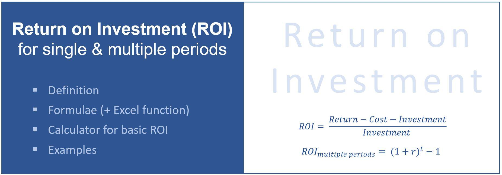

## Table of Contents

## What is Return on Investment (ROI)?

Return on Investment, or ROI, is a way to measure how much money you make or lose from an investment. It's like figuring out if the money you put into something was worth it. You calculate ROI by taking the profit you made from the investment and dividing it by the cost of the investment. Then, you multiply that number by 100 to get a percentage. If the ROI is positive, it means you made money. If it's negative, it means you lost money.

ROI is useful because it helps people decide where to put their money. For example, if you're thinking about buying a new piece of equipment for your business, you can use ROI to see if it will make you more money than it costs. It's also a good way to compare different investments. If one investment has a higher ROI than another, it might be a better choice. But remember, ROI doesn't tell the whole story. Other things like risk and how long it takes to get your money back are also important to consider.

## How do you calculate ROI?

To calculate ROI, you start by finding out how much money you made or lost from your investment. This is your profit. You then divide this profit by the amount of money you originally put into the investment. After that, you multiply the result by 100 to turn it into a percentage. So, the formula looks like this: ROI = (Profit / Cost of Investment) x 100.

For example, if you bought a stock for $100 and later sold it for $120, your profit would be $20. To find the ROI, you would divide $20 by $100, which gives you 0.2. Then, you multiply 0.2 by 100 to get a 20% ROI. This means you made a 20% return on your investment.

Remember, ROI can be positive or negative. A positive ROI means you made money, while a negative ROI means you lost money. It's a simple way to see if an investment was worth it, but it's not the only thing to think about. You should also consider other factors like how risky the investment is and how long it takes to get your money back.

## Why is ROI important for businesses?

ROI is really important for businesses because it helps them figure out if they're spending their money wisely. When a business thinks about buying new things, like machines or starting a new project, they can use ROI to see if it will make them more money than it costs. This is super helpful because it lets them choose the best way to use their money. If a business sees that one investment has a higher ROI than another, they can decide to put their money into the one that will make them more money.

Also, ROI helps businesses keep track of how well they're doing. By looking at the ROI of different parts of their business, they can see which parts are making money and which ones might be losing money. This can help them make changes to do better. For example, if a business sees that one of their stores has a low ROI, they might decide to close it or try to make it better. So, ROI is a key tool for businesses to make smart choices and keep growing.

## What are the common uses of ROI in financial analysis?

In financial analysis, ROI is often used to compare the efficiency of different investments. For example, a company might want to see which project will give them the most bang for their buck. By calculating the ROI for each project, they can see which one will likely make them more money compared to what it costs. This helps them decide where to put their money to get the best return. Investors also use ROI to compare different stocks or other investments, so they can pick the ones that seem like the best deals.

ROI is also useful for tracking performance over time. A business might look at the ROI of their investments from last year to this year to see if they're doing better or worse. This can help them figure out if their strategies are working or if they need to make changes. For example, if the ROI on a certain product line is going down, the company might decide to stop making that product or try to improve it. So, ROI helps businesses and investors make smarter decisions and keep an eye on how well they're doing.

## Can ROI be used for personal investments? If so, how?

Yes, ROI can be used for personal investments. It helps you figure out if your money is being spent wisely. For example, if you're thinking about buying a rental property, you can use ROI to see if the money you make from rent will be more than what you spent to buy and fix up the property. You can also use ROI to compare different investments, like stocks or starting a small business, to see which one might make you more money.

Using ROI for personal investments is pretty straightforward. You just need to know how much you put in and how much you got back. If you bought a stock for $1,000 and sold it for $1,200, your ROI would show you made a 20% return. This can help you decide if you want to keep investing in the same way or try something different. Remember, though, ROI is just one part of the puzzle. You should also think about things like how risky the investment is and how long it will take to get your money back.

## What are the limitations of using ROI as a performance metric?

Using ROI as a performance metric can be really helpful, but it has some limitations. One big problem is that ROI doesn't tell you about the risk of an investment. Just because something has a high ROI doesn't mean it's a good choice if it's also very risky. For example, a stock might have a high ROI, but if it's likely to lose a lot of money, it might not be worth it. Also, ROI doesn't consider the time it takes to get your money back. An investment that takes 10 years to pay off might have the same ROI as one that pays off in 1 year, but they're not the same.

Another limitation is that ROI can be hard to calculate accurately. Sometimes, it's tough to figure out all the costs and benefits of an investment. For example, if you're starting a business, you might not know all the costs upfront, like how much you'll spend on marketing or unexpected repairs. Plus, some benefits, like building a good reputation or learning new skills, are hard to put a number on. So, while ROI is a useful tool, it's important to look at other things too when making decisions about investments.

## How does ROI differ from other investment performance metrics like ROE and ROA?

ROI, or Return on Investment, is a simple way to see if an investment made or lost money. It looks at the profit from the investment compared to how much was spent on it. ROI is great because it can be used for all kinds of investments, like buying a house, starting a business, or investing in stocks. But, ROI doesn't tell you about the risk of the investment or how long it takes to get your money back.

ROE, or Return on Equity, is different because it focuses on how well a company uses the money that shareholders have put into it. ROE is calculated by dividing the company's net income by the shareholders' equity. It's useful for investors who want to know how well a company is doing with their money. ROA, or Return on Assets, looks at how well a company uses all its assets to make money. It's calculated by dividing the company's net income by its total assets. ROA is good for understanding how efficient a company is at using what it owns to make a profit. Both ROE and ROA give you a deeper look into a company's performance, but they're more specific than ROI and are mainly used for analyzing businesses.

## What are some strategies to improve ROI?

One way to improve ROI is to cut costs. If you can spend less money on an investment, the profit you make from it will be a bigger part of what you spent. For example, if you're running a business, you could look for cheaper suppliers or find ways to make things more efficiently. This means you'll spend less money to get the same result, which can make your ROI go up. Another way to cut costs is to be smart about where you spend your money. Focus on the things that really help your investment grow, and don't waste money on things that don't make a big difference.

Another strategy is to increase the money you make from your investment. If you can find ways to make more money, your ROI will go up even if you spend the same amount. For example, if you own a rental property, you could raise the rent a little bit or add extra services that people are willing to pay for. If you're investing in a business, you could try to sell more products or find new customers. The key is to look for ways to make more money without spending a lot more.

It's also important to think about the time it takes to get your money back. Sometimes, you can improve ROI by choosing investments that pay off faster. If you can get your money back quickly, you can use it to make more investments, which can lead to more profits. So, when you're looking at different investments, think about how long it will take to see a return. The faster you can get your money back, the better your overall ROI might be.

## How can ROI be applied in different industries?

In the real estate industry, ROI can help people decide if buying a property is a good idea. For example, if someone buys a house to rent out, they can use ROI to see if the money they get from rent will be more than what they spent to buy and fix up the house. If the ROI is high, it means the rental property is a good investment. Real estate investors often compare the ROI of different properties to choose the ones that will make them the most money. They also use ROI to see if making improvements, like adding a new kitchen, will pay off in the long run.

In the tech industry, companies use ROI to decide where to spend their money on new projects or products. For example, if a tech company is thinking about developing a new app, they can use ROI to see if the money they'll make from the app will be more than what it costs to create it. This helps them choose which projects to work on. Tech companies also use ROI to compare different marketing strategies, like online ads or social media campaigns, to see which ones bring in the most customers for the least amount of money. By looking at ROI, they can make smarter choices about where to invest their resources.

## What are the advanced methods for adjusting ROI calculations for inflation and risk?

To adjust ROI for inflation, you need to think about how the value of money changes over time. Inflation means that the same amount of money will buy less in the future than it does now. To account for this, you can use something called the real ROI. Real ROI takes the regular ROI and subtracts the inflation rate. For example, if your investment has an ROI of 10% and the inflation rate is 2%, the real ROI would be 8%. This gives you a better idea of how much your investment is really worth over time. By using real ROI, you can make sure you're not overestimating how much money you're making.

To adjust ROI for risk, you can use something called the risk-adjusted ROI. This means you take into account how likely it is that you'll lose money on your investment. One way to do this is by using a risk premium, which is extra money you expect to make because the investment is risky. For example, if a safe investment like a savings account has an ROI of 2%, but you're thinking about investing in a riskier stock with an expected ROI of 8%, you might say the risk premium is 6%. You can then use this to compare different investments more fairly. By adjusting ROI for risk, you get a clearer picture of whether the potential reward is worth the chance of losing money.

## How do you interpret ROI results in the context of industry benchmarks?

When you look at ROI results, it's helpful to compare them to industry benchmarks. These benchmarks are like average scores that show what other people in the same industry are getting. If your ROI is higher than the benchmark, it means your investment is doing better than most others in your field. This can make you feel good because it shows you're making smart choices with your money. But if your ROI is lower than the benchmark, it might mean you need to think about changing your strategy or looking for new ways to invest.

Using industry benchmarks helps you see where you stand compared to others. For example, if you're in the real estate business and the average ROI for rental properties in your area is 8%, but your property has an ROI of 10%, you're doing better than average. This can help you decide if you should keep investing in the same way or try something different. Remember, benchmarks can change over time, so it's a good idea to keep checking them to make sure your investments are still doing well.

## What case studies demonstrate the effective use of ROI in decision-making?

In one case study, a small business owner used ROI to decide whether to open a new store. The owner looked at how much it would cost to open the store and how much money they expected to make from it. After calculating the ROI, they saw that it would be about 15%, which was higher than the industry average of 10%. This convinced the owner to go ahead with the new store. A year later, the store was doing well, and the actual ROI turned out to be even better than expected at 18%. This showed that using ROI helped the owner make a smart decision that led to more money for the business.

Another case study involved a tech company deciding whether to develop a new app. The company's team calculated the ROI by looking at the development costs and the expected revenue from the app. They found that the ROI would be around 20%, which was much higher than other projects they were considering. Based on this, they decided to go ahead with the app. After launching, the app became popular and brought in a lot of money, giving the company an ROI of 25%. This case showed how ROI can help companies choose the right projects to work on and make more money.

## What is Understanding Return on Investment (ROI)?

Return on Investment (ROI) is a crucial metric for assessing the profitability of an investment relative to its initial cost. It helps investors gauge how effectively their capital is being utilized by measuring the return relative to the investment's expense. The calculation of ROI is straightforward and is expressed as a percentage:

$$
\text{ROI} = \left( \frac{\text{Current Value of Investment} - \text{Cost of Investment}}{\text{Cost of Investment}} \right) \times 100
$$

This simplicity makes ROI an attractive tool for investors, as it facilitates the comparison of potential financial gains across diverse investment opportunities. For example, an ROI of 20% indicates that the investment has yielded 20% more in value than its original cost, providing a clear indicator of profitability.

Despite its widespread use, ROI has limitations. One of the main drawbacks is that it does not consider the time value of money. The time value of money principle holds that a specific amount of money today is worth more than the same amount in the future due to its potential [earning](/wiki/earning-announcement) capacity. Without incorporating this principle, ROI may overstate the attractiveness of longer-term investments. Furthermore, ROI does not account for opportunity costs, which are the potential benefits an investor misses out on when choosing one alternative over another.

In financial decision making, ROI is frequently utilized to assess the feasibility of investment projects, helping investors prioritize options according to predicted profitability. However, for long-term investments, supplementary analysis methods that take into account the duration and risk, such as Net Present Value (NPV) and Internal Rate of Return (IRR), are recommended. These methods incorporate the time value of money and offer a more comprehensive understanding of investment potential over time.

In summary, while ROI is an effective initial tool for evaluating investment efficiency, it is most useful when complemented with other financial analysis techniques to provide a holistic view of investment viability and long-term profitability.

## References & Further Reading

[1]: Marcos Lopez de Prado. ["Advances in Financial Machine Learning"](https://www.amazon.com/Advances-Financial-Machine-Learning-Marcos/dp/1119482089). Wiley, 2018.

[2]: David Aronson. ["Evidence-Based Technical Analysis: Applying the Scientific Method and Statistical Inference to Trading Signals"](https://www.amazon.com/Evidence-Based-Technical-Analysis-Scientific-Statistical/dp/0470008741). Wiley, 2006.

[3]: Stefan Jansen. ["Machine Learning for Algorithmic Trading"](https://github.com/stefan-jansen/machine-learning-for-trading). Packt Publishing, 2018.

[4]: Ernest P. Chan. ["Quantitative Trading: How to Build Your Own Algorithmic Trading Business"](https://www.amazon.com/Quantitative-Trading-Build-Algorithmic-Business/dp/0470284889). Wiley, 2008.

[5]: James Bergstra, Remi Bardenet, Yoshua Bengio, and Balazs Kégl. ["Algorithms for Hyper-Parameter Optimization."](https://proceedings.neurips.cc/paper/2011/file/86e8f7ab32cfd12577bc2619bc635690-Paper.pdf) Advances in Neural Information Processing Systems 24, 2011.