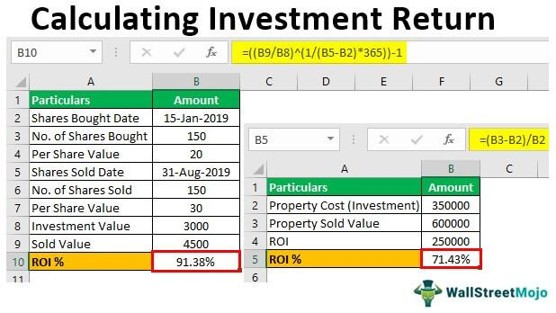

## Table of Contents

## What is Return on Investment (ROI) and why is it important?

Return on Investment, or ROI, is a way to measure how much money you make or lose from an investment. It's like a score that tells you if putting your money into something was a good idea. You figure out ROI by taking the profit you made from the investment and dividing it by the amount of money you originally put in. Then, you multiply that number by 100 to get a percentage. If the ROI is positive, it means you made money. If it's negative, you lost money.

ROI is important because it helps you see if your investments are doing well. It's a simple tool that lets you compare different investments to see which ones are the best use of your money. Whether you're investing in stocks, a new business, or even a home renovation, knowing the ROI can help you make smarter choices. It also helps businesses decide where to spend their money to get the best results. By understanding ROI, you can plan better and hopefully make more money in the long run.

## How do you set up a basic ROI calculation in Excel?

To set up a basic ROI calculation in Excel, start by opening a new spreadsheet. In the first cell, let's say A1, type "Initial Investment." In the cell below, A2, enter the amount of money you initially invested. Next, in cell A3, type "Final Value," and in A4, enter the total value of your investment at the end, including any profits or losses. Now, in cell A5, type "Profit," and in A6, type "=A4-A2" to calculate the profit by subtracting the initial investment from the final value.

After setting up your data, you can calculate the ROI. In cell A7, type "ROI," and in A8, enter the formula "= (A6/A2)*100" to find the ROI as a percentage. This formula divides the profit by the initial investment and then multiplies by 100 to convert it to a percentage. Once you've entered all the data and formulas, the ROI will automatically update if you change any of the numbers, making it easy to see how different scenarios affect your return on investment.

## What are the key components needed to calculate ROI in Excel?

To calculate ROI in Excel, you need two main pieces of information: the initial investment and the final value of the investment. The initial investment is the amount of money you put into something at the start. The final value is what your investment is worth at the end, including any profits or losses.

Once you have these numbers, you can find the profit by subtracting the initial investment from the final value. Then, to get the ROI, you divide the profit by the initial investment and multiply by 100 to turn it into a percentage. This simple calculation helps you see if your investment was a good choice or not.

## Can you explain how to input data into Excel for ROI calculation?

To start, open a new Excel spreadsheet. In the first cell, like A1, write "Initial Investment." Below that, in cell A2, put the amount of money you spent at the start. Next, in cell A3, write "Final Value." In cell A4, enter what your investment is worth at the end, including any money you made or lost. In cell A5, write "Profit," and in A6, type "=A4-A2" to figure out how much money you made or lost by subtracting the initial investment from the final value.

Now, you can calculate the ROI. In cell A7, write "ROI," and in A8, enter the formula "=(A6/A2)*100" to find out the return on investment as a percentage. This formula divides the profit by the initial investment and then multiplies by 100 to turn it into a percentage. Once you've put all the numbers and formulas in, the ROI will change automatically if you update any of the numbers. This makes it easy to see how different situations affect your investment's return.

## What formulas should be used in Excel to calculate ROI?

To calculate ROI in Excel, you need two main numbers: the initial investment and the final value of the investment. The initial investment is how much money you put in at the start. The final value is what your investment is worth at the end, including any profits or losses. To find the profit, you subtract the initial investment from the final value. In Excel, if you put the initial investment in cell A2 and the final value in cell A4, you can calculate the profit in cell A6 by typing "=A4-A2".

Once you have the profit, you can calculate the ROI. ROI is the profit divided by the initial investment, then multiplied by 100 to turn it into a percentage. In Excel, if your profit is in cell A6 and your initial investment is in cell A2, you can find the ROI in cell A8 by typing "=(A6/A2)*100". This formula will show you the return on investment as a percentage, making it easy to see if your investment was a good choice or not.

## How can you format an Excel spreadsheet to make ROI calculations clearer?

To make ROI calculations clearer in an Excel spreadsheet, start by organizing your data neatly. Label the cells clearly. For example, put "Initial Investment" in cell A1, and the amount you invested in A2. Then, write "Final Value" in A3, and the total value of your investment at the end in A4. Label "Profit" in A5, and use the formula "=A4-A2" in A6 to calculate it. Finally, label "ROI" in A7, and use the formula "=(A6/A2)*100" in A8 to show the return on investment as a percentage. This setup helps you see all the numbers and how they relate to each other.

To make it even easier to understand, you can use formatting tools. Make the labels bold so they stand out. You can also color-code the cells, like using green for positive numbers and red for negative ones. This helps you quickly see if you made or lost money. You might want to add borders around the cells to keep everything neat. If you want to compare different investments, you can copy this setup to other columns and change the numbers to see how the ROI changes. This way, you can make smart choices about where to put your money.

## What are common mistakes to avoid when calculating ROI in Excel?

When calculating ROI in Excel, one common mistake is not using the right numbers. You need to make sure you're using the initial investment and the final value correctly. If you mix up these numbers or use the wrong ones, your ROI will be wrong too. Another mistake is forgetting to multiply by 100 at the end of the formula. If you don't do this, you'll get a decimal instead of a percentage, which can be confusing.

Another error to watch out for is not updating the numbers when things change. If your investment grows or shrinks, you need to put in the new numbers to get the right ROI. Also, be careful with negative numbers. If your investment loses money, the final value will be less than the initial investment, and your ROI will be negative. Make sure you understand what a negative ROI means and don't ignore it. By avoiding these mistakes, you can make sure your ROI calculations are accurate and helpful.

## How can you use Excel to compare ROI across different investments?

To compare ROI across different investments in Excel, you can set up a table with columns for each investment. Start by labeling the first row with the names of the investments, like "Investment A," "Investment B," and so on. In the next rows, label and enter the initial investment, final value, profit, and ROI for each investment. To calculate the profit for each investment, use the formula "=Final Value - Initial Investment" in the profit row. Then, to find the ROI, use the formula "=(Profit / Initial Investment) * 100" in the ROI row. This way, you can see all the numbers side by side and compare them easily.

Once you have all the numbers entered, you can sort the ROI column from highest to lowest to see which investment gave you the best return. You can also use conditional formatting to highlight the best and worst ROIs, making it even easier to spot the differences. By having everything in one place, you can quickly see how each investment performed and make better decisions about where to put your money in the future.

## What advanced Excel functions can enhance ROI analysis?

To make your ROI analysis better in Excel, you can use the IF function. This function helps you set up rules for your data. For example, you can use it to show "Good Investment" if the ROI is above a certain number and "Bad Investment" if it's below. This makes it easy to see at a glance which investments are doing well. Another useful function is VLOOKUP, which lets you pull in data from different parts of your spreadsheet. If you have a list of investments in one place and their details in another, VLOOKUP can help you bring it all together in one spot, making your analysis clearer and more complete.

You can also use the AVERAGE function to find out the average ROI of all your investments. This gives you a quick idea of how your portfolio is doing overall. If you want to get even fancier, you can use the CHOOSE function to set up different scenarios. For example, you could see what would happen to your ROI if the final value of your investments went up or down by a certain amount. By using these advanced functions, you can make your ROI analysis more powerful and get a better understanding of your investments.

## How do you incorporate time value of money into ROI calculations in Excel?

To include the time value of money in ROI calculations in Excel, you need to think about how money today is worth more than the same amount of money in the future. This is because you could invest money now and earn interest on it. To do this in Excel, you can use the Net Present Value (NPV) function. First, you need to know the discount rate, which is the rate at which you expect to earn money on your investments. Then, you enter the initial investment as a negative number, followed by the cash flows you expect to receive each year. The NPV function will calculate the present value of those future cash flows, giving you a more accurate picture of your investment's return.

Once you have the NPV, you can calculate the ROI that takes into account the time value of money. You do this by subtracting the initial investment from the NPV and then dividing by the initial investment. Finally, multiply by 100 to get the percentage. This adjusted ROI shows you the real return on your investment, considering that money has different values at different times. By using these steps in Excel, you can make smarter decisions about where to put your money, knowing that you're looking at a more complete picture of your investment's performance.

## Can you demonstrate how to create dynamic ROI models in Excel?

To create a dynamic ROI model in Excel, you can set up a spreadsheet that changes when you update the numbers. Start by putting the initial investment in one cell, like A2, and the final value in another cell, like A4. In cell A6, use the formula "=A4-A2" to calculate the profit. Then, in cell A8, use the formula "=(A6/A2)*100" to find the ROI. Now, to make it dynamic, you can use Excel's data validation tool to create drop-down lists for different scenarios. For example, you can have a list of different final values in one column, and when you choose a value from the list, the ROI calculation will update automatically. This way, you can quickly see how different outcomes affect your return on investment.

You can also use Excel's scenario manager to make your ROI model even more dynamic. This tool lets you save different sets of numbers and switch between them easily. For example, you could set up scenarios for best-case, worst-case, and most-likely outcomes. Each scenario would have its own initial investment and final value. When you switch between scenarios, the profit and ROI calculations will update automatically, showing you how your investment might perform under different conditions. By using these tools, you can play around with different numbers and see how they change your ROI, helping you make better decisions about your investments.

## How do you use Excel to forecast future ROI based on historical data?

To forecast future ROI using historical data in Excel, you first need to collect and organize your past investment data. Start by creating a table with columns for the date of each investment, the initial investment amount, and the final value at the end of each period. Once you have this data, you can calculate the ROI for each past investment using the formula "=(Final Value - Initial Investment) / Initial Investment * 100". Next, you can use Excel's AVERAGE function to find the average ROI of all your past investments. This average can give you a baseline to predict future performance.

After calculating the average ROI, you can use Excel's FORECAST function to predict future ROI based on this historical data. You'll need to set up a column for future dates and another for the forecasted ROI. In the cell where you want the forecasted ROI to appear, use the FORECAST function with the future date as the x value, the historical ROI data as the known_y's, and the corresponding dates as the known_x's. This will give you a predicted ROI for the future date. By doing this, you can estimate how your investments might perform in the future, helping you make more informed decisions about where to put your money.

## What is ROI and why is it important?

Return on Investment (ROI) is a cornerstone financial metric that evaluates the profitability of an investment by measuring how much return can be expected in relation to the investment's cost. This metric is vital for both individuals and businesses, as it serves as a simple yet effective tool for assessing the performance and efficiency of various investments. ROI is expressed as a percentage, which allows for easy comparison across different investment opportunities.

The formula to calculate ROI is as follows:

$$
\text{ROI} = \left(\frac{\text{Gain from Investment} - \text{Cost of Investment}}{\text{Cost of Investment}}\right) \times 100
$$

In this formula, the "Gain from Investment" refers to the total return or profit obtained, while the "Cost of Investment" is the initial expenditure incurred to make the investment. By subtracting the initial cost from the total gain, the profit or loss is determined, which is then divided by the initial cost to yield a decimal figure. Multiplying this figure by 100 converts it into a percentage, facilitating an easy comparison.

Understanding and accurately calculating ROI is critical for making informed financial decisions. It enables investors to evaluate the efficiency of single or multiple investments, helping them to allocate resources in a manner that maximizes potential gains. For example, consider an investor choosing between two potential projects: one with an ROI of 20% and another with 15%. In this scenario, the project with an ROI of 20% is generally the better choice, assuming other factors such as risk and time period are comparable.

ROI is beneficial not just for evaluating existing investments but also for forecasting potential future returns, allowing strategic planning and goal setting. However, while ROI is an essential tool, it should be utilized alongside other financial metrics to provide a comprehensive analysis, as it does not [factor](/wiki/factor-investing) in aspects such as the time value of money or investment risk.

## How can you calculate ROI using Excel?

Excel, a staple tool in financial management, provides robust functionalities for calculating Return on Investment (ROI) with precision and ease. This process begins with setting up a spreadsheet that is optimized for clarity and usability.

To create an ROI calculation in Excel, start by labeling the necessary cells. Typically, these include 'Starting Value', 'Current Value', and 'ROI', which can be placed in distinct columns in the first row to keep the spreadsheet organized. This setup ensures that each parameter is clearly defined, aiding in both data entry and result interpretation.

Once the spreadsheet is prepared, input the relevant data into the 'Starting Value' and 'Current Value' cells. The ROI is computed using the formula:

$$
\text{ROI} = \frac{\text{Current Value} - \text{Starting Value}}{\text{Starting Value}}
$$

Expressed as a percentage, this formula highlights the proportion of gain or loss relative to the initial investment. To automate this calculation in Excel, enter the formula directly into the 'ROI' cell. For instance, if the starting value is in cell A2 and the current value is in B2, input the formula `=(B2-A2)/A2` in the cell designated for ROI, usually C2.

Excel can handle this calculation for multiple investment scenarios simultaneously. By dragging the formula down across adjacent cells in the 'ROI' column, users can simulate ROI for multiple data sets, facilitating comparative analysis.

Additionally, Excel's built-in features, such as conditional formatting, can further enhance ROI analysis. By applying color scales to the ROI column, you can instantly visualize which investments are outperforming others. This visual context aids in quick decision-making by highlighting profitable ventures at a glance.

In conclusion, Excel's ability to streamline ROI calculations not only simplifies the financial analysis process but also provides a reliable method for evaluating investment performance. With just a few steps, users can automate calculations, ensuring efficient and accurate financial decision-making.

## What are the pros and cons of using ROI in financial analysis?

Return on Investment (ROI) is an established measure for evaluating the profitability of investments by comparing the net gain to the initial cost. Its straightforwardness makes it a popular choice among investors for quick comparisons across different opportunities. The formula for ROI is expressed as:

$$
\text{ROI} = \frac{\text{Net Profit}}{\text{Cost of Investment}} \times 100
$$

ROI offers a clear snapshot of the potential success of an investment by presenting it as a percentage, facilitating direct comparisons irrespective of the investment size. This simplicity can aid investors in making swift decisions, especially when dealing with numerous investment options.

However, ROI carries certain limitations. One significant drawback is its failure to account for the time value of money. This principle stipulates that money available today is worth more than the same amount in the future due to its potential [earning](/wiki/earning-announcement) capacity. ROI has no mechanism to factor in the varying times over which profits might be realized. As such, investments that generate returns quickly may appear erroneously more favorable than those yielding steady gains over a longer period.

Further, ROI does not incorporate risk factors, providing no insight into the [volatility](/wiki/volatility-trading-strategies) or stability of the potential returns. It treats all investments as equal in terms of risk, which may mislead investors into underestimating the risk associated with high-reward opportunities.

Due to these limitations, it is recommended that investors use ROI in conjunction with other financial metrics such as Net Present Value (NPV) and Internal Rate of Return (IRR). NPV provides insight into the value of future cash flows in present terms, while IRR gives an expected growth rate, taking into account the time value of money. These metrics together provide a more comprehensive picture of an investment's potential and risk profile, enabling more informed and strategic financial decisions.

## References & Further Reading

[1]: ["Advances in Financial Machine Learning"](https://www.amazon.com/Advances-Financial-Machine-Learning-Marcos/dp/1119482089) by Marcos Lopez de Prado

[2]: ["Evidence-Based Technical Analysis: Applying the Scientific Method and Statistical Inference to Trading Signals"](https://www.amazon.com/Evidence-Based-Technical-Analysis-Scientific-Statistical/dp/0470008741) by David Aronson

[3]: ["Machine Learning for Algorithmic Trading"](https://github.com/stefan-jansen/machine-learning-for-trading) by Stefan Jansen

[4]: ["Quantitative Trading: How to Build Your Own Algorithmic Trading Business"](https://www.amazon.com/Quantitative-Trading-Build-Algorithmic-Business/dp/1119800064) by Ernest P. Chan