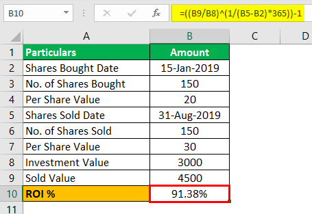

In the ever-evolving landscape of financial management and investment strategy, mastering tools like Excel for ROI calculations is crucial. Excel stands out as a vital resource, offering a combination of flexibility and functionality that empowers users to perform complex financial analyses with precision. This article examines the intersection of Excel finance, investment analysis, and algorithmic trading, focusing on how these elements can enhance decision-making processes. By leveraging Excel, users can calculate Return on Investment (ROI) accurately, providing a clearer picture of the potential profitability and risks associated with investments.

Investment analysis and algorithmic trading represent strategic elements in modern finance. They facilitate data-driven decisions through quantitative analysis and the use of automated systems to execute trades based on predetermined strategies. Integrating these elements with Excel's powerful toolset enables investors and analysts to refine their strategies, optimize portfolio performance, and apply advanced techniques such as backtesting and signal generation.



This guide is designed to equip you with actionable insights and practical knowledge, exploring methods to utilize Excel not only for ROI calculations but also for broader investment analysis and trading strategies. Whether you are managing personal finance or engaging in professional trading, the combination of Excel's capabilities and a solid understanding of financial metrics will enable you to make informed and strategic financial decisions.

## Table of Contents

## Understanding ROI and Its Importance

Return on Investment (ROI) is a cornerstone financial metric that evaluates the profitability of an investment by measuring how much return can be expected in relation to the investment's cost. This metric is vital for both individuals and businesses, as it serves as a simple yet effective tool for assessing the performance and efficiency of various investments. ROI is expressed as a percentage, which allows for easy comparison across different investment opportunities.

The formula to calculate ROI is as follows:

$$
\text{ROI} = \left(\frac{\text{Gain from Investment} - \text{Cost of Investment}}{\text{Cost of Investment}}\right) \times 100
$$

In this formula, the "Gain from Investment" refers to the total return or profit obtained, while the "Cost of Investment" is the initial expenditure incurred to make the investment. By subtracting the initial cost from the total gain, the profit or loss is determined, which is then divided by the initial cost to yield a decimal figure. Multiplying this figure by 100 converts it into a percentage, facilitating an easy comparison.

Understanding and accurately calculating ROI is critical for making informed financial decisions. It enables investors to evaluate the efficiency of single or multiple investments, helping them to allocate resources in a manner that maximizes potential gains. For example, consider an investor choosing between two potential projects: one with an ROI of 20% and another with 15%. In this scenario, the project with an ROI of 20% is generally the better choice, assuming other factors such as risk and time period are comparable.

ROI is beneficial not just for evaluating existing investments but also for forecasting potential future returns, allowing strategic planning and goal setting. However, while ROI is an essential tool, it should be utilized alongside other financial metrics to provide a comprehensive analysis, as it does not [factor](/wiki/factor-investing) in aspects such as the time value of money or investment risk.

## Calculating ROI Using Excel

Excel, a staple tool in financial management, provides robust functionalities for calculating Return on Investment (ROI) with precision and ease. This process begins with setting up a spreadsheet that is optimized for clarity and usability.

To create an ROI calculation in Excel, start by labeling the necessary cells. Typically, these include 'Starting Value', 'Current Value', and 'ROI', which can be placed in distinct columns in the first row to keep the spreadsheet organized. This setup ensures that each parameter is clearly defined, aiding in both data entry and result interpretation.

Once the spreadsheet is prepared, input the relevant data into the 'Starting Value' and 'Current Value' cells. The ROI is computed using the formula:

$$
\text{ROI} = \frac{\text{Current Value} - \text{Starting Value}}{\text{Starting Value}}
$$

Expressed as a percentage, this formula highlights the proportion of gain or loss relative to the initial investment. To automate this calculation in Excel, enter the formula directly into the 'ROI' cell. For instance, if the starting value is in cell A2 and the current value is in B2, input the formula `=(B2-A2)/A2` in the cell designated for ROI, usually C2.

Excel can handle this calculation for multiple investment scenarios simultaneously. By dragging the formula down across adjacent cells in the 'ROI' column, users can simulate ROI for multiple data sets, facilitating comparative analysis.

Additionally, Excel's built-in features, such as conditional formatting, can further enhance ROI analysis. By applying color scales to the ROI column, you can instantly visualize which investments are outperforming others. This visual context aids in quick decision-making by highlighting profitable ventures at a glance.

In conclusion, Excel's ability to streamline ROI calculations not only simplifies the financial analysis process but also provides a reliable method for evaluating investment performance. With just a few steps, users can automate calculations, ensuring efficient and accurate financial decision-making.

## An Example: ROI Calculation in Excel

Consider a scenario where you sell an antique piece and wish to calculate its Return on Investment (ROI) using Excel, a powerful tool for such financial computations. First, organize your spreadsheet by labeling the cells accordingly. Create a column for 'Initial Cost' where you input the original purchase price of the antique. Next, label another column 'Financial Gain' to record the total revenue obtained from the sale. Lastly, establish a column for 'ROI' which will automatically calculate the return percentage based on the data entered.

To proceed with the ROI calculation, enter the numeric values for the initial cost and the profit generated from the sale. For instance, if the antique was initially purchased for $1,000 and sold for $1,500, your financial gain, which is the difference between the selling price and the initial cost, would be $500.

The ROI is then computed using the formula:
$$
ROI = \frac{\text{Financial Gain}}{\text{Initial Cost}} \times 100
$$
In Excel, you can implement this by using cell references. Assuming the 'Initial Cost' is in cell A2 and the 'Financial Gain' is in cell B2, enter the following formula into the 'ROI' cell (for example, C2):
```
=(B2/A2)*100
```

After entering this formula, Excel will instantly calculate the ROI percentage. Continuing with the example, the formula will output an ROI of 50%, demonstrating the profitability of reselling the antique. This highlights Excel's capability to efficiently automate financial calculations, offering clear and actionable insights into the investment's success.

## Using Excel for Investment Analysis and Algorithmic Trading

Investment analysis using Excel integrates logical and mathematical functions to evaluate different strategies effectively. Excel's flexibility allows financial analysts and traders to perform detailed assessments without relying on expensive software.

One of the most significant applications of Excel in investment analysis is its ability to conduct [backtesting](/wiki/backtesting) for [algorithmic trading](/wiki/algorithmic-trading) strategies. Backtesting involves simulating a trading strategy using historical data to evaluate its potential effectiveness. Excel can store vast datasets and incorporates various functions to test different scenarios. You can use functions like VLOOKUP or INDEX and MATCH to retrieve and analyze historical market data, while SUMPRODUCT can help calculate returns and risks associated with specific strategies.

For instance, you can set up an Excel sheet to track historical prices of a security and apply an algorithmic trading strategy by creating rules in Excel. Suppose you want to test a simple moving average crossover strategy, which involves buying a stock when a shorter-term moving average crosses above a longer-term average.

Here’s an example using Excel:

1. **Input Historical Data:** Label your columns for dates, closing prices, and moving averages.
2. **Calculate Moving Averages:** For a 10-day moving average, use the formula:
   ```excel
   =AVERAGE(B2:B11)
   ```
   Drag this down for the rest of your dataset.
3. **Implement the Crossover Logic:** Using formulas such as IF, AND, and OR, create a signal column indicating when the crossover occurs:
   ```excel
   =IF(AND(C12>D12, C11<D11), "Buy", IF(AND(C12<D12, C11>D11), "Sell", "Hold"))
   ```
   Here, C12 and C11 represent the shorter-term moving average, and D12 and D11 represent the longer-term average.

Besides backtesting, Excel supports live signal generation by utilizing real-time data integrations. For instance, you can use Power Query or Data Streamer add-ons to connect Excel with live market feeds, automatically updating your data and signaling opportunities in real-time.

Excel's logical functions (IF, AND, OR) further enhance financial models by allowing complex conditional interrogations. Using these functions, traders can develop strategies that react to a variety of market conditions, tailoring their models to include stop-losses, take-profits, and other trading prerequisites.

In conclusion, Excel provides a robust platform for investment analysis and algorithmic trading. Its potential is vast, given its capability to automate calculations, analyze large datasets, and systematically test trading strategies. For individuals keen on exploring algorithmic trading, mastering Excel's functionalities can be an invaluable asset in developing data-driven strategies.

## Pros and Cons of Using ROI in Financial Analysis

Return on Investment (ROI) is an established measure for evaluating the profitability of investments by comparing the net gain to the initial cost. Its straightforwardness makes it a popular choice among investors for quick comparisons across different opportunities. The formula for ROI is expressed as:

$$
\text{ROI} = \frac{\text{Net Profit}}{\text{Cost of Investment}} \times 100
$$

ROI offers a clear snapshot of the potential success of an investment by presenting it as a percentage, facilitating direct comparisons irrespective of the investment size. This simplicity can aid investors in making swift decisions, especially when dealing with numerous investment options.

However, ROI carries certain limitations. One significant drawback is its failure to account for the time value of money. This principle stipulates that money available today is worth more than the same amount in the future due to its potential [earning](/wiki/earning-announcement) capacity. ROI has no mechanism to factor in the varying times over which profits might be realized. As such, investments that generate returns quickly may appear erroneously more favorable than those yielding steady gains over a longer period.

Further, ROI does not incorporate risk factors, providing no insight into the [volatility](/wiki/volatility-trading-strategies) or stability of the potential returns. It treats all investments as equal in terms of risk, which may mislead investors into underestimating the risk associated with high-reward opportunities.

Due to these limitations, it is recommended that investors use ROI in conjunction with other financial metrics such as Net Present Value (NPV) and Internal Rate of Return (IRR). NPV provides insight into the value of future cash flows in present terms, while IRR gives an expected growth rate, taking into account the time value of money. These metrics together provide a more comprehensive picture of an investment's potential and risk profile, enabling more informed and strategic financial decisions.

## Conclusion

Return on Investment (ROI) continues to be an essential metric for investors and analysts aiming to assess the profitability of their financial ventures. The integration of Excel's comprehensive computational capabilities with ROI calculations significantly enhances investment analysis and strategic planning endeavors. Excel's functionality allows for the seamless automation of ROI formulas and offers the capacity to handle complex datasets, making it an invaluable tool for both personal finance management and professional trading environments. Through data visualization, pivot tables, and advanced functions, Excel empowers users to gain insights and make informed, data-driven decisions. This dual application of ROI and Excel ensures that financial assessments are not only more precise but also more adaptable to changing market conditions, providing a robust foundation for financial decision-making and strategic investment planning.

## References & Further Reading

[1]: ["Advances in Financial Machine Learning"](https://www.amazon.com/Advances-Financial-Machine-Learning-Marcos/dp/1119482089) by Marcos Lopez de Prado

[2]: ["Evidence-Based Technical Analysis: Applying the Scientific Method and Statistical Inference to Trading Signals"](https://www.amazon.com/Evidence-Based-Technical-Analysis-Scientific-Statistical/dp/0470008741) by David Aronson

[3]: ["Machine Learning for Algorithmic Trading"](https://github.com/stefan-jansen/machine-learning-for-trading) by Stefan Jansen

[4]: ["Quantitative Trading: How to Build Your Own Algorithmic Trading Business"](https://www.amazon.com/Quantitative-Trading-Build-Algorithmic-Business/dp/1119800064) by Ernest P. Chan