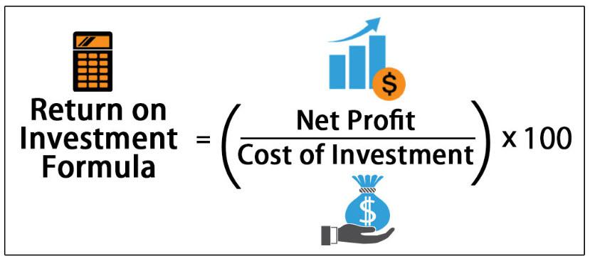

In today's fast-paced financial markets, understanding key financial metrics is crucial for making effective investment decisions. Investors and traders must possess a keen awareness of factors that influence potential profits to adapt swiftly to market changes.

One of the most widely used metrics in evaluating the profitability of investments is Return on Investment (ROI). ROI provides insight into the efficiency of an investment by measuring the gain or loss generated relative to the initial cost. This fundamental metric helps investors assess the performance of their investments compared to other potential opportunities.

The advent of algorithmic trading has revolutionized how markets are approached. Algorithmic trading leverages advanced algorithms to execute trades at a speed and frequency beyond the capabilities of human traders. This systematic approach allows for precise, data-driven decision-making, minimizing human error and capitalizing on even minute market opportunities.

Understanding how financial metrics, particularly ROI, are calculated and optimized within algorithmic trading is essential for enhancing investment outcomes. This article provides a comprehensive guide to integrating ROI calculations with algorithmic strategies, ensuring that financial operations not only meet profitability benchmarks but are also efficient and risk-averse.

We explore the significance of ROI by focusing on its computation and application in algorithmic trading strategies. As financial markets continue to evolve, adopting a robust framework for evaluating and optimizing investment performance remains pivotal for achieving superior investment success.

## Table of Contents

## Understanding Financial Metrics: ROI

Return on Investment (ROI) is a pivotal financial metric used to evaluate the efficiency and profitability of an investment. It indicates the amount of return relative to the cost of the investment. The ROI calculation is straightforward and is expressed as a percentage, calculated using the formula:

$$
\text{ROI} = \left( \frac{\text{Net Profit}}{\text{Cost of Investment}} \right) \times 100
$$

Where:
- **Net Profit** is the difference between the total returns from the investment and the initial cost.
- **Cost of Investment** is the total amount invested initially.

This formula provides a clear measure of profitability, allowing investors to compare the returns from different investments on an equal footing. ROI's simplicity and ease of calculation make it a widely utilized metric among both individual and institutional investors.

Despite its popularity, ROI has limitations. It doesn't inherently account for the time horizon over which gains are made. An investment that doubles in five years versus one year will have the same ROI, ignoring the impact of the time value of money. Moreover, ROI does not consider risk factors, meaning an investment with high returns could also come with significant risk that ROI alone does not reflect.

Nonetheless, ROI remains a fundamental tool for quickly assessing the relative performance of investment opportunities. It serves as the starting point for more detailed analyses that may involve other metrics or considerations to provide a comprehensive view of an investment's potential.

## Calculating ROI in Investment Strategies

To calculate Return on Investment (ROI) accurately within investment strategies, it is essential to consider all associated returns and costs. This includes commissions, dividends, and taxes that impact the net profit and cost of the investment. The basic ROI formula is expressed as:

$$
\text{ROI} = \left( \frac{\text{Net Profit}}{\text{Cost of Investment}} \right) \times 100
$$

Net Profit is derived from the total return on the investment minus the associated costs. This formula provides a rudimentary understanding of an investment's profitability; however, for investments held over multiple years, adjustments like annualized ROI offer deeper insights.

**Annualized ROI** accounts for the effects of compounding over time and is critical for comparing investments with different durations. To compute the annualized ROI, the formula is adjusted to consider the number of years $n$ the investment is held:

$$
\text{Annualized ROI} = \left( (1 + \text{Total ROI})^{\frac{1}{n}} - 1 \right) \times 100
$$

This calculation helps normalize results, making it possible to compare investments with varied time frames meaningfully.

Investors should be cautious about ROI's time-frame dependency, as it can cause skewed comparisons if not standardized across investments. For example, a short-term investment with higher nominal ROI may appear more appealing than a long-term investment with a lower ROI, when in fact, the latter might offer better value once annualized.

**Example – Stock Investment Calculation**

Let's consider a stock investment example to illustrate ROI calculation:

1. **Initial Investment**: $10,000
2. **Shares Purchased**: 100 shares at $100 each
3. **Price at Sale**: $150 per share
4. **Total Sale Proceeds**: 100 shares x $150 = $15,000
5. **Net Profit Before Costs**: $15,000 - $10,000 = $5,000

Next, account for additional costs. Suppose there is a commission fee of $200 and taxes amounting to $300:

- **Net Profit After Costs**: $5,000 - $200 - $300 = $4,500

Finally, calculate ROI:

$$
\text{ROI} = \left( \frac{4,500}{10,000} \right) \times 100 = 45\%
$$

For an investment held over 3 years, calculate the annualized ROI:

1. **Total ROI**: 45%
2. **Annualized ROI**:

   \[ \text{Annualized ROI} = \left( (1 + 0.45)^{\frac{1}{3}} - 1 \right) \times 100 \approx 13.17\%
$$

This example demonstrates how neglecting costs and the investment period can result in misleading ROI figures. For precise evaluations, investors must integrate all financial variables and adapt calculations to fit specific investment contexts.

## Algorithmic Trading and Performance Metrics

Algorithmic trading is a sophisticated method of executing trading orders using automated and pre-programmed instructions, which enable execution at speeds and frequencies that surpass human capabilities. This trading method is increasingly popular due to its ability to process vast amounts of market data and execute trades with minimal latency.

Important metrics in [algorithmic trading](/wiki/algorithmic-trading) are vital in assessing the performance and risk associated with trading algorithms. The Sharpe Ratio, Volatility, and Maximum Drawdown are predominant among these indicators:

1. **Sharpe Ratio**: This metric measures the risk-adjusted return of an investment strategy. It is calculated by subtracting the risk-free rate from the portfolio's return and dividing the result by the portfolio's standard deviation. A higher Sharpe Ratio indicates a more favorable risk-to-return balance:
$$
   \text{Sharpe Ratio} = \frac{\text{Return of Portfolio} - \text{Risk-Free Rate}}{\text{Standard Deviation of Portfolio Returns}}

$$

2. **Volatility**: Volatility gauges the degree of variation in trading prices over a specific period. It is critical in understanding the risk level associated with the trading strategy. High volatility implies a higher risk, which may affect the strategy's attractiveness to investors.

3. **Maximum Drawdown**: This metric represents the peak-to-trough decline during a specific period and marks the maximum loss from the highest point to the lowest point. It helps traders identify the worst possible loss they could incur, thus aiding in assessing the strategy's risk and stability.

Algorithmic trading strategies leverage Return on Investment (ROI) analysis to fine-tune algorithms and optimize financial outcomes. The ROI provides insight into the profitability of algorithmic trading strategies when considering the initial investment and associated costs such as commissions and slippage.

For example, an algorithmic trading system may adjust its trading parameters to achieve targeted ROI levels by analyzing historical data and [backtesting](/wiki/backtesting) results. By doing so, traders can enhance the efficiency of algorithms and adjust to shifting market conditions to maximize returns.

Real-world implementations demonstrate the effective integration of ROI in algorithmic trading systems. A system can utilize these metrics to recalibrate strategies dynamically, aiming for enhanced returns while mitigating associated risks. For instance, algorithms might adjust position sizes or modify stop-loss orders based on the calculated ROI over specific periods, ensuring alignment with the investor's risk tolerance and financial goals.

Overall, while ROI is a critical component in tracking investment success, its combination with other performance metrics, such as the Sharpe Ratio, Volatility, and Maximum Drawdown, provides a comprehensive overview of algorithmic trading strategies, facilitating informed decision-making and risk management.

## Combining ROI with Advanced Algorithmic Strategies

Integrating ROI analysis with algorithmic trading offers significant advantages by aligning trading strategies with profitability benchmarks. ROI, a straightforward metric, becomes a powerful tool when combined with the precision and speed of algorithmic trading, allowing traders to assess and adjust strategies effectively.

Algorithmic traders use ROI to fine-tune algorithms, enhancing both efficiency and effectiveness. By continuously monitoring ROI, algorithms can be programmed to make real-time adjustments, optimizing performance as market conditions change. This ongoing recalibration ensures that algorithms remain aligned with set profitability targets, providing a better return on investment.

Combining leverage with ROI calculations can amplify returns, but it necessitates careful risk management. Leverage allows traders to control larger positions with a smaller amount of invested capital, potentially increasing both profits and losses. Calculating leveraged ROI involves adjusting the standard ROI formula to account for borrowed funds and associated costs. This integration requires robust risk management strategies to mitigate the increased exposure inherent with leverage.

In real-world applications, automated trading strategies can be designed to adapt according to ROI targets and financial metrics. For example, traders might set a specific ROI threshold that, once achieved, triggers a shift in strategy—whether that means adjusting the trading frequency, altering asset allocations, or rebalancing portfolios. Algorithms can incorporate ROI alongside other key performance indicators to optimize decision-making processes.

The effectiveness of ROI-focused strategies varies across different market conditions and asset classes. In volatile markets, high-frequency trading algorithms might utilize short-term ROI calculations to exploit rapid price fluctuations. Conversely, in more stable markets, long-term ROI analysis might guide strategic investments in slower-moving assets. Each asset class presents unique characteristics that can affect how ROI-based strategies are formulated and implemented, necessitating tailored approaches to maximize profitability.

Incorporating ROI analysis within algorithmic trading not only enhances strategy refinement but also underlines the importance of a dynamic, responsive trading mechanism. As financial markets evolve, the symbiosis of ROI and algorithmic trading provides a comprehensive framework for maximizing investment returns while managing associated risks effectively.

## Challenges in ROI Calculation and Algo Trading

Calculating Return on Investment (ROI) within algorithmic trading presents several challenges, primarily due to the dynamic nature of financial markets. One of the most pressing issues is managing uneven cash flows and market [volatility](/wiki/volatility-trading-strategies), which can lead to fluctuating investment returns. This variability makes it difficult to measure ROI accurately over short periods, as the momentary impacts of market changes can cause distortions in the perceived profitability of an investment.

Algorithmic trading, characterized by the rapid execution of trades based on computer algorithms, requires quick adaptations to ever-changing market conditions. For accurate ROI calculations, real-time data is crucial, necessitating algorithms that can process diverse market scenarios swiftly and efficiently. The integration of real-time data ensures that investments are evaluated accurately, reflecting current market conditions rather than outdated information.

However, relying solely on ROI as a performance metric can be limiting. ROI does not account for external factors such as investor behavior or macroeconomic changes, which can significantly influence investment outcomes. For instance, a high ROI might be misleading if the broader economic environment is declining. Similarly, behavioral biases in trading can lead to sub-optimal decisions that affect the profitability represented by ROI.

One effective strategy for overcoming these challenges is to employ a robust, data-driven approach. This involves the extensive backtesting of algorithms using historical data to anticipate potential market scenarios and determine the algorithm's effectiveness in achieving desired ROI levels. Backtesting allows traders to evaluate how trading strategies might perform based on past data, thereby refining the algorithms before they are deployed in live markets.

Continuous monitoring and adjustment of trading algorithms are essential to maintaining desired ROI levels. Given the volatility and unpredictability of financial markets, periodic reviews of trading algorithms help ensure they remain aligned with ROI targets. Adjustments may involve recalibrating parameters based on evolving market patterns or integrating additional factors into the algorithm to enhance its predictive capabilities.

In summary, while ROI is a crucial metric for assessing the profitability of investment strategies, particularly in algorithmic trading, it must be complemented by additional performance measures and rigorous data analysis. By thoroughly testing and continuously adjusting trading algorithms, traders can better navigate the complexities of market dynamics and optimize their investment strategies for more accurate ROI calculations.

## Conclusion

Return on Investment (ROI) continues to stand out as an essential metric for assessing investment success. This prominence is particularly notable when ROI is used alongside algorithmic trading technologies, which leverage complex algorithms to scrutinize vast amounts of market data efficiently. Such integration allows for accurate, prompt decision-making driven by comprehensive data analysis, enhancing ROI’s applicability and utility.

Algorithmic trading maximizes ROI's effectiveness by processing extensive datasets in real-time, which human traders find challenging to manage due to the sheer [volume](/wiki/volume-trading-strategy) and speed required. This capability ensures that investment decisions occur at optimal moments, aligning with the strategic goals of traders. However, while ROI provides crucial insights into profitability, it is not without its limitations. To gain a full picture of investment performance, it is critical to complement ROI with other performance metrics such as the Sharpe Ratio, Volatility, and Maximum Drawdown. These metrics collectively help to evaluate risk-adjusted returns and overall investment risk, thus offering a more comprehensive view of trading strategies.

Looking forward, developments in algorithmic trading promise even more sophisticated methods for employing ROI. Advances in [machine learning](/wiki/machine-learning) and [artificial intelligence](/wiki/ai-artificial-intelligence) are expected to refine investment strategies, allowing traders to adapt more dynamically to changing market conditions. These technologies hold the potential to improve ROI calculation accuracy and offer enhanced predictive capabilities, leading to superior investment performance.

In summary, understanding and optimizing ROI, especially when integrated with algorithmic trading, lays a robust foundation for achieving superior investment outcomes. As trading technologies continue to evolve, they will undoubtedly further amplify the effectiveness of ROI, refining strategies and contributing to more informed investment decisions.

## References & Further Reading

[1]: Bergstra, J., Bardenet, R., Bengio, Y., & Kégl, B. (2011). ["Algorithms for Hyper-Parameter Optimization."](https://dl.acm.org/doi/10.5555/2986459.2986743) Advances in Neural Information Processing Systems 24.

[2]: ["Advances in Financial Machine Learning"](https://www.amazon.com/Advances-Financial-Machine-Learning-Marcos/dp/1119482089) by Marcos Lopez de Prado

[3]: ["Evidence-Based Technical Analysis: Applying the Scientific Method and Statistical Inference to Trading Signals"](https://www.amazon.com/Evidence-Based-Technical-Analysis-Scientific-Statistical/dp/0470008741) by David Aronson

[4]: ["Machine Learning for Algorithmic Trading"](https://github.com/PacktPublishing/Machine-Learning-for-Algorithmic-Trading-Second-Edition) by Stefan Jansen

[5]: ["Quantitative Trading: How to Build Your Own Algorithmic Trading Business"](https://books.google.com/books/about/Quantitative_Trading.html?id=j70yEAAAQBAJ) by Ernest P. Chan