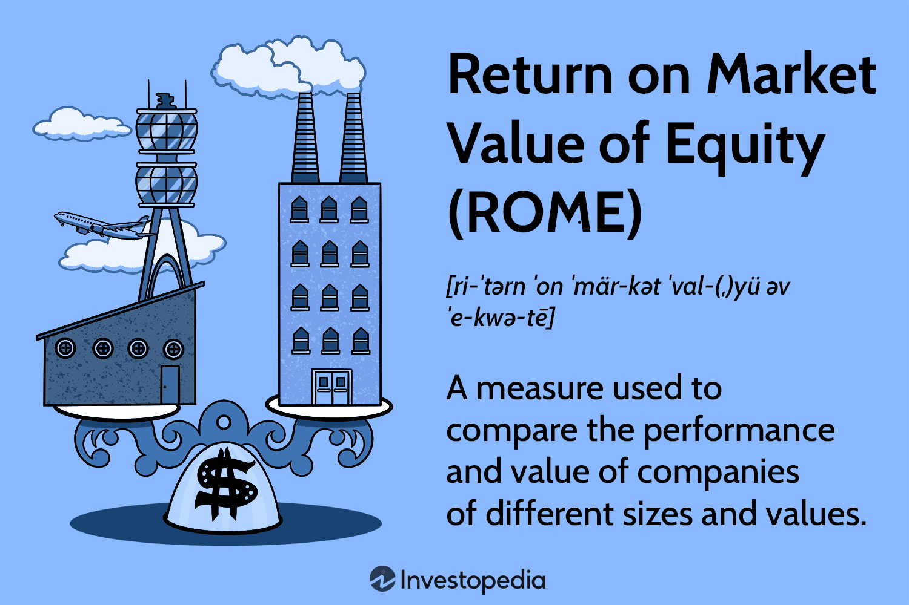

## Table of Contents

## What is the Return on Market Value of Equity (ROME)?

The Return on Market Value of Equity (ROME) is a financial metric that helps investors understand how much profit a company is making compared to its market value. It is calculated by dividing the company's net income by its market value of equity, which is the total value of all outstanding shares of the company's stock. This ratio gives investors an idea of how effectively a company is using the money that shareholders have invested in it.

ROME is useful because it shows the return that shareholders might expect on their investment. If a company has a high ROME, it means that it is generating a lot of profit relative to its market value, which can be attractive to investors looking for good returns. On the other hand, a low ROME might indicate that the company is not using its equity efficiently, which could be a red flag for potential investors. By comparing the ROME of different companies, investors can make more informed decisions about where to put their money.

## How is ROME calculated?

ROME is calculated by dividing a company's net income by its market value of equity. Net income is the profit a company makes after all expenses are paid. Market value of equity is found by multiplying the number of outstanding shares by the current stock price. This gives you the total value of the company's stock in the market.

The formula for ROME is simple: ROME = Net Income / Market Value of Equity. For example, if a company has a net income of $1 million and its market value of equity is $10 million, the ROME would be 10% ($1 million divided by $10 million). This percentage tells investors how much profit the company is making for each dollar of market value.

## What is the difference between ROME and Return on Equity (ROE)?

ROME and ROE are both ways to measure how well a company is doing, but they use different numbers to do it. ROME looks at the profit a company makes compared to its market value. The market value is what people are willing to pay for the company's stock. So, ROME tells you how much profit you get for each dollar you could buy the company for in the stock market.

ROE, on the other hand, looks at the profit compared to the shareholders' equity. Shareholders' equity is the money that the owners of the company have put into it, plus any profits that have been kept in the company. ROE tells you how much profit the company is making for each dollar that the owners have invested. So, while ROME uses the market's view of the company's value, ROE uses the company's own financial records to see how well it's doing with the money it has.

## Why is ROME important for investors?

ROME is important for investors because it shows how much profit a company makes compared to what the market thinks the company is worth. If a company has a high ROME, it means the company is making a lot of profit for the price of its stock. This can be a good sign for investors because it suggests they might get a good return on their investment. On the other hand, a low ROME could mean the company isn't making enough profit for its market value, which might make investors think twice before buying its stock.

By looking at ROME, investors can compare different companies to see which ones might give them the best return. For example, if two companies have similar businesses but one has a much higher ROME, an investor might choose to invest in the company with the higher ROME. This helps investors make smarter choices about where to put their money, aiming for the best possible returns.

## Can you provide an example of how to calculate ROME for a hypothetical company?

Let's say we have a company called TechTrend Inc. TechTrend Inc. has a net income of $5 million for the year. The company has 1 million shares outstanding, and each share is currently trading at $20 in the stock market. To find the market value of equity, we multiply the number of shares by the current stock price. So, for TechTrend Inc., the market value of equity is 1 million shares times $20 per share, which equals $20 million.

To calculate ROME, we divide the net income by the market value of equity. For TechTrend Inc., that means we divide $5 million by $20 million. This gives us a ROME of 0.25, or 25%. This means that for every dollar of TechTrend Inc.'s market value, the company is making 25 cents in profit. Investors looking at this number might think TechTrend Inc. is doing a good job of making money for its market value, which could make it an attractive investment.

## How does ROME vary across different industries?

ROME can be different for companies in different industries because each industry has its own way of making money and its own costs. For example, tech companies might have a higher ROME because they can grow fast and make a lot of profit with new ideas and products. On the other hand, industries like utilities or manufacturing might have a lower ROME because they need a lot of money to buy big machines or build power plants, and they might not grow as fast.

Investors need to think about what is normal for each industry when they look at ROME. A ROME that looks low for a tech company might be pretty good for a utility company. It's important for investors to compare companies within the same industry to see if a company's ROME is good or not. By doing this, they can make better choices about where to invest their money.

## What factors can influence the ROME of a company?

Many things can change a company's ROME. One big thing is how well the company makes money. If a company can sell more stuff or make more money from what it sells, its net income goes up. This can make the ROME go up too. Another thing is how much the company's stock is worth in the market. If people think the company is doing well, the stock price might go up. This makes the market value of equity bigger, which can make the ROME go down if the net income doesn't go up as fast.

Other things that can affect ROME include how much the company spends on things like new machines or buildings. If a company spends a lot of money on these things, it might not make as much profit right away, which can lower the ROME. Also, things happening in the world or in the industry can change how much people are willing to pay for the company's stock. If there's a lot of competition or if something bad happens, like a new law or a big economic change, it can make the stock price go down and affect the ROME.

## How can a company improve its ROME?

A company can improve its ROME by making more profit. This can be done by selling more products or services, or by finding ways to make them cheaper to produce. For example, a company might start a new marketing campaign to get more customers, or it might find a cheaper supplier to lower costs. If the company can increase its net income without the stock price going up too much, the ROME will go up.

Another way to improve ROME is by making the stock price go up. This can happen if people think the company is doing well and want to buy its stock. The company can do this by showing good financial results, or by telling people about new products or plans that sound exciting. If the stock price goes up, but the net income stays the same, the ROME might go down. So, the best way is to increase both the net income and the stock price at the same time.

## What are the limitations of using ROME as a performance metric?

Using ROME as a way to see how well a company is doing has some problems. One big problem is that ROME depends a lot on the stock price, which can go up and down a lot because of things that don't have anything to do with how the company is really doing. For example, if there's a lot of excitement in the market or if people are worried about the economy, the stock price can change a lot. This means ROME can change even if the company's profit stays the same, which can make it hard to know if the company is really doing better or worse.

Another problem with ROME is that it might not tell the whole story about a company. ROME only looks at how much profit a company makes compared to what its stock is worth right now. It doesn't show other important things, like how much money the company is spending on new projects or how much debt it has. These things can be very important for understanding if a company is in good shape or not. So, while ROME can be a helpful number to look at, it's not the only thing investors should think about when deciding where to put their money.

## How does ROME relate to stock valuation models like the Dividend Discount Model?

ROME and the Dividend Discount Model (DDM) are both ways to figure out how much a company's stock is worth, but they do it differently. ROME looks at how much profit a company makes compared to what its stock is worth right now. It's a simple way to see if a company is making good use of the money people have put into it. On the other hand, the Dividend Discount Model is a bit more complicated. It tries to guess what a stock is worth by adding up all the dividends it might pay out in the future, and then figuring out what those dividends are worth today.

Even though ROME and DDM look at different things, they can help each other out. For example, if a company has a high ROME, it might mean the company is making a lot of profit, which could make people think the stock is worth more. This could make the DDM value go up too, because if the company is making more profit, it might be able to pay out bigger dividends in the future. So, while ROME gives a quick snapshot of how well a company is doing right now, the DDM tries to look into the future to see what the stock might be worth over time. Both can be useful for investors trying to decide if a stock is a good buy.

## Can ROME be used to compare companies of different sizes effectively?

ROME can be used to compare companies of different sizes, but it's not perfect. ROME looks at how much profit a company makes compared to what its stock is worth in the market. This means it's a good way to see if a company is making good use of the money people have invested in it, no matter how big or small the company is. For example, a small company with a high ROME might be doing a better job at making money than a big company with a lower ROME.

However, there are some things to keep in mind when using ROME to compare companies of different sizes. Big companies might have a harder time growing their profits as fast as smaller companies because they are already so big. Also, the stock price of a big company can be affected by things like how well the whole economy is doing, which might not affect a smaller company as much. So, while ROME can be a helpful tool for comparing companies, it's important to look at other things too, like how fast the company is growing or how much debt it has.

## What advanced statistical methods can be used to forecast future ROME?

To forecast future ROME, you can use advanced statistical methods like regression analysis. This method helps you see how different things, like sales or costs, affect ROME. By looking at past data, you can make a model that predicts how ROME might change in the future based on these factors. For example, if you see that every time sales go up by 10%, ROME goes up by 2%, you can use this information to guess what might happen next year if sales are expected to increase.

Another useful method is time series analysis. This method looks at how ROME has changed over time and tries to find patterns. If ROME goes up and down in a certain way every year, you can use this pattern to predict what might happen in the future. For example, if ROME usually goes up in the summer and down in the winter, you can use this to make a guess about next year's ROME. Both regression analysis and time series analysis can help you make better predictions about ROME, but they work best when you have a lot of good data to look at.

## What is the Market Value of Equity?

Market value of equity, often referred to as market capitalization, represents the total value of a company's outstanding shares in the stock market. It provides investors with a quantifiable gauge of a company's size and public valuation. This metric is calculated using the formula:

$$
\text{Market Value of Equity} = \text{Current Share Price} \times \text{Total Number of Outstanding Shares}
$$

By reflecting how much investors are willing to pay for a company, market capitalization serves as a crucial indicator of corporate value. It plays a pivotal role in investment decisions and portfolio management, shaping perceptions of a company's financial strength and growth potential.

Investors typically classify companies into various market capitalization categories, such as large-cap, mid-cap, and small-cap. These categories offer insights into different risk-return profiles and growth expectations. Large-cap companies (generally valued at over $10 billion) are often perceived as stable and are considered lower-risk investments. Mid-cap companies (valued between $2 billion and $10 billion) represent a balance of growth potential and risk, while small-cap companies (valued under $2 billion) are associated with higher growth potential but also greater risk exposure.

Understanding these classifications helps investors tailor their strategies according to their risk appetite and investment objectives, making market value of equity a cornerstone in financial analysis and strategy development.

## What is the Understanding of Return on Market Value of Equity (ROME)?

Return on Market Value of Equity (ROME) is an essential metric that evaluates a company's financial performance in relation to its market capitalization. This metric helps investors understand how effectively a company generates returns on the financial value assigned to it by the market. The ROME metric is particularly crucial because it underscores the efficacy with which a company turns its market value into profits—an indicator of potential undervaluation or overvaluation.

Mathematically, ROME can be expressed as follows:

$$
\text{ROME} = \frac{\text{Net Income}}{\text{Market Value of Equity}}
$$

Here, the net income represents the company's total earnings after taxes and other expenses have been deducted, while the market value of equity refers to the total value of the company's outstanding shares, calculated by multiplying the current stock price by the number of outstanding shares.

A higher ROME value signifies that the company is generating substantial profits compared to what the market perceives its worth to be. This could suggest that the company's stock is undervalued, as it indicates a strong [earning](/wiki/earning-announcement) capacity relative to its market capitalization. Conversely, a lower ROME might imply that the company’s market value is higher than what its earnings justify, pointing to potential overvaluation.

ROME is an effective tool in comparative analysis, allowing investors to evaluate companies of different sizes on a level playing field. This metric offers insights into whether a company's stock can be deemed a value investment as opposed to growth or speculative stocks. Investors looking for value investments focus on companies with strong ROME indicators, needing substantial profits relative to their market valuation, which may reflect underlying financial health and growth potential.

## References & Further Reading

[1]: Bergstra, J., Bardenet, R., Bengio, Y., & Kégl, B. (2011). ["Algorithms for Hyper-Parameter Optimization."](https://dl.acm.org/doi/10.5555/2986459.2986743) Advances in Neural Information Processing Systems 24.

[2]: ["Advances in Financial Machine Learning"](https://www.amazon.com/Advances-Financial-Machine-Learning-Marcos/dp/1119482089) by Marcos Lopez de Prado

[3]: ["Evidence-Based Technical Analysis: Applying the Scientific Method and Statistical Inference to Trading Signals"](https://www.amazon.com/Evidence-Based-Technical-Analysis-Scientific-Statistical/dp/0470008741) by David Aronson

[4]: ["Machine Learning for Algorithmic Trading"](https://github.com/stefan-jansen/machine-learning-for-trading) by Stefan Jansen

[5]: ["Quantitative Trading: How to Build Your Own Algorithmic Trading Business"](https://github.com/LucindaYa/quant-resources/blob/master/Quantitative%20Trading%20How%20to%20Build%20Your%20Own%20Algorithmic%20Trading%20Business.pdf) by Ernest P. Chan