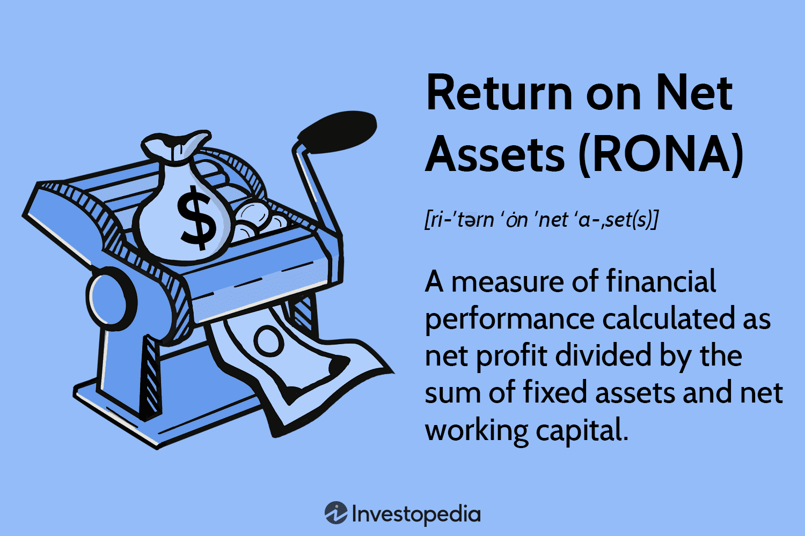

## Table of Contents

## What is Return on Net Assets (RONA)?

Return on Net Assets (RONA) is a financial metric that shows how well a company uses its assets to make money. It tells you the profit a company makes for every dollar of assets it owns, after taking away any debts or liabilities. To calculate RONA, you divide the company's net income by its net assets. Net assets are what's left when you subtract all the company's liabilities from its total assets.

RONA is useful for comparing how efficient different companies are at using their assets. If a company has a high RONA, it means it's good at turning its assets into profit. This can be important for investors who want to know if a company is a good investment. On the other hand, a low RONA might mean the company isn't using its assets effectively, which could be a warning sign for investors.

## How is RONA calculated?

Return on Net Assets (RONA) is calculated by dividing a company's net income by its net assets. Net income is the money a company makes after paying all its expenses. Net assets are found by taking the total assets of a company and subtracting its total liabilities. This gives you the value of what the company really owns after paying off what it owes.

To find RONA, you just need these two numbers. First, look at the company's income statement to find the net income. Then, go to the balance sheet to find the total assets and total liabilities. Subtract the liabilities from the assets to get the net assets. Finally, divide the net income by the net assets. The result is RONA, which shows how well the company is using its assets to make money.

## Why is RONA important for businesses?

RONA is important for businesses because it helps them see how well they are using their assets to make money. It tells a business if it is doing a good job at turning what it owns into profit. If a business has a high RONA, it means it is using its assets efficiently. This can make the business more attractive to investors because it shows that the company is good at making money from what it has.

On the other hand, if a business has a low RONA, it might mean that it is not using its assets well. This can be a warning sign for the business and its investors. It might need to find ways to use its assets better or get rid of assets that are not helping to make money. By keeping an eye on RONA, a business can make better decisions about how to manage its assets and improve its overall performance.

## What is considered a good RONA percentage?

A good RONA percentage can change depending on the industry. In some industries, like tech or finance, a RONA of 20% or more might be seen as good. But in other industries, like retail or manufacturing, a RONA of 10% could be considered good. It's important to compare a company's RONA with others in the same industry to know if it's doing well.

A company's goal should be to have a RONA that is higher than its cost of capital. The cost of capital is the rate of return a company needs to make to satisfy its investors. If RONA is higher than the cost of capital, it means the company is creating value for its investors. If it's lower, the company might need to find ways to use its assets better to make more money.

## How does RONA differ from Return on Assets (ROA)?

RONA and ROA both look at how well a company uses its assets to make money, but they use different numbers to do this. RONA stands for Return on Net Assets, and it uses net assets in its calculation. Net assets are what you get when you take away all the company's debts from its total assets. So, RONA shows how well a company makes money from the assets it really owns after paying off what it owes. On the other hand, ROA stands for Return on Assets, and it uses total assets in its calculation. Total assets are all the things a company owns, even if it has debts.

The main difference between RONA and ROA is in the asset part of the calculation. RONA gives a clearer picture of how a company is doing because it looks at the assets left after paying debts. This can be more useful for investors who want to know if a company is good at making money from what it really owns. ROA, on the other hand, might be simpler to calculate because it uses total assets, but it doesn't show how debts affect the company's ability to make money. Both metrics are helpful, but they give different views on how well a company is using its assets.

## Can RONA be used to compare companies in different industries?

RONA can be used to compare companies, but it's tricky when the companies are in different industries. Each industry has its own way of making money and using assets. For example, a tech company might have a high RONA because it doesn't need a lot of big, expensive things to make money. But a factory that makes cars might have a lower RONA because it needs a lot of machines and buildings to do its work. So, if you use RONA to compare companies in different industries, you might not get a fair picture of how well they're doing.

It's better to use RONA to compare companies that are in the same industry. This way, you can see which company is better at turning its assets into profit compared to others that do the same kind of work. For example, you could compare two car factories to see which one is using its machines and buildings more efficiently. But if you want to compare a car factory to a tech company, RONA might not be the best tool because their businesses are so different.

## What are the limitations of using RONA as a performance metric?

RONA is a useful tool for looking at how well a company uses its assets, but it has some limitations. One big problem is that RONA can be hard to compare across different industries. Each industry works differently, so what's a good RONA in one industry might not be good in another. For example, a tech company might have a high RONA because it doesn't need a lot of big, expensive things to make money, but a factory might have a lower RONA because it needs a lot of machines and buildings. So, if you use RONA to compare companies in different industries, you might not get a fair picture of how well they're doing.

Another limitation of RONA is that it doesn't show the whole story of a company's performance. RONA only looks at net income and net assets, but there are other important things to consider, like how fast the company is growing, how much risk it's taking, or how happy its customers are. Also, RONA can be affected by how a company chooses to value its assets and how it manages its debts. If a company changes how it values its assets or pays off its debts, its RONA can go up or down, even if its real performance hasn't changed. So, while RONA can give you a good idea of how well a company is using its assets, it's important to look at other things too to get a full picture of how the company is doing.

## How can a company improve its RONA?

A company can improve its RONA by making more money or by using its assets better. One way to make more money is to find new ways to sell more products or services. This could mean trying new marketing ideas or selling to new customers. Another way is to cut costs. If a company can spend less on things like materials or workers, it can keep more of the money it makes. This will make its net income go up, which can help improve RONA.

Using assets better is also important. A company can do this by getting rid of assets it doesn't need. If a company has machines or buildings it's not using, selling them can help lower the net assets and make RONA go up. Another way is to use the assets it has more efficiently. For example, if a factory can make more products with the same machines, it can make more money without needing more assets. By focusing on making more money and using assets wisely, a company can improve its RONA and show that it's good at turning what it owns into profit.

## What impact do depreciation methods have on RONA?

Depreciation methods can change how a company's RONA looks. Depreciation is how a company figures out how much its assets, like machines or buildings, lose value over time. Different ways of figuring out depreciation can make the net assets on the balance sheet look bigger or smaller. For example, if a company uses a method that makes depreciation go faster, like the double-declining balance method, the value of its assets will go down faster. This makes net assets smaller, which can make RONA go up because the company is dividing its net income by a smaller number.

On the other hand, if a company uses a method that makes depreciation go slower, like the straight-line method, the value of its assets will go down more slowly. This keeps net assets bigger, which can make RONA go down because the company is dividing its net income by a bigger number. So, the way a company chooses to figure out depreciation can change its RONA, even if its real performance hasn't changed. It's important for people looking at RONA to understand the depreciation methods a company uses so they can see the real picture of how well the company is doing.

## How does RONA relate to a company's cost of capital?

RONA and a company's cost of capital are closely linked because they both help show if a company is doing a good job with its money. RONA tells you how much profit a company makes for every dollar of assets it really owns, after paying off its debts. The cost of capital is the rate of return a company needs to make to keep its investors happy. If a company's RONA is higher than its cost of capital, it means the company is making more money from its assets than it needs to pay its investors. This is good because it shows the company is creating value.

On the other hand, if a company's RONA is lower than its cost of capital, it's not making enough money from its assets to satisfy its investors. This can be a problem because it means the company is not using its money well. To fix this, the company might need to find ways to make more money or use its assets better. By comparing RONA to the cost of capital, investors and managers can see if the company is doing a good job and make smart decisions about how to improve.

## What are some advanced strategies for optimizing RONA?

One advanced strategy for optimizing RONA is to focus on asset-light business models. This means a company tries to make money without owning a lot of big, expensive things. For example, a company could use outsourcing to let other businesses handle things like making products or delivering them. This way, the company doesn't have to buy and keep a lot of machines or trucks, which can lower its net assets. By keeping net assets low and still making money, RONA can go up. Another way is to use technology to make things run more smoothly. For example, using software to keep track of inventory can help a company use its space and machines better, which can help make more money without needing more assets.

Another strategy is to look at how the company makes money and see if there are better ways to do it. This could mean changing the products or services the company offers to ones that make more money or cost less to make. For example, a company might decide to focus on selling high-profit items instead of low-profit ones. This can help increase net income. The company could also use data and analytics to find out which parts of the business are doing well and which ones need to improve. By focusing on the parts that make the most money and fixing the parts that don't, the company can make more money from its assets. This can help improve RONA by making net income go up while keeping net assets the same or even lowering them.

## How can RONA be integrated into a broader financial analysis framework?

RONA can be a useful part of a bigger financial analysis framework because it shows how well a company uses its assets to make money. But it's important to use RONA along with other financial measures to get a full picture of a company's health. For example, looking at the company's Return on Equity (ROE) can help you see how well it's using the money that shareholders have put into the business. Also, looking at the company's debt levels and cash flow can give you more information about how safe the company's finances are. By putting RONA together with these other measures, you can see not just how well the company is using its assets, but also how it's doing in other important areas.

Another way to use RONA in a broader financial analysis is to compare it with the company's cost of capital. This helps you see if the company is making enough money from its assets to keep its investors happy. If RONA is higher than the cost of capital, it's a good sign that the company is doing well. But if it's lower, the company might need to find ways to improve. Also, looking at industry benchmarks and trends can help you understand how the company is doing compared to others in the same field. By using RONA as part of a bigger picture, you can make better decisions about the company's future and how to help it grow.

## What is Return on Net Assets (RONA) and how is it understood?

Return on Net Assets (RONA) is a critical metric used to evaluate a company's financial performance by assessing its ability to generate profit from its net assets. The metric provides insight into how efficiently a company utilizes its assets, especially in comparison to its peers in asset-intensive industries. 

The RONA formula is expressed as:

$$
\text{RONA} = \frac{\text{Net Profit}}{\text{Fixed Assets} + \text{Net Working Capital}}
$$

where:
- **Net Profit** is the profit remaining after all expenses, including operating costs, interest, taxes, and preferred stock dividends, have been subtracted from total revenue. This figure is often found on the company's income statement.

- **Fixed Assets** are long-term tangible assets that a company uses to produce its goods and services. These include property, plant, and equipment, and are listed on the balance sheet.

- **Net Working Capital** is the difference between current assets and current liabilities. It represents the short-term liquidity of a company and is calculated as:

  \[ \text{Net Working Capital} = \text{Current Assets} - \text{Current Liabilities}
$$

A higher RONA value indicates more efficient asset utilization, which is particularly significant in capital-intensive sectors like manufacturing, telecommunications, or utilities. In these industries, substantial investments in physical assets are necessary to maintain operations. Therefore, RONA provides crucial insights into how well these assets are contributing to the profitability of the company. 

By focusing on RONA, businesses can identify areas where they might enhance asset management strategies to improve operational efficiency and profitability. Companies with consistently high RONA values may be viewed more favorably by investors and analysts because these firms are seen as capable of generating superior returns from their asset base.

## How do you calculate RONA?

To calculate Return on Net Assets (RONA), the primary components required are net profit, fixed assets, and net working capital. Each of these metrics plays a critical role in determining a company's efficiency in utilizing its assets to generate profit.

**Net Profit**: This is derived from the income statement and represents the company's total earnings after accounting for all expenses, taxes, and costs. It is the bottom line that indicates the company's financial health.

**Fixed Assets**: These are long-term tangible assets crucial for a company's operations and are recorded on the balance sheet. Fixed assets typically include property, plant, machinery, and equipment, and are used to gauge a company's investment in essential resources that support its business activities.

**Net Working Capital**: This figure is calculated as the difference between current assets and current liabilities. Current assets include cash, inventory, receivables, and other items expected to be converted into cash within a year, while current liabilities are obligations the company expects to settle within the same period.

### Calculation Formula:
The formula to compute RONA is succinctly expressed as:

$$
\text{RONA} = \frac{\text{Net Profit}}{\text{Fixed Assets} + \text{Net Working Capital}}
$$

This calculation showcases how effectively a company is leveraging its net assets, which comprise fixed assets and the net working capital required for daily operations, to produce earnings.

To automate the computation in Python, the following code snippet can be used:

```python
def calculate_rona(net_profit, fixed_assets, current_assets, current_liabilities):
    net_working_capital = current_assets - current_liabilities
    rona = net_profit / (fixed_assets + net_working_capital)
    return rona

# Example usage
net_profit = 500000  # Example net profit value
fixed_assets = 2000000  # Example fixed assets value
current_assets = 1000000  # Example current assets value
current_liabilities = 300000  # Example current liabilities value

rona_value = calculate_rona(net_profit, fixed_assets, current_assets, current_liabilities)
print(f"The RONA value is: {rona_value:.2f}")
```

This function takes in the net profit, fixed assets, current assets, and current liabilities as inputs to compute the RONA. The result, represented as a ratio, indicates the company's effectiveness in generating returns from its asset base. A higher RONA value typically suggests better asset utilization efficiency.

## What is the importance of RONA in business?

Return on Net Assets (RONA) is a critical metric utilized by businesses to evaluate operational efficiency and financial performance. It provides insight into how effectively a company leverages its asset base to generate profits. The essence of RONA lies in its ability to assess the efficacy of asset utilization, essential for companies aiming to optimize their financial health.

Mathematically, RONA is expressed as:

$$
\text{RONA} = \frac{\text{Net Profit}}{\text{Fixed Assets} + \text{Net Working Capital}}
$$

This formula underscores the relationship between a company's net profits and its net assets, comprising both fixed assets and net working capital. By assessing RONA, businesses can ascertain the return achieved from the assets deployed, which is a direct reflection of managerial competence and strategic resource utilization.

High RONA values serve as a magnet for investors, reflecting superior resource efficiency and potentially higher returns on investment. This metric acts as a signal of financial prudence, showcasing a firm's capability to maximize profits from its assets. Investors inclined toward companies demonstrating operational excellence often consider RONA as a benchmark for investment decisions.

Furthermore, RONA plays a pivotal role in facilitating performance comparisons across firms, particularly in asset-intensive sectors such as manufacturing, telecommunications, and utilities. In industries where significant capital is tied up in fixed assets and infrastructure, RONA underscores the firm's ability to convert these substantial investments into profitable ventures. By examining RONA, stakeholders can gauge which companies in a sector are optimizing their asset usage, leading to more judicious capital allocation and strategic planning.

In conclusion, the importance of RONA in business lies in its comprehensive assessment of a company's asset management prowess. It stands as a testament to managerial efficiency and is a critical parameter for comparative performance assessment among industry peers. Through a strategic focus on RONA, businesses can enhance investor confidence and drive long-term growth.

## References & Further Reading

[1]: ["Efficiently Inefficient: How Smart Money Invests & Market Prices are Determined"](https://www.amazon.com/Efficiently-Inefficient-Invests-Market-Determined/dp/0691166196) by Lasse Heje Pedersen.

[2]: Gabbai, A., De Bondt, W., & Forbes, W. (2012). ["International evidence on the value relevance of return on net operating assets versus earnings: A re-examination and extension."](https://www.sciencedirect.com/science/article/pii/S1062976905000372) Advances in Accounting.

[3]: ["Financial Statement Analysis and Security Valuation"](https://www.amazon.com/Financial-Statement-Analysis-Security-Valuation/dp/0073379662) by Stephen H. Penman.

[4]: Choudhry, M. (2019). ["An Introduction to Bond Markets"](https://onlinelibrary.wiley.com/doi/book/10.1002/9781118371961). John Wiley & Sons.

[5]: Hull, J. C. (2018). ["Options, Futures, and Other Derivatives"](https://www.semanticscholar.org/paper/Options%2C-Futures%2C-and-Other-Derivatives-Hull/89bdee500c8623864fc9eb7a471546aa713acc44). Pearson.