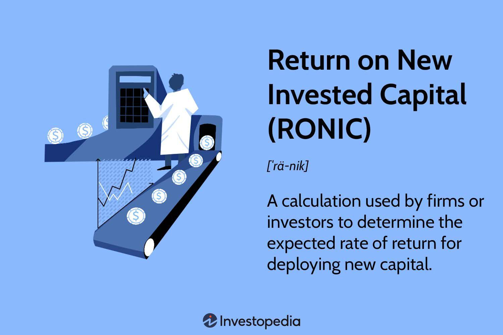

## Table of Contents

## What is Return on New Invested Capital (RONIC)?

Return on New Invested Capital (RONIC) is a financial metric that helps businesses understand how well they are using their new investments to generate profits. It measures the return that a company earns on the capital it has recently invested in its operations. This is important because it shows whether the money being put into new projects or expansions is being used effectively to increase the company's earnings.

RONIC is calculated by taking the additional operating profit generated from new investments and dividing it by the amount of new capital invested. For example, if a company invests in a new factory and the factory generates extra profit, RONIC helps to see if that investment was worth it. A high RONIC means the new investments are doing well and adding value to the company, while a low RONIC might suggest that the company should rethink its investment strategy.

## How is RONIC calculated?

RONIC is calculated by dividing the extra profit made from new investments by the amount of money put into those investments. For example, if a company spends $1 million on a new project and that project makes an extra $100,000 in profit, the RONIC would be 10%. This is found by taking the $100,000 extra profit and dividing it by the $1 million invested.

It's important to use the right numbers when figuring out RONIC. The extra profit should only include the money made from the new investments, not the company's total profit. The amount of money invested should also be the total new capital put into the project, not the company's overall capital. This way, RONIC shows how well the new money is being used to make more profit.

## Why is RONIC important for investors?

RONIC is important for investors because it shows how well a company is using new money to make more profit. When a company spends money on new projects, like building a new store or buying new machines, investors want to know if that money is being used wisely. RONIC helps answer that question by showing the return on those new investments. If RONIC is high, it means the company is good at turning new money into more profit, which is a good sign for investors.

Investors can use RONIC to compare different companies and see which ones are better at using new investments to grow. For example, if one company has a RONIC of 15% and another has a RONIC of 5%, the first company is doing a better job with its new investments. This can help investors decide where to put their money. A company with a high RONIC might be a better choice because it shows they are good at growing and making money from new projects.

## How does RONIC differ from Return on Invested Capital (ROIC)?

RONIC and ROIC are both ways to measure how well a company uses money to make profits, but they look at different things. RONIC focuses on the return from new investments, like money spent on new projects or equipment. It helps see if the new money put into the company is being used well to make more profit. ROIC, on the other hand, looks at the return on all the money invested in the company, not just the new stuff. It gives a broader picture of how well the company is doing with all its investments, old and new.

The main difference is that RONIC is more specific to recent investments, which can be really helpful for understanding how a company is growing right now. If a company is spending a lot on new things, RONIC can show if that money is being used well. ROIC, however, gives a more general view of the company's overall health and efficiency with all its capital. Both are useful, but RONIC is better for looking at new growth, while ROIC is better for understanding the overall performance.

## What are the key components needed to compute RONIC?

To compute RONIC, you need to know two main things: the extra profit from new investments and the amount of new money invested. The extra profit is the money made from the new projects or equipment that the company has put money into recently. This is different from the company's total profit because it only includes what comes from the new stuff. The amount of new money invested is the total cost of those new projects or equipment. This is not the same as the company's total capital, just what was spent on the new things.

Using these two pieces of information, you can find RONIC by dividing the extra profit by the new money invested. For example, if a company spends $1 million on a new factory and that factory makes an extra $100,000 in profit, the RONIC would be 10%. This calculation helps show how well the company is using its new investments to make more money. A high RONIC means the new investments are doing well, while a low RONIC might mean the company needs to think about how it's spending its new money.

## Can you provide an example of RONIC calculation for a real company?

Let's say we have a company called "TechGrow" that decides to invest in a new software development project. They spend $5 million on this project, which includes hiring new developers and buying new computers. After a year, the new software starts making money, and TechGrow earns an extra $750,000 in profit from it. To find out the RONIC, we divide the extra profit by the amount invested. So, $750,000 divided by $5 million gives us a RONIC of 15%. This means that for every dollar TechGrow put into the new software, they got back 15 cents in extra profit.

This 15% RONIC tells us that TechGrow is doing a good job with its new investment. It shows that the money spent on the new software project is being used well to make more money. If TechGrow's investors see this high RONIC, they might feel good about the company's growth and think about putting more money into it. A high RONIC like this can make the company look attractive to people who want to invest in businesses that are good at turning new investments into profits.

## What are the common pitfalls when using RONIC for analysis?

One common pitfall when using RONIC for analysis is mixing up the new profits with the overall company profits. RONIC only looks at the extra money made from new investments, not the total profit. If someone uses the wrong numbers, they might think the new projects are doing better or worse than they really are. This can lead to bad decisions about where to put more money or which projects to stop.

Another pitfall is not considering the time it takes for new investments to start making money. Sometimes, new projects take a while to get going and make a profit. If RONIC is calculated too early, it might look low, even if the project will be good in the long run. It's important to give new investments enough time to show their true value before deciding if they are worth it.

## How can RONIC be used to compare companies within the same industry?

RONIC can be a useful tool for comparing how well companies in the same industry are doing with their new investments. If you look at the RONIC of different companies, you can see which ones are getting more profit from the money they spend on new projects. For example, if one company has a RONIC of 12% and another has a RONIC of 8%, the first company is doing a better job at turning its new investments into extra profit. This can help investors decide which company might be a better choice to put their money into, because a higher RONIC suggests the company is good at growing and making money from new projects.

However, when using RONIC to compare companies, it's important to make sure you're looking at similar kinds of new investments. If one company is investing in something that takes a long time to start making money, like building a new factory, and another company is investing in something that makes money faster, like a new software tool, their RONIC might look different even if both investments are good. So, it's helpful to consider the type of investment and how long it takes to start making money when comparing RONIC between companies.

## What are the limitations of RONIC as a performance metric?

RONIC has some limitations that can make it tricky to use as a performance metric. One big problem is that it only looks at the money made from new investments, not the whole company's profit. This means RONIC might not give a full picture of how well a company is doing overall. If a company's old investments are doing really well but the new ones are not, RONIC might make the company look worse than it really is. Also, RONIC can be hard to compare between companies if they are investing in different kinds of projects. A new factory might take longer to start making money than a new software tool, so their RONIC numbers might look different even if both investments are good.

Another limitation of RONIC is that it doesn't show the risks involved with new investments. Some projects might have a high RONIC but also be very risky. If something goes wrong, the company could lose a lot of money. RONIC doesn't tell you about these risks, so it's important to look at other things too. Also, RONIC can be affected by how a company decides to account for its costs. If a company spreads out the cost of a new investment over many years, the RONIC might look higher in the early years but lower later on. This can make it hard to know if the high RONIC is really because the investment is doing well or just because of how the costs are being counted.

## How does RONIC influence a company's investment decisions?

RONIC helps a company decide where to spend its money on new projects. If a company sees that its RONIC is high, it means the new money they're putting into things like new factories or technology is making good profit. This can make the company feel confident about spending more money on similar kinds of projects. They might think, "Hey, this new stuff is working well, let's do more of it!" On the other hand, if RONIC is low, it tells the company that their new investments are not making as much money as they hoped. This might make them think twice before spending more money on new projects, or it might make them look for different kinds of investments that could do better.

RONIC also helps a company compare different investment options. Let's say a company is trying to decide between building a new store or starting a new product line. By looking at the RONIC for each option, they can see which one might make more money. If the new store has a higher RONIC, it might be the better choice. But it's not just about the numbers. The company also needs to think about other things like how long it will take to start making money and how risky the investment is. RONIC is a good starting point, but it's one part of a bigger picture when making investment decisions.

## What advanced techniques can be used to refine RONIC calculations?

One advanced technique to refine RONIC calculations is to use a more detailed way of figuring out the extra profit from new investments. Instead of just looking at the profit in one year, you can look at the profit over several years. This can give a better idea of how well the new money is doing, especially if the project takes a while to start making money. Another way is to think about the cost of money, or the [interest rate](/wiki/interest-rate-trading-strategies) the company pays to borrow money. If you subtract this cost from the profit, you get a clearer picture of how much the new investment is really making.

Another technique is to use something called "risk-adjusted RONIC." This means you think about how risky the new investment is. If a project is very risky, you might want to see a higher RONIC to feel good about it. By adjusting the RONIC to account for risk, you can compare different projects more fairly. Also, you can use a method called "discounted cash flow" to find the present value of future profits from the new investment. This helps you see what the money made in the future is worth today, which can make your RONIC calculation more accurate and useful for making decisions.

## How can RONIC be integrated into a broader financial analysis framework?

RONIC can be a key part of a bigger financial analysis framework by helping to understand how well a company is using its new money to make more profit. When looking at a company's overall health, it's important to see if the money they're putting into new projects is doing well. RONIC gives you that information. By using RONIC along with other metrics like Return on Invested Capital (ROIC) and Return on Equity (ROE), you get a fuller picture of how the company is doing. ROIC tells you about all the money invested, not just the new stuff, and ROE shows how well the company is using the money from its owners. Together, these metrics help you see if the company is good at growing and making money from both old and new investments.

In a broader financial analysis, RONIC can also be used to compare a company's new investments to industry standards or to see how they're doing over time. For example, if a company's RONIC is higher than the industry average, it might mean they're doing a better job with their new money than other companies. Or, if you look at RONIC over several years, you can see if the company is getting better or worse at using new investments to make profit. This can help you decide if the company is a good place to invest your money. By putting RONIC into a bigger picture with other financial metrics and industry data, you get a more complete understanding of how well a company is doing and where it might be headed.

## What is Return on New Invested Capital (RONIC)?

Return on New Invested Capital (RONIC) is a key financial metric that quantifies the efficiency and effectiveness of deploying new capital in generating returns. This metric is pivotal for investors and companies as it aids in assessing potential investments and capital allocation strategies. Essentially, RONIC measures how well a company can generate profits from its new investments, providing an indication of future growth prospects and financial health.

A high RONIC value suggests that a company is effectively utilizing its newly invested capital to generate substantial returns. This implies that the investment is likely yielding benefits that exceed its costs, indicating strong capital management practices and potentially higher shareholder value. Conversely, a lower RONIC may signal inefficient resource utilization and may prompt a review of investment strategies to optimize returns.

The RONIC calculation involves the analysis of two critical components: the increase in earnings before interest between two periods and the net new investments made during the latter period. Mathematically, RONIC can be expressed as:

$$
\text{RONIC} = \frac{\Delta \text{EBIT}_{t+1}}{\text{Net New Investments}_t}
$$

Where:
- $\Delta \text{EBIT}_{t+1}$ represents the growth in earnings before interest for the next period, providing a clear signal of how well new investments are performing.
- $\text{Net New Investments}_t$ refers to the capital deployed in the current period.

This formula provides a transparent method for evaluating how new investments translate into additional earnings, crucial for informed decision-making and portfolio management. Its importance in investment analysis is underscored by its ability to illuminate the returns on incremental investments, offering a forward-looking perspective on the deployment of newly raised or redirected capital.

Understanding RONIC helps investors identify opportunities where capital can be allocated most effectively to maximize returns. It provides insight into whether a company can sustain its growth trajectory through efficient use of new resources. Moreover, by benchmarking RONIC against industry peers or historical performance, stakeholders can gain a comparative view of an entity's capital allocation success. Thus, RONIC is invaluable for optimizing investment portfolios and for strategic planning, ensuring resources are directed toward ventures that promise the most favorable financial outcomes.

## How does RONIC work?

Return on New Invested Capital (RONIC) is a pivotal metric in investment analysis, particularly when contrasted with the Weighted Average Cost of Capital (WACC). In the domain of investment evaluation, RONIC serves as a benchmark for determining whether new capital deployment is financially viable. If RONIC surpasses WACC, it indicates that the new investment is yielding returns above the average cost of capital, thus generating net positive value.

Mathematically, if RONIC > WACC, the investment is considered profitable, suggesting the allocation of new capital resources is efficient and potentially signalling an economic moat or competitive advantage. This disparity between RONIC and WACC can be expressed as:

$$
\text{Net Value Generation (NVG)} = \text{RONIC} - \text{WACC}
$$

A positive NVG suggests the investment is creating additional shareholder value by [earning](/wiki/earning-announcement) returns above its cost of capital.

Companies employ RONIC to evaluate potential capital projects. A high RONIC guides strategic decisions: it may prioritize investment in projects that are anticipated to generate substantial economic returns, bolstering the company's market position. Conversely, a RONIC not significantly exceeding the WACC may call for a re-evaluation of the investment decision, as the opportunity cost of capital could outweigh the projected returns.

Variability in RONIC values can influence investment strategies significantly. Firms with consistently high RONIC can attract investors seeking high-growth opportunities and may reinvest earnings efficiently to sustain their competitive advantage. In contrast, fluctuations in RONIC could reflect varying market conditions or changes in operational efficiency, prompting companies to either reassess growth projections or optimize cost structures.

In summary, RONIC serves as a crucial metric in assessing the profitability of new investments when compared to WACC. Its implications on strategic decision-making underscore the need for precise calculation and interpretation in managing capital investments effectively.

## How do you calculate RONIC?

Return on New Invested Capital (RONIC) is calculated to assess the efficiency of newly deployed capital. To compute RONIC, one must understand its components: growth in earnings before interest and taxes (EBIT) and net new investments. The formula for RONIC is:

$$

\text{RONIC} = \frac{\Delta \text{EBIT}}{\text{Net New Investment}} 
$$

In this calculation, $\Delta \text{EBIT}$ represents the change in EBIT between two consecutive periods, and net new investment refers to additional capital deployed during the same period.

### Case Example

Consider a company that has decided to expand its operations by investing in new machinery and facilities. In the previous year, the company's EBIT was $1 million. After the investment, which amounted to $500,000, the company's EBIT increased to $1.2 million. Using these figures, we can calculate the RONIC as follows:

1. Calculate $\Delta \text{EBIT}$:
$$
   \Delta \text{EBIT} = \text{EBIT}_{\text{current}} - \text{EBIT}_{\text{previous}} = \$1.2\, \text{million} - \$1\, \text{million} = \$0.2\, \text{million}

$$

2. Identify the Net New Investment: $500,000

3. Compute RONIC:
$$
   \text{RONIC} = \frac{\$0.2\, \text{million}}{\$0.5\, \text{million}} = 0.4 \text{ or } 40\%

$$

This RONIC of 40% indicates that for every dollar of new investment, the company generates an additional 40 cents in EBIT, highlighting efficient capital utilization.

### Python Example

For those utilizing computational methods to determine RONIC, Python offers a flexible approach to automate this calculation. Below is a simple Python function to compute RONIC:

```python
def calculate_ronic(previous_ebit, current_ebit, new_investment):
    delta_ebit = current_ebit - previous_ebit
    ronic = delta_ebit / new_investment
    return ronic * 100  # expressed as a percentage

# Example usage:
previous_ebit = 1_000_000
current_ebit = 1_200_000
new_investment = 500_000

ronic = calculate_ronic(previous_ebit, current_ebit, new_investment)
print(f"RONIC: {ronic}%")
```

In this example, the function `calculate_ronic` accurately determines the RONIC based on the input values for previous and current EBIT, and the additional capital investment. Understanding this calculation is essential for applying RONIC effectively, as it offers strategic insights into the return profile of new investments. 

Employing RONIC in investment analysis enables investors to make informed decisions about capital allocation and growth opportunities, ultimately enhancing investment outcomes. Furthermore, while this example provides a straightforward method to assess RONIC, real-world applications may require adjusting for inflation, currency fluctuations, and other economic factors to ensure accurate insights.

## What are the key differences between RONIC and ROIC?

Return on New Invested Capital (RONIC) and Return on Invested Capital (ROIC) are both pivotal metrics in assessing investment performance, yet they cater to distinct aspects. 

ROIC measures the efficiency and profitability of a company's existing capital investments. It determines how effectively a company utilizes its available capital to generate earnings. The ROIC formula typically involves comparing the net operating profit after tax (NOPAT) to the invested capital. Mathematically, ROIC can be expressed as:

$$
\text{ROIC} = \frac{\text{NOPAT}}{\text{Invested Capital}}
$$

This provides insights into how well the company is using its competencies and resources to generate returns.

Conversely, RONIC assesses the expected return from new capital investments. It evaluates how additional, newly allocated capital contributes to earnings growth. The RONIC formula involves determining the increase in earnings before interest and taxes (EBIT) over a certain period, divided by the net new capital investments made in that period. Although often less cited in literature than ROIC, RONIC can be mathematically outlined as follows:

$$
\text{RONIC} = \frac{\Delta \text{EBIT}}{\text{Net New Invested Capital}}
$$

This metric is crucial in decision-making processes regarding future investments and expansion, focusing on incremental gains rather than existing asset performance.

The primary distinction between ROIC and RONIC lies in their focus. ROIC is historically oriented, evaluating past capital utilization efficiency. In contrast, RONIC is forward-looking, providing insights into the potential returns from the company’s strategic growth initiatives and new capital engagements.

In investment analysis, these metrics can be leveraged together to gain a comprehensive understanding of both past performance and prospective capital allocation effectiveness. ROIC provides a baseline of existing operational proficiency and capital deployment, while RONIC highlights potential future growth avenues and the value created through new investment strategies. By using both metrics, investors can form a holistic view of the financial health and strategic foresight of a company, thereby facilitating well-rounded investment decisions.

## What are the challenges and limitations of RONIC?

Return on New Invested Capital (RONIC) is a valuable metric for assessing the potential performance of new capital investments. However, despite its advantages, the practical application of RONIC is fraught with certain challenges and limitations. A primary challenge involves data availability and the accuracy of financial information required to compute RONIC effectively. Reliable data on earnings growth and new investment figures are essential, yet obtaining such detailed financial data can often be difficult, especially for companies with complex financial structures or those operating in highly volatile markets. This limitation can lead to inaccurate RONIC calculations and potentially misguided investment decisions.

Moreover, the complexity of computation is another significant hurdle. Calculating RONIC requires a clear understanding of specific financial metrics and their interplay. The formula for RONIC is:

$$
\text{RONIC} = \frac{\Delta \text{EBIT}}{\text{Net New Investments}}
$$

where $\Delta \text{EBIT}$ is the change in earnings before interest and taxes across periods, and "Net New Investments" represents the additional capital invested during the latter period. Companies must ensure precise calculations to avoid discrepancies that could affect strategic decisions.

Another limitation is the inadequacy of RONIC as a standalone measure, as it may not reflect the nuances of broader market conditions and business cycles. The metric predominantly focuses on near-term capital efficiency and may overlook long-term strategic factors or cyclical market fluctuations that impact investment outcomes. To mitigate this, RONIC should be used in conjunction with other financial metrics and qualitative assessments of economic conditions.

Incorporating a multi-faceted analytical approach can help address these limitations. Investors might use additional performance indicators, such as Internal Rate of Return (IRR) or Net Present Value (NPV), to gain a more comprehensive understanding of investment viability. Additionally, employing advanced statistical models and financial software can ease the computational burden and improve accuracy, rendering the RONIC analysis more robust and reliable.

Ultimately, while RONIC is a valuable tool for evaluating new investments, a holistic strategy that integrates diverse financial metrics and market insights will be more effective in optimizing investment strategies and achieving sustainable growth.

## References & Further Reading

[1]: ["Return on Invested Capital (ROIC): What It Is & How to Calculate It"](https://www.investopedia.com/terms/r/returnoninvestmentcapital.asp) - Investopedia

[2]: Fama, E. F., & French, K. R. (1998). ["Value Versus Growth: The International Evidence."](https://www.jstor.org/stable/117458) The Journal of Finance, 53(6), 1975-1999.

[3]: ["Corporate Finance: Theory and Practice"](https://onlinelibrary.wiley.com/doi/book/10.1002/9781119208372) by Aswath Damodaran

[4]: ["Algorithmic Trading: Winning Strategies and Their Rationale"](https://onlinelibrary.wiley.com/doi/pdf/10.1002/9781118676998.fmatter) by Ernest P. Chan

[5]: ["Principles of Corporate Finance"](https://www.mheducation.com/highered/product/Principles-of-Corporate-Finance-Brealey.html) by Richard A. Brealey, Stewart C. Myers, and Franklin Allen