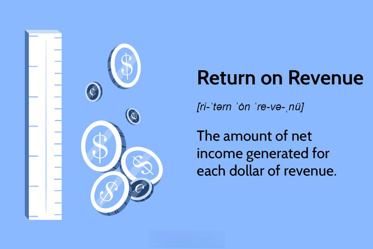

## Table of Contents

## What is Return on Revenue (ROR)?

Return on Revenue (ROR) is a financial measure that shows how much profit a company makes for every dollar of revenue it earns. It is calculated by dividing the company's net income by its total revenue. This gives business owners and investors an idea of how efficiently a company is turning its sales into profits.

ROR is useful because it helps compare the profitability of different companies, even if they are in different industries or have different sizes. A higher ROR means the company is doing a good job at keeping costs low and making more profit from its sales. However, it's important to look at other financial measures too, because ROR alone doesn't tell the whole story about a company's financial health.

## How is Return on Revenue different from Return on Investment (ROI)?

Return on Revenue (ROR) and Return on Investment (ROI) are both ways to measure how well a company is doing, but they look at different things. ROR tells you how much profit a company makes from every dollar of revenue it earns. It's calculated by dividing the company's net income by its total revenue. This helps you see how good a company is at turning its sales into profit.

On the other hand, ROI looks at the profit made on an investment compared to the cost of that investment. It's calculated by taking the gain from the investment and dividing it by the cost of the investment. ROI is useful for figuring out if putting money into something was a good idea. It can be used for all sorts of investments, not just business profits.

So, while ROR focuses on how efficiently a company turns revenue into profit, ROI is more about measuring the success of specific investments. Both are important, but they give you different pieces of information about a company's financial health.

## What is the basic formula for calculating Return on Revenue?

The basic formula for calculating Return on Revenue (ROR) is simple. You take the company's net income and divide it by its total revenue. The result is a percentage that shows how much profit the company makes for every dollar of revenue it earns.

For example, if a company has a net income of $50,000 and total revenue of $500,000, you would divide $50,000 by $500,000. This gives you an ROR of 0.1 or 10%. This means the company makes 10 cents of profit for every dollar of revenue it brings in.

## Can you provide a simple example of how to calculate ROR?

Let's say a small bakery called "Sweet Treats" made $100,000 in revenue last year. After paying all their costs like ingredients, rent, and salaries, they had a net income of $20,000. To find out their Return on Revenue (ROR), we divide the net income by the total revenue. So, we take $20,000 and divide it by $100,000. This gives us an ROR of 0.2 or 20%.

This means that for every dollar Sweet Treats earned in revenue, they made 20 cents in profit. This is a helpful number because it shows how good the bakery is at turning its sales into profit. If another bakery has a lower ROR, Sweet Treats is doing a better job at making money from their sales.

## What are the key components needed to calculate ROR?

To calculate Return on Revenue (ROR), you need two main pieces of information: the company's net income and its total revenue. Net income is how much money the company has left after paying all its costs. This is the profit. Total revenue is the total amount of money the company made from selling its products or services.

Once you have these two numbers, you can find the ROR by dividing the net income by the total revenue. The result is a percentage that shows how much profit the company makes for every dollar of revenue. For example, if a company's net income is $50,000 and its total revenue is $250,000, the ROR would be 20%. This means the company makes 20 cents of profit for every dollar of revenue it earns.

## How can ROR be used to assess the profitability of a business?

ROR, or Return on Revenue, helps you see how well a business is doing by showing how much profit it makes from every dollar of sales. When you calculate ROR, you divide the business's net income by its total revenue. This gives you a percentage that tells you how good the business is at turning sales into profit. If a business has a high ROR, it means it's doing a great job at keeping costs low and making more money from what it sells.

You can use ROR to compare different businesses, even if they are in different industries or have different sizes. For example, if one company has an ROR of 15% and another has an ROR of 10%, the first company is better at turning its sales into profit. But remember, ROR is just one way to look at a business's health. It's important to look at other numbers too, like how much debt the company has or how fast it's growing, to get a full picture of how well the business is doing.

## What are the limitations of using ROR as a financial metric?

ROR, or Return on Revenue, can be a useful way to see how good a business is at turning sales into profit. But it has some limitations. For one thing, ROR doesn't tell you about the business's overall financial health. It only looks at profit compared to revenue, so it doesn't show you if the business has a lot of debt or if it's growing quickly. These things are important too, but ROR doesn't give you that information.

Another problem with ROR is that it can be different from one industry to another. What might be a good ROR in one industry might not be good in another. So, if you're comparing businesses in different industries, ROR might not be the best way to do it. Also, ROR can be affected by one-time events or changes in how the business does its accounting. These things can make ROR go up or down, even if the business's real performance hasn't changed much. So, while ROR can be helpful, it's important to use other financial measures too to get a full picture of how a business is doing.

## How does ROR vary across different industries?

ROR, or Return on Revenue, can be different in different industries because each industry has its own way of making money and its own costs. For example, a tech company might have a high ROR because it can sell software with very little cost to make more copies. But a grocery store might have a lower ROR because it has to buy a lot of products to sell, and those products can go bad if they don't sell quickly.

It's important to know these differences when you're looking at ROR. If you compare a tech company with a grocery store just by looking at their ROR, you might think the grocery store is doing badly. But really, it might be doing well for its industry. So, when you use ROR to compare businesses, it's best to look at companies in the same industry to get a fair idea of how they're doing.

## What are some advanced methods to enhance the accuracy of ROR calculations?

To make ROR calculations more accurate, you can look at the numbers over a longer time. Instead of just looking at one year, you can see how the ROR changes over several years. This helps you see if the ROR is going up or down and if it's because of something that happens every year or just something that happened once. Also, you can break down the ROR into smaller parts, like looking at different parts of the business or different products. This way, you can see which parts are doing well and which parts need to be better.

Another way to make ROR more accurate is to think about all the costs. Sometimes, businesses have costs that they don't see right away, like the cost of fixing machines or the cost of borrowing money. If you include these costs in your ROR calculation, you get a better idea of how much profit the business is really making. Also, you can compare your ROR with other businesses in the same industry. This helps you see if your ROR is good or if other businesses are doing better. By doing these things, you can make sure your ROR calculation is as accurate as possible.

## How can ROR be integrated into broader financial analysis and decision-making?

ROR, or Return on Revenue, can be a helpful part of a bigger financial analysis. When you look at a business's financial health, you need to think about many things, like how much debt the business has, how fast it's growing, and how much money it's making. ROR shows how good the business is at turning its sales into profit. By using ROR along with other financial measures, you get a fuller picture of how well the business is doing. For example, if a business has a high ROR but also a lot of debt, you might want to be careful before deciding it's doing well overall.

ROR can also help with making decisions. If you're thinking about putting money into a business, you can look at its ROR to see how good it is at making money from its sales. This can help you decide if it's a good investment. But you shouldn't just look at ROR alone. You should also think about other things, like how the business is doing compared to others in its industry and what its future plans are. By using ROR as part of a bigger financial analysis, you can make smarter choices about where to put your money.

## What are the common pitfalls to avoid when using ROR for financial analysis?

When using ROR for financial analysis, one common mistake is relying on it too much. ROR is just one number that shows how much profit a business makes from its sales. It doesn't tell you everything about a business's health. For example, a business might have a high ROR but also a lot of debt, which can be risky. So, it's important to look at other numbers too, like how much the business is growing and how much money it owes.

Another pitfall is not thinking about how ROR can be different in different industries. What might be a good ROR in one industry might not be good in another. If you compare businesses in different industries just by looking at their ROR, you might make the wrong decision. It's better to compare businesses in the same industry to get a fair idea of how they're doing. Also, ROR can be affected by one-time events or changes in accounting, so it's important to look at ROR over time to see the real trend.

## How can ROR be used in conjunction with other financial metrics for a comprehensive business analysis?

ROR, or Return on Revenue, is a useful number that shows how much profit a business makes from its sales. But to really understand how a business is doing, you need to look at other numbers too. One important number is the Return on Assets (ROA), which shows how good a business is at using its stuff to make money. Another number to look at is the Debt-to-Equity Ratio, which tells you how much money the business owes compared to what it owns. By looking at ROR along with these other numbers, you get a better idea of the business's overall health. For example, if a business has a high ROR but also a high Debt-to-Equity Ratio, it might be making good profits but also taking big risks.

Using ROR with other financial metrics can also help you make better decisions about where to put your money. If you're thinking about investing in a business, you can look at its ROR to see how good it is at turning sales into profit. But you should also look at the business's growth rate to see if it's getting bigger over time. And you should check the Gross Profit Margin to see how much money the business makes after paying for the things it sells. By putting all these numbers together, you can see if the business is a good investment or if it might be too risky. This way, you can make smarter choices about where to put your money and help the business grow in the right way.

## What are the key aspects of understanding financial metrics?

Financial metrics provide insights into a company’s operational efficiency and overall profitability. These metrics allow stakeholders to understand how well a company is performing, not just by looking at the revenues generated, but also by evaluating how those revenues translate into profits. One critical financial metric used in this evaluation is the return on revenue (ROR). ROR helps investors gauge the efficiency of sales operations and assess whether the company is turning its sales into substantial profits.

ROR is calculated as follows:

$$
ROR = \left( \frac{\text{Net Income}}{\text{Sales Revenue}} \right) \times 100
$$

This percentage indicates the profitability for every dollar of revenue earned, providing a straightforward way to compare companies within the same industry.

Companies use a variety of financial metrics alongside ROR to track their performance over time and evaluate their position relative to competitors. Common metrics include gross profit margin, operating margin, and net profit margin. Each offers unique insights—for instance, the gross profit margin reflects the efficiency of production processes, while the operating margin considers both production costs and operating expenses.

Tracking these metrics over time enables companies to spot trends, identify areas for improvement, and formulate strategic plans. For instance, a consistent increase in operating margin may suggest enhanced operational efficiency, whereas a declining trend could indicate rising operational costs that must be addressed. Moreover, benchmarking against industry competitors helps companies ascertain their competitive standing and make tactical adjustments to achieve or maintain market leadership.

A comprehensive understanding of these financial metrics is essential for sound strategic planning and investment decisions. By analyzing how effectively companies convert revenue into profit through metrics like ROR, investors can make more informed decisions about which companies offer the best investment potential. This holistic approach to financial analysis ensures that business strategies remain grounded in robust data, enhancing the likelihood of long-term success.

## What are the fundamentals and techniques of revenue calculation?

Revenue, commonly referred to as the top line, represents the total income generated by a company from its core business operations before any expenses are deducted. It is a crucial indicator of a company's financial performance and sustainability. The calculation of revenue can vary significantly based on industry-specific practices, but the foundation remains consistent across sectors.

To calculate net revenue, a company subtracts returns, allowances, and discounts from its gross revenue. The formula can be summarized as follows:

$$
\text{Net Revenue} = \text{Gross Revenue} - \text{Returns} - \text{Allowances} - \text{Discounts}
$$

Accurately measuring revenue is essential for a company’s financial assessment as it directly impacts profitability analysis and strategic planning. Misstated revenue figures can lead to incorrect conclusions about a company’s fiscal health and distort valuation metrics used by investors.

Different industries employ unique techniques for revenue calculation to account for sector-specific characteristics and challenges. For example, the retail industry often deals with a substantial [volume](/wiki/volume-trading-strategy) of returns and discounts, necessitating precise tracking and adjustment mechanisms to ensure accurate net revenue reporting. Conversely, subscription-based businesses recognize revenue progressively over time, aligning income with service delivery periods.

In software development, companies might recognize revenue either at the point of sale or over the lifespan of a service contract, depending on applicable accounting standards like IFRS 15 or ASC 606. These standards help in defining the method of recognizing revenue based on the transfer of control of goods or services to customers.

Advanced software tools and accounting systems aid in implementing these principles, ensuring compliance with relevant regulations and providing robust revenue tracking capabilities. For example, Python libraries like Pandas can be employed to automate and streamline revenue calculations, improving accuracy and efficiency.

This alignment and proper categorization of revenue contribute significantly to more accurate financial reporting, allowing businesses to monitor performance adequately and make informed strategic decisions. Recognizing these nuances is critical for stakeholders who rely on precise revenue data to gauge a company’s financial health.

## What is the Definition and Significance of Return on Revenue?

Return on Revenue (ROR) is a key financial metric that quantifies a company's profitability in relation to its total revenue. It effectively measures the efficiency with which a company's management converts its sales into net profit. The formula for calculating ROR is:

$$
\text{ROR} = \left( \frac{\text{Net Income}}{\text{Sales Revenue}} \right) \times 100
$$

Expressed as a percentage, ROR provides insight into a company's profit-generating capabilities. A higher ROR indicates that a company is efficiently converting revenue into profit, reflecting effective cost management and pricing strategies. Conversely, a lower ROR may suggest inefficiencies or higher operational costs.

Identifying and evaluating ROR is essential for comparing profitability among companies within the same industry. It enables investors and stakeholders to gauge which companies are managing their resources more effectively to generate profits. Analyzing ROR allows businesses to identify areas for improvement and to benchmark their performance against industry peers.

Understanding the significance of ROR is crucial for strategic planning, as it directly influences decisions on cost management, pricing strategies, and overall financial strategy. By continually monitoring ROR, companies can adjust their operations to enhance profitability and ensure sustainable growth.

## What are some example calculations and their real-world applications?

Analyzing the financial metrics of industry giants like Microsoft and Toyota reveals how diversifying revenue streams and strategic financial management are crucial for sustaining profitability and supporting growth.

### Microsoft: Multi-Channel Revenue Streams

Microsoft exemplifies a diversified revenue model leveraging various channels. The major segments contributing to Microsoft's revenue include Productivity and Business Processes, Intelligent Cloud, and More Personal Computing. The Intelligent Cloud segment, driven by Azure's success, showcases how cloud computing services can significantly boost a company's financials.

To calculate revenue for a segment like Intelligent Cloud, consider the formula:

$$
\text{Net Revenue} = \text{Gross Revenue} - (\text{Discounts} + \text{Returns} + \text{Allowances})
$$

Microsoft meticulously tracks these figures through meticulous accounting systems, allowing them to align their strategies with market demands.

Furthermore, calculating Return on Revenue (ROR) for Microsoft's Intelligent Cloud involves:

$$
\text{ROR} = \left( \frac{\text{Net Income from Intelligent Cloud}}{\text{Net Sales Revenue of Intelligent Cloud}} \right) \times 100
$$

This calculation helps Microsoft determine how effectively each dollar of revenue transforms into profit, supporting strategic investment decisions to prioritize Azure's continued expansion.

### Toyota: Strategic Revenue Classifications

Toyota operates in a different industry but similarly implements multi-channel approaches. Revenue is generated through vehicle sales, financial services, and additional services like spare parts and maintenance. Toyota's focus on hybrid and electric vehicles showcases a strategic shift toward sustainable models that tap into the evolving automotive market.

In the automotive industry, accurate revenue calculation is crucial due:

$$
\text{Revenue} = (\text{Unit Price} \times \text{Number of Units Sold}) - (\text{Incentives} + \text{Returns})
$$

Toyota's return on revenue is similarly calculated to assess how efficiently the company translates vehicle sales into net profit:

$$
\text{ROR} = \left( \frac{\text{Net Income from Automotive Sales}}{\text{Total Sales Revenue of Automotive}} \right) \times 100
$$

### Case Studies in Diverse Sectors

Various sectors employ these metrics for growth. For instance, in retail, companies like Amazon track multiple product categories and geographic sales to determine high-performing segments. In technology, firms analyze software subscriptions versus hardware sales to guide strategic resource allocation.

In conclusion, understanding how companies like Microsoft and Toyota calculate revenue and return on revenue offers insights into effective financial strategies across industries. Companies maintain competitiveness by leveraging these metrics, fostering growth and adapting to market dynamics.

## References & Further Reading

[1]: ["Advances in Financial Machine Learning"](https://www.amazon.com/Advances-Financial-Machine-Learning-Marcos/dp/1119482089) by Marcos Lopez de Prado

[2]: Bergstra, J., Bardenet, R., Bengio, Y., & Kégl, B. (2011). ["Algorithms for Hyper-Parameter Optimization."](https://dl.acm.org/doi/10.5555/2986459.2986743) Advances in Neural Information Processing Systems 24.

[3]: ["Machine Learning for Algorithmic Trading"](https://github.com/stefan-jansen/machine-learning-for-trading) by Stefan Jansen

[4]: ["Quantitative Trading: How to Build Your Own Algorithmic Trading Business"](https://www.amazon.com/Quantitative-Trading-Build-Algorithmic-Business/dp/1119800064) by Ernest P. Chan

[5]: ["Financial Statement Analysis and Security Valuation"](https://www.mheducation.com/highered/product/Financial-Statement-Analysis-and-Security-Valuation-Penman.html) by Stephen Penman

[6]: Bodie, Z., Kane, A., & Marcus, A. J. (2014). ["Investments"](https://books.google.com/books/about/EBOOK_Investments_Global_edition.html?id=BMsvEAAAQBAJ) (10th ed.). McGraw-Hill Education.