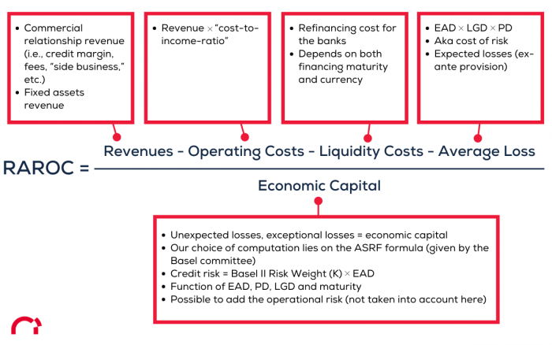

## Table of Contents

## What is Return on Risk-Adjusted Capital (RORAC)?

Return on Risk-Adjusted Capital (RORAC) is a financial measure that helps banks and other financial institutions figure out how much profit they are making compared to the risks they are taking. It looks at the profit or return from a certain activity or investment and divides it by the amount of capital that is at risk. This way, RORAC shows if the money being made is worth the risks involved.

Using RORAC, a bank can decide if it should start a new project or invest in something new. If the RORAC is high, it means the project or investment might be a good idea because the return is high compared to the risk. If the RORAC is low, the bank might decide not to go ahead with it, because the return might not be worth the risk. This helps banks make smarter choices about where to put their money.

## Why is RORAC important in financial analysis?

RORAC is important in financial analysis because it helps banks and financial institutions understand if the money they are making from their activities is worth the risks they are taking. By looking at RORAC, banks can see which projects or investments are giving them good returns compared to the risks involved. This is crucial because it helps them decide where to put their money to get the best results without taking too much risk.

Using RORAC, banks can also compare different projects or investments to see which ones are the best choices. If one project has a high RORAC and another has a low one, the bank will know to focus on the one with the high RORAC. This helps banks use their money wisely and make decisions that can lead to better profits and a stronger financial position.

## How is RORAC calculated?

RORAC is calculated by dividing the expected return from an activity or investment by the amount of capital that is at risk. The expected return is the profit or income that the bank thinks it will make from the activity. The capital at risk is the amount of money that the bank could lose if things go wrong. So, if a bank expects to make $100 from a project and the capital at risk is $1,000, the RORAC would be 100 divided by 1,000, which equals 0.1 or 10%.

This calculation helps banks see if the return they are getting is worth the risk they are taking. A high RORAC means the return is good compared to the risk, which is what banks want to see. A low RORAC means the return might not be worth the risk, and the bank might decide not to go ahead with the project or investment. By using RORAC, banks can make better decisions about where to put their money to get the best results.

## What are the components of the RORAC formula?

The RORAC formula has two main parts: the expected return and the capital at risk. The expected return is the money a bank thinks it will make from a project or investment. This could be the profit or income they expect to earn. The capital at risk is the money that the bank could lose if the project or investment doesn't go well. It's the amount of money the bank has at stake.

To calculate RORAC, you divide the expected return by the capital at risk. For example, if a bank expects to make $100 from a project and the capital at risk is $1,000, the RORAC would be 100 divided by 1,000, which equals 0.1 or 10%. This simple calculation helps banks understand if the money they are making is worth the risk they are taking. A high RORAC means the return is good compared to the risk, while a low RORAC means the return might not be worth the risk.

## Can you provide a simple example of how to use the RORAC formula?

Imagine a bank is thinking about starting a new project. They think this project will make them $50,000 in profit. But, they also know that if the project fails, they could lose $250,000. That $250,000 is the capital at risk. To find out if this project is a good idea, the bank can use the RORAC formula.

The RORAC formula is simple. You take the expected return, which is $50,000 in this case, and divide it by the capital at risk, which is $250,000. So, $50,000 divided by $250,000 equals 0.2 or 20%. This means the RORAC for this project is 20%. If the bank thinks a 20% return is good enough compared to the risk, they might decide to go ahead with the project. If not, they might look for a better opportunity.

## What are the differences between RORAC and other return metrics like ROE or ROI?

RORAC, or Return on Risk-Adjusted Capital, is different from other return metrics like Return on Equity (ROE) and Return on Investment (ROI) because it focuses on the risk part of the equation. RORAC looks at how much profit a bank can make from a project compared to the amount of money that could be lost if things go wrong. This makes it really useful for banks because they can see if the money they might make is worth the risk they are taking. On the other hand, ROE measures the profit a company makes compared to the money that shareholders have put into the business. It's all about how well the company is using the money that shareholders have invested.

ROI, or Return on Investment, is a bit simpler. It looks at the profit made from an investment compared to the cost of that investment. It's used to see if an investment was a good choice or not. ROI doesn't take into account the risk of losing money like RORAC does. So, while ROI can tell you if you made money, it doesn't tell you if the risk was worth it. That's why banks might use RORAC to make decisions about new projects, because it gives them a clearer picture of both the return and the risk involved.

## How can RORAC be used to compare different investment opportunities?

RORAC can be used to compare different investment opportunities by helping banks see which ones give the best return compared to the risk involved. If a bank is looking at two different projects, they can calculate the RORAC for each one. The project with the higher RORAC is the one that gives a better return for the amount of risk taken. This way, the bank can choose the project that is most likely to be worth the risk.

For example, if one project has an expected return of $100,000 and a capital at risk of $500,000, its RORAC would be 20% ($100,000 divided by $500,000). If another project has an expected return of $80,000 but a capital at risk of $320,000, its RORAC would be 25% ($80,000 divided by $320,000). Even though the first project has a higher expected return, the second project has a higher RORAC, meaning it gives a better return for the risk involved. By using RORAC, the bank can make a smarter choice about which project to go with.

## What are the limitations of using RORAC as a performance measure?

Using RORAC as a performance measure has some limitations. One big problem is that it can be hard to figure out exactly how much risk is involved in a project. Banks have to guess how much money they could lose, and if they guess wrong, the RORAC won't be accurate. This means that the RORAC might make a project look better or worse than it really is. Also, RORAC doesn't take into account other important things like how long the project will last or how much money it will need over time. These things can affect how good an investment really is, but RORAC doesn't show that.

Another limitation is that RORAC can be different from one bank to another. Each bank might use a different way to figure out the risk, so the RORAC numbers can't always be compared easily. This makes it hard for banks to use RORAC to see how they are doing compared to other banks. Also, RORAC focuses only on the risk and return of a single project, but it doesn't show how that project fits into the whole picture of the bank's business. So, while RORAC can help with some decisions, it's not perfect and should be used along with other measures to get a full understanding of performance.

## How does risk adjustment affect the RORAC calculation?

Risk adjustment is a big part of the RORAC calculation. It means figuring out how much money a bank could lose if a project goes wrong. This is called the capital at risk. When a bank calculates RORAC, they divide the money they expect to make by this capital at risk. If the risk is high, the capital at risk goes up, which makes the RORAC go down. This shows that the return might not be worth the risk. On the other hand, if the risk is low, the capital at risk is smaller, and the RORAC goes up, making the project look better.

Getting the risk adjustment right is really important because it affects how good a project looks. If a bank guesses the risk wrong, the RORAC won't be accurate. For example, if they think a project is less risky than it really is, the RORAC will be too high, and they might decide to go ahead with a project that's not a good idea. But if they think it's more risky than it really is, the RORAC will be too low, and they might miss out on a good opportunity. So, understanding and adjusting for risk correctly helps banks make better decisions about where to put their money.

## What advanced techniques can be used to refine the risk adjustment in RORAC?

To make the risk adjustment in RORAC more accurate, banks can use a technique called Value at Risk (VaR). VaR helps banks figure out the most money they could lose over a certain time with a certain chance. For example, a bank might use VaR to say they could lose up to $1 million in the next month, 95% of the time. By using VaR, banks can get a better idea of the capital at risk, which makes the RORAC calculation more accurate. This way, they can see if the return from a project is really worth the risk.

Another advanced technique is stress testing. Stress testing looks at what could happen to a project if things go really bad. Banks can run different scenarios to see how much money they might lose in tough times. For example, they might look at what would happen if the economy crashed or if interest rates went way up. By doing stress tests, banks can see how risky a project really is, even in the worst situations. This helps them adjust the capital at risk more accurately, which leads to a better RORAC calculation and better decisions about where to put their money.

## How can RORAC be integrated into a broader risk management strategy?

RORAC can be a big part of a bank's overall plan for managing risk. It helps banks see if the money they might make from a project is worth the risk they are taking. By using RORAC, banks can decide which projects to go ahead with and which ones to avoid. They can also use RORAC to check how well they are doing overall, by looking at the RORAC for all their projects together. This helps them make sure they are not taking too much risk and that they are getting good returns for the risks they do take.

To make RORAC even better, banks can use it along with other tools like Value at Risk (VaR) and stress testing. VaR helps banks figure out the most money they could lose over a certain time, which helps them understand the risk better. Stress testing looks at what could happen if things go really bad, which helps banks see how risky a project really is. By using RORAC with these other tools, banks can get a full picture of their risks and returns. This helps them make smarter choices about where to put their money and how to manage their risks overall.

## What are some real-world applications of RORAC in different industries?

RORAC is not just used in banks, but also in other industries like insurance and asset management. In insurance, companies use RORAC to figure out if the money they make from selling insurance policies is worth the risk of having to pay out claims. If the RORAC is high, it means the money they earn from the policies is good compared to the risk of paying claims, so they might decide to offer more of those types of policies. If the RORAC is low, they might decide to change their policies or focus on other types of insurance that have a better return for the risk.

In asset management, RORAC helps managers decide where to invest their clients' money. They look at different investments like stocks, bonds, or real estate, and calculate the RORAC for each one. If one investment has a higher RORAC, it means it gives a better return for the risk involved, so the manager might choose to put more money into that investment. This helps them make sure they are getting the best returns for their clients without taking too much risk.

Overall, RORAC is a useful tool for any industry that needs to balance making money with managing risk. It helps companies and managers make smart choices about where to put their money, so they can get the best results while keeping risks under control. By using RORAC, they can see which projects or investments are worth doing and which ones they should avoid.

## What is Understanding RORAC?

Return on Risk-Adjusted Capital (RORAC) is a financial metric used to evaluate the profitability of an investment relative to the risk undertaken. It offers a nuanced perspective by accounting for both return and risk, thereby providing a more comprehensive assessment of performance compared to traditional metrics such as Return on Investment (ROI) or Return on Equity (ROE).

**Definition and Calculation of RORAC**

RORAC is calculated by dividing the net income generated from an investment by its risk-weighted assets (RWA). The formula can be expressed as:

$$
\text{RORAC} = \frac{\text{Net Income}}{\text{Risk-Weighted Assets}}
$$

In this equation, Net Income refers to the profits generated after accounting for operating expenses, taxes, interest, and other costs. Risk-Weighted Assets, on the other hand, adjust the value of assets by considering the financial risk associated with them. This adjustment helps in assessing how much capital is at risk in generating the net income.

**Differences from Traditional Metrics**

Unlike ROI and ROE, which primarily focus on returns without regard for risk, RORAC incorporates the concept of risk by utilizing risk-weighted assets. ROI simply calculates return as a percentage of the initial investment, while ROE measures return as a percentage of shareholder equity. Both of these metrics can potentially overlook the underlying risk, providing a skewed picture of financial performance. RORAC, by considering the risk dimension, offers a balanced view, ensuring that returns are evaluated in the context of the associated risk.

**Importance of RORAC in Financial Analysis**

The primary advantage of using RORAC lies in its ability to assess risk-adjusted profitability. In financial analysis, understanding the risk-reward trade-off is crucial for informed decision-making. RORAC provides insights into whether the returns compensate adequately for the risks taken, enabling better comparison across various investments and business units. This is particularly important in financial institutions where regulatory requirements necessitate careful risk management.

**Situations Where RORAC is Preferable**

RORAC is often preferred in scenarios involving complex risk profiles, such as in the banking sector or for investments in volatile markets. For instance, when comparing two portfolios with different levels of risk exposure, RORAC helps identify which portfolio offers better risk-adjusted returns. Additionally, financial institutions use RORAC to evaluate the efficiency of capital allocation among different business units or investment products, ensuring that capital is invested where it yields the highest risk-adjusted return.

Overall, RORAC serves as a vital tool for investors and financial managers who seek to optimize their portfolios by balancing return and risk, ultimately leading to more robust and informed investment strategies.

## What is the Importance of Risk-Adjusted Performance?

Considering risk is crucial when evaluating investment performance because it provides a more comprehensive perspective on the potential outcomes and sustainability of investments. Traditional performance metrics such as Return on Investment (ROI) and Return on Equity (ROE) often focus solely on returns without accounting for the risk involved, which can lead to skewed perceptions of performance. For instance, two investments may offer similar returns, but one may entail significantly higher risk. Without assessing risk, investors may inadvertently choose riskier investments with potentially adverse implications for their portfolios.

Risk-adjusted metrics, like the Return on Risk-Adjusted Capital (RORAC), bring a nuanced view by integrating risk factors into performance evaluation. RORAC measures the profitability of an investment relative to the risk taken, allowing investors to identify investments that offer the best potential returns for the level of risk involved. Its formula is:

$$
\text{RORAC} = \frac{\text{Net Income}}{\text{Risk-Weighted Assets}}
$$

This metric adjusts the capital required based on the risk profile, which makes it a superior choice for comparing investments with varying risk profiles. By factoring in risk, RORAC provides a clearer picture of which investments are efficient or sustainable in the long term, offering investors a balanced view of returns versus the potential for loss.

The benefits of using RORAC are significant, especially when comparing investments across diverse risk profiles. By enabling a standardized measure of risk-adjusted returns, RORAC allows for more precise comparisons and informed decision-making. This is particularly valuable in environments where [volatility](/wiki/volatility-trading-strategies) and uncertainty are prevalent. For example, RORAC can help identify whether a high-yield fund truly offers better risk-adjusted returns than a lower-yielding, but more stable, alternative.

The real-world implications of using risk-adjusted performance metrics are manifold. Financial institutions and asset managers can use RORAC to better align their investment strategies with their risk appetite and regulatory requirements. For instance, under the Basel II and III accords, banks are required to maintain a certain amount of capital reserves against their risk-weighted assets. Employing RORAC ensures that banks optimize their capital allocation strategies to maximize returns while staying compliant with risk management standards.

Furthermore, integrating RORAC into decision-making fosters a culture of risk-awareness among investment professionals, leading to more robust and resilient financial strategies. This approach helps in anticipating and mitigating potential downfalls associated with high-risk investments, ultimately providing a safeguard against financial instability.

In summary, incorporating risk-adjusted performance metrics like RORAC into investment evaluation is vital for accurately assessing the true profitability of investments, ensuring informed decisions that account for both return and risk. By doing so, investors can achieve sustainable growth while effectively managing risk exposure, enhancing both the stability and performance of their investment portfolios.

## How do you calculate RORAC?

Return on Risk-Adjusted Capital (RORAC) is a crucial metric used in financial analysis to evaluate the profitability of an investment while taking into account the associated risks. Understanding how to calculate RORAC involves a step-by-step analysis of its components, namely Net Income and Risk-Weighted Assets (RWA).

### Step-by-Step Guide to Calculating RORAC

The formula for calculating RORAC is expressed as:

$$

\text{RORAC} = \frac{\text{Net Income}}{\text{Risk-Weighted Assets}}
$$

#### Understanding the Inputs

1. **Net Income**: This represents the profit of a company after all expenses, taxes, and costs have been deducted from total revenue. It is a straightforward measure of financial performance and profitability. Net income is usually reported on a company’s income statement.

2. **Risk-Weighted Assets (RWA)**: RWAs are a way of assessing the risk level of assets held by a financial institution. Different assets are assigned different weights based on their risk, in accordance with regulatory guidelines such as the Basel Accords. For instance, government bonds are considered less risky and thus have a lower weight compared to corporate loans.

### Challenges in Measuring Risk-Weighted Assets Accurately

The accuracy of RWA calculations is essential to ensure that RORAC reflects true risk-adjusted performance. However, there are inherent challenges in measuring RWAs:

- **Subjectivity in Risk Assessment**: Determining the risk weight for an asset class can be subjective and may vary across different regulatory environments. This subjectivity can lead to inconsistencies in RWA calculations.

- **Changes in Regulatory Standards**: Financial institutions must adhere to evolving regulatory standards, such as those issued by the Basel Committee. Changes in these standards can affect how assets are risk-weighted.

- **Market Volatility**: Fluctuations in the financial markets can impact the value and risk profile of assets, thereby influencing their risk weights.

### Practical Examples and Case Studies

Consider a financial institution with net income of $10 million and a diversified portfolio whose risk-weighted assets total $100 million. Applying the RORAC formula: 

$$
\text{RORAC} = \frac{10,000,000}{100,000,000} = 0.1 \text{ or } 10\%
$$

This indicates that the institution generates a 10% return on its risk-adjusted capital, suggesting a reasonable profit level when accounting for risk.

**Case Study Example**: A mid-sized bank with aggressive lending strategies might report a high net income. However, if its asset base is heavily weighted toward high-risk loans, its RWAs would substantially increase, reducing the RORAC. This emphasizes the need for balanced risk management and asset composition.

In conclusion, calculating RORAC provides valuable insights into financial performance that traditional metrics may not capture. By thoroughly understanding net income and accurately assessing RWAs, investors can more effectively evaluate risk-adjusted profitability and make informed investment decisions.

## How does RORAC compare with other metrics?

Return on Risk-Adjusted Capital (RORAC) is a vital financial metric for assessing the profitability of investments by considering the risk involved. It is often compared with similar metrics such as Risk-Adjusted Return on Capital (RAROC) and Economic Value Added (EVA), each offering unique insights into financial performance.

**Differences and Similarities between RORAC, RAROC, and EVA**

RORAC, RAROC, and EVA all aim to measure financial performance by incorporating risk into the evaluation. However, their approaches and focus areas differ. RORAC specifically evaluates profitability after adjusting for risk and is calculated as:

$$

\text{RORAC} = \frac{\text{Net Income}}{\text{Risk-Weighted Assets}} 
$$

RAROC, a closely related metric, also emphasizes risk-adjustment but focuses more on capital allocation efficiency, often including expected losses explicitly in its calculations. This formula is:

$$

\text{RAROC} = \frac{\text{Net Income} - \text{Expected Losses}}{\text{Economic Capital}} 
$$

In contrast, EVA measures an investment's performance based on the concept of economic profit—how much value is created above the required return on the firm’s capital. It is calculated by:

$$

\text{EVA} = \text{Net Operating Profit After Taxes} - (\text{Capital} \times \text{Cost of Capital}) 
$$

These metrics share the common objective of presenting a risk-sensitive picture of financial performance but diverge in their implementation and emphasis—RORAC focuses on risk-weighted assets, RAROC on economic capital allocation, and EVA on economic profitability.

**Comparison of RORAC's Utility Against Other Risk-Adjusted Metrics**

RORAC's utility is especially pronounced when evaluating investments with varying levels of risk. While RORAC offers a direct risk-adjusted profitability measure, RAROC provides deeper insights into how effectively capital is deployed with risk considerations in mind. Meanwhile, EVA aids in assessing value creation from an economic standpoint, reflecting the opportunity cost of capital utilized.

**Examples of Scenarios where RORAC Outperforms or Complements Other Metrics**

RORAC is particularly advantageous in scenarios where investment comparison is critical. For instance, in a portfolio consisting of high-risk and low-risk assets, RORAC allows investors to directly gauge the profitability of each asset on a risk-adjusted basis. Conversely, when assessing capital allocation for projects within a financial institution, RAROC might be preferable due to its focus on economic capital and expected losses.

**Highlighting the Situations where RORAC Provides Superior Insights**

RORAC provides superior insights in contexts requiring straightforward risk-adjusted return evaluations without extensive computations of expected losses or economic profits. Its integration into strategic decision-making can enhance portfolio management, especially in simplified scenarios where the key concern is to balance returns with the underlying risks of assets. By offering a clear picture of profitability through the lens of risk exposure, RORAC serves as a critical tool for investors and financial analysts aiming to optimize risk-adjusted returns efficiently.

## References & Further Reading

[1]: Damodaran, A. (2007). ["Strategic Risk Taking: A Framework for Risk Management."](https://books.google.com/books/about/Strategic_Risk_Taking.html?id=JJUkCHhuYO8C) Pearson Education.

[2]: ["Risk-Adjusted Performance"](https://www.investopedia.com/terms/r/riskadjustedreturn.asp) article by CFA Institute.

[3]: Hull, John C. (2015). ["Risk Management and Financial Institutions."](https://www.amazon.com/Management-Financial-Institutions-Wiley-Finance/dp/1119932483) Wiley.

[4]: ["Algorithmic and High-Frequency Trading"](https://www.amazon.com/Algorithmic-High-Frequency-Trading-Mathematics-Finance/dp/1107091144) by Álvaro Cartea, Sebastian Jaimungal, and José Penalva

[5]: ["Modern Portfolio Theory and Investment Analysis"](https://books.google.com/books/about/Modern_Portfolio_Theory_and_Investment_A.html?id=181CEAAAQBAJ) by Edwin J. Elton, Martin J. Gruber, Stephen J. Brown, and William N. Goetzmann.