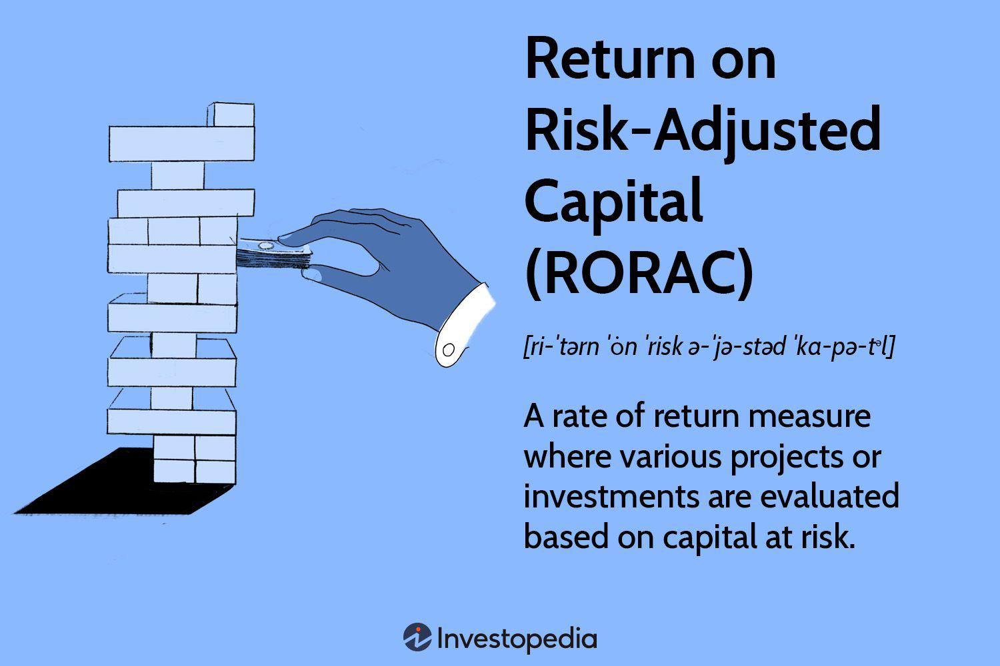

Financial metrics are essential tools for evaluating investment performance, providing quantitative measures that investors and analysts utilize to make informed decisions. These metrics help assess profitability, return on investment, risk, and overall financial health. Traditional metrics like Return on Investment (ROI) and Return on Equity (ROE) have long been used to evaluate company performance. However, they may not fully account for the risks associated with investments. This is where risk-adjusted metrics, such as Return on Risk-Adjusted Capital (RORAC), become crucial.

Risk-Adjusted Capital introduces the concept of balancing potential returns with associated risks. In financial analysis, RORAC represents a sophisticated metric designed to evaluate the profitability of a company's capital in relation to the level of risk taken. By considering both returns and risks, RORAC provides a more accurate assessment of a company’s performance. It allows investors to compare different investment opportunities with varying risk profiles on a standardized basis, leading to more informed decision-making.



Algorithmic trading has emerged as a significant force in financial markets, leveraging advanced algorithms and computational power to optimize trading decisions. The incorporation of RORAC into algorithmic trading strategies enhances the ability to manage risk effectively while optimizing returns. By integrating risk-adjusted metrics into their models, algorithmic traders can fine-tune their portfolios to achieve superior risk management and performance outcomes. This approach aligns trading strategies with the risk preferences and objectives of investors.

The exploration of RORAC in financial markets underscores its value as a critical component in the evolution of financial analysis. By providing a clearer picture of risk-adjusted returns, RORAC equips investors, analysts, and financial institutions with the insights needed to make strategic decisions in complex market environments. This section sets the stage for a comprehensive examination of RORAC, its calculation, application, and the distinct advantages it offers over traditional performance metrics in assessing risk-adjusted profitability. Through a deeper understanding of RORAC, market participants can enhance their investment strategies and drive more effective risk management practices.

## Table of Contents

## Understanding RORAC

Return on Risk-Adjusted Capital (RORAC) is a financial metric used to evaluate the profitability of an investment relative to the risk undertaken. It offers a nuanced perspective by accounting for both return and risk, thereby providing a more comprehensive assessment of performance compared to traditional metrics such as Return on Investment (ROI) or Return on Equity (ROE).

**Definition and Calculation of RORAC**

RORAC is calculated by dividing the net income generated from an investment by its risk-weighted assets (RWA). The formula can be expressed as:

$$
\text{RORAC} = \frac{\text{Net Income}}{\text{Risk-Weighted Assets}}
$$

In this equation, Net Income refers to the profits generated after accounting for operating expenses, taxes, interest, and other costs. Risk-Weighted Assets, on the other hand, adjust the value of assets by considering the financial risk associated with them. This adjustment helps in assessing how much capital is at risk in generating the net income.

**Differences from Traditional Metrics**

Unlike ROI and ROE, which primarily focus on returns without regard for risk, RORAC incorporates the concept of risk by utilizing risk-weighted assets. ROI simply calculates return as a percentage of the initial investment, while ROE measures return as a percentage of shareholder equity. Both of these metrics can potentially overlook the underlying risk, providing a skewed picture of financial performance. RORAC, by considering the risk dimension, offers a balanced view, ensuring that returns are evaluated in the context of the associated risk.

**Importance of RORAC in Financial Analysis**

The primary advantage of using RORAC lies in its ability to assess risk-adjusted profitability. In financial analysis, understanding the risk-reward trade-off is crucial for informed decision-making. RORAC provides insights into whether the returns compensate adequately for the risks taken, enabling better comparison across various investments and business units. This is particularly important in financial institutions where regulatory requirements necessitate careful risk management.

**Situations Where RORAC is Preferable**

RORAC is often preferred in scenarios involving complex risk profiles, such as in the banking sector or for investments in volatile markets. For instance, when comparing two portfolios with different levels of risk exposure, RORAC helps identify which portfolio offers better risk-adjusted returns. Additionally, financial institutions use RORAC to evaluate the efficiency of capital allocation among different business units or investment products, ensuring that capital is invested where it yields the highest risk-adjusted return.

Overall, RORAC serves as a vital tool for investors and financial managers who seek to optimize their portfolios by balancing return and risk, ultimately leading to more robust and informed investment strategies.

## Importance of Risk-Adjusted Performance

Considering risk is crucial when evaluating investment performance because it provides a more comprehensive perspective on the potential outcomes and sustainability of investments. Traditional performance metrics such as Return on Investment (ROI) and Return on Equity (ROE) often focus solely on returns without accounting for the risk involved, which can lead to skewed perceptions of performance. For instance, two investments may offer similar returns, but one may entail significantly higher risk. Without assessing risk, investors may inadvertently choose riskier investments with potentially adverse implications for their portfolios.

Risk-adjusted metrics, like the Return on Risk-Adjusted Capital (RORAC), bring a nuanced view by integrating risk factors into performance evaluation. RORAC measures the profitability of an investment relative to the risk taken, allowing investors to identify investments that offer the best potential returns for the level of risk involved. Its formula is:

$$
\text{RORAC} = \frac{\text{Net Income}}{\text{Risk-Weighted Assets}}
$$

This metric adjusts the capital required based on the risk profile, which makes it a superior choice for comparing investments with varying risk profiles. By factoring in risk, RORAC provides a clearer picture of which investments are efficient or sustainable in the long term, offering investors a balanced view of returns versus the potential for loss.

The benefits of using RORAC are significant, especially when comparing investments across diverse risk profiles. By enabling a standardized measure of risk-adjusted returns, RORAC allows for more precise comparisons and informed decision-making. This is particularly valuable in environments where [volatility](/wiki/volatility-trading-strategies) and uncertainty are prevalent. For example, RORAC can help identify whether a high-yield fund truly offers better risk-adjusted returns than a lower-yielding, but more stable, alternative.

The real-world implications of using risk-adjusted performance metrics are manifold. Financial institutions and asset managers can use RORAC to better align their investment strategies with their risk appetite and regulatory requirements. For instance, under the Basel II and III accords, banks are required to maintain a certain amount of capital reserves against their risk-weighted assets. Employing RORAC ensures that banks optimize their capital allocation strategies to maximize returns while staying compliant with risk management standards.

Furthermore, integrating RORAC into decision-making fosters a culture of risk-awareness among investment professionals, leading to more robust and resilient financial strategies. This approach helps in anticipating and mitigating potential downfalls associated with high-risk investments, ultimately providing a safeguard against financial instability.

In summary, incorporating risk-adjusted performance metrics like RORAC into investment evaluation is vital for accurately assessing the true profitability of investments, ensuring informed decisions that account for both return and risk. By doing so, investors can achieve sustainable growth while effectively managing risk exposure, enhancing both the stability and performance of their investment portfolios.

## Calculating RORAC

Return on Risk-Adjusted Capital (RORAC) is a crucial metric used in financial analysis to evaluate the profitability of an investment while taking into account the associated risks. Understanding how to calculate RORAC involves a step-by-step analysis of its components, namely Net Income and Risk-Weighted Assets (RWA).

### Step-by-Step Guide to Calculating RORAC

The formula for calculating RORAC is expressed as:

$$

\text{RORAC} = \frac{\text{Net Income}}{\text{Risk-Weighted Assets}}
$$

#### Understanding the Inputs

1. **Net Income**: This represents the profit of a company after all expenses, taxes, and costs have been deducted from total revenue. It is a straightforward measure of financial performance and profitability. Net income is usually reported on a company’s income statement.

2. **Risk-Weighted Assets (RWA)**: RWAs are a way of assessing the risk level of assets held by a financial institution. Different assets are assigned different weights based on their risk, in accordance with regulatory guidelines such as the Basel Accords. For instance, government bonds are considered less risky and thus have a lower weight compared to corporate loans.

### Challenges in Measuring Risk-Weighted Assets Accurately

The accuracy of RWA calculations is essential to ensure that RORAC reflects true risk-adjusted performance. However, there are inherent challenges in measuring RWAs:

- **Subjectivity in Risk Assessment**: Determining the risk weight for an asset class can be subjective and may vary across different regulatory environments. This subjectivity can lead to inconsistencies in RWA calculations.

- **Changes in Regulatory Standards**: Financial institutions must adhere to evolving regulatory standards, such as those issued by the Basel Committee. Changes in these standards can affect how assets are risk-weighted.

- **Market Volatility**: Fluctuations in the financial markets can impact the value and risk profile of assets, thereby influencing their risk weights.

### Practical Examples and Case Studies

Consider a financial institution with net income of $10 million and a diversified portfolio whose risk-weighted assets total $100 million. Applying the RORAC formula: 

$$
\text{RORAC} = \frac{10,000,000}{100,000,000} = 0.1 \text{ or } 10\%
$$

This indicates that the institution generates a 10% return on its risk-adjusted capital, suggesting a reasonable profit level when accounting for risk.

**Case Study Example**: A mid-sized bank with aggressive lending strategies might report a high net income. However, if its asset base is heavily weighted toward high-risk loans, its RWAs would substantially increase, reducing the RORAC. This emphasizes the need for balanced risk management and asset composition.

In conclusion, calculating RORAC provides valuable insights into financial performance that traditional metrics may not capture. By thoroughly understanding net income and accurately assessing RWAs, investors can more effectively evaluate risk-adjusted profitability and make informed investment decisions.

## Comparing RORAC with Other Metrics

Return on Risk-Adjusted Capital (RORAC) is a vital financial metric for assessing the profitability of investments by considering the risk involved. It is often compared with similar metrics such as Risk-Adjusted Return on Capital (RAROC) and Economic Value Added (EVA), each offering unique insights into financial performance.

**Differences and Similarities between RORAC, RAROC, and EVA**

RORAC, RAROC, and EVA all aim to measure financial performance by incorporating risk into the evaluation. However, their approaches and focus areas differ. RORAC specifically evaluates profitability after adjusting for risk and is calculated as:

$$

\text{RORAC} = \frac{\text{Net Income}}{\text{Risk-Weighted Assets}} 
$$

RAROC, a closely related metric, also emphasizes risk-adjustment but focuses more on capital allocation efficiency, often including expected losses explicitly in its calculations. This formula is:

$$

\text{RAROC} = \frac{\text{Net Income} - \text{Expected Losses}}{\text{Economic Capital}} 
$$

In contrast, EVA measures an investment's performance based on the concept of economic profit—how much value is created above the required return on the firm’s capital. It is calculated by:

$$

\text{EVA} = \text{Net Operating Profit After Taxes} - (\text{Capital} \times \text{Cost of Capital}) 
$$

These metrics share the common objective of presenting a risk-sensitive picture of financial performance but diverge in their implementation and emphasis—RORAC focuses on risk-weighted assets, RAROC on economic capital allocation, and EVA on economic profitability.

**Comparison of RORAC's Utility Against Other Risk-Adjusted Metrics**

RORAC's utility is especially pronounced when evaluating investments with varying levels of risk. While RORAC offers a direct risk-adjusted profitability measure, RAROC provides deeper insights into how effectively capital is deployed with risk considerations in mind. Meanwhile, EVA aids in assessing value creation from an economic standpoint, reflecting the opportunity cost of capital utilized.

**Examples of Scenarios where RORAC Outperforms or Complements Other Metrics**

RORAC is particularly advantageous in scenarios where investment comparison is critical. For instance, in a portfolio consisting of high-risk and low-risk assets, RORAC allows investors to directly gauge the profitability of each asset on a risk-adjusted basis. Conversely, when assessing capital allocation for projects within a financial institution, RAROC might be preferable due to its focus on economic capital and expected losses.

**Highlighting the Situations where RORAC Provides Superior Insights**

RORAC provides superior insights in contexts requiring straightforward risk-adjusted return evaluations without extensive computations of expected losses or economic profits. Its integration into strategic decision-making can enhance portfolio management, especially in simplified scenarios where the key concern is to balance returns with the underlying risks of assets. By offering a clear picture of profitability through the lens of risk exposure, RORAC serves as a critical tool for investors and financial analysts aiming to optimize risk-adjusted returns efficiently.

## The Role of Algorithmic Trading

Algorithmic trading refers to the use of computer programs to execute trades in financial markets at speeds and frequencies that are impossible for human traders. These programs follow pre-defined instructions or algorithms which consider various market data points to make decisions on buying or selling financial instruments. Over the past several decades, [algorithmic trading](/wiki/algorithmic-trading) has become an essential component of the global financial ecosystem, owing to its ability to process vast amounts of information rapidly and execute orders with precision.

Incorporating Return on Risk-Adjusted Capital (RORAC) into algorithmic trading involves integrating risk management metrics to enhance decision-making processes. RORAC is a metric that helps in evaluating the profitability of investments relative to the amount of risk taken. By factoring RORAC into algorithms, traders can ensure that each position taken aligns with desired risk-adjusted returns. This integration is particularly significant for portfolios with diverse assets and differing risk profiles.

Algorithmic strategies leveraging RORAC for risk management often utilize techniques such as optimization and [backtesting](/wiki/backtesting). These strategies might employ [machine learning](/wiki/machine-learning) models to predict market movements or apply statistical [arbitrage](/wiki/arbitrage) to identify and exploit pricing inefficiencies. For instance, an algorithm may adjust position sizes based on expected RORAC, prioritizing trades with higher potential risk-adjusted returns. A Python example illustrating a simple strategy that adjusts position sizing based on RORAC could look like this:

```python
def calculate_rorac(net_income, risk_weighted_assets):
    return net_income / risk_weighted_assets

class TradingAlgorithm:
    def __init__(self, data, initial_risk_assets):
        self.data = data
        self.initial_risk_assets = initial_risk_assets

    def execute_trade(self):
        net_incomes = [entry['net_income'] for entry in self.data]
        for net_income, entry in zip(net_incomes, self.data):
            rorac = calculate_rorac(net_income, self.initial_risk_assets)
            if rorac > entry['target_rorac']:
                execute_buy_order(entry['asset'], entry['amount'])
            else:
                execute_sell_order(entry['asset'], entry['amount'])

def execute_buy_order(asset, amount):
    print(f"Buying {amount} of {asset}")

def execute_sell_order(asset, amount):
    print(f"Selling {amount} of {asset}")

# Sample data
data = [
    {'asset': 'Asset1', 'net_income': 1000, 'target_rorac': 0.08, 'amount': 10},
    {'asset': 'Asset2', 'net_income': 800, 'target_rorac': 0.07, 'amount': 5}
]

algorithm = TradingAlgorithm(data, 10000)
algorithm.execute_trade()
```

The primary benefit of using algorithms to optimize RORAC in trading portfolios is the ability to continually adjust to new market conditions and data, ensuring a dynamic and responsive trading strategy. Algorithms can seamlessly evaluate real-time data, recalibrating their strategies to optimize returns while managing risks effectively. This adaptability not only enhances potential profitability but also contributes to more sophisticated risk management frameworks, reducing exposure to unforeseen market events and volatility.

## Limitations of RORAC

Return on Risk-Adjusted Capital (RORAC) is a valuable tool in financial analysis, yet it is not without limitations. Understanding these constraints is critical for accurate financial evaluations and optimizing decision-making processes.

Firstly, RORAC calculations can be subject to inherent biases and inaccuracies, primarily due to the reliance on risk-weighted assets (RWAs). RWAs, which are essential for calculating RORAC, can be challenging to measure precisely because they require estimations of potential future losses under risk scenarios. This reliance on assumptions about future events introduces a degree of subjectivity that can skew results. For instance, different models for risk assessment or changes in market conditions can lead to significant variations in the risk-weight calculation, thereby affecting RORAC values.

Moreover, RORAC might not always provide a comprehensive view of financial performance. It focuses on capital deployed under a risk-weighted framework, which may overlook other critical aspects of risk, such as operational or market risks. Hence, relying solely on RORAC could result in a narrow perspective that fails to fully capture an investment's risk landscape. For example, an investment might appear favorable under RORAC due to its low credit risk but might be exposed to significant [interest rate](/wiki/interest-rate-trading-strategies) or currency risks not reflected in the metric.

To overcome these limitations, it is crucial to integrate RORAC with other financial metrics and risk assessment tools. One effective approach is the complementary use of RORAC alongside metrics like Return on Equity (ROE), Economic Value Added (EVA), and Value at Risk (VaR), which can provide a broader view of performance and risk exposure. This multifaceted approach enables investors and managers to capture diverse dimensions of risk, ensuring more robust decision-making.

Additionally, enhancing the accuracy of RORAC requires improving the precision of risk-weighted asset calculations. This can be achieved by adopting more sophisticated risk models that better account for the nuances of different asset classes and market conditions. Regular updates to risk assessments and the incorporation of real-time data can also help mitigate biases in risk estimation.

In conclusion, while RORAC is a powerful metric for evaluating risk-adjusted returns, acknowledging and addressing its limitations can lead to more effective financial analysis and risk management. Comprehensive evaluations integrating multiple metrics and advancing risk modeling techniques are vital strategies for navigating the complexities associated with using RORAC.

## Case Studies

### Case Studies

In recent years, financial institutions have increasingly focused on optimizing their portfolio performance by considering risk-adjusted capital. One notable example is a European bank that successfully integrated Return on Risk-Adjusted Capital (RORAC) into its investment analysis framework. The bank aimed to enhance its capital allocation efficiency by assessing the risk-adjusted profitability of potential investments. By implementing RORAC calculations, the bank was able to identify and prioritize investment opportunities that offered superior returns relative to the inherent risks. This shift not only improved the bank's portfolio performance but also enhanced its risk management capabilities, leading to more informed investment decisions.

In the context of algorithmic trading, a prominent [hedge fund](/wiki/hedge-fund-trading-strategies) developed a strategy leveraging RORAC to optimize trading decisions. The strategy involved employing machine learning algorithms to predict market trends while adjusting the trading positions based on RORAC metrics. By continuously calculating and monitoring RORAC in real-time, the trading system could dynamically adjust its positions to maximize risk-adjusted returns. Python code snippets used within the trading infrastructure facilitated the seamless integration of RORAC computations:

```python
def calculate_rorac(net_income, risk_weighted_assets):
    """Calculate RORAC given net income and risk-weighted assets."""
    if risk_weighted_assets == 0:
        return float('inf')  # Handling division by zero
    return net_income / risk_weighted_assets

def update_trading_position(current_position, market_signal, rorac_threshold):
    """Adjust trading strategy based on RORAC threshold."""
    predicted_rorac = calculate_rorac(current_position["net_income"], current_position["risk_weighted_assets"])
    if predicted_rorac > rorac_threshold:
        # Increase position if RORAC is favorable
        new_position = current_position["volume"] * (1 + market_signal)
    else:
        # Reduce position if RORAC is not favorable
        new_position = current_position["volume"] * (1 - market_signal)
    return new_position
```

The implementation of this RORAC-focused algorithmic strategy highlighted several important lessons. Firstly, it demonstrated the ability of RORAC to provide actionable insights that enhance decision-making processes. By focusing on risk-adjusted returns, the hedge fund was able to capture value and improve its return on capital, making informed adjustments to its trading portfolio. 

Furthermore, the case studies underscore the impact of adopting RORAC-focused approaches in financial decision-making. Financial institutions and trading entities reported noticeable improvements in their ability to allocate capital more efficiently and manage risk effectively. Such approaches help align investment selections with strategic objectives, thereby supporting long-term growth and stability.

Overall, these examples illustrate the practical utility of RORAC in financial analysis and algorithmic trading, serving as a critical tool for improving risk management and enhancing investment outcomes.

## Conclusion

Risk-Adjusted Return on Capital (RORAC) plays a pivotal role in financial analysis and risk management by providing a comprehensive measure that marries profitability assessments with risk considerations. As traditional metrics like Return on Investment (ROI) or Return on Equity (ROE) focus solely on returns without addressing the risk involved, RORAC offers a more nuanced evaluation by factoring in the cost of risk. This allows investors and financial analysts to make more informed decisions regarding capital allocation and investment strategies. The ability of RORAC to adjust for risk ensures that capital is employed not only to achieve superior returns but also to maintain an appropriate balance between risk and reward.

Looking ahead, the evolution of risk-adjusted performance metrics is poised to become even more sophisticated, as the financial environment continues to grow in complexity. Advances in technology and increased access to data provide opportunities to refine these metrics further. Enhanced computational tools and machine learning models can integrate more variables and data points, potentially leading to more precise measurements of risk-adjusted returns. This evolution will aid financial institutions in better understanding the nuances of their risk exposures and optimize their investment portfolios accordingly.

Integrating RORAC into algorithmic trading strategies holds significant promise. Algorithmic trading systems, which rely heavily on computational efficiency and data analysis, can incorporate RORAC to optimize trade decisions dynamically. By continuously assessing the risk-adjusted performance of assets, these systems can adjust their strategies in real time, ensuring that the portfolio maximizes returns while managing risk effectively. The synergy between RORAC and algorithmic trading can lead to the development of highly adaptive and efficient trading strategies that meet the demands of today's fast-paced financial markets.

In conclusion, the use of comprehensive risk assessment tools is indispensable in modern finance. Adopting measures like RORAC equips financial professionals with the ability to account for risk in their investment evaluations, leading to more resilient and informed decision-making. Encouraging the integration of such tools not only facilitates superior capital management but also protects against unforeseen market volatilities, fostering a more stable financial ecosystem.

## References & Further Reading

[1]: Damodaran, A. (2007). ["Strategic Risk Taking: A Framework for Risk Management."](https://books.google.com/books/about/Strategic_Risk_Taking.html?id=JJUkCHhuYO8C) Pearson Education.

[2]: ["Risk-Adjusted Performance"](https://www.investopedia.com/terms/r/riskadjustedreturn.asp) article by CFA Institute.

[3]: Hull, John C. (2015). ["Risk Management and Financial Institutions."](https://www.amazon.com/Management-Financial-Institutions-Wiley-Finance/dp/1119932483) Wiley.

[4]: ["Algorithmic and High-Frequency Trading"](https://www.amazon.com/Algorithmic-High-Frequency-Trading-Mathematics-Finance/dp/1107091144) by Álvaro Cartea, Sebastian Jaimungal, and José Penalva

[5]: ["Modern Portfolio Theory and Investment Analysis"](https://books.google.com/books/about/Modern_Portfolio_Theory_and_Investment_A.html?id=181CEAAAQBAJ) by Edwin J. Elton, Martin J. Gruber, Stephen J. Brown, and William N. Goetzmann.