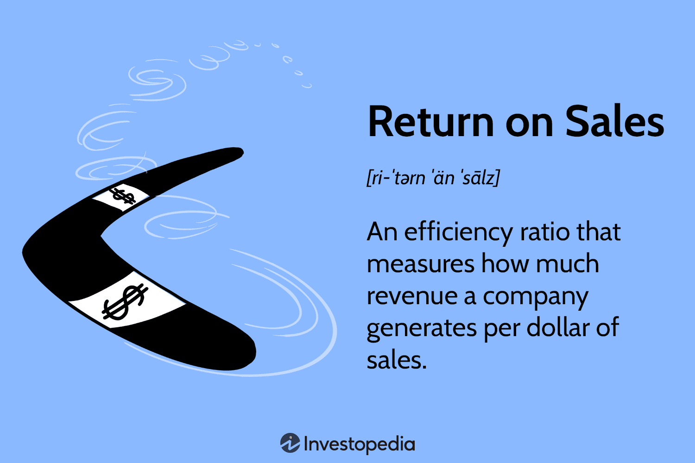

## Table of Contents

## What is Return on Sales (ROS)?

Return on Sales (ROS) is a financial ratio that shows how much profit a company makes from its sales. It is calculated by dividing the company's operating profit by its net sales. This ratio helps to understand how efficiently a company is at turning sales into profits. A higher ROS means the company is doing a good job at making money from its sales.

ROS is important for comparing the performance of different companies, especially within the same industry. It can show which company is better at managing its costs and generating profits. Investors and managers use ROS to make decisions about where to invest or how to improve business operations. By looking at ROS over time, you can see if a company is getting better or worse at making profits from its sales.

## Why is Return on Sales important for businesses?

Return on Sales (ROS) is important for businesses because it shows how well they are making money from what they sell. It tells business owners and managers if they are doing a good job at keeping costs low and making a profit. If a business has a high ROS, it means they are making more money from each sale, which is good. If the ROS is low, it might mean they need to find ways to cut costs or sell more to make more profit.

Businesses also use ROS to compare themselves with other companies in the same industry. This helps them see if they are doing better or worse than others. Investors look at ROS too, to decide if they should put money into a business. By checking ROS over time, a business can see if it's getting better at making profits or if it needs to change something.

## How do you calculate Return on Sales?

Return on Sales, or ROS, is a way to figure out how much profit a business makes from its sales. You calculate it by dividing the operating profit by the net sales. Operating profit is the money left after you subtract all the costs of running the business, like salaries, rent, and supplies, from the total sales. Net sales are the total sales after you take away any returns or discounts.

For example, if a business has an operating profit of $50,000 and net sales of $200,000, you would calculate ROS like this: $50,000 divided by $200,000 equals 0.25. You can turn this into a percentage by multiplying by 100, so the ROS would be 25%. This means for every dollar of sales, the business makes 25 cents in profit. 

ROS helps businesses see if they are good at turning sales into profit. A higher ROS means the business is doing well at keeping costs down and making money. If the ROS is low, the business might need to look at ways to cut costs or increase sales to improve their profit.

## What is the difference between Return on Sales and other profitability ratios?

Return on Sales (ROS) is one way to measure how profitable a business is, but there are other ratios that look at profit in different ways. ROS focuses on how much profit a business makes from its sales. It's calculated by dividing the operating profit by the net sales. This tells you how much of each dollar of sales turns into profit. Other ratios, like Return on Assets (ROA) and Return on Equity (ROE), look at profit in relation to different parts of the business. ROA measures how well a business uses its assets to make profit, while ROE shows how much profit a business makes with the money shareholders have invested.

These different ratios give you different pieces of information about a business's health. ROS is great for seeing how efficient a business is at turning sales into profit, which is important for comparing businesses in the same industry. ROA, on the other hand, helps you understand if a business is using its assets well, which can be useful for businesses with a lot of equipment or property. ROE is important for investors because it shows how well their investment is doing. Each ratio has its own use, and together they give a fuller picture of a business's profitability and financial health.

## Can Return on Sales be negative, and what does that indicate?

Yes, Return on Sales (ROS) can be negative. This happens when a business's operating costs are more than its sales. In other words, the business is losing money on each sale it makes. A negative ROS means the business is not making a profit and is actually spending more money to run the business than it is bringing in from sales.

A negative ROS is a warning sign that something is wrong. It could mean the business needs to cut costs, raise prices, or find ways to sell more to turn things around. If a business sees a negative ROS, it's important for the owners and managers to look closely at their expenses and sales strategies to figure out how to improve their situation and start making a profit again.

## How can a company improve its Return on Sales?

A company can improve its Return on Sales by focusing on increasing its sales and reducing its costs. To boost sales, the company might try to attract more customers with marketing campaigns, introduce new products, or offer promotions and discounts. They could also work on improving their customer service to keep people coming back. At the same time, the company should look at its costs. They might find ways to spend less on things like supplies, rent, or salaries. By cutting costs, more money from each sale can turn into profit.

Another way to improve Return on Sales is by looking at the prices of what they sell. If the company can raise prices without losing customers, they can make more money from each sale. This might work if their products or services are unique or if customers think they are worth the extra cost. Also, the company should keep an eye on its competition. By understanding what other businesses are doing, they can find ways to do things better and make more profit. By working on these areas, a company can see its Return on Sales go up over time.

## What is considered a good Return on Sales percentage?

A good Return on Sales (ROS) percentage depends on the industry the business is in. For example, in industries like retail or restaurants, a good ROS might be around 5% to 10%. In other industries, like software or technology, a good ROS could be much higher, often above 20% or even 30%. It's important for a business to compare its ROS to other businesses in the same industry to see if it's doing well.

If a business has a higher ROS than others in its industry, it means they are doing a good job at making money from their sales. They are either selling more or keeping their costs lower than their competitors. But if their ROS is lower, they might need to find ways to improve. By looking at what other successful businesses in the industry are doing, a company can learn how to increase its own ROS.

## How does industry affect the interpretation of Return on Sales?

The industry a business is in can change what a good Return on Sales (ROS) looks like. Different industries have different costs and ways of making money. For example, a restaurant might have a good ROS if it's around 5% to 10%. This is because restaurants have a lot of costs like food, staff, and rent. On the other hand, a software company might have a good ROS if it's over 20% or even 30%. Software companies often have lower costs once the product is made, so they can keep more money from each sale.

Because of these differences, it's important to compare a business's ROS with others in the same industry. If a business has a higher ROS than others in its industry, it means they are doing a good job at making money from their sales. They might be selling more or keeping their costs lower than their competitors. If their ROS is lower, they might need to find ways to improve. By looking at what successful businesses in their industry are doing, a company can learn how to increase its own ROS.

## What are the limitations of using Return on Sales as a performance metric?

Return on Sales (ROS) is a helpful way to see how well a business is making money from its sales, but it has some limits. One big limit is that ROS doesn't tell you about other important parts of the business, like how well it's using its assets or how much money shareholders are making. For example, a business might have a good ROS but still be using its money badly or not making enough profit for its investors. ROS only looks at operating profit and sales, so it doesn't give you the full picture of how the business is doing.

Another limit of ROS is that it can be different from one industry to another. What's a good ROS in one industry might not be good in another. This makes it hard to compare businesses in different industries using just ROS. Also, ROS can be affected by things like one-time costs or sales that don't happen every year. These can make ROS look better or worse than it really is. So, while ROS is a useful tool, it's best to use it with other ways of measuring how a business is doing to get a clearer view.

## How does Return on Sales relate to operational efficiency?

Return on Sales, or ROS, shows how well a business turns its sales into profit. It's a way to see if a business is good at keeping its costs low while making money from what it sells. When a business has a high ROS, it means they are doing a good job at running their operations efficiently. They are either selling more, keeping their costs down, or both. This makes ROS a useful measure of how well a business is managing its day-to-day work.

However, ROS doesn't tell the whole story about how efficient a business is. It only looks at the profit from sales and doesn't consider how well the business uses its other resources, like its buildings, machines, or money. A business might have a high ROS but still be wasting money in other areas. So, while ROS is a good sign of operational efficiency, it's best to use it along with other measures to get a full picture of how well a business is doing.

## Can Return on Sales be used to compare companies of different sizes?

Return on Sales, or ROS, can be used to compare companies of different sizes, but it's not always the best way. ROS looks at how much profit a company makes from its sales. This means it focuses on the percentage of profit, not the total amount. So, a small company and a big company can have the same ROS even if they make very different amounts of money. This makes ROS helpful for comparing how well companies turn sales into profit, no matter their size.

However, there are some things to keep in mind. ROS doesn't tell you about other important parts of a business, like how much it spends on things like buildings or machines. A small company might have a high ROS because it doesn't need to spend a lot on these things, while a big company might have a lower ROS because it has more costs. So, while ROS can give you a good idea of how efficiently companies make money from sales, it's best to use it with other measures to get a full picture of how well companies of different sizes are doing.

## How might macroeconomic factors influence a company's Return on Sales?

Macroeconomic factors can have a big effect on a company's Return on Sales (ROS). Things like inflation, interest rates, and economic growth can change how much money a company makes from its sales. For example, if inflation goes up, the cost of goods and services might go up too. This means a company might have to spend more money to make the same products, which can lower its ROS. Also, if interest rates go up, it can be more expensive for a company to borrow money, which might make it harder for them to keep their costs down and their ROS high.

Another way macroeconomic factors can influence ROS is through changes in consumer spending. When the economy is doing well, people might have more money to spend on things they want, which can help a company sell more and keep its ROS high. But if the economy is doing badly, people might not buy as much, which can hurt a company's sales and lower its ROS. So, a company needs to pay attention to these big economic changes to understand how they might affect its ability to make money from its sales.

## What is Return on Sales (ROS)?

Return on Sales (ROS), sometimes referred to as the operating profit margin, is an essential metric in financial analysis used to determine the proportion of revenue that remains as profit after deducting operating expenses. This percentage is crucial for understanding how efficiently a company can convert its sales into actual profit, excluding non-operating income and expenses such as taxes and interest. The formula for calculating ROS is:

$$
\text{ROS} = \left( \frac{\text{Operating Profit}}{\text{Net Sales}} \right) \times 100
$$

A higher ROS is indicative of a company's effective cost management and pricing strategies, signifying greater operational efficiency and profitability. It enables companies and investors to evaluate how well a company is performing in its core operations, making it easier to compare businesses within the same industry. Efficient cost structures and strong pricing strategies often result in a higher ROS, highlighting a firm's ability to generate profits from its principal activities.

## What is the Formula and Calculation of ROS?

The formula for calculating Return on Sales (ROS) is straightforward: 

$$
\text{ROS} = \left( \frac{\text{Operating Profit}}{\text{Net Sales}} \right) \times 100
$$

Operating Profit refers to the earnings a company generates from its core operational activities, before accounting for any non-operating income such as interest or investments, and other expenses like taxes. It is a key indicator of the efficiency and sustainability of a company's primary business functions. 

Net Sales, on the other hand, is the total revenue that a company earns from its sales activities, adjusted for any discounts offered, returns made by customers, or allowances that might reduce the gross sales figures. This adjustment ensures that the sales figure reflects the actual inflow of funds from the selling activities, providing a more accurate basis for assessing operational efficiency through ROS. 

To implement this calculation programmatically in Python, you could write a simple function:

```python
def calculate_ros(operating_profit, net_sales):
    if net_sales == 0:
        return "Net Sales cannot be zero."
    ros = (operating_profit / net_sales) * 100
    return ros

# Example usage:
operating_profit = 500000  # Example operating profit
net_sales = 2000000  # Example net sales
ros_value = calculate_ros(operating_profit, net_sales)
print(f"The Return on Sales (ROS) is: {ros_value}%")
```

This function `calculate_ros` takes operating profit and net sales as inputs, ensuring that the net sales is not zero to avoid division errors. It then computes the ROS and returns the value, providing a practical tool for quickly assessing a company's operational profitability.

## What is an Example of ROS Calculation?

Consider Company XYZ, which reports an Operating Profit of $500,000 and Net Sales of $2,000,000. To calculate the Return on Sales (ROS), we use the formula:

$$
\text{ROS} = \left( \frac{\text{Operating Profit}}{\text{Net Sales}} \right) \times 100
$$

Substituting the given values:

$$
\text{ROS} = \left( \frac{500,000}{2,000,000} \right) \times 100 = 25\%
$$

This calculation indicates that Company XYZ retains 25 cents in profit for every dollar of sales after covering its operating expenses. This is a measure of how efficiently the company converts sales into operating profit, reflecting the effectiveness of its cost management strategies relative to its revenue-generating capabilities. The 25% ROS suggests a relatively high level of operational efficiency, as a significant portion of sales revenue contributes to profit before accounting for taxes and interest.

## References & Further Reading

[1]: ["Understanding Financial Statements"](https://online.hbs.edu/blog/post/how-to-read-financial-statements) by Lyn M. Fraser and Aileen Ormiston

[2]: ["Financial Management: Theory & Practice"](https://faculty.cengage.com/titles/9781337902601) by Eugene F. Brigham and Michael C. Ehrhardt

[3]: ["Algorithmic and High-Frequency Trading"](https://www.amazon.com/Algorithmic-High-Frequency-Trading-Mathematics-Finance/dp/1107091144) by Álvaro Cartea, Sebastian Jaimungal, and José Penalva

[4]: ["Financial Analysis and Decision Making: Tools and Techniques to Solve Financial Problems and Make Effective Business Decisions"](https://archive.org/details/financialanalysi0000vanc) by David E. Vance

[5]: ["Algorithmic Trading & DMA: An Introduction to Direct Access Trading Strategies"](https://www.amazon.com/Algorithmic-Trading-DMA-introduction-strategies/dp/0956399207) by Barry Johnson

[6]: ["The Evaluation and Optimization of Trading Strategies"](https://onlinelibrary.wiley.com/doi/book/10.1002/9781119196969) by Robert Pardo