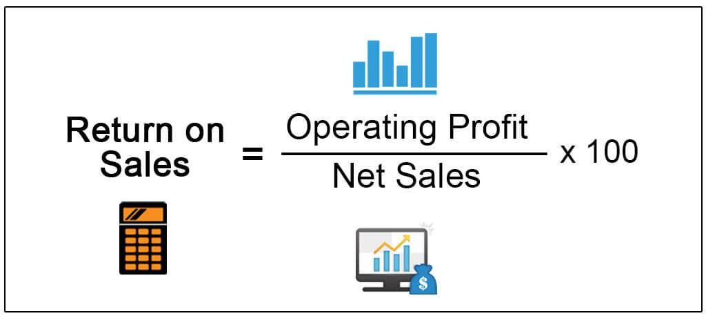

Return on Sales (ROS) is an essential metric in financial analysis, offering insight into a company's operational efficiency by measuring the proportion of revenue that remains after operating expenses have been subtracted. This assessment tool is particularly valuable to investors and financial analysts aiming to evaluate a company's profitability and efficiency objectively. In today's dynamic markets, traders increasingly rely on algorithmic trading strategies, which in turn depend on the accuracy of financial metrics like ROS. By quantifying a company's ability to convert sales into profit, ROS serves as a fundamental indicator for developing trading strategies and making informed investment decisions. This article explores how understanding and applying ROS can provide crucial insights into a company's operational health, especially for those integrating algorithmic techniques into their trading frameworks.

## Table of Contents



## What is Return on Sales (ROS)?

Return on Sales (ROS), sometimes referred to as the operating profit margin, is an essential metric in financial analysis used to determine the proportion of revenue that remains as profit after deducting operating expenses. This percentage is crucial for understanding how efficiently a company can convert its sales into actual profit, excluding non-operating income and expenses such as taxes and interest. The formula for calculating ROS is:

$$
\text{ROS} = \left( \frac{\text{Operating Profit}}{\text{Net Sales}} \right) \times 100
$$

A higher ROS is indicative of a company's effective cost management and pricing strategies, signifying greater operational efficiency and profitability. It enables companies and investors to evaluate how well a company is performing in its core operations, making it easier to compare businesses within the same industry. Efficient cost structures and strong pricing strategies often result in a higher ROS, highlighting a firm's ability to generate profits from its principal activities.

## Formula and Calculation of ROS

The formula for calculating Return on Sales (ROS) is straightforward: 

$$
\text{ROS} = \left( \frac{\text{Operating Profit}}{\text{Net Sales}} \right) \times 100
$$

Operating Profit refers to the earnings a company generates from its core operational activities, before accounting for any non-operating income such as interest or investments, and other expenses like taxes. It is a key indicator of the efficiency and sustainability of a company's primary business functions. 

Net Sales, on the other hand, is the total revenue that a company earns from its sales activities, adjusted for any discounts offered, returns made by customers, or allowances that might reduce the gross sales figures. This adjustment ensures that the sales figure reflects the actual inflow of funds from the selling activities, providing a more accurate basis for assessing operational efficiency through ROS. 

To implement this calculation programmatically in Python, you could write a simple function:

```python
def calculate_ros(operating_profit, net_sales):
    if net_sales == 0:
        return "Net Sales cannot be zero."
    ros = (operating_profit / net_sales) * 100
    return ros

# Example usage:
operating_profit = 500000  # Example operating profit
net_sales = 2000000  # Example net sales
ros_value = calculate_ros(operating_profit, net_sales)
print(f"The Return on Sales (ROS) is: {ros_value}%")
```

This function `calculate_ros` takes operating profit and net sales as inputs, ensuring that the net sales is not zero to avoid division errors. It then computes the ROS and returns the value, providing a practical tool for quickly assessing a company's operational profitability.

## Applying ROS in Algorithmic Trading

Algorithmic trading increasingly relies on metrics like Return on Sales (ROS) to evaluate companies' financial health and optimize trading decisions based on operational efficiency. ROS offers traders a lens through which they can assess a company's ability to convert sales into operating profit, providing valuable insights into its core operations.

By utilizing ROS, traders can effectively identify which companies within the same industry demonstrate superior potential investments. This metric enables the comparison of firms based on how efficiently they manage their sales and operational costs, filtering out those that excel in these areas. For example, in a competitive sector like technology, companies with a higher ROS are often better at cost management and competitive pricing, thus presenting more attractive investment opportunities.

In practice, ROS can be integrated into [algorithmic trading](/wiki/algorithmic-trading) systems to automate trading decisions. By setting ROS as a parameter, trading algorithms can quickly sift through financial data, identifying stocks of companies with high operational profitability. This automated filtering process is crucial for high-frequency traders who need to make rapid, yet informed, investment choices based on substantial datasets.

Python is a common language used to develop such algorithmic trading systems due to its simplicity and robust data processing libraries. Below is a basic example of how ROS might be calculated and used in a trading algorithm:

```python
# Example: Basic Calculation of ROS in a Trading Algorithm

# Sample data for illustration
company_data = {
    'Company A': {'operating_profit': 500000, 'net_sales': 2000000},
    'Company B': {'operating_profit': 300000, 'net_sales': 1800000},
    # Additional companies could be listed here
}

# Function to calculate ROS
def calculate_ros(operating_profit, net_sales):
    if net_sales == 0:
        return 0
    return (operating_profit / net_sales) * 100

# Identifying companies with high ROS
high_ros_companies = {name: calculate_ros(data['operating_profit'], data['net_sales'])
                      for name, data in company_data.items() if calculate_ros(data['operating_profit'], data['net_sales']) > 20}

# Outputting companies with high ROS
print("Companies with high ROS:")
for company, ros in high_ros_companies.items():
    print(f"{company}: {ros}%")
```

In this example, the algorithm calculates the ROS for each company and selects those with a ROS greater than 20%, indicating strong operational profitability. This automated approach streamlines the selection process for investment-worthy companies, allowing traders to focus on those with robust financial health.

Overall, applying ROS in algorithmic trading facilitates more refined and strategic decision-making processes, enabling traders to leverage a company's fundamental efficiency in their trading strategies.

## Example of ROS Calculation

Consider Company XYZ, which reports an Operating Profit of $500,000 and Net Sales of $2,000,000. To calculate the Return on Sales (ROS), we use the formula:

$$
\text{ROS} = \left( \frac{\text{Operating Profit}}{\text{Net Sales}} \right) \times 100
$$

Substituting the given values:

$$
\text{ROS} = \left( \frac{500,000}{2,000,000} \right) \times 100 = 25\%
$$

This calculation indicates that Company XYZ retains 25 cents in profit for every dollar of sales after covering its operating expenses. This is a measure of how efficiently the company converts sales into operating profit, reflecting the effectiveness of its cost management strategies relative to its revenue-generating capabilities. The 25% ROS suggests a relatively high level of operational efficiency, as a significant portion of sales revenue contributes to profit before accounting for taxes and interest.

## Importance of ROS in Financial Analysis

Return on Sales (ROS) is an essential aspect of financial analysis, providing critical insights into a company's operational efficiency over time. By focusing on the profitability derived from core operations, ROS offers a clear view of how effectively a company is managing its costs and generating profits. This is particularly useful for internal assessments, as it allows businesses to track and improve their efficiency and cost management strategies across different periods. 

The metric also facilitates the comparison of profitability among firms within the same industry, serving as a standardized tool for such analyses. By providing a uniform measure, ROS helps investors and analysts determine which companies are managing their operations more efficiently relative to their peers. This aspect is crucial for determining a firm's competitive position in the industry.

Furthermore, ROS is a significant indicator of management effectiveness and the ability to control operational costs. Investors often look at ROS to gauge the quality of a company's management, as high ROS values typically indicate effective leadership in cost management and resource allocation. It acts as a signal of the company's ability to maintain profitability margins despite varying market conditions and competitive pressures.

In conclusion, Return on Sales is not only a measure of profit generation but also a reflection of a company's operational health, making it a valuable metric for both internal analyses and comparative assessments within the industry.

## Limitations of Using ROS

Return on Sales (ROS) is a useful metric for evaluating a company's operational efficiency, but it has several limitations that analysts should consider. One major shortcoming of ROS is its focus solely on operating profit. It does not account for non-operating incomes or expenses, such as investment income, interest expenses, or taxes. These elements can significantly influence a company's overall financial health and profitability, making ROS an incomplete picture of performance.

Furthermore, ROS overlooks the company's capital structure, including how it is financed through debt versus equity. For instance, a company with a high level of debt might have a strong ROS but still be at financial risk due to substantial interest obligations. Assessing financial health requires an understanding of not only operational efficiency but also how a company's operations are financed.

Comparisons using ROS can be misleading across different industries. Each industry may have distinct business models and cost structures, affecting the ROS benchmark. An industry like manufacturing, with high fixed costs, may naturally have a different ROS compared to a service-based industry, which might have lower fixed costs but higher variable costs. Hence, comparing companies solely on ROS without context on their operational environment can lead to incorrect conclusions.

To overcome these limitations, analysts often complement ROS with other financial ratios. For instance, the debt-to-equity ratio provides insights into a company's leverage, while EBITDA (Earnings Before Interest, Taxes, Depreciation, and Amortization) offers a clearer picture by excluding non-cash expenses. By integrating these additional metrics, financial analysts can achieve a more comprehensive analysis of a company's performance and risk profile. Such a holistic approach can aid investors in making better-informed decisions by understanding both operational efficiency and broader financial health.

## Conclusion

Return on Sales (ROS) is a vital financial metric for evaluating a company's ability to convert sales into profit. It measures the efficiency with which a company manages its operating expenses relative to its generated revenue, thereby offering crucial insights into operational efficiency. Despite its significance, ROS should not be utilized in isolation. For a comprehensive assessment of a company's performance, it is essential to consider additional financial metrics such as debt-to-equity ratio, EBITDA, or other profitability ratios. This holistic approach helps in gaining a more complete understanding of a company's financial health and operational effectiveness.

In algorithmic trading, ROS plays a crucial role by assisting in the development of trading strategies that rely on a company's fundamental strengths. It enables traders to automate the selection of companies demonstrating high operational profitability, thus enhancing decision-making processes. However, the effectiveness of ROS in evaluating investment opportunities can be enhanced by integrating it with other financial metrics, ensuring a multi-dimensional analysis of a company's financial standing. This integration permits a more robust strategy formulation based on comprehensive data analytics, ultimately leading to more informed trading decisions.

## References & Further Reading

[1]: ["Understanding Financial Statements"](https://online.hbs.edu/blog/post/how-to-read-financial-statements) by Lyn M. Fraser and Aileen Ormiston

[2]: ["Financial Management: Theory & Practice"](https://faculty.cengage.com/titles/9781337902601) by Eugene F. Brigham and Michael C. Ehrhardt

[3]: ["Algorithmic and High-Frequency Trading"](https://www.amazon.com/Algorithmic-High-Frequency-Trading-Mathematics-Finance/dp/1107091144) by Álvaro Cartea, Sebastian Jaimungal, and José Penalva

[4]: ["Financial Analysis and Decision Making: Tools and Techniques to Solve Financial Problems and Make Effective Business Decisions"](https://archive.org/details/financialanalysi0000vanc) by David E. Vance

[5]: ["Algorithmic Trading & DMA: An Introduction to Direct Access Trading Strategies"](https://www.amazon.com/Algorithmic-Trading-DMA-introduction-strategies/dp/0956399207) by Barry Johnson

[6]: ["The Evaluation and Optimization of Trading Strategies"](https://onlinelibrary.wiley.com/doi/book/10.1002/9781119196969) by Robert Pardo