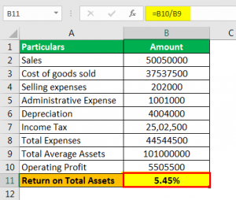

In the fast-paced world of finance, understanding key financial metrics is crucial for investors and traders. These metrics provide valuable insights into a company's operational efficiency and financial health, allowing stakeholders to make informed decisions. One such significant metric is the Return on Total Assets (ROTA), which serves as a measure of a company's ability to generate earnings from its assets.

ROTA is of particular interest when applied to algorithmic trading, where financial algorithms make autonomous trading decisions based on pre-set criteria. In algorithmic trading, ROTA helps assess asset utilization, informing strategies that optimize returns relative to the assets deployed. By integrating ROTA into algorithmic models, traders can enhance their investment strategies, making more data-driven and quantitative assessments of asset performance.



This article aims to provide a comprehensive understanding of ROTA, its calculation, and how it can be effectively incorporated into algorithmic trading. By examining ROTA in this context, investors and traders can better appreciate its role in evaluating asset efficiency and optimizing trading outcomes.

## Table of Contents

## Understanding Return on Total Assets (ROTA)

Return on Total Assets (ROTA) is a financial metric that evaluates a company's ability to generate earnings from its total assets before accounting for interest and taxes. It is represented by the formula:

$$
\text{ROTA} = \frac{\text{EBIT}}{\text{Average Total Assets}}
$$

where EBIT stands for Earnings Before Interest and Taxes. This metric provides valuable insights into a company's operational efficiency, specifically concerning asset utilization. A higher ROTA indicates more efficient use of assets to produce earnings.

ROTA is particularly useful for investors and analysts who wish to compare the operational efficiency of companies within the same industry or across different sectors. Given that asset structures and capital investments can vary widely among firms, ROTA allows for normalization and standardization when analyzing businesses. By focusing on EBIT, ROTA excludes the effects of taxation and financing decisions, thus providing a clearer view of a company's operational performance. 

Investors often use ROTA as a criterion to assess whether a company’s management is utilizing its asset base effectively. A higher ROTA suggests that the management is generating more income per dollar of assets controlled, making it a critical indicator for stakeholder decision-making.

## The Formula for Calculating ROTA

Return on Total Assets (ROTA) is a crucial financial metric that evaluates a company's efficiency in generating earnings from its assets. The formula used to calculate ROTA is straightforward: 

$$
\text{ROTA} = \frac{\text{EBIT}}{\text{Average Total Assets}}
$$

### Components of the Formula

1. **Earnings Before Interest and Taxes (EBIT):** 
   - This component represents a firm's profit generated from its operations, excluding the costs of capital structure and tax considerations. EBIT is crucial as it focuses on a company's operational efficiency, independent of its capital structure, allowing for a more direct comparison across businesses.

2. **Average Total Assets:** 
   - The denominator is the average total assets, which are calculated over a specific period, typically a year. This average is found by adding the beginning and ending total assets for the period and dividing by two. The use of average total assets accounts for fluctuations throughout the year, providing a more stable measure for the analysis.

### Example Calculation

Consider a hypothetical company, XYZ Corp., with the following financial figures for the fiscal year:
- **EBIT:** $500,000
- **Total Assets at the Beginning of the Year:** $2,000,000
- **Total Assets at the End of the Year:** $3,000,000

First, calculate the average total assets:

$$
\text{Average Total Assets} = \frac{\text{Total Assets at the Beginning of the Year} + \text{Total Assets at the End of the Year}}{2}
$$

$$
\text{Average Total Assets} = \frac{2,000,000 + 3,000,000}{2} = 2,500,000
$$

Now, substitute the values into the ROTA formula:

$$
\text{ROTA} = \frac{500,000}{2,500,000} = 0.20 \text{ or } 20\%
$$

This result implies that XYZ Corp is generating a 20% return from its average total assets, indicating how effectively the company utilizes its assets to produce earnings before interest and taxes. Such a calculation provides a benchmark for evaluating asset efficiency against industry peers and across different fiscal periods.

## Application of ROTA in Algorithmic Trading

Algorithmic trading, a method that uses complex algorithms to make trading decisions based on pre-set criteria, has become increasingly prevalent in the financial markets. One way to enhance such automated trading strategies is by incorporating the Return on Total Assets (ROTA) metric. By doing so, traders can assess the efficiency with which assets generate earnings and therefore make more informed decisions regarding asset allocation in their strategies.

### Using ROTA in Algorithmic Trading Strategies

ROTA provides a measure of how effectively a company's assets generate earnings before interest and taxes (EBIT). This insight can be valuable for [algorithmic trading](/wiki/algorithmic-trading), particularly in strategies focused on asset-based evaluations. By integrating ROTA into a trading algorithm, one can potentially improve the decision-making process by filtering investments based on asset utilization efficiency.

### Implementation

To implement ROTA into an algorithmic trading strategy, one can follow these steps:

1. **Data Collection:** Gather financial data, including EBIT and total assets for the companies within the trading universe. This can be done using financial APIs or data providers such as Bloomberg, Reuters, or Yahoo Finance.

2. **Pre-processing:** Ensure the data is clean and complete, focusing particularly on consistency in time periods for total asset values, which should be averaged over the fiscal year under consideration when calculating ROTA.

3. **Algorithm Development:**
   Develop a trading algorithm that incorporates ROTA as a criterion. Below is an example in Python using the Pandas library to calculate ROTA and make trading decisions:

   ```python
   import pandas as pd

   # Sample data: DataFrame 'financials' with columns 'EBIT' and 'Total_Assets'
   financials = pd.DataFrame({
       'Company': ['A', 'B', 'C'],
       'EBIT': [50000, 120000, 180000],
       'Total_Assets': [200000, 500000, 900000]
   })

   # Calculate ROTA
   financials['ROTA'] = financials['EBIT'] / financials['Total_Assets']

   # Example trading strategy: Select companies with ROTA > 0.1
   investment_criteria = financials[financials['ROTA'] > 0.1]
   ```

4. **Execution:** Implement the developed strategy in an algorithmic trading platform like QuantConnect, Quantitative Brokers, or custom-built systems to automate trade execution based on the ROTA-enhanced criteria.

5. **Optimization and Backtesting:** Regularly optimize the algorithm by backtesting with historical data to assess performance and adjust parameters as necessary to align with investment goals.

### Benefits of Incorporating ROTA

By incorporating ROTA into algorithmic trading strategies, traders can potentially achieve better asset utilization, leading to more efficient trading decisions. It enables a focus on companies that use their asset bases more effectively to generate profits, possibly revealing hidden opportunities within a portfolio that aren't obvious through other metrics.

By understanding and using ROTA in algorithmic strategies, traders can potentially enjoy a competitive edge, producing better-aligned investment decisions with the criteria of high asset utilization efficiency, ultimately seeking enhanced returns on investment.

## Limitations of Using ROTA in Financial Analysis

Return on Total Assets (ROTA) serves as a significant indicator of a company's efficiency in utilizing its assets to generate earnings. Despite its usefulness, ROTA has inherent limitations that analysts and investors must consider, particularly when interpreting its outcomes in financial analysis.

One primary limitation of ROTA is its reliance on book values rather than market values. Book values are historical costs recorded on the company's balance sheet, which may not adequately reflect the current market conditions or the true value of the assets. The discrepancy between book value and market value can lead to misleading ROTA figures, especially for assets that have significantly appreciated or depreciated. For example, if a company owns real estate acquired decades ago, its market value might be far above the book value, leading to an understated ROTA. Conversely, certain assets might have depreciated, resulting in an overstated ROTA if only book values are considered.

Another concern arises when assets are financed through debt. ROTA traditionally measures pre-interest earnings relative to total assets, not accounting for how these assets are financed. Companies with substantial debt might show high ROTA because borrowed funds can amplify earnings. However, this debt does not appear in the ROTA calculation, potentially giving a skewed perspective of asset efficiency. To illustrate, if two companies have identical asset bases and earnings, but one is heavily indebted, ROTA will not reflect the risk or cost associated with this debt, potentially misleading stakeholders who depend solely on ROTA for decision-making.

To account for these limitations, investors could supplement ROTA analysis with other financial metrics such as Return on Equity (ROE) or Debt-to-Equity ratios. These metrics provide additional layers of insight into financial performance, particularly regarding the capital structure and risk. Additionally, adjusting for inflation or using adjusted book values reflecting current market conditions can offer a more accurate picture of a company's asset efficiency.

In summary, while ROTA is an effective tool for assessing asset utilization, its limitations necessitate a comprehensive approach to financial analysis. By integrating market value considerations and evaluating debt financing, investors can enhance the accuracy of their assessments and make more informed investment decisions.

## ROTA vs. Other Financial Metrics

Return on Total Assets (ROTA) and other financial metrics such as Return on Equity (ROE) and Profit-to-Revenue ratios provide unique insights into a company's performance, each focusing on different aspects of financial health and efficiency. 

ROTA is primarily concerned with how effectively a company is using its assets to generate earnings. This ratio is significant because it provides a broad view of asset utilization without considering the company's financial structure or shareholder equity.

**Return on Equity (ROE)**, on the other hand, measures a company's profitability relative to shareholder equity. It provides insights into how well a company is utilizing shareholders' funds to generate earnings. ROE is often preferred when the focus is on maximizing shareholder returns.

The Profit-to-Revenue ratio, or profit margin, calculates the percentage of revenue that translates into profit. This ratio helps assess how well a company manages its expenses relative to its revenues and is crucial for understanding overall profitability.

### Comparison of ROTA and ROE

ROTA and ROE offer different perspectives: 

- **ROTA**: Indicates the efficiency of asset utilization regardless of financing method. ROTA is particularly useful when analyzing companies with large asset bases and assessing their operational efficiency.

- **ROE**: Focuses on financial leverage and shareholder returns. ROE might be prioritized when investor focus is on return maximization through equity.

### Comparison of ROTA and Profit-to-Revenue Ratios

While ROTA assesses asset efficiency, the Profit-to-Revenue ratio evaluates profitability after considering operational efficiency. Companies with high asset bases but lower profit margins might have different ROTA and Profit-to-Revenue outcomes, reflecting operational efficiency versus profitability.

### When to Prioritize ROTA

Deciding when to prioritize ROTA over other metrics depends on the specific financial analysis goals:

- **Asset-Intensive Industries**: In industries where assets play a critical role (e.g., manufacturing, utilities), ROTA provides invaluable insights into asset management effectiveness.

- **Automation and Algorithmic Trading**: In automated trading, ROTA can be prioritized to assess and leverage asset-based strategies effectively, ensuring algorithms account for the potential of asset efficiency.

In conclusion, while ROTA gives a broad sense of asset usage, ROE and Profit-to-Revenue ratios provide different angles on equity profitability and revenue management. Effective financial analysis integrates these metrics based on individual investment or analysis goals.

## Conclusion

Return on Total Assets (ROTA) serves as a robust financial metric that evaluates how effectively a company is utilizing its assets to generate earnings. When used in conjunction with other financial tools, ROTA can provide deep insights into asset efficiency, offering a more comprehensive overview of a company's performance. This metric holds particular value for algorithmic traders, as it can be seamlessly integrated into algorithmic trading models. By considering ROTA in trading algorithms, traders can make informed investment decisions, enhancing their strategies in terms of asset utilization and potential profitability.

For algorithmic trading, ROTA's applicability lies in its ability to inform and refine trading strategies. By using ROTA to assess asset-based strategies, traders can identify opportunities to optimize their trades and improve overall outcomes, leveraging ROTA's insights to better align their algorithms with profitability goals. This integration helps in crafting strategies that are not only efficient but also finely tuned to exploit asset utilization.

Despite its beneficial applications, ROTA is not without limitations. Issues such as reliance on book values instead of market values can skew results, possibly leading to misinterpretations of asset efficiency. Thus, while ROTA plays a crucial role in evaluating financial performance, it should not be used in isolation. Instead, investors and traders must consider it alongside other financial metrics to achieve a balanced and nuanced understanding of a company's performance.

Understanding and correctly applying ROTA remains a critical skill for any investor or trader. When adeptly utilized, it can significantly contribute to optimizing asset management strategies, ultimately leading to better investment outcomes. The metric's ability to shed light on asset efficiency makes it an indispensable component of a robust financial analysis toolkit.

## FAQs

### FAQs

**How do investors utilize ROTA in their investment strategies?**

Investors leverage Return on Total Assets (ROTA) to gauge how efficiently a company is using its assets to generate profits, thereby aiding investment decisions. A higher ROTA suggests a company is proficiently managing its assets to produce earnings, which can indicate a solid investment opportunity. Conversely, a lower ROTA might prompt investors to investigate the company further to identify potential inefficiencies. By comparing ROTA across different companies within the same industry, investors can assess relative performance and asset utilization.

**What is considered a good ROTA value across different industries?**

A "good" ROTA value can vary significantly from one industry to another due to differences in asset intensity and business models. Capital-intensive industries like manufacturing or utilities often exhibit lower ROTA values, as they require substantial assets to generate income. In contrast, industries with less capital expenditure, such as software or consulting, may show higher ROTA figures. Hence, investors often compare a company's ROTA to industry averages or to its historical ROTA values to determine performance quality. Understanding industry-specific benchmarks is crucial for a nuanced assessment of ROTA.

**How can ROTA be used in conjunction with algorithmic trading to improve ROI?**

In algorithmic trading, ROTA can be integrated into trading algorithms to refine stock selection and timing. By using ROTA as a filter, traders can identify companies that efficiently utilize their assets, potentially leading to better earnings and, consequently, stock performance. This analysis can be automated, with algorithms programmed to execute trades based on ROTA thresholds tailored to specific sectors or market conditions. For instance, an algorithm could be designed to buy stocks only if their ROTA exceeds a certain industry benchmark, thereby improving the overall return on investment (ROI). Here's a simple Python code example implementing an ROTA filter:

```python
# Example Python code to filter stocks by ROTA threshold

import pandas as pd

# Sample data: company tickers and their corresponding ROTA
data = {'Ticker': ['AAPL', 'GOOGL', 'MSFT', 'TSLA'], 
        'ROTA': [0.15, 0.20, 0.18, 0.08]}

# Create a DataFrame
df = pd.DataFrame(data)

# Define an ROTA threshold
rota_threshold = 0.10

# Filter stocks with ROTA greater than the threshold
selected_stocks = df[df['ROTA'] > rota_threshold]

print("Stocks with ROTA greater than threshold:")
print(selected_stocks)
```

Incorporating ROTA into algorithmic trading strategies can enhance asset management by ensuring capital is allocated to companies demonstrating efficient asset utilization.

## References & Further Reading

[1]: Bergstra, J., Bardenet, R., Bengio, Y., & Kégl, B. (2011). ["Algorithms for Hyper-Parameter Optimization."](https://dl.acm.org/doi/10.5555/2986459.2986743) Advances in Neural Information Processing Systems 24.

[2]: ["Advances in Financial Machine Learning"](https://www.amazon.com/Advances-Financial-Machine-Learning-Marcos/dp/1119482089) by Marcos Lopez de Prado

[3]: ["Evidence-Based Technical Analysis: Applying the Scientific Method and Statistical Inference to Trading Signals"](https://www.amazon.com/Evidence-Based-Technical-Analysis-Scientific-Statistical/dp/0470008741) by David Aronson

[4]: ["Machine Learning for Algorithmic Trading"](https://github.com/stefan-jansen/machine-learning-for-trading) by Stefan Jansen

[5]: ["Quantitative Trading: How to Build Your Own Algorithmic Trading Business"](https://www.amazon.com/Quantitative-Trading-Build-Algorithmic-Business/dp/1119800064) by Ernest P. Chan