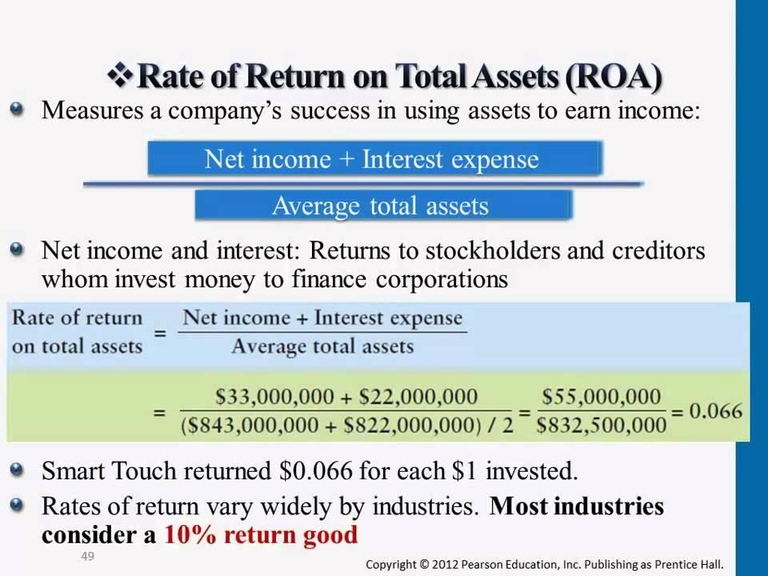

## Table of Contents

## What is Return on Total Assets (ROTA)?

Return on Total Assets (ROTA) is a financial ratio that shows how well a company is using its assets to make money. It tells you the profit a company makes for each dollar of assets it has. To find ROTA, you take the company's earnings before interest and taxes (EBIT) and divide it by the total assets. This ratio is important because it helps investors and managers see if the company is using its assets efficiently.

ROTA is useful for comparing how well different companies are doing, especially if they are in the same industry. A higher ROTA means the company is better at turning its assets into profits. However, ROTA can vary a lot depending on the type of business. For example, a company with a lot of expensive equipment might have a lower ROTA than a company that doesn't need much equipment to operate. It's always a good idea to look at ROTA along with other financial ratios to get a full picture of a company's performance.

## Why is ROTA important for businesses?

ROTA is important for businesses because it shows how well they are using their assets to make money. It tells owners and managers if they are getting a good return on the money they have put into the company. If ROTA is high, it means the business is doing a good job of turning its assets into profits. This can help attract investors because they see that the company is using its resources well.

On the other hand, a low ROTA might mean the company needs to find better ways to use its assets. It can help businesses figure out if they need to sell off some assets or if they should invest in new ones. By looking at ROTA, companies can make smarter decisions about where to put their money to grow and be more profitable.

## How is ROTA calculated?

To calculate Return on Total Assets (ROTA), you need to know two things: the company's earnings before interest and taxes (EBIT) and the total assets the company has. EBIT is the money the company makes before it pays interest on loans and taxes. Total assets are everything the company owns, like buildings, machines, and money in the bank. To find ROTA, you divide the EBIT by the total assets. The formula looks like this: ROTA = EBIT / Total Assets.

ROTA is usually shown as a percentage. For example, if a company's EBIT is $100,000 and its total assets are $1,000,000, the ROTA would be 10%. This means for every dollar of assets, the company makes 10 cents in profit before interest and taxes. It's a simple way to see how well a company is using its assets to make money.

## What is the difference between ROTA and Return on Assets (ROA)?

ROTA and Return on Assets (ROA) are both important ratios that show how well a company is using its assets to make money. The main difference between them is what kind of profit they use in their calculations. ROTA uses earnings before interest and taxes (EBIT), which is the profit a company makes before it pays interest on loans and taxes. On the other hand, ROA uses net income, which is the profit after all expenses, including interest and taxes, have been paid.

Because ROTA uses EBIT, it gives a clearer picture of how well a company's core operations are doing, without the impact of how the company is financed or its tax situation. This makes ROTA useful for comparing companies in different industries or countries where tax rates and financing methods might be different. ROA, however, gives a more complete view of the company's overall profitability because it includes all expenses. Both ratios are helpful, but they tell slightly different stories about a company's performance.

## Can you provide a simple example of ROTA calculation?

Let's say a company called ABC Corp has earnings before interest and taxes (EBIT) of $50,000. They also have total assets worth $500,000. To find the Return on Total Assets (ROTA), we use the formula: ROTA = EBIT / Total Assets. So, we take $50,000 and divide it by $500,000. The result is 0.1, which we then turn into a percentage by multiplying by 100. That gives us a ROTA of 10%.

This means for every dollar of assets ABC Corp has, they make 10 cents in profit before paying interest and taxes. A 10% ROTA shows that ABC Corp is doing a good job of using its assets to make money. If another company in the same industry has a lower ROTA, ABC Corp might be seen as more efficient at turning its assets into profits.

## What are the components of total assets in ROTA?

Total assets in ROTA are all the things a company owns that have value. This includes things like buildings, machines, vehicles, and land. It also includes money in the bank, money owed to the company by customers, and any investments the company has made. All these things together make up the total assets of a company.

When calculating ROTA, you need to add up the value of all these different types of assets. This gives you a complete picture of everything the company has that can be used to make money. By comparing the earnings before interest and taxes (EBIT) to this total, you can see how well the company is using its assets to generate profit.

## How does ROTA help in comparing companies within the same industry?

ROTA helps in comparing companies within the same industry by showing how well each company uses its assets to make money. When you look at the ROTA of different companies, you can see which one is better at turning its buildings, machines, and money into profits. For example, if Company A has a ROTA of 12% and Company B has a ROTA of 8%, you can tell that Company A is doing a better job of using its assets to make money. This can help investors and managers decide where to put their money or how to improve their own company's performance.

However, it's important to remember that ROTA can vary a lot depending on the type of business within an industry. Some companies might need more expensive equipment or have different ways of making money. So, while ROTA is a helpful tool for comparing companies, it's best to use it along with other financial ratios to get a full picture of how well a company is doing. By looking at ROTA and other measures together, you can make smarter decisions about which companies are the best investments or which need to improve their asset management.

## What are the limitations of using ROTA as a performance metric?

ROTA is a useful tool, but it has some limitations. One big problem is that it doesn't consider how a company pays for its assets. Some companies might use a lot of borrowed money, which can make their ROTA look better because they have more assets but also more debt. This can make it hard to compare companies because one might look good on ROTA but have a lot of debt that could be risky.

Another limitation is that ROTA can vary a lot between different industries. A company that needs a lot of expensive equipment, like a factory, might have a lower ROTA than a company that doesn't need much equipment, like a software company. This makes it tricky to use ROTA to compare companies in different industries because what's a good ROTA in one industry might be bad in another. So, it's important to look at ROTA along with other financial measures to get a full picture of a company's performance.

## How can a company improve its ROTA?

A company can improve its ROTA by making more money from what it already owns. This means finding ways to use its buildings, machines, and other assets better. For example, if a factory has machines that aren't being used all the time, the company can try to use them more to make more products and earn more money. Another way is to sell products or services that make more profit. If a company finds that some of its products don't make much money, it can focus on selling the ones that do. By doing this, the company can increase its earnings before interest and taxes (EBIT), which will make its ROTA higher.

Another way to improve ROTA is by getting rid of assets that aren't helping the company make money. If a company has old equipment or buildings that it doesn't need, selling them can help. This will lower the total assets, which can make the ROTA go up because the company is still making the same amount of money but with fewer assets. Also, the company can be smart about buying new assets. Instead of buying something expensive that won't help much, it can invest in things that will make more money. By being careful about what it buys and sells, a company can use its assets better and improve its ROTA.

## What is considered a good ROTA percentage?

A good ROTA percentage can vary a lot depending on the industry a company is in. For example, a company that makes things like cars or machines might have a lower ROTA because they need a lot of expensive equipment. On the other hand, a company that sells software or services might have a higher ROTA because they don't need as much stuff to make money. So, what's considered good can be different for different kinds of businesses.

In general, a ROTA of 5% to 10% is often seen as good for many industries. But it's important to compare a company's ROTA with other companies in the same industry to see if it's doing well. If a company's ROTA is higher than most others in its industry, that's a sign it's using its assets really well to make money.

## How does ROTA relate to other financial ratios like Return on Equity (ROE)?

ROTA and Return on Equity (ROE) both help show how well a company is doing, but they look at different things. ROTA tells you how much profit a company makes before paying interest and taxes for every dollar of assets it has. This means it shows how good the company is at using its buildings, machines, and money to make money. On the other hand, ROE looks at how much profit a company makes after paying all its expenses, including interest and taxes, for every dollar of money that shareholders have put into the company. ROE shows how well the company is using the money that its owners have invested to make more money.

While ROTA focuses on all the assets a company has, ROE focuses only on the money that comes from shareholders. Because of this, ROTA can be a better way to see how well a company is doing at its core business, without worrying about how it's financed or how much it pays in taxes. ROE, however, can be more useful for shareholders because it shows them how much money they are making on their investment. Both ratios are important, but they give you different pieces of information about a company's performance.

## Can you explain an advanced scenario where ROTA might be misleading and how to adjust for it?

ROTA can sometimes be misleading if a company has a lot of debt. Imagine a company called XYZ Corp that buys a lot of new equipment using borrowed money. This makes their total assets go up, but it also means they have to pay a lot of interest on their loans. If you just look at their ROTA, it might look good because their EBIT (earnings before interest and taxes) is high compared to their new, higher total assets. But, the company is actually not doing as well as it seems because it has to pay a lot of interest, which isn't counted in EBIT. This means the company's real profit, after paying interest, is much lower than what ROTA shows.

To adjust for this, you can look at a different ratio called Return on Assets (ROA), which uses net income instead of EBIT. Net income is what the company makes after paying all its expenses, including interest and taxes. By comparing ROA with ROTA, you can see if a company's high ROTA is because of a lot of debt. If ROTA is much higher than ROA, it might mean the company is using a lot of borrowed money to make its ROTA look good. This way, you can get a better idea of how well the company is really doing by looking at both ratios together.

## What is Return on Total Assets (ROTA) and how is it understood?

Return on Total Assets (ROTA) is a financial metric that evaluates a company's ability to generate earnings from its total assets before accounting for interest and taxes. It is represented by the formula:

$$
\text{ROTA} = \frac{\text{EBIT}}{\text{Average Total Assets}}
$$

where EBIT stands for Earnings Before Interest and Taxes. This metric provides valuable insights into a company's operational efficiency, specifically concerning asset utilization. A higher ROTA indicates more efficient use of assets to produce earnings.

ROTA is particularly useful for investors and analysts who wish to compare the operational efficiency of companies within the same industry or across different sectors. Given that asset structures and capital investments can vary widely among firms, ROTA allows for normalization and standardization when analyzing businesses. By focusing on EBIT, ROTA excludes the effects of taxation and financing decisions, thus providing a clearer view of a company's operational performance. 

Investors often use ROTA as a criterion to assess whether a company’s management is utilizing its asset base effectively. A higher ROTA suggests that the management is generating more income per dollar of assets controlled, making it a critical indicator for stakeholder decision-making.

## What is the Formula for Calculating ROTA?

Return on Total Assets (ROTA) is a crucial financial metric that evaluates a company's efficiency in generating earnings from its assets. The formula used to calculate ROTA is straightforward: 

$$
\text{ROTA} = \frac{\text{EBIT}}{\text{Average Total Assets}}
$$

### Components of the Formula

1. **Earnings Before Interest and Taxes (EBIT):** 
   - This component represents a firm's profit generated from its operations, excluding the costs of capital structure and tax considerations. EBIT is crucial as it focuses on a company's operational efficiency, independent of its capital structure, allowing for a more direct comparison across businesses.

2. **Average Total Assets:** 
   - The denominator is the average total assets, which are calculated over a specific period, typically a year. This average is found by adding the beginning and ending total assets for the period and dividing by two. The use of average total assets accounts for fluctuations throughout the year, providing a more stable measure for the analysis.

### Example Calculation

Consider a hypothetical company, XYZ Corp., with the following financial figures for the fiscal year:
- **EBIT:** $500,000
- **Total Assets at the Beginning of the Year:** $2,000,000
- **Total Assets at the End of the Year:** $3,000,000

First, calculate the average total assets:

$$
\text{Average Total Assets} = \frac{\text{Total Assets at the Beginning of the Year} + \text{Total Assets at the End of the Year}}{2}
$$

$$
\text{Average Total Assets} = \frac{2,000,000 + 3,000,000}{2} = 2,500,000
$$

Now, substitute the values into the ROTA formula:

$$
\text{ROTA} = \frac{500,000}{2,500,000} = 0.20 \text{ or } 20\%
$$

This result implies that XYZ Corp is generating a 20% return from its average total assets, indicating how effectively the company utilizes its assets to produce earnings before interest and taxes. Such a calculation provides a benchmark for evaluating asset efficiency against industry peers and across different fiscal periods.

## References & Further Reading

[1]: Bergstra, J., Bardenet, R., Bengio, Y., & Kégl, B. (2011). ["Algorithms for Hyper-Parameter Optimization."](https://dl.acm.org/doi/10.5555/2986459.2986743) Advances in Neural Information Processing Systems 24.

[2]: ["Advances in Financial Machine Learning"](https://www.amazon.com/Advances-Financial-Machine-Learning-Marcos/dp/1119482089) by Marcos Lopez de Prado

[3]: ["Evidence-Based Technical Analysis: Applying the Scientific Method and Statistical Inference to Trading Signals"](https://www.amazon.com/Evidence-Based-Technical-Analysis-Scientific-Statistical/dp/0470008741) by David Aronson

[4]: ["Machine Learning for Algorithmic Trading"](https://github.com/stefan-jansen/machine-learning-for-trading) by Stefan Jansen

[5]: ["Quantitative Trading: How to Build Your Own Algorithmic Trading Business"](https://www.amazon.com/Quantitative-Trading-Build-Algorithmic-Business/dp/1119800064) by Ernest P. Chan