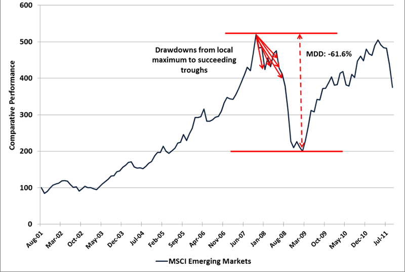

## Table of Contents

## What is Return Over Maximum Drawdown (RoMaD)?

Return Over Maximum Drawdown (RoMaD) is a way to measure how well an investment is doing by comparing its gains to its biggest drop in value. It helps investors see if the returns they are getting are worth the risk they are taking. To calculate RoMaD, you take the total return of an investment and divide it by the maximum drawdown, which is the largest peak-to-trough decline in the value of the investment.

For example, if an investment made a total return of 20% but had a maximum drawdown of 10%, the RoMaD would be 2 (20% divided by 10%). This means the investment returned twice as much as its biggest drop in value. RoMaD is useful because it gives a clearer picture of risk-adjusted performance than just looking at returns alone. It's especially helpful for comparing different investments to see which one offers better returns for the level of risk involved.

## How is Return Over Maximum Drawdown calculated?

Return Over Maximum Drawdown (RoMaD) is a way to see how good an investment is by comparing its gains to its biggest loss. To find RoMaD, you first need to know the total return of the investment. This is how much the investment has grown over a certain time. Then, you need to find the maximum drawdown. This is the largest drop in value the investment has ever had from its highest point to its lowest point during that time.

Once you have these two numbers, you calculate RoMaD by dividing the total return by the maximum drawdown. For example, if an investment grew by 30% but had a biggest drop of 15%, the RoMaD would be 2 (30% divided by 15%). This number tells you how many times the investment's total return is compared to its biggest loss. A higher RoMaD means the investment did well compared to the risk it took.

## Why is Return Over Maximum Drawdown important in investment analysis?

Return Over Maximum Drawdown (RoMaD) is important in investment analysis because it helps investors understand if the returns they are getting are worth the risks they are taking. It does this by comparing the total gains of an investment to its biggest drop in value. This is useful because it gives a clearer picture of how well an investment is doing, beyond just looking at the returns. For example, if two investments have the same return but one has a smaller maximum drawdown, the one with the smaller drawdown would have a higher RoMaD, showing it's a better choice because it's less risky.

RoMaD is also helpful for comparing different investments to see which one offers better returns for the level of risk involved. This can guide investors in making smarter choices about where to put their money. By focusing on RoMaD, investors can avoid investments that might look good because of high returns but actually [carry](/wiki/carry-trading) too much risk. In the end, RoMaD helps investors balance the potential for making money with the risk of losing it, leading to more informed and safer investment decisions.

## Can you explain the concept of 'drawdown' in the context of RoMaD?

In the context of Return Over Maximum Drawdown (RoMaD), a drawdown is a drop in the value of an investment from its highest point to its lowest point. Imagine you bought a stock for $100 and it went up to $120. If it then falls to $100, you have a drawdown of $20, which is the difference between the highest value ($120) and the lowest value ($100) it reached.

Drawdowns are important because they show how risky an investment can be. The bigger the drawdown, the more money you could lose before the investment goes back up. In RoMaD, we look at the maximum drawdown, which is the biggest drop the investment has ever had. By comparing the total return of the investment to this maximum drawdown, RoMaD helps investors see if the gains are worth the risk of those big drops.

## How does Return Over Maximum Drawdown differ from other risk-adjusted performance metrics like Sharpe Ratio?

Return Over Maximum Drawdown (RoMaD) and the Sharpe Ratio are both ways to measure how well an investment is doing when you think about the risk involved, but they look at different kinds of risk. RoMaD focuses on the biggest drop in value that an investment has ever had, called the maximum drawdown. It compares how much the investment has grown to how much it has dropped at its worst. This helps investors see if the gains are worth the biggest loss they might face. 

The Sharpe Ratio, on the other hand, looks at how much extra return you get for taking on more risk, compared to a safe investment like a government bond. It uses something called standard deviation to measure risk, which is a way to see how much the investment's value goes up and down over time. The Sharpe Ratio tells you if the extra returns you're getting are worth the ups and downs. So, while RoMaD is about the worst possible loss, the Sharpe Ratio is about how often and how much the investment's value changes.

## What are the limitations of using Return Over Maximum Drawdown as a performance measure?

Return Over Maximum Drawdown (RoMaD) has some limitations that investors should know about. One big problem is that it only looks at the biggest drop in value, called the maximum drawdown. It doesn't tell you about other smaller drops or how often the value goes up and down. So, an investment could have a good RoMaD but still be risky because it goes up and down a lot.

Another limitation is that RoMaD doesn't think about how long the big drop lasts. A short drop might be easier to handle than a long one, but RoMaD treats them the same. Also, RoMaD can make an investment look good if it had a small drop but a big return, even if that return came from taking a lot of risk. So, it's important to use RoMaD with other measures to get a full picture of an investment's risk and reward.

## How can an investor use RoMaD to compare different investment strategies?

An investor can use Return Over Maximum Drawdown (RoMaD) to compare different investment strategies by looking at how each strategy's total return stacks up against its biggest drop in value. For example, if Strategy A has a total return of 25% and a maximum drawdown of 10%, its RoMaD would be 2.5. If Strategy B has a total return of 30% but a maximum drawdown of 20%, its RoMaD would be 1.5. By comparing these RoMaD values, the investor can see that Strategy A offers better returns for the level of risk involved, as it has a higher RoMaD.

However, it's important for the investor to not rely solely on RoMaD when comparing strategies. RoMaD only tells part of the story because it focuses on the biggest drop and doesn't account for other types of risk or how long the drop lasts. So, the investor should also look at other measures like the Sharpe Ratio, which considers the ups and downs of the investment's value, or the Sortino Ratio, which looks at downside risk. By using RoMaD along with these other metrics, the investor can get a fuller picture of which strategy is truly better, balancing both the potential for returns and the risks involved.

## What historical data is typically required to calculate an accurate RoMaD?

To calculate an accurate Return Over Maximum Drawdown (RoMaD), you need historical data on the investment's value over time. This means you need to know the price or value of the investment at different points in the past. You'll need this data to figure out the total return, which is how much the investment has grown from the start to the end of the time you're looking at. You also need to know the highest and lowest points during that time to find the maximum drawdown, which is the biggest drop in value.

The longer the period of historical data you have, the better your RoMaD calculation will be. This is because a longer time frame gives you a clearer picture of how the investment behaves over time. It helps you see if the big drops are common or rare, and if the total return is steady or comes with a lot of ups and downs. So, to get a good idea of an investment's RoMaD, you should use as much historical data as you can.

## How does the time period of analysis affect the RoMaD?

The time period you choose to analyze can really change the Return Over Maximum Drawdown (RoMaD) number. If you look at a short time, like a few months, you might not see the biggest drop that could happen. So, the RoMaD might look better than it really is. But if you look at a longer time, like many years, you'll see more ups and downs. This means you're more likely to find the biggest drop, and the RoMaD might be lower because it shows the true risk over a long time.

Using a longer time period to calculate RoMaD gives a better picture of how risky an investment is. It's like looking at a whole book instead of just one chapter. You get to see all the big drops and rises, not just a few. This helps you understand if the returns are worth the risk over time. So, when you're trying to figure out RoMaD, it's smart to use as much historical data as you can to make sure you're seeing the full story.

## Are there any specific sectors or asset classes where RoMaD is more commonly used?

Return Over Maximum Drawdown (RoMaD) is often used in sectors where investments can be very risky, like hedge funds and trading strategies. These areas can have big ups and downs, so it's helpful to know if the gains are worth the biggest drops. Hedge fund managers and traders use RoMaD to show how well they're doing compared to the risks they're taking. It's a good way to see if their strategies are really paying off.

RoMaD is also used a lot in the world of commodities and [forex](/wiki/forex-system) trading. These markets can be very unpredictable, and prices can change a lot. Investors in these areas want to know if the returns they're getting are worth the risk of big losses. By using RoMaD, they can compare different investments or trading strategies and pick the ones that offer the best balance of returns and risk.

## How can RoMaD be integrated into a broader risk management framework?

Return Over Maximum Drawdown (RoMaD) can be a helpful part of a bigger plan to manage risk. It looks at how much an investment grows compared to its biggest drop in value. By using RoMaD, investors can see if the money they might make is worth the risk of big losses. This helps them make smarter choices about where to put their money. They can use RoMaD along with other ways to measure risk, like the Sharpe Ratio, which looks at how much an investment goes up and down, and the Sortino Ratio, which focuses on bad drops. By putting all these measures together, investors can get a full picture of the risks they're taking and make better decisions.

In a risk management plan, RoMaD can also help set rules for how much risk to take. For example, an investor might decide not to put money into an investment if its RoMaD is too low, because that means the biggest drop is too big compared to the returns. They can also use RoMaD to keep an eye on their investments and see if they're doing as well as they should. If an investment's RoMaD starts to drop, it might be a sign to sell it and find something safer. By using RoMaD this way, investors can keep their money safer and still try to make good returns.

## What advanced techniques can be used to optimize investment portfolios using RoMaD?

One way to use Return Over Maximum Drawdown (RoMaD) to make a better investment portfolio is by changing the mix of investments to find the best balance between making money and taking risks. You can use a computer to try out different mixes of stocks, bonds, and other things you might invest in. The computer looks at how each mix has done in the past and figures out its RoMaD. By trying many different mixes, you can find the one that gives you the highest RoMaD, meaning it has the best chance of making good returns without big drops in value. This helps you build a portfolio that grows well but is also safe.

Another way to use RoMaD is by setting rules for when to buy or sell investments. For example, you might decide to sell an investment if its RoMaD gets too low, because that means the biggest drop is too big compared to the returns. On the other hand, you might buy more of an investment if its RoMaD goes up, showing it's doing better than before. By using these rules, you can keep your portfolio in good shape, always trying to make more money while keeping the risk low. This way, RoMaD helps you make smart moves with your investments to keep them growing safely.

## What is RoMaD?

Return Over Maximum Drawdown (RoMaD) is a risk-adjusted return metric employed to evaluate the performance of an investment portfolio by comparing its overall return against its maximum drawdown. Unlike other common risk assessment metrics such as the Sharpe Ratio, which considers the return-to-[volatility](/wiki/volatility-trading-strategies) relationship, or the Sortino Ratio, which focuses on downside deviation, RoMaD provides a unique perspective by focusing on the balance between achieved returns and the worst-case historical losses incurred by the portfolio.

Mathematically, RoMaD is calculated by dividing the portfolio's total return by its maximum drawdown, as shown in the formula below:

$$
\text{RoMaD} = \frac{\text{Portfolio Return}}{\text{Maximum Drawdown}}
$$

Maximum drawdown represents the largest observed loss from a peak to a trough of a portfolio before a new peak is reached. This measure is crucial for understanding the potential depth of loss that can occur during a downturn.

RoMaD finds its primary application in the evaluation of [hedge fund](/wiki/hedge-fund-trading-strategies) performance, where it is critical to assess the extent of adverse risk events in relation to returns. Hedge funds, often characterized by complex and leveraged strategies, benefit from RoMaD as it reflects not merely the potential returns but also sheds light on the risks endured to achieve those returns. A higher RoMaD indicates a more favorable risk-return balance, suggesting efficiency in gaining returns relative to the risks taken, and is a desirable objective for many investors focused on sustained returns with minimized drawdowns.

## What is Understanding Maximum Drawdown?

Maximum Drawdown (MDD) is a key metric used in finance to evaluate the risk inherent in investment portfolios. It quantifies the largest loss from a peak value to a trough before a new peak is reached. By expressing this decline as a percentage of the peak value, MDD illustrates the severity of drop an investor might face during adverse market conditions. 

Formally, if $P(t)$ represents the portfolio value at time $t$, the maximum drawdown is calculated as follows:

1. **Calculate the peak and trough:**
$$
   \text{Peak} = \max \{ P(t) \mid t \in [0, T] \}

$$
$$
   \text{Trough after Peak} = \min \{ P(t) \mid t \text{ occurs after the Peak and before the next new Peak} \}

$$

2. **Determine the maximum drawdown:**
$$
   MDD = \frac{\text{Peak} - \text{Trough}}{\text{Peak}}

$$

This calculation allows investors to understand the worst-case scenario regarding portfolio value during the investment period. MDD highlights the most significant decline a portfolio can suffer, offering a perspective on potential losses and the time recovery might take if such an event occurs. 

For investors focused on risk management, MDD serves a critical role by pinpointing moments of significant financial stress, enabling strategies to hedge against these occurrences. By understanding MDD, investors can design more resilient portfolios, adapting strategies to reduce susceptibility to debilitating drawdowns. This understanding supports critical decision-making processes, particularly for those seeking to incorporate prudent risk management techniques within their investment frameworks.

## What are the examples and applications of RoMaD?

Consider a portfolio that experiences a peak value of $1000 and subsequently falls to $800 before achieving an annual return of 10%. In this instance, the maximum drawdown (MDD) is calculated as follows:

$$
\text{MDD} = \frac{\text{Peak Value} - \text{Lowest Value}}{\text{Peak Value}} = \frac{1000 - 800}{1000} = 0.20 \, \text{or} \, 20\%.
$$

The portfolio's return, given the 10% annual growth, can be expressed in absolute terms. Assuming the lowest point of $800 recovers to achieve this return, the new value becomes $880 by the end of the year.

To calculate RoMaD (Return Over Maximum Drawdown), use the formula:

$$
\text{RoMaD} = \frac{\text{Portfolio Return}}{\text{Maximum Drawdown}} = \frac{0.10}{0.20} = 0.5.
$$

This RoMaD of 0.5 indicates that for every unit of drawdown endured, the portfolio gained only half that unit in return over the assessment period.

Comparing portfolios with similar returns but differing drawdowns can shed light on the safer investment option. For example, if another portfolio also yields a 10% return but with only a 10% drawdown, its RoMaD would be:

$$
\text{RoMaD} = \frac{0.10}{0.10} = 1.0.
$$

With a higher RoMaD of 1.0, this portfolio demonstrates a more favorable risk-adjusted performance, suggesting it as a potentially safer investment option.

Another practical application of RoMaD involves historical evaluation to guide future investment decisions. Investors can analyze past performance, assessing RoMaD across different market conditions to identify strategies that consistently outperform on a risk-adjusted basis. By integrating this analysis, investors can make informed choices, potentially leading to improved risk management and return optimization in their portfolios.

## How can you implement RoMaD in your portfolio?

To effectively implement Return Over Maximum Drawdown (RoMaD) in your portfolio, begin by analyzing historical drawdowns and understanding the recovery paths of your investments. This involves looking at past performance data to identify periods during which your investment value declined from a peak to a trough and how efficiently the portfolio recovered thereafter. By calculating the maximum drawdown (MDD) for different time periods, you can establish a baseline for assessing risk.

To calculate RoMaD, use the following formula:

$$
\text{RoMaD} = \frac{\text{Portfolio Return}}{\text{Maximum Drawdown}}
$$

For instance, if a portfolio has an annual return of 15% and a maximum drawdown of 10%, 

$$
\text{RoMaD} = \frac{15\%}{10\%} = 1.5
$$

Next, adjust your portfolio allocations to enhance the RoMaD ratio. A diversified approach is often recommended to mitigate risks further. This can involve reallocating assets to include a mix of equities, fixed-income securities, and alternative investments. By doing so, you aim to minimize the impact of market volatility on your portfolio, thereby improving the RoMaD.

Continuous monitoring of the RoMaD ratio is essential. This involves regularly updating your calculations as new data becomes available and adjusting your strategies to account for this data. Market dynamics are ever-changing, and staying informed about these changes helps in fine-tuning your portfolio to maintain optimized risk-return profiles.

Example Python code: To automate the RoMaD calculation for different periods:

```python
def calculate_romad(returns, drawdowns):
    if min(drawdowns) == 0:
        raise ValueError("Maximum drawdown cannot be zero.")
    return returns / min(drawdowns)

# Example for annual data
annual_returns = [0.15, 0.10, 0.12]
annual_drawdowns = [-0.10, -0.15, -0.07]

romad_values = [calculate_romad(r, d) for r, d in zip(annual_returns, annual_drawdowns)]
print(romad_values)
```

By integrating RoMaD into your portfolio management, you can potentially realize better aggregate returns while maintaining a lower risk exposure. This approach helps not only in safeguarding your investments but also maximizing their potential gains over time. Remember, by fostering a proactive adjustment and monitoring strategy, you can significantly enhance the long-term performance and resilience of your investment portfolio.

## References & Further Reading

[1]: Bacon, C. R. (2008). ["Practical Portfolio Performance Measurement and Attribution."](https://onlinelibrary.wiley.com/doi/book/10.1002/9781119206309) John Wiley & Sons.

[2]: Maginn, J. L., Tuttle, D. L., Pinto, J. E., & McLeavey, D. W. (2007). ["Managing Investment Portfolios: A Dynamic Process."](https://www.amazon.com/Managing-Investment-Portfolios-Dynamic-Process/dp/0470080140) John Wiley & Sons.

[3]: Kestner, L. N. (1996). ["Getting a Handle on True Performance."](https://www.academia.edu/40006464/PERFORMANCE_GAUGING_OF_PORTFOLIO_LUENBERGER_DISTANCE_FUNCTION_APPROACH_ON_SARAJEVO_STOCK_EXCHANGE) Futures, April 1996.

[4]: Sortino, F. A., & Satchell, S. (2001). ["Managing Downside Risk in Financial Markets."](https://www.sciencedirect.com/book/9780750648639/managing-downside-risk-in-financial-markets) Butterworth-Heinemann.

[5]: Allen, L., & Karjalainen, R. (1999). ["Using Genetic Algorithms to Find Technical Trading Rules."](https://www.sciencedirect.com/science/article/pii/S0304405X9800052X) Journal of Financial Economics, 51(2), 245-271.