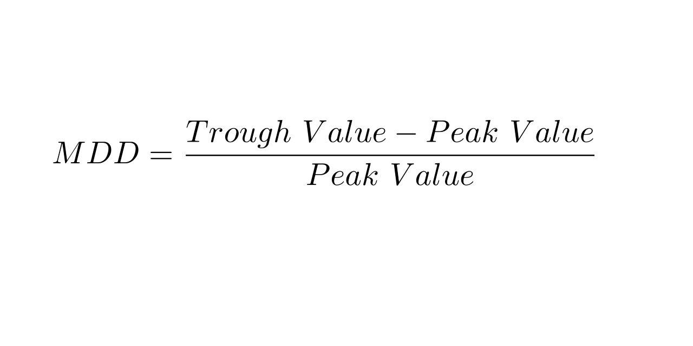

The financial world is filled with metrics that help investors gauge performance and risk. These metrics provide investors with critical insights needed to make informed decisions. Among these, Return Over Maximum Drawdown (RoMaD) stands out as a valuable tool in risk management, especially prevalent in algorithmic trading. RoMaD combines the concept of potential returns with the reality of historical drawdowns, offering a more comprehensive view of investment performance than traditional metrics like the Sharpe or Sortino ratios.

This article aims to elucidate RoMaD's significance, its calculation, and its role in investment strategies. By presenting a risk-adjusted return analysis, RoMaD allows for assessing both the performance and the inherent risk within a portfolio, offering a more balanced perspective in risk assessment. For investors, particularly those engaged in algorithmic trading, RoMaD is invaluable. It provides a nuanced approach to maximizing returns while maintaining a conservative risk profile, enabling investors to make decisions that are both strategic and informed.



As we navigate through the intricacies of RoMaD, we will highlight its importance in constructing robust investment strategies and explore methods for its implementation within a portfolio to enhance risk management and return optimization. By leveraging the insights RoMaD provides, investors can strive to achieve superior returns while managing associated risks effectively.

## Table of Contents

## What is RoMaD?

Return Over Maximum Drawdown (RoMaD) is a risk-adjusted return metric employed to evaluate the performance of an investment portfolio by comparing its overall return against its maximum drawdown. Unlike other common risk assessment metrics such as the Sharpe Ratio, which considers the return-to-volatility relationship, or the Sortino Ratio, which focuses on downside deviation, RoMaD provides a unique perspective by focusing on the balance between achieved returns and the worst-case historical losses incurred by the portfolio.

Mathematically, RoMaD is calculated by dividing the portfolio's total return by its maximum drawdown, as shown in the formula below:

$$
\text{RoMaD} = \frac{\text{Portfolio Return}}{\text{Maximum Drawdown}}
$$

Maximum drawdown represents the largest observed loss from a peak to a trough of a portfolio before a new peak is reached. This measure is crucial for understanding the potential depth of loss that can occur during a downturn.

RoMaD finds its primary application in the evaluation of [hedge fund](/wiki/hedge-fund-trading-strategies) performance, where it is critical to assess the extent of adverse risk events in relation to returns. Hedge funds, often characterized by complex and leveraged strategies, benefit from RoMaD as it reflects not merely the potential returns but also sheds light on the risks endured to achieve those returns. A higher RoMaD indicates a more favorable risk-return balance, suggesting efficiency in gaining returns relative to the risks taken, and is a desirable objective for many investors focused on sustained returns with minimized drawdowns.

## Understanding Maximum Drawdown

Maximum Drawdown (MDD) is a key metric used in finance to evaluate the risk inherent in investment portfolios. It quantifies the largest loss from a peak value to a trough before a new peak is reached. By expressing this decline as a percentage of the peak value, MDD illustrates the severity of drop an investor might face during adverse market conditions. 

Formally, if $P(t)$ represents the portfolio value at time $t$, the maximum drawdown is calculated as follows:

1. **Calculate the peak and trough:**
$$
   \text{Peak} = \max \{ P(t) \mid t \in [0, T] \}

$$
$$
   \text{Trough after Peak} = \min \{ P(t) \mid t \text{ occurs after the Peak and before the next new Peak} \}

$$

2. **Determine the maximum drawdown:**
$$
   MDD = \frac{\text{Peak} - \text{Trough}}{\text{Peak}}

$$

This calculation allows investors to understand the worst-case scenario regarding portfolio value during the investment period. MDD highlights the most significant decline a portfolio can suffer, offering a perspective on potential losses and the time recovery might take if such an event occurs. 

For investors focused on risk management, MDD serves a critical role by pinpointing moments of significant financial stress, enabling strategies to hedge against these occurrences. By understanding MDD, investors can design more resilient portfolios, adapting strategies to reduce susceptibility to debilitating drawdowns. This understanding supports critical decision-making processes, particularly for those seeking to incorporate prudent risk management techniques within their investment frameworks.

## Importance of RoMaD in Investment Strategies

RoMaD provides investors with critical insights into the efficiency of their investment strategies by examining the relationship between potential rewards and associated risks. It emphasizes the maximum drawdown relative to returns, enabling investors to gauge the risk-reward tradeoff more effectively. High RoMaD values are often sought after by investors as they signify the attainment of substantial returns for the risks undertaken, reflecting a well-optimized investment strategy.

In contexts characterized by market [volatility](/wiki/volatility-trading-strategies), RoMaD's robustness becomes increasingly valuable. A strong RoMaD ratio can serve as an indicator of a well-balanced and risk-averse investment approach. It suggests that the strategy employed is capable of managing risks while maximizing returns. This quality is particularly appealing in unstable market conditions, where the capacity to absorb shocks and maintain profitability is crucial.

RoMaD's emphasis on balancing the drawdown against returns provides a nuanced perspective on portfolio performance, allowing investors to make better-informed decisions. By prioritizing strategies that yield high RoMaD values, investors can ensure that they are not only pursuing high returns but also maintaining a disciplined approach to risk management. This balance is essential for sustaining long-term investment growth and achieving financial goals with reduced exposure to extreme losses.

## Algorithmic Trading and RoMaD

Algorithmic trading, a method that employs computer algorithms to execute trading decisions, revolves around data analysis and automation. The integration of Return Over Maximum Drawdown (RoMaD) as a performance metric in [algorithmic trading](/wiki/algorithmic-trading) offers strategic advantages. RoMaD serves as a critical benchmark for assessing the efficiency and risk profile of trading algorithms.

One of the primary benefits of using RoMaD in algorithmic trading lies in its ability to optimize performance under varying market conditions. Algorithms can be programmed to maximize RoMaD by adjusting trading parameters dynamically. This optimization ensures that trading strategies not only seek to enhance returns but also control drawdowns effectively. For instance, an algorithm could be designed to minimize exposure during high-volatility periods when the potential for significant drawdowns is heightened, thereby improving the RoMaD ratio.

Incorporating RoMaD in trading algorithms also enhances automated risk assessments and decision-making processes. By continuously analyzing RoMaD, algorithms can make more informed decisions about entry and [exit](/wiki/exit-strategy) points, risk exposure, and position sizing. This integration allows the algorithm to function adaptively, refining strategies based on real-time data to maintain an optimal balance between risk and reward. 

Furthermore, RoMaD measurements can be used to continually optimize algorithms, thereby mitigating large losses while promoting gains. Through [backtesting](/wiki/backtesting) and simulation, traders can evaluate the performance of various algorithmic strategies using historical data. Here's a simple Python code snippet to illustrate how RoMaD calculations might be integrated into an algorithmic trading system:

```python
def calculate_romad(portfolio_returns, max_drawdown):
    return portfolio_returns / max_drawdown

# Example usage
portfolio_returns = 0.1  # 10% annual return
max_drawdown = 0.2       # 20% maximum drawdown
romad = calculate_romad(portfolio_returns, max_drawdown)
print(f"RoMaD: {romad}")
```

This continuous assessment and refinement process is crucial in algorithmic trading, as it allows for the sustainable pursuit of superior performance while managing risk. By systematically integrating RoMaD into trading algorithms, traders can navigate complex market landscapes with a structured, quantified approach to risk management and performance optimization.

## Examples and Applications of RoMaD

Consider a portfolio that experiences a peak value of $1000 and subsequently falls to $800 before achieving an annual return of 10%. In this instance, the maximum drawdown (MDD) is calculated as follows:

$$
\text{MDD} = \frac{\text{Peak Value} - \text{Lowest Value}}{\text{Peak Value}} = \frac{1000 - 800}{1000} = 0.20 \, \text{or} \, 20\%.
$$

The portfolio's return, given the 10% annual growth, can be expressed in absolute terms. Assuming the lowest point of $800 recovers to achieve this return, the new value becomes $880 by the end of the year.

To calculate RoMaD (Return Over Maximum Drawdown), use the formula:

$$
\text{RoMaD} = \frac{\text{Portfolio Return}}{\text{Maximum Drawdown}} = \frac{0.10}{0.20} = 0.5.
$$

This RoMaD of 0.5 indicates that for every unit of drawdown endured, the portfolio gained only half that unit in return over the assessment period.

Comparing portfolios with similar returns but differing drawdowns can shed light on the safer investment option. For example, if another portfolio also yields a 10% return but with only a 10% drawdown, its RoMaD would be:

$$
\text{RoMaD} = \frac{0.10}{0.10} = 1.0.
$$

With a higher RoMaD of 1.0, this portfolio demonstrates a more favorable risk-adjusted performance, suggesting it as a potentially safer investment option.

Another practical application of RoMaD involves historical evaluation to guide future investment decisions. Investors can analyze past performance, assessing RoMaD across different market conditions to identify strategies that consistently outperform on a risk-adjusted basis. By integrating this analysis, investors can make informed choices, potentially leading to improved risk management and return optimization in their portfolios.

## Limitations and Considerations

Despite its advantages, Return Over Maximum Drawdown (RoMaD) isn't without flaws and should be considered alongside other financial metrics for a comprehensive investment analysis. One of the primary limitations of RoMaD is its retrospective nature. As a metric that relies heavily on historical data, it focuses solely on past drawdowns and returns. This backward-looking perspective may not accurately represent or predict future market conditions or risks. Consequently, investors relying solely on RoMaD may overlook emerging market trends or unprecedented economic shifts that could impact future investment performance.

Moreover, a low RoMaD does not inherently signify poor investment quality. Rather, it necessitates a more nuanced risk assessment. A portfolio may exhibit a low RoMaD but still align with an investor's risk tolerance and financial objectives, possibly due to strategic considerations or external market factors. The low metric should prompt a deeper examination of the underlying assets and market conditions rather than an immediate dismissal of the investment.

Understanding these limitations is crucial for investors to effectively incorporate RoMaD into their risk management strategies. It is not a stand-alone indicator, and its insights should be balanced with other financial metrics to provide a more holistic view of an investment's potential. Metrics such as the Sharpe Ratio, beta coefficient, and even qualitative factors can complement RoMaD, offering broader insights into risk and return dynamics.

By recognizing the intrinsic limitations of RoMaD and using it judiciously with a suite of other analytical tools, investors can more accurately assess risks and make informed decisions. This strategic approach ensures a robust evaluation and optimization of portfolios, allowing for both risk mitigation and potential maximization of returns.

## Implementing RoMaD in Your Portfolio

To effectively implement Return Over Maximum Drawdown (RoMaD) in your portfolio, begin by analyzing historical drawdowns and understanding the recovery paths of your investments. This involves looking at past performance data to identify periods during which your investment value declined from a peak to a trough and how efficiently the portfolio recovered thereafter. By calculating the maximum drawdown (MDD) for different time periods, you can establish a baseline for assessing risk.

To calculate RoMaD, use the following formula:

$$
\text{RoMaD} = \frac{\text{Portfolio Return}}{\text{Maximum Drawdown}}
$$

For instance, if a portfolio has an annual return of 15% and a maximum drawdown of 10%, 

$$
\text{RoMaD} = \frac{15\%}{10\%} = 1.5
$$

Next, adjust your portfolio allocations to enhance the RoMaD ratio. A diversified approach is often recommended to mitigate risks further. This can involve reallocating assets to include a mix of equities, fixed-income securities, and alternative investments. By doing so, you aim to minimize the impact of market volatility on your portfolio, thereby improving the RoMaD.

Continuous monitoring of the RoMaD ratio is essential. This involves regularly updating your calculations as new data becomes available and adjusting your strategies to account for this data. Market dynamics are ever-changing, and staying informed about these changes helps in fine-tuning your portfolio to maintain optimized risk-return profiles.

Example Python code: To automate the RoMaD calculation for different periods:

```python
def calculate_romad(returns, drawdowns):
    if min(drawdowns) == 0:
        raise ValueError("Maximum drawdown cannot be zero.")
    return returns / min(drawdowns)

# Example for annual data
annual_returns = [0.15, 0.10, 0.12]
annual_drawdowns = [-0.10, -0.15, -0.07]

romad_values = [calculate_romad(r, d) for r, d in zip(annual_returns, annual_drawdowns)]
print(romad_values)
```

By integrating RoMaD into your portfolio management, you can potentially realize better aggregate returns while maintaining a lower risk exposure. This approach helps not only in safeguarding your investments but also maximizing their potential gains over time. Remember, by fostering a proactive adjustment and monitoring strategy, you can significantly enhance the long-term performance and resilience of your investment portfolio.

## Conclusion

RoMaD provides a comprehensive measure of the relationship between risk and return, derived from the analysis of historical performance data. Its primary application has been within hedge fund evaluations, where understanding the interplay between potential gains and significant losses is critical for investors. As the financial industry moves towards automation, RoMaD's integration into algorithmic trading systems represents an advancement in evaluating trading strategies. This integration allows algorithms to be optimized based on RoMaD metrics, ensuring that trading decisions are data-driven and risk-conscious.

Investors who incorporate RoMaD into their portfolios gain a clear understanding of their risk exposure relative to their returns. The metric serves as an indicator of efficiency, shedding light on how well an investment strategy is functioning in terms of balancing reward against risk of loss. The insights offered by RoMaD empower investors to make informed decisions, effectively managing and mitigating potential financial risks. 

Overall, the application of RoMaD is invaluable for those seeking to enhance their investment portfolios. It not only aids in achieving superior aggregate returns but also ensures that the risks undertaken are well-justified and strategically sound. As such, RoMaD stands out as an essential tool for prudent investors dedicated to maximizing their returns with a measured approach to risk management.

## References & Further Reading

[1]: Bacon, C. R. (2008). ["Practical Portfolio Performance Measurement and Attribution."](https://onlinelibrary.wiley.com/doi/book/10.1002/9781119206309) John Wiley & Sons.

[2]: Maginn, J. L., Tuttle, D. L., Pinto, J. E., & McLeavey, D. W. (2007). ["Managing Investment Portfolios: A Dynamic Process."](https://www.amazon.com/Managing-Investment-Portfolios-Dynamic-Process/dp/0470080140) John Wiley & Sons.

[3]: Kestner, L. N. (1996). ["Getting a Handle on True Performance."](https://www.academia.edu/40006464/PERFORMANCE_GAUGING_OF_PORTFOLIO_LUENBERGER_DISTANCE_FUNCTION_APPROACH_ON_SARAJEVO_STOCK_EXCHANGE) Futures, April 1996.

[4]: Sortino, F. A., & Satchell, S. (2001). ["Managing Downside Risk in Financial Markets."](https://www.sciencedirect.com/book/9780750648639/managing-downside-risk-in-financial-markets) Butterworth-Heinemann.

[5]: Allen, L., & Karjalainen, R. (1999). ["Using Genetic Algorithms to Find Technical Trading Rules."](https://www.sciencedirect.com/science/article/pii/S0304405X9800052X) Journal of Financial Economics, 51(2), 245-271.