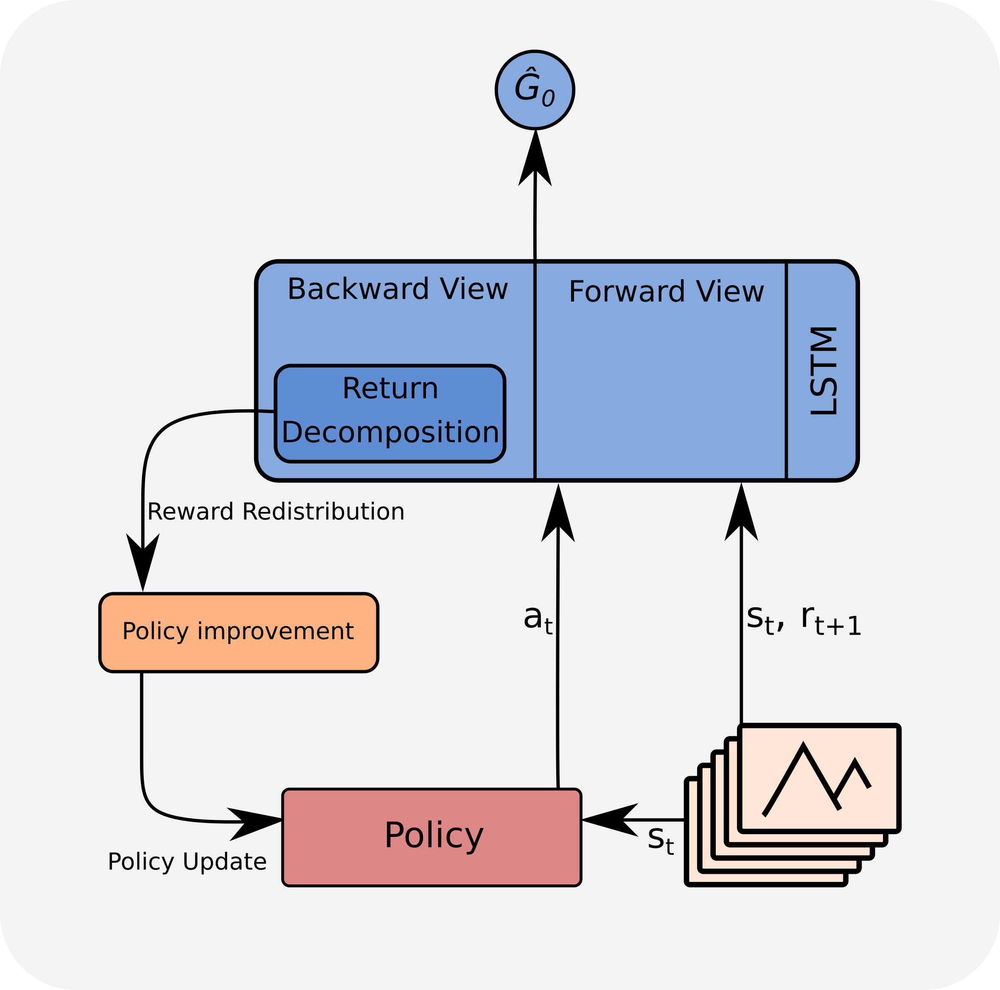

## Table of Contents

## What is return in the context of machine learning?

In the context of machine learning, "return" usually refers to the outcome or result that a model predicts or the actual value that it tries to predict. For example, if you are using a machine learning model to predict stock prices, the return would be the predicted stock price. This concept is central to supervised learning, where the model learns from a dataset that includes both input features and their corresponding returns or labels. The model's goal is to find a pattern or relationship between the inputs and the returns so that it can make accurate predictions on new, unseen data.

In reinforcement learning, "return" has a more specific meaning. It represents the total reward an agent accumulates over time as it interacts with an environment. The return is calculated using a formula that considers immediate rewards and future rewards, often discounted by a factor to reflect the decreasing value of rewards received further in the future. For example, if an agent is learning to play a game, the return would be the sum of all the points or rewards it gets during the game. This concept helps the agent learn which actions lead to the best overall outcomes, guiding its decision-making process to maximize the total return.

## How does the concept of return relate to reinforcement learning?

In reinforcement learning, the concept of return is very important. It's like the total score an agent gets while playing a game or doing a task. The return is all the rewards the agent collects added together. But, rewards that come later are not as important as rewards that come right away. So, we use something called a discount factor to make future rewards less valuable. This helps the agent focus on doing well now, but also think about what will happen later.

The return is calculated using a special formula. If we call the reward at each step 'r' and the discount factor 'gamma', the return 'G' can be written like this: $$ G_t = r_{t+1} + \gamma r_{t+2} + \gamma^2 r_{t+3} + ... $$. This formula shows that the return at time 't' is the sum of all future rewards, but each reward is multiplied by a smaller and smaller number as time goes on. By using this formula, the agent can figure out which actions will lead to the best total score over time. This helps the agent learn to make smart choices to get the highest return possible.

## What is the difference between immediate and cumulative return?

Immediate return is the reward an agent gets right after taking an action. It's like getting a point for doing something good right away. In a game, if you score a goal, the immediate return might be the points you get for that goal. The agent focuses on what happens now, and it's easy to see because it's right in front of you.

Cumulative return, on the other hand, is the total of all the rewards an agent gets over time. It's not just about what happens now, but also what happens later. In a game, the cumulative return would be the total score at the end, which includes all the points from all the goals you scored. The cumulative return is calculated using a formula that adds up all the immediate returns but makes future rewards less important. The formula looks like this: $$ G_t = r_{t+1} + \gamma r_{t+2} + \gamma^2 r_{t+3} + ... $$, where 'r' is the reward at each step and 'gamma' is a number that makes future rewards smaller. This helps the agent think about the big picture and make choices that will lead to the best total score.

## How is return calculated in a Markov Decision Process?

In a Markov Decision Process (MDP), return is calculated by adding up all the rewards an agent gets over time. But, rewards that come later are not as important as rewards that come right away. So, we use a discount factor, called gamma, to make future rewards less valuable. The return at any time step 't' is called the cumulative return or total return. It's the sum of all the future rewards, but each future reward is multiplied by a smaller number as time goes on. The formula to calculate the return at time 't' is $$ G_t = r_{t+1} + \gamma r_{t+2} + \gamma^2 r_{t+3} + ... $$, where 'r' is the reward at each step and 'gamma' is the discount factor.

This formula helps the agent in an MDP figure out which actions will lead to the best total score over time. By using the discount factor, the agent can focus on doing well now, but also think about what will happen later. The goal is to choose actions that will maximize the cumulative return, which means getting the highest total score possible. This way, the agent learns to make smart choices that consider both immediate and future rewards.

## What role does the discount factor play in calculating return?

The discount factor, often called gamma, is really important when we calculate the return in reinforcement learning. It's a number between 0 and 1 that makes future rewards less valuable than rewards we get right now. Think of it like this: if you had a choice between getting $1 today or $1 in a year, you'd probably want the money today because you could use it right away. The discount factor works the same way; it makes rewards that come later smaller, so the agent focuses on doing well now but also thinks about what will happen later.

The formula to calculate the return at time 't' is $$ G_t = r_{t+1} + \gamma r_{t+2} + \gamma^2 r_{t+3} + ... $$. In this formula, 'r' is the reward at each step, and 'gamma' is the discount factor. If gamma is close to 1, the agent cares a lot about future rewards. But if gamma is close to 0, the agent mostly cares about what happens right now. By using the discount factor, the agent can figure out which actions will lead to the best total score over time, helping it make smart choices that consider both immediate and future rewards.

## Can you explain the concept of expected return and its importance?

Expected return in reinforcement learning is like guessing how much reward an agent will get in the future if it keeps making choices. It's not just about what happens now, but what might happen later too. Imagine you're playing a game and trying to figure out how many points you'll end up with if you keep making certain moves. The expected return helps the agent make smart choices by thinking about all the possible future rewards, not just the ones it can see right away. It's like looking at a map to plan the best route to get to your destination, considering all the possible paths and their outcomes.

The importance of expected return lies in guiding the agent to make decisions that will lead to the best overall outcome. By calculating the expected return, the agent can figure out which actions are likely to give it the highest total score over time. This helps the agent learn from its experiences and improve its strategy. The formula for expected return is $$ E[G_t] = E[r_{t+1} + \gamma r_{t+2} + \gamma^2 r_{t+3} + ...] $$, where 'E' means expected value, 'r' is the reward at each step, and 'gamma' is the discount factor that makes future rewards less important. By using this, the agent can balance between getting rewards now and planning for future rewards, which is key to doing well in the long run.

## How do returns influence the learning process in reinforcement learning algorithms?

In reinforcement learning, returns play a big role in helping the agent learn how to do things better. The return is like the total score the agent gets over time. When the agent does something, it gets a reward, and the return is all these rewards added up. But, rewards that come later are not as important as the ones that come right away. So, we use something called a discount factor to make future rewards smaller. This helps the agent focus on doing well now but also think about what will happen later. The formula to calculate the return at time 't' is $$ G_t = r_{t+1} + \gamma r_{t+2} + \gamma^2 r_{t+3} + ... $$, where 'r' is the reward at each step and 'gamma' is the discount factor. By looking at the return, the agent can figure out which actions will lead to the best total score over time.

Returns influence the learning process by guiding the agent to make smarter choices. When the agent tries different actions and sees the returns, it can learn which actions lead to higher total scores. This is like playing a game and figuring out which moves give you more points. The agent uses the returns to update its strategy, trying to get a higher return next time. This way, the agent gets better at the task over time. The expected return, which is like guessing how much reward the agent will get in the future, also helps. The formula for expected return is $$ E[G_t] = E[r_{t+1} + \gamma r_{t+2} + \gamma^2 r_{t+3} + ...] $$. By thinking about the expected return, the agent can plan its actions to get the best overall outcome, making it a key part of learning in reinforcement learning algorithms.

## What are some common strategies for maximizing return in reinforcement learning?

In reinforcement learning, one common strategy to maximize return is called Q-learning. Q-learning helps the agent learn which actions are best in different situations. It does this by keeping track of something called a Q-value for each action in each state. The Q-value is like a score that tells the agent how good it is to take a certain action. The agent updates these Q-values based on the rewards it gets and the expected future rewards. By choosing actions with the highest Q-values, the agent tries to get the highest return possible. The formula for updating Q-values in Q-learning is $$ Q(s, a) \leftarrow Q(s, a) + \alpha \left( r + \gamma \max_{a'} Q(s', a') - Q(s, a) \right) $$, where 's' is the current state, 'a' is the action taken, 'r' is the reward received, 's'' is the next state, 'a'' is the next action, 'alpha' is the learning rate, and 'gamma' is the discount factor.

Another strategy is called policy gradient methods. These methods work by directly changing the agent's strategy, or policy, to get a higher return. The policy tells the agent which action to take in each state. Policy gradient methods use the returns the agent gets to figure out how to change the policy to do better next time. They do this by calculating something called the gradient, which shows how much the return changes when the policy changes a little bit. By following the gradient, the agent can slowly improve its policy to get higher returns. This can be especially useful in tasks where the best action is not clear and the agent needs to explore different possibilities to find the best way to do things.

## How does the choice of return function affect the performance of a reinforcement learning agent?

The choice of return function in reinforcement learning can really change how well the agent does its job. The return function is like a score that tells the agent how good it's doing over time. If the return function is set up to focus on immediate rewards, the agent might do things that give it points right away but might not be the best in the long run. On the other hand, if the return function is set up to care more about future rewards, the agent might make choices that don't seem good now but will lead to a higher total score later. The discount factor, which is part of the return function, is really important here. It's a number between 0 and 1 that makes future rewards less important than rewards right now. If the discount factor is close to 1, the agent will think more about the future, and if it's close to 0, the agent will focus more on what's happening now.

The return function also affects how the agent learns and improves over time. For example, if the return function is set up to give a high score for reaching a goal quickly, the agent will learn to find the fastest way to that goal. But if the return function rewards the agent for exploring different ways to do things, the agent might take longer to reach the goal but will learn more about the environment. This can help the agent do better in different situations. The formula for calculating the return at time 't' is $$ G_t = r_{t+1} + \gamma r_{t+2} + \gamma^2 r_{t+3} + ... $$, where 'r' is the reward at each step and 'gamma' is the discount factor. By changing the return function, like adjusting the discount factor or the way rewards are given, people can make the agent focus on different things and perform better in the tasks it's meant to do.

## What are the challenges associated with estimating return in complex environments?

Estimating return in complex environments can be really tough. One big challenge is that the environment might have a lot of different states and actions, which makes it hard for the agent to figure out what will happen in the future. Imagine trying to predict the weather in a place where it changes a lot – it's not easy! The agent needs to explore a lot to understand how the environment works, but this can take a long time and the agent might make a lot of mistakes along the way. Also, if the environment changes over time, what the agent learned before might not be useful anymore, so it has to keep learning and adapting.

Another challenge is dealing with uncertainty. In complex environments, the agent might not know everything about what's going on, so it has to guess what will happen next. This can make the expected return hard to calculate because the agent has to think about all the different things that could happen. The formula for expected return is $$ E[G_t] = E[r_{t+1} + \gamma r_{t+2} + \gamma^2 r_{t+3} + ...] $$, where 'E' means expected value, 'r' is the reward at each step, and 'gamma' is the discount factor. If the agent makes a wrong guess, it might choose actions that don't lead to the best total score. Balancing between exploring new things and using what it already knows is a big part of dealing with this uncertainty and getting better at estimating the return.

## How can advanced techniques like Monte Carlo methods improve return estimation?

Monte Carlo methods can help improve return estimation in reinforcement learning by using random sampling to figure out how good different actions are. Instead of trying to guess what will happen next, the agent plays out many different versions of the future from the same starting point. This means the agent can see all the possible rewards it might get and use this information to calculate a more accurate expected return. The formula for expected return is $$ E[G_t] = E[r_{t+1} + \gamma r_{t+2} + \gamma^2 r_{t+3} + ...] $$. By running many simulations, the agent can get a better idea of what the average return will be, which helps it make smarter choices.

Using Monte Carlo methods is especially helpful in complex environments where it's hard to predict what will happen. The agent can explore a lot without having to worry about making mistakes because it's just trying out different possibilities. Over time, as the agent runs more and more simulations, it learns more about the environment and can estimate the return more accurately. This way, the agent can find the best actions to take to get the highest total score, even in situations where things change a lot or there's a lot of uncertainty.

## What are some recent advancements in return optimization for deep reinforcement learning?

Recent advancements in return optimization for deep reinforcement learning have focused on improving the efficiency and effectiveness of how agents learn to maximize their returns. One key development is the use of advanced policy gradient methods, like Proximal Policy Optimization (PPO) and Trust Region Policy Optimization (TRPO). These methods help the agent change its strategy in a safe way, so it can get better at the task without making big mistakes. They do this by limiting how much the policy can change at once, which helps the agent learn faster and more reliably. The formula for updating the policy in PPO, for example, includes a clipping function to keep the policy changes small: $$ L^{CLIP}(\theta) = \hat{\mathbb{E}}_t \left[ \min \left( r_t(\theta) \hat{A}_t, \text{clip}(r_t(\theta), 1-\epsilon, 1+\epsilon) \hat{A}_t \right) \right] $$, where 'r_t' is the ratio of the new and old policies, 'A_t' is the advantage, and 'epsilon' is a small number that limits the change.

Another advancement is the use of off-policy learning methods like Deep Q-Networks (DQN) with experience replay. Experience replay lets the agent learn from its past experiences by storing them in a memory and then randomly sampling from this memory to update its strategy. This helps the agent use its experiences more efficiently and learn from a wider range of situations. A recent improvement on DQN is the use of dueling networks, which split the Q-value function into two parts: one that estimates the value of being in a state and another that estimates the advantage of taking a specific action. The formula for the dueling network is $$ Q(s, a) = V(s) + (A(s, a) - \frac{1}{N} \sum_{a'} A(s, a')) $$, where 'V(s)' is the state value, 'A(s, a)' is the action advantage, and 'N' is the number of actions. This separation helps the agent better understand the value of states and actions, leading to more accurate return estimates and better performance in complex tasks.