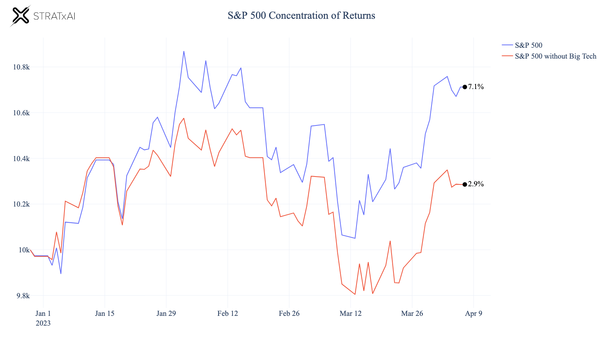

## Table of Contents

## What is returns concentration?

Returns concentration refers to how much of an investment's return comes from just a few assets or sources. Imagine you have a basket of fruits, and most of the tastiness comes from just one or two fruits. In the same way, if most of your investment's performance is driven by a small number of stocks or assets, that's returns concentration.

This concept is important because it can affect how risky an investment is. If your returns are concentrated in just a few assets, your investment could be more vulnerable. If those few assets do poorly, it could drag down your whole investment. On the other hand, if your returns are spread out across many different assets, it might be less risky because the poor performance of one asset won't hurt as much.

## Why is returns concentration important in investing?

Returns concentration is important in investing because it tells you how much of your money's growth depends on just a few things. Imagine you have a bunch of different toys, but you only play with one or two of them. If those favorite toys break, you'll be sad because you relied on them so much. In investing, if most of your money's growth comes from just a few stocks or assets, it's risky. If those few things do badly, your whole investment could suffer.

Understanding returns concentration helps you manage risk. If your money is spread out across many different investments, it's like having lots of toys to play with. If one toy breaks, it's not a big deal because you have others to enjoy. This way, if one investment does poorly, the others might still do well and balance things out. So, knowing how concentrated your returns are can help you decide if you need to mix things up to make your investments safer.

## How can returns concentration be measured?

Returns concentration can be measured by looking at how much of your total returns come from just a few investments. One way to do this is by using the Herfindahl-Hirschman Index (HHI). The HHI is a number that shows how spread out your returns are. You calculate it by squaring the percentage of returns from each investment and then adding those squares together. If the number is high, it means your returns are coming from just a few investments, which means high concentration.

Another way to measure returns concentration is by looking at the top few investments that contribute the most to your total returns. You can find out what percentage of your total returns come from, say, the top three or five investments. If a big part of your returns comes from just these few investments, then you have high returns concentration. This method is easier to understand and can give you a quick idea of how concentrated your returns are.

## What are the common metrics used to assess returns concentration?

One common way to measure returns concentration is by using the Herfindahl-Hirschman Index (HHI). This is a number that shows how spread out your returns are. To find the HHI, you take the percentage of returns from each investment, square that number, and then add all those squares together. A high HHI means your returns are coming from just a few investments, showing high concentration. A low HHI means your returns are spread out among many investments, showing low concentration.

Another simple way to assess returns concentration is by looking at the top few investments that contribute the most to your total returns. You can figure out what percentage of your total returns comes from, say, the top three or five investments. If a large part of your returns comes from just these few investments, then you have high returns concentration. This method is easy to understand and can quickly show you if your investment returns depend too much on just a few assets.

## Can you explain the difference between returns concentration and risk concentration?

Returns concentration and risk concentration are related but different ideas in investing. Returns concentration is about how much of your investment's growth comes from just a few investments. Imagine you have a bunch of different toys, but you only play with one or two of them. If most of your money's growth comes from just a few stocks or assets, that's high returns concentration. It's important because if those few investments do badly, it could hurt your whole investment a lot.

Risk concentration, on the other hand, is about how much of your investment's risk comes from just a few things. It's like if you only play with those one or two toys, and they break, you'll be really upset because you relied on them so much. If most of the risk in your investment comes from just a few stocks or assets, that's high risk concentration. It matters because if something bad happens to those few investments, it could really shake up your whole investment. While returns concentration focuses on where your growth is coming from, risk concentration looks at where your potential losses might come from.

## How does returns concentration impact portfolio diversification?

Returns concentration can make it harder to have a well-diversified portfolio. When most of your money's growth comes from just a few investments, it's like putting all your eggs in one basket. If those few investments do well, you might be happy, but if they do badly, your whole portfolio could suffer. A diversified portfolio spreads out the risk by having many different types of investments. So, if one investment goes down, others might go up and help balance things out. But if you have high returns concentration, you're not really spreading out your risk, which goes against the idea of diversification.

To fix this, you might need to adjust your portfolio to reduce returns concentration. This means selling some of your big winners and buying more of other investments to spread out your money's growth. By doing this, you can make your portfolio more diversified and less risky. It's like having a bunch of different toys to play with instead of just one or two favorites. If one toy breaks, you still have others to enjoy, which makes your playtime (or your investment) safer and more fun.

## What are the potential benefits of high returns concentration?

High returns concentration can lead to big wins. If you put a lot of your money into just a few investments and those investments do really well, you could make a lot more money than if your money was spread out. Imagine you bet all your money on one horse in a race, and that horse wins by a lot. You'd be really happy because you made a big profit from just that one horse. So, if you're good at [picking](/wiki/asset-class-picking) the right investments, high returns concentration can help you earn more.

But, there's a catch. If those few investments you bet on do badly, you could lose a lot more money than if your money was spread out. It's like if that horse you bet on falls and doesn't finish the race. You'd be really sad because you lost all your money on just that one horse. So, while high returns concentration can lead to big wins, it can also lead to big losses if you're not careful.

## What are the risks associated with high returns concentration?

High returns concentration can be risky because if the few investments you put a lot of money into do badly, you could lose a lot. Imagine you have all your toys in one basket, and someone takes the basket away. You'd be really sad because you lost all your toys at once. In the same way, if your money is mostly in just a few investments and they go down, your whole investment could suffer a lot. This makes your investment more vulnerable to big losses, which can be scary.

Another risk is that high returns concentration can make it hard to sleep at night. If you know that most of your money's growth depends on just a few things, you might worry a lot about what could happen to those few investments. It's like if you only have one favorite toy and you're always worried about it breaking. This worry can make investing less fun and more stressful, which isn't good for your peace of mind.

## How can an investor manage returns concentration in their portfolio?

An investor can manage returns concentration by spreading out their money across different types of investments. This is like having a bunch of different toys to play with instead of just one or two favorites. If you notice that most of your money's growth comes from just a few stocks or assets, you might want to sell some of those and buy more of other investments. This way, you won't rely too much on just a few things, and your investment will be safer because if one thing goes down, others might go up and balance things out.

Another way to manage returns concentration is by regularly checking your portfolio to see where your money's growth is coming from. It's like looking at all your toys and seeing which ones you play with the most. If you see that a big part of your returns comes from just a few investments, you can make changes to spread things out more. By doing this, you can make sure your investment stays diversified and less risky, which can help you feel more comfortable and confident about your money.

## What role does sector-specific returns concentration play in market analysis?

Sector-specific returns concentration is important in market analysis because it shows how much of the market's growth comes from just a few industries. Imagine you have a big party and most of the fun is happening in just one or two rooms. If most of the market's returns come from just a few sectors, it can tell analysts that those sectors are driving the market's performance. This information can help investors understand which parts of the economy are doing well and might be good places to put their money.

Understanding sector-specific returns concentration can also help analysts predict how the market might react to changes in those key sectors. If a few sectors are responsible for most of the market's growth, any problems in those sectors could have a big impact on the whole market. It's like if the rooms where most of the party fun is happening suddenly get too crowded or run out of snacks. Knowing this can help investors make smarter choices and be ready for what might happen next in the market.

## How do different investment strategies affect returns concentration?

Different investment strategies can change how much of your money's growth comes from just a few things. If you use a strategy like growth investing, where you pick stocks that you think will grow a lot, you might end up with high returns concentration. That's because you're betting on just a few companies to do really well. It's like picking a few favorite toys to play with all the time. If those toys are fun, you'll have a great time, but if they break, you'll be sad because you relied on them so much.

On the other hand, if you use a strategy like index investing, where you buy a bunch of different stocks to match a big group like the S&P 500, you'll have lower returns concentration. This is because your money is spread out across many different companies. It's like having a big toy box with lots of different toys to play with. If one toy breaks, it's not a big deal because you have others to enjoy. This way, your investment is safer because the poor performance of one company won't hurt as much.

## What advanced statistical methods can be used to analyze returns concentration?

One advanced statistical method to analyze returns concentration is the Gini coefficient. It's a number that shows how unequal the returns are across different investments. Imagine you have a bunch of toys and you want to know if you play with them all equally or if you mostly play with just a few. The Gini coefficient helps you figure that out for your investments. If the number is high, it means most of your money's growth comes from just a few investments, showing high returns concentration. If it's low, your returns are more spread out, which means lower returns concentration.

Another method is using principal component analysis (PCA). This technique helps you see which investments are driving most of your returns. It's like looking at your toy box and figuring out which toys make up most of your playtime. PCA can show you if just a few investments are responsible for a big part of your portfolio's performance, which means high returns concentration. By understanding this, you can make better choices about how to spread out your investments to make them less risky.

## How can we evaluate strategy performance?

Assessing the performance of [algorithmic trading](/wiki/algorithmic-trading) strategies is crucial for understanding returns concentration. By using specific metrics, traders can quantify and evaluate the effectiveness and risks associated with their strategies. Key performance indicators include the Sharpe Ratio, Maximum Drawdown, Win Rate, Profit Factor, and Average Trade Value, each providing unique insights into strategy performance.

The **Sharpe Ratio** is essential for evaluating risk-adjusted returns. It measures the average return earned in excess of the risk-free rate per unit of [volatility](/wiki/volatility-trading-strategies) or total risk. The formula for the Sharpe Ratio is:

$$

\text{Sharpe Ratio} = \frac{R_p - R_f}{\sigma_p} 
$$

where $R_p$ is the average return of the portfolio, $R_f$ is the risk-free rate, and $\sigma_p$ is the standard deviation of the portfolio's excess returns. A higher Sharpe Ratio indicates a more attractive risk-adjusted return, essential for concentrating on high-return strategies while managing risk effectively.

**Maximum Drawdown** assesses a strategy's vulnerability to losses by measuring the peak-to-trough decline during a specific period. The metric is important for understanding the worst-case scenario of capital depletion. It is calculated as:

$$

\text{Maximum Drawdown} = \frac{\text{Trough Value} - \text{Peak Value}}{\text{Peak Value}} 
$$

A smaller Maximum Drawdown signifies a more resilient strategy, crucial for maintaining capital and confidence during market downturns.

The **Win Rate** quantifies the percentage of profitable trades. While an important measure, it should be evaluated alongside the Profit Factor to provide comprehensive insight into strategy effectiveness. The formula for the Win Rate is:

$$

\text{Win Rate} = \frac{\text{Number of Winning Trades}}{\text{Total Number of Trades}} \times 100 
$$

The **Profit Factor** is calculated as the ratio of gross profits to gross losses. It indicates how much profit is earned for each unit of risk taken. A Profit Factor greater than 1 indicates a profitable strategy, with higher values suggesting better performance.

Finally, **Average Trade Value** provides insight into the profitability per trade, helping traders discern the contribution of each trade to overall returns. It is determined by dividing the total profit by the number of trades:

$$

\text{Average Trade Value} = \frac{\text{Total Profit}}{\text{Total Number of Trades}} 
$$

This metric helps identify individual trades' impact, guiding strategic adjustments to enhance returns concentration further.

By applying these metrics, traders can systematically evaluate and refine their algorithmic trading strategies, ensuring they focus on areas yielding maximum risk-adjusted returns while being aware of potential vulnerabilities.

## References & Further Reading

[1]: Bergstra, J., Bardenet, R., Bengio, Y., & Kégl, B. (2011). ["Algorithms for Hyper-Parameter Optimization."](https://papers.nips.cc/paper/4443-algorithms-for-hyper-parameter-optimization) Advances in Neural Information Processing Systems 24.

[2]: ["Advances in Financial Machine Learning"](https://www.amazon.com/Advances-Financial-Machine-Learning-Marcos/dp/1119482089) by Marcos Lopez de Prado

[3]: ["Evidence-Based Technical Analysis: Applying the Scientific Method and Statistical Inference to Trading Signals"](https://www.amazon.com/Evidence-Based-Technical-Analysis-Scientific-Statistical/dp/0470008741) by David Aronson

[4]: ["Machine Learning for Algorithmic Trading"](https://github.com/stefan-jansen/machine-learning-for-trading) by Stefan Jansen

[5]: ["Quantitative Trading: How to Build Your Own Algorithmic Trading Business"](https://books.google.com/books/about/Quantitative_Trading.html?id=j70yEAAAQBAJ) by Ernest P. Chan