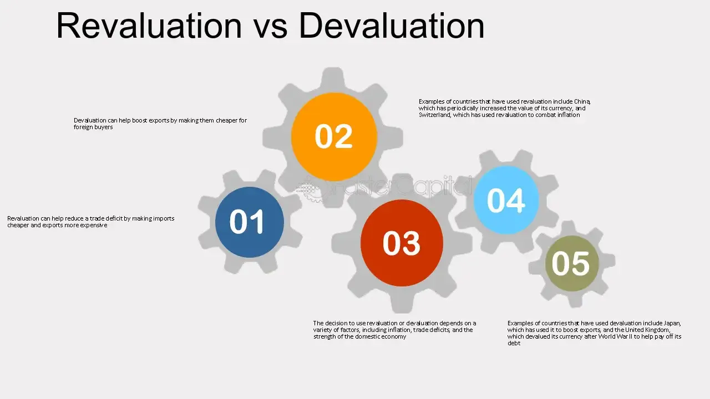

## Table of Contents

## What is revaluation?

Revaluation is when a company or a country changes the value of something they own to match its current market price. This is often done with things like buildings, machinery, or currency. For example, if a company owns a building that has become more valuable over time, they might revalue it to show its new, higher worth on their financial statements.

Revaluation is important because it helps show a more accurate picture of a company's or country's financial health. If the value of assets goes up, revaluation can make the company look more valuable. However, if the value goes down, it might show a loss. This process helps everyone, like investors and managers, make better decisions based on the true value of the assets.

## What is devaluation?

Devaluation is when a country makes its currency worth less compared to other currencies on purpose. This usually happens in countries where the government controls the value of their money. For example, if a country's currency was set at 10 units to 1 US dollar, devaluation might change it to 12 units to 1 US dollar. This makes the country's exports cheaper and more attractive to other countries, which can help increase sales abroad.

However, devaluation can also make things more expensive for people living in that country. When the currency is worth less, it costs more to buy things from other countries, like cars or electronics. This can lead to higher prices for everyday items and might make life harder for people if their wages don't go up too. Governments usually think carefully before devaluing their currency because it can have big effects on the economy.

## How do revaluation and devaluation affect a country's currency?

Revaluation and devaluation are two ways a country can change the value of its currency. Revaluation means making the currency worth more compared to other currencies. This usually happens when a country's economy is doing well and its currency becomes more valuable. For example, if a country's currency was set at 10 units to 1 US dollar, revaluation might change it to 8 units to 1 US dollar. This can make imports cheaper for people in that country because they need less of their currency to buy things from other countries. However, it can make the country's exports more expensive and less attractive to other countries.

Devaluation, on the other hand, means making the currency worth less compared to other currencies. This is often done to make a country's exports cheaper and more competitive in the global market. For instance, if the currency was set at 10 units to 1 US dollar, devaluation might change it to 12 units to 1 US dollar. This can help boost the country's exports because other countries can buy more with their money. However, devaluation can also make imports more expensive for people in the country, which might lead to higher prices for goods and services. Both revaluation and devaluation have big effects on a country's economy and are important tools that governments use to manage their currency's value.

## What are the main reasons a country might choose to revalue its currency?

A country might choose to revalue its currency when its economy is doing really well. When a country's businesses are making a lot of money and its products are in high demand around the world, its currency can become more valuable. By revaluing the currency, the government makes it worth more compared to other countries' money. This can help keep inflation under control because it makes things from other countries cheaper to buy. People in the country can then afford more imported goods, which can help keep prices stable.

Revaluation can also make a country look more attractive to foreign investors. When a country's currency is strong, investors from other countries might want to put their money there because they believe the economy is strong and growing. This can bring more money into the country, which can help create jobs and boost the economy even more. However, revaluation can make the country's exports more expensive, so the government has to think carefully about whether the benefits of revaluation outweigh the possible downsides.

## Under what circumstances might a country decide to devalue its currency?

A country might decide to devalue its currency when its exports are not selling well on the world market. By making the currency worth less, the country's products become cheaper for other countries to buy. This can help increase sales and boost the economy. For example, if a country makes a lot of cars, devaluing the currency can make those cars cheaper for people in other countries, which might lead to more sales and more jobs at home.

Devaluation can also be used when a country is facing a big trade deficit, meaning it is importing more than it is exporting. By making the currency weaker, the country makes its exports cheaper and its imports more expensive. This can help balance trade by encouraging people to buy more local products and fewer foreign ones. However, devaluing the currency can also make life harder for people in the country because imported goods like food and medicine can become more expensive. So, the government has to think carefully about the effects on everyday people before deciding to devalue.

## How do revaluation and devaluation impact international trade?

Revaluation makes a country's currency worth more compared to other countries' money. This can make the country's exports more expensive for other countries to buy. When a country's products cost more, other countries might buy less of them. This can hurt the country's businesses that sell things to other countries because they might make less money. On the other hand, revaluation makes imports cheaper for people in the country. They can buy more things from other countries with their money, which can be good for them but might hurt local businesses that have to compete with these cheaper imports.

Devaluation makes a country's currency worth less compared to other countries' money. This can make the country's exports cheaper for other countries to buy. When a country's products are cheaper, other countries might buy more of them. This can help the country's businesses that sell things to other countries because they can make more money. However, devaluation makes imports more expensive for people in the country. They need more of their money to buy things from other countries, which can make life harder for them because everyday items might cost more.

## What are the short-term economic effects of revaluation?

When a country revalues its currency, it makes the money worth more compared to other countries' money. This can make things from other countries cheaper for people in the country. They can buy more imported goods with their money, which can be good for them. But it can also make the country's own products more expensive for other countries to buy. This might mean that other countries buy less of the country's exports, which can hurt businesses that sell things abroad. In the short term, revaluation can help keep prices stable at home because cheaper imports can help control inflation.

Revaluation can also affect the country's economy in other ways. If the currency is strong, it might attract more foreign investors who want to put their money in the country. They might think the economy is doing well and will keep getting better. This can bring more money into the country, which can help create jobs and boost the economy. However, if the country's exports drop a lot because they are too expensive, it could lead to job losses in industries that rely on selling things to other countries. So, revaluation can have both good and bad short-term effects on the economy.

## What are the long-term economic consequences of devaluation?

When a country devalues its currency, it makes its money worth less compared to other countries' money. Over the long term, this can make the country's exports cheaper and more attractive to other countries. This can help the country sell more of its products abroad, which can lead to more jobs and a stronger economy. Businesses that sell things to other countries might do better because they can sell more at a lower price. But devaluation can also make things from other countries more expensive for people at home. If people have to pay more for things like food and medicine, it can make life harder for them, especially if their wages don't go up too.

In the long run, devaluation can also affect how much foreign investors want to put their money in the country. If the currency keeps losing value, investors might think the economy is not doing well and decide to take their money out. This can make it harder for the country to grow because it needs that money to build new things and create jobs. Also, if the country keeps devaluing its currency, it might lead to inflation, where prices keep going up. This can make it even harder for people to afford things they need. So, while devaluation can help with exports in the short term, it can have some tough long-term effects on the economy and people's lives.

## How do revaluation and devaluation influence inflation rates?

Revaluation makes a country's money worth more compared to other countries' money. This can help keep inflation under control because it makes things from other countries cheaper. When people can buy more with their money, it can stop prices from going up too fast. But if the country's own products become too expensive for other countries to buy, businesses might make less money. This can lead to fewer jobs and less money for people to spend, which might also help keep inflation down.

Devaluation makes a country's money worth less compared to other countries' money. This can make things from other countries more expensive. When people have to pay more for things they need, it can lead to higher prices and more inflation. If the country keeps devaluing its money, people might start expecting prices to keep going up, which can make inflation even worse. But if the country can sell more of its own products to other countries because they are cheaper, it might help the economy grow and keep inflation from getting out of control.

## Can revaluation and devaluation be used as tools for economic policy, and if so, how?

Yes, revaluation and devaluation can be used as tools for economic policy. Governments use them to help control their economy. Revaluation makes a country's money worth more compared to other countries' money. This can be used to keep inflation under control because it makes things from other countries cheaper. When people can buy more with their money, it can stop prices from going up too fast. Governments might choose to revalue their currency when the economy is doing really well, and they want to attract more foreign investors. This can bring more money into the country, helping to create jobs and boost the economy.

Devaluation makes a country's money worth less compared to other countries' money. This can be used to make the country's products cheaper for other countries to buy. When a country's exports become cheaper, it can help sell more products abroad, which can lead to more jobs and a stronger economy. Governments might choose to devalue their currency when they are facing a big trade deficit or when their exports are not selling well. However, devaluation can also make life harder for people at home because things from other countries become more expensive. So, governments have to be careful and think about the effects on everyday people before deciding to devalue.

## What are the potential risks associated with frequent revaluation or devaluation?

Frequent revaluation or devaluation can make things unpredictable for businesses and people. If a country keeps changing the value of its money, it can be hard for businesses to plan ahead. They might not know how much their products will cost in other countries or how much they will have to pay for things they need to buy from other countries. This uncertainty can make businesses less likely to invest in new projects or hire more workers. For people, frequent changes can make it hard to know how much their money will be worth from one day to the next, which can make it tough to save or plan for the future.

Frequent changes in the value of money can also make other countries lose trust in the economy. If a country's money keeps going up and down a lot, other countries might think the economy is not stable. This can scare away foreign investors who might be worried about losing money if the value of the currency keeps changing. Without foreign investment, it can be harder for the country to grow its economy and create jobs. Also, if people start expecting the value of their money to keep changing, it can lead to more inflation, where prices keep going up, making life harder for everyone.

## How do global financial markets react to announcements of revaluation or devaluation?

When a country announces it will revalue its currency, it means their money will be worth more compared to other countries' money. This news can make global financial markets happy because it often means the country's economy is doing well. Investors from other countries might want to put their money in the country because they think it's a safe place to invest. But it can also make some investors worried because the country's products will become more expensive for other countries to buy. This might mean less money from selling things abroad, which can affect the stock prices of companies that rely on exports.

When a country announces it will devalue its currency, it means their money will be worth less compared to other countries' money. This news can make global financial markets nervous because it might mean the country's economy is not doing so well. Investors might take their money out of the country because they are worried about losing money if the currency keeps going down. But it can also make some investors happy because the country's products will become cheaper for other countries to buy. This might mean more money from selling things abroad, which can help the stock prices of companies that rely on exports.

## References & Further Reading

[1]: Bergstra, J., Bardenet, R., Bengio, Y., & Kégl, B. (2011). ["Algorithms for Hyper-Parameter Optimization."](https://proceedings.neurips.cc/paper/2011/file/86e8f7ab32cfd12577bc2619bc635690-Paper.pdf) Advances in Neural Information Processing Systems 24.

[2]: ["Advances in Financial Machine Learning"](https://www.amazon.com/Advances-Financial-Machine-Learning-Marcos/dp/1119482089) by Marcos Lopez de Prado

[3]: ["Evidence-Based Technical Analysis: Applying the Scientific Method and Statistical Inference to Trading Signals"](https://www.amazon.com/Evidence-Based-Technical-Analysis-Scientific-Statistical/dp/0470008741) by David Aronson

[4]: ["Machine Learning for Algorithmic Trading"](https://github.com/PacktPublishing/Machine-Learning-for-Algorithmic-Trading-Second-Edition) by Stefan Jansen

[5]: ["Quantitative Trading: How to Build Your Own Algorithmic Trading Business"](https://www.amazon.com/Quantitative-Trading-Build-Algorithmic-Business/dp/1119800064) by Ernest P. Chan