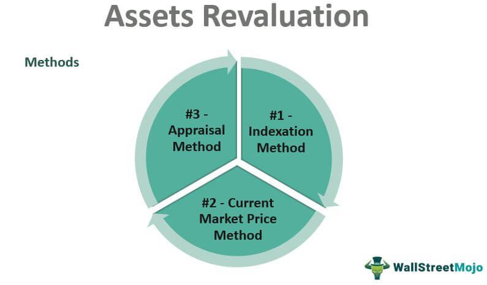

The global financial markets are driven by complex mechanisms, with currency exchange rates at the core of international trade, investment, and economic policies. Currency exchange rates determine the value of one currency in terms of another and are essential in facilitating cross-border transactions. Key concepts within this sphere include currency adjustment, devaluation, revaluation, and algorithmic trading, all of which play significant roles in shaping economic dynamics.

Currency adjustment refers to changes in the official exchange rate of a nation's currency, which can manifest as either devaluation or revaluation. Devaluation involves a deliberate reduction in the currency's value relative to other currencies, commonly employed by governments to boost exports by making them cheaper and more competitive on the global market. Conversely, revaluation implies an upward adjustment, often utilized to curb inflation by increasing the currency's value, thereby reducing import costs.



Algorithmic trading, another crucial facet of financial markets, employs computer algorithms to execute trades automatically based on pre-established criteria. In currency markets, algorithmic trading systems can swiftly adjust trading strategies in response to fluctuations in currency values, such as those triggered by revaluation or devaluation. This approach offers traders speed, precision, and efficiency, enabling them to capitalize on short-term price movements and hedge against potential currency risks.

This article examines the interplay between currency adjustments and algorithmic trading strategies, providing a comprehensive overview of their impact on the broader economic environment. As globalization advances, understanding these concepts becomes increasingly important for investors, policymakers, and traders seeking to effectively navigate the global economy. By grasping the implications of currency adjustment and leveraging algorithmic trading, market participants can better manage risks and seize opportunities within this interconnected financial landscape.

## Table of Contents

## Understanding Currency Adjustment: Devaluation and Revaluation

Currency adjustment involves altering the official exchange rate of a country's currency, frequently through mechanisms like devaluation or revaluation. These adjustments are strategic economic tools utilized by governments and central banks to influence macroeconomic conditions, thereby impacting international trade, inflation rates, and overall economic growth.

Devaluation is the intentional reduction in the value of a national currency relative to other currencies. This deliberate downward adjustment is primarily used to enhance a country's export competitiveness by making domestic goods and services less expensive in international markets. The central aim is to stimulate foreign demand for these cheaper exports, potentially improving the country's trade balance. However, devaluation can also make imports more expensive, which may lead to higher domestic inflation as the cost of foreign goods and services rises.

Conversely, revaluation is an upward adjustment in the value of a country's currency. This strategy is often deployed to tackle inflation by making imports less expensive, thus potentially lowering the domestic price level. While revaluation can lead to reduced export competitiveness—as domestic products become costlier for foreign buyers—it can also increase purchasing power for consumers and importers, benefiting sectors reliant on foreign goods. Consequently, the trade balance may be negatively affected due to a possible decline in export volumes coupled with an increase in imports.

Both devaluation and revaluation [carry](/wiki/carry-trading) significant implications for a nation's economy. A devaluation may initially boost economic growth by spurring demand for exports, but the ensuing inflationary pressures could dampen this growth over time. Conversely, revaluation might control inflation effectively but could hinder economic growth by reducing the competitiveness of exports.

Overall, the choice between devaluation and revaluation necessitates careful consideration of a country's specific economic circumstances and policy objectives, as both strategies have wide-ranging effects on inflation, trade balance, and economic development. Decisions on currency adjustments are usually informed by a comprehensive analysis of economic indicators and trends, aiming to balance the myriad factors influencing a nation's economic health.

## Impact of Currency Revaluation on International Trade

Currency revaluation involves increasing the value of a national currency relative to foreign currencies. This adjustment can significantly impact international trade by altering the price dynamics of exports and imports. Specifically, a revalued currency can make a nation's exports more expensive in the global market, thereby reducing their competitive edge. When the domestic currency strengthens, foreign buyers must spend more of their currency to purchase the same amount of goods, which can lead to a decline in demand for those exports. For example, if the currency of a country is revalued by 10%, the cost of exporting a $100 product may increase effectively to $110 for foreign buyers, potentially leading to a decrease in international sales.

Nevertheless, revaluation can yield benefits, particularly for importers and consumers within the country experiencing the currency appreciation. An appreciated currency decreases the cost of importing goods and services, as fewer units of the domestic currency are required to acquire the same quantity of foreign products. This can lead to a reduction in inflationary pressures since imported goods and services become cheaper. For instance, a strengthening of the currency might mean that imported electronics or machinery become more affordable, decreasing costs for both businesses and consumers.

The impact on a country's trade balance, which is the difference between the value of exports and imports, can thus be twofold. While exports might decrease due to diminished competitiveness, the reduction in the cost of imports can lead to increased import volumes. This dynamic shift can lead to a widening trade deficit if the reduction in export revenue surpasses the savings gained from cheaper imports, or potentially balance out if the import savings are sufficient.

Moreover, structural changes in the economy may result from these shifts. Industries heavily dependent on exports may need to adapt by improving efficiency, diversifying products, or exploring new markets to maintain competitiveness. Conversely, industries dependent on imported raw materials might experience cost reductions, potentially boosting productivity and profitability.

In summary, currency revaluation influences international trade by making exports less competitive while reducing the cost of imports. Its effect on the trade balance is nuanced and depends on the elasticity of both export and import demand. Policymakers must carefully consider these factors when contemplating currency revaluation to manage its economic implications effectively.

## Algorithmic Trading in Currency Markets

Algorithmic trading, a paradigm shift in modern financial markets, leverages sophisticated computer programs to execute trades based on predetermined criteria. This method significantly increases the efficiency of trading activities, especially in the fast-paced environment of currency markets. By utilizing complex algorithms, traders can swiftly react to real-time data, making split-second decisions that human traders might miss.

In currency markets, the value of a currency can fluctuate due to various factors like economic data releases, geopolitical events, or deliberate currency adjustments such as revaluation or devaluation. Algorithmic trading systems are designed to process these fluctuations almost instantaneously. Through algorithms, traders can automate responses to currency value changes, optimizing the timing and size of trades to maximize profit or minimize risk.

The primary advantage of [algorithmic trading](/wiki/algorithmic-trading) lies in its speed. Algorithms can execute orders within milliseconds, a crucial [factor](/wiki/factor-investing) given the high [volatility](/wiki/volatility-trading-strategies) often present in currency markets. This speed not only allows traders to capitalize on short-lived price movements but also to implement strategies like [arbitrage](/wiki/arbitrage), where small price discrepancies across different markets are exploited for profit.

Efficiency is another critical attribute of algorithmic trading. By automating trading processes, algorithms reduce the potential for human error, ensuring that trades are executed according to predefined parameters without emotional interference. This can be particularly advantageous in managing high-frequency trading volumes, where manual execution would be impractical.

Precision is equally vital in the context of hedging against currency risks. Algoritmic trading strategies can be tailored to manage exposure to unfavorable currency movements, safeguarding against potential losses. For example, by employing stop-loss orders within their algorithms, traders can automatically sell a currency once its price drops to a certain level, thus limiting potential losses.

The development of algorithmic trading systems involves the use of various programming languages, with Python being a preferred choice due to its extensive libraries and frameworks. Here is a basic example of a Python algorithm that could respond to a currency revaluation:

```python
import requests
import time

# Example API endpoint for currency data
api_url = "https://api.exchangeratesapi.io/latest?base=USD"

# Define a threshold for revaluation response
REVALUATION_THRESHOLD = 0.02  # 2%

def fetch_exchange_rate():
    response = requests.get(api_url)
    data = response.json()
    return data["rates"]["EUR"]  # Example for EUR/USD exchange rate

def execute_trade(action):
    # Placeholder function for executing trades
    print(f"Executing {action} trade based on revaluation.")

# Initial rate
initial_rate = fetch_exchange_rate()

while True:
    current_rate = fetch_exchange_rate()
    rate_change = (current_rate - initial_rate) / initial_rate

    if rate_change >= REVALUATION_THRESHOLD:
        execute_trade("buy")
        initial_rate = current_rate
    elif rate_change <= -REVALUATION_THRESHOLD:
        execute_trade("sell")
        initial_rate = current_rate

    time.sleep(60)  # Check every 60 seconds
```

This Python script continuously monitors the EUR/USD exchange rate and executes a "buy" or "sell" trade if the rate changes by more than 2%, simulating a response to a currency revaluation. The integration of algorithms like this into trading strategies demonstrates how technology can enhance decision-making processes in currency markets. 

Algorithmic trading continues to reshape the landscape of financial markets, offering traders unparalleled tools to navigate the complexities of global currency trading efficiently and effectively.

## Risks and Challenges in Currency Adjustment and Algorithmic Trading

Rapid currency adjustments, whether stemming from revaluation or devaluation, introduce significant market volatility, impacting algorithmic trading strategies. When a currency undergoes revaluation, its value compared to foreign currencies increases, affecting various economic elements such as exports, imports, and inflation. Similarly, devaluation decreases a currency's value, influencing trade dynamics and economic policies. These value shifts can occur unexpectedly and with little warning, leading to challenges in the predictive models that algorithmic trading systems rely on.

Algorithmic trading systems are designed to execute trades with speed and precision, reacting to predefined market conditions. However, the fundamental challenge lies in the inherent unpredictability of currency adjustments. Traditional algorithms may not adequately anticipate swift and large-scale changes, potentially causing significant financial losses. For instance, a sudden devaluation of a major currency might trigger a cascade of effects across global markets, unforeseen by existing algorithmic models.

The disparities in algorithmic capabilities among market participants further exacerbate these challenges. Larger institutions often have access to more advanced technologies and sophisticated algorithms, allowing them to respond more effectively to abrupt currency changes. This disparity can lead to imbalances, where smaller or less technologically adept traders are unable to compete, potentially resulting in [liquidity](/wiki/liquidity-risk-premium) issues. Reduced liquidity, in turn, hinders effective market operations and increases the cost of trading.

From a technical standpoint, the challenges of algorithmic trading during rapid currency adjustments can be partially attributed to the limitations in current financial modeling techniques. These models generally assume certain market conditions remain relatively stable over time. However, drastic currency changes violate these assumptions, thereby compromising the reliability of predictions. Enhancing these models to incorporate [machine learning](/wiki/machine-learning) techniques could potentially improve their adaptability to sudden currency fluctuations.

In addressing these risks, traders and financial institutions are encouraged to employ robust risk management strategies. This includes diversification of trading algorithms, setting stop-loss limits, and continuously updating models with real-time data. Furthermore, leveraging historical data to simulate possible scenarios of currency adjustments can help in refining algorithm sensitivity and resilience to market shocks.

Overall, the dynamic and interconnected nature of global financial systems means that currency adjustments will always present inherent risks and challenges to algorithmic trading. By recognizing these potential pitfalls and adopting adaptive strategies, traders and institutions can better manage the uncertainties presented by volatile currency markets.

## Strategies for Leveraging Currency Revaluation in Algo Trading

Traders aiming to capitalize on currency revaluation can enhance their algorithmic trading strategies by integrating currency revaluation data to adjust their models accordingly. Accurate prediction of the impacts on currency pairs necessitates sophisticated algorithms that can dynamically adapt to the changing economic landscape.

Firstly, traders should focus on developing diversified trading algorithms that can handle the inherent volatility accompanying currency revaluation. A diversified approach might involve constructing a portfolio of algorithms, each optimized for different market conditions or currency pairs. Such diversification can help mitigate the risks associated with sudden market movements caused by revaluation.

Risk management tools are equally important to safeguard against unexpected financial downturns during currency revaluation. Traders should employ stop-loss orders, position size limits, and automated risk assessment protocols within their algorithmic frameworks to minimize exposure to adverse developments. These tools ensure that the algorithms can respond proportionately to currency adjustments, maintaining capital preservation as a priority.

Furthermore, [backtesting](/wiki/backtesting) using historical data is a critical step in refining algorithmic strategies. By simulating various revaluation scenarios using historical currency market data, traders can evaluate the effectiveness of their models and identify potential areas for improvement. Backtesting helps in understanding past market reactions to similar events and provides insights into potential future outcomes.

```python
# Example of backtesting a simple moving average strategy in Python

import pandas as pd
import numpy as np

def backtest_moving_average_strategy(data, short_window, long_window):
    # Compute moving averages
    data['Short_Moving_Avg'] = data['Exchange_Rate'].rolling(window=short_window, min_periods=1).mean()
    data['Long_Moving_Avg'] = data['Exchange_Rate'].rolling(window=long_window, min_periods=1).mean()

    # Generate signals
    data['Signal'] = 0.0
    data['Signal'][short_window:] = np.where(data['Short_Moving_Avg'][short_window:] 
                                             > data['Long_Moving_Avg'][short_window:], 1.0, 0.0)

    # Calculate returns
    data['Position'] = data['Signal'].diff()
    data['Trade_Returns'] = data['Position'] * data['Exchange_Rate'].pct_change()

    return data['Trade_Returns'].cumsum()  # Cumulative returns

# Assume 'currency_data' is a DataFrame with a column 'Exchange_Rate' containing historical rates
# currency_data = pd.read_csv('your_historical_data.csv')

# Example usage
# cumulative_returns = backtest_moving_average_strategy(currency_data, short_window=40, long_window=100)
# print(cumulative_returns)
```

In conclusion, leveraging currency revaluation in algorithmic trading necessitates a combination of diversified algorithms, stringent risk management practices, and rigorous backtesting. By effectively utilizing these strategies, traders can better anticipate and adapt to the challenges and opportunities presented by currency revaluation events in the global financial market.

## Conclusion

As globalization continues to expand, understanding the relationship between currency adjustments and algorithmic trading strategies is becoming increasingly vital for participants in financial markets. Currency adjustments, whether through revaluation or devaluation, present distinct opportunities and challenges when it comes to automated trading. 

Revaluation, which increases the value of a currency, can create shifts in market dynamics by altering the relative prices of imports and exports. For algorithmic traders, this shift can influence patterns in currency pair values, requiring rapid adjustments in trading algorithms to capitalize on new trends or hedge against potential risks. Similarly, a devaluation reduces a currency’s value, potentially enhancing the competitiveness of domestic exports but also inviting algorithmic strategy revisions to accommodate changing price movements and market conditions.

To effectively navigate these changes, a thorough analysis of currency adjustments is essential. Traders can employ data analytics and historical trends to develop predictive models capable of responding to currency fluctuations. Additionally, a robust risk management framework is crucial in mitigating potential losses that may arise from unexpected monetary policy shifts or economic events affecting currency values.

For policymakers, understanding these market mechanisms is equally important in crafting economic strategies that balance domestic growth with international competitiveness. By leveraging advanced analytical tools and fostering transparent communication regarding policy changes, both traders and policymakers can better manage the complexities of a globally connected economy.

As the financial ecosystem continues to evolve, the ability to adapt to currency adjustments through informed decision-making and strategic algorithmic trading will serve as a key advantage in navigating the challenges and opportunities presented by globalization.

## References & Further Reading

[1]: Bergstra, J., Bardenet, R., Bengio, Y., & Kégl, B. (2011). ["Algorithms for Hyper-Parameter Optimization."](https://proceedings.neurips.cc/paper/2011/file/86e8f7ab32cfd12577bc2619bc635690-Paper.pdf) Advances in Neural Information Processing Systems 24.

[2]: ["Advances in Financial Machine Learning"](https://www.amazon.com/Advances-Financial-Machine-Learning-Marcos/dp/1119482089) by Marcos Lopez de Prado

[3]: ["Evidence-Based Technical Analysis: Applying the Scientific Method and Statistical Inference to Trading Signals"](https://www.amazon.com/Evidence-Based-Technical-Analysis-Scientific-Statistical/dp/0470008741) by David Aronson

[4]: ["Machine Learning for Algorithmic Trading"](https://github.com/PacktPublishing/Machine-Learning-for-Algorithmic-Trading-Second-Edition) by Stefan Jansen

[5]: ["Quantitative Trading: How to Build Your Own Algorithmic Trading Business"](https://www.amazon.com/Quantitative-Trading-Build-Algorithmic-Business/dp/1119800064) by Ernest P. Chan