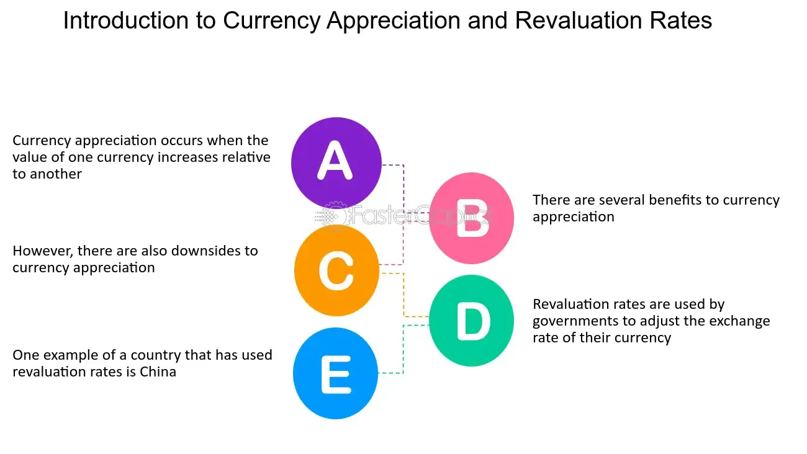

## Table of Contents

## What is a revaluation rate?

A revaluation rate is a way to change the value of something, like money or property, to make it worth more than before. This can happen when a country decides to make its currency stronger compared to other countries' money. For example, if a country's currency was worth less before, but now it's worth more, that's a revaluation. This can make things like exports more expensive for other countries to buy.

Revaluation can also apply to things like buildings or land. If the value of a property goes up because the area around it has become more popular or developed, that's also a revaluation. This can affect how much tax someone has to pay on the property or how much they can sell it for. Revaluation is important because it helps keep the value of things up to date with what's happening in the economy or the area.

## Why are revaluation rates important in accounting?

Revaluation rates are important in accounting because they help keep the value of a company's assets up to date. When a company owns things like buildings, land, or equipment, the value of these items can change over time. If the value goes up, the company needs to adjust its records to show the new, higher value. This is called revaluation. By doing this, the company's financial statements will show a more accurate picture of what the company is worth.

This is important for making good decisions. If a company knows the true value of its assets, it can make better choices about whether to sell them, use them as collateral for loans, or keep them for future use. It also helps investors and creditors understand the company's financial health. If the values are not updated, the financial statements might not show the real situation, which could lead to bad decisions or misunderstandings about the company's value.

## How do revaluation rates affect financial statements?

Revaluation rates can change the numbers on a company's financial statements. When a company revalues its assets, like buildings or land, to a higher value, it shows this increase on its balance sheet. The balance sheet is like a snapshot of what the company owns and owes at a certain time. If the value of an asset goes up, the company's total assets go up too. This can make the company look more valuable and financially stronger.

This change can also affect the income statement, which shows how much money the company made or lost over a period. When an asset's value increases, the company might record a gain from the revaluation. This gain can make the company's profit look bigger for that period. But, it's important to remember that this gain is not from selling the asset or [earning](/wiki/earning-announcement) money from it. It's just because the asset is now worth more on paper. So, while revaluation can make financial statements look better, it's not the same as actually making more money.

## What is the difference between revaluation and depreciation?

Revaluation and depreciation are two ways to change the value of a company's assets, but they do the opposite things. Revaluation is when a company makes the value of an asset higher. This can happen if the asset, like a building or land, becomes more valuable over time. For example, if a company owns a piece of land and the area around it becomes more popular, the land might be worth more. The company would then increase the value of the land on its financial records to show this new, higher value.

Depreciation, on the other hand, is when a company makes the value of an asset lower over time. This usually happens with things like machines or vehicles that wear out or get old. For example, if a company buys a truck, the truck will lose value as it gets older and is used more. The company will decrease the value of the truck on its financial records to show that it's worth less now. So, revaluation makes assets worth more, while depreciation makes them worth less.

## Can you explain the process of revaluing assets?

When a company decides to revalue its assets, it starts by looking at the current value of the asset. This could be a building, land, or any other long-term asset. The company might hire an expert, like an appraiser, to figure out what the asset is worth now. The appraiser will look at things like what similar assets are selling for, how the area around the asset has changed, and other factors that could affect its value. Once the appraiser gives their report, the company compares this new value to what they have on their [books](/wiki/algo-trading-books).

If the new value is higher than what's on the books, the company will increase the value of the asset on its financial statements. This increase is called a revaluation surplus, and it goes into a special part of the company's equity called the revaluation reserve. This shows that the asset is now worth more, but it's not the same as making money from selling the asset. The company will keep track of this new value and might need to do another revaluation in the future if the asset's value changes again.

## What are the common methods used to determine revaluation rates?

When a company wants to find out the new value of its assets, it can use different ways to do it. One common way is to look at what similar assets are selling for in the market. This is called the market approach. For example, if a company owns a building, it can look at the prices of similar buildings in the same area that have been sold recently. This helps them figure out what their building might be worth now.

Another way is called the cost approach. This method looks at how much it would cost to replace the asset today. If a company owns a machine, it can find out how much it would cost to buy a new one that does the same thing. Then, they take away some value for how old or worn out the machine is. This gives them an idea of what the machine is worth now. Both methods help companies keep their financial records up to date with the real value of their assets.

## How often should assets be revalued?

Companies do not have to revalue their assets all the time. How often they do it can depend on what the rules say in their country or what their own rules are. Some companies might choose to revalue their assets every year to keep their records very up to date. Others might do it less often, like every three or five years, because it can be a lot of work and cost money to get appraisers to check the value of everything.

The important thing is to revalue assets often enough so that the numbers in the company's records are not too far off from what the assets are really worth. If a company waits too long to revalue its assets, the values on its books might not show the real situation. This can make it hard for the company to make good decisions or for people who want to invest in the company to understand its true value.

## What are the tax implications of asset revaluation?

When a company revalues its assets, it can affect how much tax it has to pay. If the value of an asset goes up, the company might have to pay more tax on that asset. This is because some countries tax companies based on the value of their assets. So, if a building or piece of land is worth more now, the company might have to pay more property tax or other taxes related to the asset's new value.

However, not all countries treat revaluation the same way for tax purposes. In some places, the increase in value from revaluation might not be taxed right away. Instead, the company might only have to pay tax on the gain if they sell the asset later. It's important for companies to know the tax rules in their country so they can plan for any extra taxes they might have to pay after revaluing their assets.

## How do international accounting standards affect revaluation practices?

International accounting standards, like those set by the International Accounting Standards Board (IASB), have rules that tell companies how to revalue their assets. These rules help make sure that companies all over the world are doing things in a similar way, which makes it easier for people to understand and compare financial statements from different countries. For example, under International Accounting Standard 16 (IAS 16), companies can choose to revalue their property, plant, and equipment to their fair value. If they do this, they have to do it regularly so that the values stay up to date.

These standards also say that any increase in the value of an asset from revaluation should be recorded in a special part of the company's equity called the revaluation reserve. This helps keep the increase separate from the company's regular profits. If the value goes down later, the company has to take the decrease out of the revaluation reserve before it affects the profit and loss statement. By following these international standards, companies can make sure their financial statements show a true and fair view of their assets' values, which is important for investors and other people who look at the company's financial health.

## What are the potential risks and benefits of revaluing assets?

Revaluing assets can be good for a company because it makes their financial statements more accurate. When a company updates the value of its buildings or land to what they are really worth now, it shows everyone a clearer picture of how much the company is worth. This can help the company get loans or attract investors because people can see that the company's assets are valuable. Also, if the value of an asset goes up, the company can record a gain, which can make their profits look bigger for that period.

But there are also risks to revaluing assets. One big risk is that it can make a company's financial statements look better than they really are. If the company records a big gain from revaluing an asset, it might look like they made more money than they actually did. This can be confusing for people who are looking at the company's financial health. Another risk is that revaluing assets can be expensive and time-consuming. The company has to pay for appraisers to figure out the new value of the assets, and they have to do this regularly to keep the values up to date. If they don't, the values on their books might not match the real situation, which can cause problems later.

## How does revaluation impact a company's financial ratios and performance indicators?

When a company revalues its assets, it can change the numbers on its financial statements, which in turn affects financial ratios and performance indicators. For example, if a company increases the value of its assets, its total assets on the balance sheet will go up. This can make the company's debt-to-equity ratio look better because the equity part of the ratio, which includes the revaluation reserve, will be higher. The debt-to-assets ratio might also improve because the assets are now worth more. These changes can make the company look financially stronger to investors and creditors.

However, revaluation can also affect performance indicators like return on assets (ROA). If the value of assets goes up, the denominator in the ROA calculation increases, which can make the ROA look smaller unless the company's profits go up by the same amount. This means that even though the company's assets are worth more, the return it gets from those assets might seem lower. It's important for people looking at these ratios and indicators to understand that revaluation can change the numbers, but it doesn't necessarily mean the company is performing better or worse.

## What advanced techniques can be used to forecast future revaluation rates?

To forecast future revaluation rates, companies can use advanced techniques like regression analysis. This method looks at past data to find patterns and predict how the value of assets might change in the future. For example, if a company owns a building, it can look at how the value of similar buildings in the area has changed over time. By using regression analysis, the company can see if there are any trends, like the value going up every year, and use this information to guess what the building might be worth in the future.

Another technique is using economic models. These models take into account things like interest rates, inflation, and how the economy is doing to predict how asset values might change. If a company knows that interest rates are going down, it might guess that property values will go up because it's cheaper to borrow money to buy them. By using these economic models, companies can make better guesses about what their assets might be worth in the future and plan accordingly.

## What is the understanding of Currency Revaluation and Revaluation Rates?

Currency revaluation refers to the process where a government or monetary authority increases the value of its national currency relative to other currencies. This is typically done in a fixed or managed exchange rate system. When a currency is revalued, the new official exchange rate enhances the country's currency's purchasing power on the international market, implying that fewer units of the domestic currency are needed to purchase foreign currencies or goods.

Revaluation rates, representing the periodic adjustment in value, are crucial for traders and investors. They provide a metric for assessing gains or losses in currency-related financial instruments. By understanding revaluation rates, market participants can fine-tune their strategies to capitalize on shifts in currency values. For instance, if a currency is revalued upwards, traders holding assets in that currency may benefit from increased value when converting to other currencies.

The repercussions of currency revaluation on a nation's economy can be substantial, influencing international trade dynamics and economic policy. A stronger currency can make a country's exports more expensive and less competitive in global markets, potentially reducing demand. Conversely, imports become cheaper, benefiting consumers and businesses reliant on foreign goods. This shift can impact the trade balance and necessitate adjustments in economic strategy.

Moreover, revaluation can serve as a tool for economic policymaking, allowing countries to control inflation and manage import costs effectively. By enhancing the currency's value, a nation may reduce the price of imported goods and services, exerting downward pressure on the overall price level within its economy. This can be particularly advantageous for economies struggling with high inflation rates.

In mathematical terms, the effect of revaluation on an import-dominated economy can be described through the import price index (MPI), which might decrease due to a stronger currency. The formula to understand price change due to revaluation can be approximated as:

$$
\text{MPI}_{\text{new}} = \text{MPI}_{\text{old}} \times \left(\frac{\text{Old exchange rate}}{\text{New exchange rate}}\right)
$$

where $\text{MPI}_{\text{new}}$ reflects the adjusted price index following the currency revaluation. By strategically revaluing its currency, a country can harness these dynamics to promote economic stability and growth, illustrating the complex yet essential role of currency revaluation in global finance.

## What are strategic approaches to leverage currency revaluation in algo trading?

Developing diversified algorithmic strategies is essential for effectively navigating the impacts of currency revaluation in [algorithmic trading](/wiki/algorithmic-trading). A multi-faceted approach allows traders to mitigate risks while capitalizing on opportunities that arise from currency value shifts.

A critical component of this approach is the incorporation of robust risk management tools. Implementing features such as stop-loss orders and position size limits can significantly reduce potential losses. Stop-loss orders allow traders to set predefined levels at which their positions will be automatically sold, limiting drawback exposure during unpredictable fluctuations. For instance, if a currency pair trades under a high-degree revaluation period, setting a stop-loss 2% below the entry point provides a safety net should the market move unfavorably.

Position size limits are equally important, restricting the size of investments based on market [volatility](/wiki/volatility-trading-strategies) and available capital. To calculate an appropriate position size, traders can use the formula:

$$
\text{Position Size} = \frac{\text{Risk Capital} \times \text{Risk %}}{\text{Stop Loss Distance}}
$$

Where:
- Risk Capital is the total capital allocated for trading,
- Risk % is the percentage of capital a trader is willing to risk on a single trade,
- Stop Loss Distance is the difference between the entry point and the stop-loss level.

Backtesting strategies using historical data is valuable for refining algorithms. This process involves simulating trading strategies on past market data to evaluate their effectiveness under various scenarios of currency revaluation. In Python, this can be implemented using libraries like pandas and NumPy. Here's an example snippet of a simple [backtesting](/wiki/backtesting) framework:

```python
import pandas as pd

def backtest_strategy(data, strategy):
    # data is a DataFrame containing historical prices
    signals = strategy.generate_signals(data)
    trades = execute_trades(data, signals)
    return evaluate_performance(trades)

def evaluate_performance(trades):
    returns = (trades['Exit Price'] - trades['Entry Price']) / trades['Entry Price']
    return returns.mean(), returns.std()

# Assuming 'data' DataFrame and 'strategy' are defined elsewhere
average_return, return_stddev = backtest_strategy(data, strategy)
```

Continuous monitoring and adaptation of algorithms ensure responsiveness to ever-changing market conditions. This requires an infrastructure capable of real-time data analysis and adjustment. Emerging trends or significant economic announcements can necessitate immediate strategic alterations. Machine learning models, such as neural networks, can be trained to detect patterns or anomalies in data indicative of future currency revaluations. These models can trigger adjustments in trading algorithms, enhancing decision-making precision and timing.

Overall, a coordinated strategy leveraging risk management, thorough backtesting, and ongoing algorithm adaptation forms a robust foundation for capitalizing on the dynamic nature of currency revaluation in algorithmic trading.

## References & Further Reading

[1]: ["Currency Revaluation and Its Impact on Trade Balance."](https://onlinelibrary.wiley.com/doi/10.1155/2014/893170) Investopedia.

[2]: ["Advances in Financial Machine Learning"](https://github.com/FIONA-Youkyung/Financial_Engineering/blob/master/Advances_in_Financial_Machine_Learning_Marcos_Lopez_de_Prado.pdf) by Marcos Lopez de Prado

[3]: ["Algorithmic and High-Frequency Trading"](https://www.amazon.com/Algorithmic-High-Frequency-Trading-Mathematics-Finance/dp/1107091144) by Álvaro Cartea, Sebastian Jaimungal, and José Penalva

[4]: ["Machine Learning for Algorithmic Trading"](https://github.com/stefan-jansen/machine-learning-for-trading) by Stefan Jansen

[5]: ["Quantitative Trading: How to Build Your Own Algorithmic Trading Business"](https://www.amazon.com/Quantitative-Trading-Build-Algorithmic-Business/dp/1119800064) by Ernest P. Chan