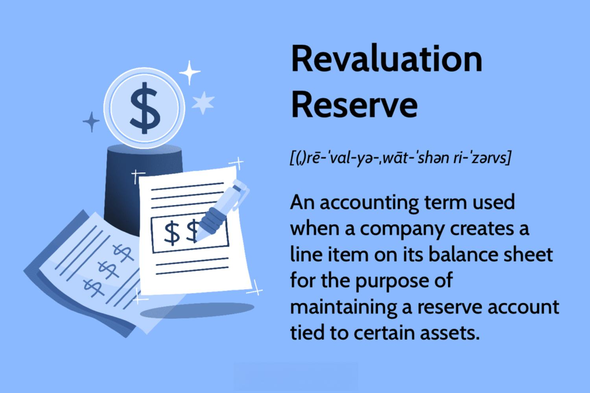

In today's dynamic financial landscape, organizations and individual investors are increasingly reliant on accurate and up-to-date accounting records. These records provide a crucial foundation for making informed decisions and maintaining transparency in financial transactions. The importance of these records cannot be understated, as they are integral to preparing financial statements and ensuring compliance with regulatory standards.

The intricacies of financial accounting can be compounded by specific elements such as the revaluation reserve. Revaluation reserves are adjustments made to reflect assets' current market value instead of historical cost. This adjustment mechanism provides a more realistic depiction of a company's financial health, allowing stakeholders to assess the true value of its assets. Understanding how revaluation reserves function is essential for accurate financial analysis and reporting.



Moreover, technological advancements have revolutionized the processing of financial transactions, particularly through algorithmic trading (algo trading). Algorithmic trading employs computer algorithms to execute trades at optimal times and prices with minimal human intervention. This approach leverages complex mathematical models to analyze market data, optimizing trading strategies. The integration of artificial intelligence and machine learning into algo trading has further enhanced its efficiency, making it indispensable in modern financial markets.

This article explores these critical components, providing insights into how they interconnect within the contemporary financial ecosystem. Readers will gain an understanding of how accounting records serve as the bedrock for financial accounting practices and their integration with revaluation reserves and algorithmic trading. By the end of this article, you will have a clearer perspective on the importance of these concepts in current financial strategies, equipping you with knowledge essential for navigating the complexities of modern finance.

## Table of Contents

## Understanding Accounting Records

Accounting records are fundamental to the financial architecture of any organization. They include various forms of documentation and books that detail all financial transactions, thereby ensuring transparency and accuracy in reporting. Key components of accounting records include financial statements, ledgers, balance sheets, and tax returns. 

Financial statements provide a snapshot of an entity's financial performance and position over a specific period. A balance sheet, a core component of the financial statements, exhibits an organization’s assets, liabilities, and equity at a particular point in time, following the equation:

$$
\text{Assets} = \text{Liabilities} + \text{Equity}
$$

Ledgers, on the other hand, play a crucial role in recording all financial transactions, serving as the backbone of the double-entry bookkeeping system. Each transaction is meticulously recorded as an entry in the relevant accounts.

Maintaining accurate accounting records is pivotal for making informed decisions and fulfilling compliance and regulatory demands. It enables management to assess the financial health of the organization and aids investors and creditors in evaluating an entity’s performance.

In today’s business environment, digitization significantly impacts the efficiency and accuracy of maintaining accounting records. The advent of digital tools and software allows for the automated capturing, processing, and storing of financial data, improving accuracy and reducing human error. Utilizing software like QuickBooks or SAP, organizations can integrate and manage financial data in real-time, thereby facilitating swift decision-making and comprehensive reporting.

Overall, well-maintained accounting records not only support strategic organizational decisions but also ensure that regulatory requirements are consistently met, thereby fortifying trust among stakeholders.

## The Role of Financial Accounting

Financial accounting is essential for systematically recording, reporting, and analyzing financial transactions, providing a comprehensive view of an organization's financial health. Through financial accounting, stakeholders such as management, investors, and regulators receive standardized financial statements that adhere to key principles and standards including Generally Accepted Accounting Principles (GAAP) or International Financial Reporting Standards (IFRS). These frameworks ensure consistency, reliability, and transparency, allowing stakeholders to make informed decisions based on the financial data presented.

Central to financial accounting is the accuracy of records, which must reflect the organization's true financial position and performance. This accuracy allows for effective strategic planning and resource allocation, essential for maintaining competitiveness and operational efficiency. Financial statements generated through financial accounting, such as the balance sheet, income statement, and cash flow statement, provide critical insights into a company's assets, liabilities, revenues, and expenses.

Maintaining accurate financial accounting records involves following specific methodologies and practices. For instance, the accrual basis of accounting recognizes revenues and expenses when they are incurred, regardless of when cash transactions occur. This approach provides a more accurate representation of an entity's financial activities over a given period.

Furthermore, financial accounting is not static but requires continuous monitoring and adaptation to changes in regulations and market conditions. Companies are obligated to keep abreast of updates in accounting standards and implement necessary adjustments to ensure compliance and maintain the integrity of their financial reports.

To enhance financial accounting processes, technology solutions like accounting software are employed, offering advanced tools for precise data entry and real-time analysis. These tools not only improve the speed and accuracy of financial reporting but also facilitate seamless integration across different departments within an organization. As a result, financial accounting becomes a strategic asset, driving better decision-making and enabling organizations to achieve budgetary goals and financial stability.

## Exploring Revaluation Reserves

A revaluation reserve is an integral component of an organization's equity, created to account for the adjustments in the value of fixed assets. It arises when an entity reassesses the value of its fixed assets, updating them to reflect their current market value rather than their historical cost. This practice ensures that the company's balance sheet presents a more accurate picture of its asset value, thus providing stakeholders with a fair representation of the organization's financial position.

When a revaluation occurs, the increase in asset value is credited to the revaluation reserve, a separate component of shareholders' equity. It is important to note that a revaluation reserve can also decrease if asset values fall, impacting the reserve and potentially leading to a write-down of the asset in the financial statements. This process underscores the need for precise and judicious asset valuation to mitigate the risk of significant financial discrepancies.

The accounting treatment of revaluation reserves must adhere to standards such as the International Financial Reporting Standards (IFRS) or Generally Accepted Accounting Principles (GAAP). These frameworks provide guidelines on how revaluation should be reported and disclosed in financial statements, ensuring transparency and consistency. For instance, under IFRS, companies must provide detailed disclosures about the revaluation decisions, including the nature, date, and impact of the revalued assets on financial performance.

Effective management of revaluation reserves involves several best practices. Regular revaluations are recommended to keep asset values current with market conditions, preferably conducted by professional valuers. Additionally, companies should adopt rigorous internal controls to review and approve revaluation exercises consistently, ensuring compliance with relevant accounting standards and avoiding manipulation of financial results.

The impact of revaluation reserves on financial performance is multifaceted. On one hand, revaluation can enhance the overall equity base, improving financial ratios and potentially enhancing the company's attractiveness to investors. On the other hand, decreases in value must be carefully managed, as they can lead to impairments affecting both the income statement and the overall financial health of the entity.

In essence, revaluation reserves contribute to a more accurate financial analysis by providing a realistic assessment of asset values. Through meticulous management and adherence to accounting standards, organizations can harness these reserves to maintain robust financial representation, supporting strategic decision-making and ensuring long-term financial stability.

 to Algorithmic Trading

Algorithmic trading, or algo trading, involves the use of computer algorithms to automate trading decisions with minimal human intervention. This method employs complex mathematical models and formulas to execute trades at optimal times and prices, thereby optimizing trading strategies and outcomes.

The integration of Artificial Intelligence (AI) and [machine learning](/wiki/machine-learning) into [algorithmic trading](/wiki/algorithmic-trading) has significantly enhanced its efficiency and effectiveness. These technologies enable the analysis of vast amounts of data at speeds unattainable by humans, allowing for the identification of trading opportunities that might be missed otherwise. For example, machine learning algorithms can detect patterns and predict market trends, adapting to new information and improving decision-making processes over time.

Python, with libraries such as NumPy, pandas, and scikit-learn, is widely used for developing algorithmic trading strategies due to its simplicity and powerful analytical capabilities. An example of a simple trading algorithm in Python might involve using a moving average crossover strategy, where the algorithm buys or sells an asset based on the crossover points of short-term and long-term moving averages.

```python
import pandas as pd

# Assuming 'data' is a DataFrame containing historical stock prices
data['Short_MA'] = data['Close'].rolling(window=40).mean()
data['Long_MA'] = data['Close'].rolling(window=100).mean()

data['Signal'] = 0
data.loc[data['Short_MA'] > data['Long_MA'], 'Signal'] = 1
data.loc[data['Short_MA'] < data['Long_MA'], 'Signal'] = -1

# Generate trading signals
data['Positions'] = data['Signal'].diff()
```

Algorithmic trading offers significant benefits including increased speed, reduced errors, and the ability to capitalize on short-lived market opportunities. The rapid execution of trades minimizes the impact of market movements and human errors, thus providing a competitive edge in markets characterized by [volatility](/wiki/volatility-trading-strategies) and rapid changes.

Despite its advantages, algorithmic trading also presents challenges. One of the primary challenges is managing market volatility, which can lead to significant losses if not controlled appropriately. Algorithms need robust risk management strategies to handle such volatility. Moreover, the reliance on historical data for training models poses the risk of overfitting, where algorithms perform well on past data but poorly in unseen market conditions.

Advanced risk management processes involve the implementation of techniques such as stop-loss limits, diversification, and dynamic hedging. Ensuring these mechanisms are integrated into algorithmic trading systems is crucial for mitigating potential risks and ensuring the long-term profitability of trading strategies.

In conclusion, algorithmic trading has transformed financial markets by enabling high-frequency trading strategies that maximize returns through speed and precision. However, it necessitates careful risk management to address the associated challenges, ensuring sustainable and profitable trading operations.

## The Intersection of Financial Concepts

The convergence of financial accounting, revaluation reserves, and algorithmic trading illuminates the intricate nature of modern finance. With accounting records as the foundation, these components facilitate robust financial strategies by ensuring that organizations reflect their true financial position accurately and can respond promptly to market dynamics.

Accounting records are critical for effectively evaluating revaluation reserves. These reserves adjust an organization's equity to reflect the current market value of assets, rather than historical cost. Accurate accounting data ensures that these adjustments are realistic, providing a transparent view of a company's asset valuation on the balance sheet. This transparency is vital for stakeholders who rely on these evaluations for informed decision-making.

Algorithmic trading capitalizes on both real-time and historical financial data, emphasizing the importance of precise accounting records. The algorithms used in trading strategies often depend on historical price patterns and current market conditions to decide optimal entry and [exit](/wiki/exit-strategy) points for trades. For instance, a simple moving average crossover strategy in Python might look like this:

```python
import pandas as pd

# Load historical price data
data = pd.read_csv('price_data.csv')

# Calculate moving averages
data['Short_MA'] = data['Close'].rolling(window=10).mean()
data['Long_MA'] = data['Close'].rolling(window=50).mean()

# Identify trade signals
data['Signal'] = 0
data.loc[data['Short_MA'] > data['Long_MA'], 'Signal'] = 1
data.loc[data['Short_MA'] <= data['Long_MA'], 'Signal'] = -1

# Execute trades based on signals
def execute_trades(data):
    portfolio_value = 100000  # Initial investment
    shares_held = 0

    for i in range(1, len(data)):
        if data['Signal'][i] == 1:  # Buy signal
            shares_held = portfolio_value / data['Close'][i]
            portfolio_value = 0
        elif data['Signal'][i] == -1 and shares_held > 0:  # Sell signal
            portfolio_value = shares_held * data['Close'][i]
            shares_held = 0
    return portfolio_value

final_value = execute_trades(data)
print(f"Final Portfolio Value: ${final_value:.2f}")
```

Ensuring data integrity is imperative since inaccuracies could lead to substantial financial losses. The integration of [artificial intelligence](/wiki/ai-artificial-intelligence) and machine learning further amplifies the need for high-quality data to refine trading models and improve predictive accuracy.

A comprehensive understanding of these financial concepts is crucial for maintaining a competitive edge within the industry. Organizations that adeptly integrate financial accounting, revaluation reserves, and algorithmic trading into their practices can enhance strategic planning, optimize resource allocation, and achieve sustainable financial health. Case studies of firms that have successfully adopted these integrations illustrate the potential benefits:

1. **XYZ Corp** enhanced their financial reporting accuracy through meticulous accounting practices, enabling a more precise calculation of revaluation reserves. Consequently, this provided clear insights into their asset value, satisfying regulatory requirements and investor expectations.

2. **ABC Trading LLC** employed algorithmic trading systems reliant on real-time financial data, resulting in faster decision-making and improved trading performance. Ensuring the accuracy of underlying financial data led to reduced market risk and enhanced profitability.

In conclusion, by harmonizing financial accounting, revaluation reserves, and algorithmic trading, firms can address the complexities of modern finance, achieving a balance between innovation and financial stability.

## Challenges and Best Practices

Navigating the intricate relationships of accounting records, financial accounting, revaluation reserves, and algorithmic trading presents several challenges that organizations must address to maintain efficiency and compliance. A primary concern is regulatory compliance, as firms must adhere to accounting standards and financial regulations, such as the Generally Accepted Accounting Principles (GAAP) or International Financial Reporting Standards (IFRS). These standards ensure accuracy in financial reporting and transparency for stakeholders but require constant monitoring to accommodate updates or changes in legislation. 

System integration presents another significant challenge. With the increasing sophistication of financial systems, ensuring seamless interaction between different software and platforms is crucial. Inadequate integration can lead to data discrepancies, delayed reporting, and ultimately, misinformed decision-making. Financial systems often include components like enterprise resource planning (ERP) software, accounting systems, and trading platforms, which must work cohesively to provide a unified financial picture.

Data accuracy and security are paramount, given the sensitive nature of financial information. Organizations must implement robust data management systems to prevent errors and safeguard against cyber threats such as data breaches. It is crucial to use encrypted channels for data transmission and ensure regular audits of security protocols.

To address these challenges, best practices include adopting advanced technology solutions. For instance, incorporating artificial intelligence (AI) and machine learning into accounting and trading systems can enhance data processing speed and accuracy, while also providing predictive analytics for better decision-making. Regular training and development programs should be established for financial personnel to keep them informed about the latest technological tools and regulatory requirements.

Establishing robust internal controls is another critical best practice. These controls should encompass checks and balances within financial systems to ensure the integrity of data and compliance with legal standards. Internal audits and feedback mechanisms should be regular to detect and rectify anomalies promptly.

Staying informed about both regulatory changes and technological advancements is essential for risk mitigation. Organizations can achieve this by subscribing to financial publications, participating in industry conferences, and collaborating with financial experts.

Implementing these best practices enhances operational efficiency, providing an organization the agility to adapt to changing financial landscapes. Furthermore, it supports strategic growth by ensuring that financial practices are aligned with market expectations and organizational objectives, thereby facilitating better decision-making and resource allocation. By investing in technology and training, organizations can effectively navigate these complexities and sustain long-term financial health and competitiveness.

## Conclusion

In today's rapidly changing financial environment, accounting records, financial accounting, revaluation reserves, and algorithmic trading are essential pillars for any organization's financial success. Proper management and integration of these elements allow firms to align their goals with market conditions and stakeholder expectations. By doing so, organizations can ensure both accuracy and transparency in their financial dealings.

As financial landscapes continue to evolve, leveraging these concepts is vital for enhanced decision-making and improved financial outcomes. For example, precise and up-to-date accounting records inform the strategic decisions that drive a company's direction. Similarly, understanding and utilizing revaluation reserves allow businesses to present a fair value of their assets, directly influencing both internal assessments and perceptions by external entities.

Moreover, investing in technology and talent development is crucial for navigating the complexities of modern finance effectively. Technological advancements, such as algorithmic trading, require investment not only in robust infrastructures but also in skilled practitioners who can interpret complex data and adjust strategies accordingly. Examples of programming languages that can be employed for algorithmic trading include:

```python
import datetime as dt
import pandas as pd
import numpy as np

def moving_average_strategy(data, short_window=40, long_window=100):
    signals = pd.DataFrame(index=data.index)
    signals['signal'] = 0.0

    signals['short_mavg'] = data['Close'].rolling(window=short_window, min_periods=1, center=False).mean()
    signals['long_mavg'] = data['Close'].rolling(window=long_window, min_periods=1, center=False).mean()

    signals['signal'][short_window:] = np.where(signals['short_mavg'][short_window:] > signals['long_mavg'][short_window:], 1.0, 0.0)
    signals['positions'] = signals['signal'].diff()

    return signals

# Example usage:
# data = pd.read_csv('financial_data.csv', parse_dates=True, index_col=0)
# signals = moving_average_strategy(data)
```

Finally, a call to action is imperative for organizations: continuously innovate and adapt to remain competitive and ensure long-term financial stability and growth. By staying informed about regulatory changes and technological advancements, and by establishing robust internal controls, businesses can mitigate risks while seizing new opportunities. Maintaining a forward-thinking approach in financial strategy and operations is not just beneficial but necessary for sustainable success in an ever-evolving economic landscape.

## References & Further Reading

[1]: Bergstra, J., Bardenet, R., Bengio, Y., & Kégl, B. (2011). ["Algorithms for Hyper-Parameter Optimization."](https://papers.nips.cc/paper/4443-algorithms-for-hyper-parameter-optimization) Advances in Neural Information Processing Systems 24.

[2]: ["Advances in Financial Machine Learning"](https://www.amazon.com/Advances-Financial-Machine-Learning-Marcos/dp/1119482089) by Marcos Lopez de Prado

[3]: ["Evidence-Based Technical Analysis: Applying the Scientific Method and Statistical Inference to Trading Signals"](https://www.amazon.com/Evidence-Based-Technical-Analysis-Scientific-Statistical/dp/0470008741) by David Aronson

[4]: ["Machine Learning for Algorithmic Trading"](https://github.com/stefan-jansen/machine-learning-for-trading) by Stefan Jansen

[5]: ["Quantitative Trading: How to Build Your Own Algorithmic Trading Business"](https://www.amazon.com/Quantitative-Trading-Build-Algorithmic-Business/dp/1119800064) by Ernest P. Chan