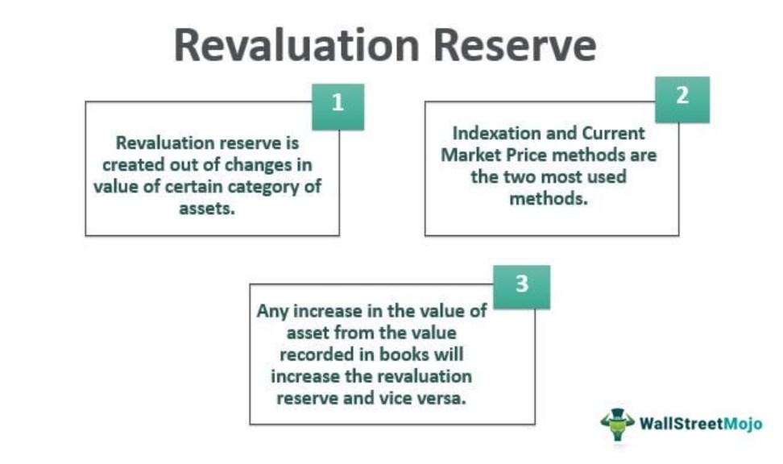

## Table of Contents

## What is a revaluation reserve?

A revaluation reserve is an accounting term that refers to the increase in value of an asset when it is revalued. When a company owns an asset like land or a building, and the value of that asset goes up, the company can choose to update, or revalue, the asset's value on their financial statements. The difference between the old value and the new, higher value is recorded in the revaluation reserve. This reserve is part of the company's equity and shows on the balance sheet.

The purpose of a revaluation reserve is to show a more accurate picture of a company's financial health. If the value of an asset increases, it makes sense to update the financial statements to reflect this change. This way, investors and other stakeholders can see a more realistic value of the company's assets. However, it's important to note that revaluation reserves are not cash. They represent potential value that could be realized if the asset were sold at the revalued amount.

## Why is it important to record revaluation reserves?

Recording revaluation reserves is important because it helps show the true value of a company's assets. When the value of an asset like land or a building goes up, it's good to update the financial statements to reflect this new value. This way, everyone who looks at the company's financials, like investors or banks, can see a more accurate picture of what the company owns. If the value of an asset increases but isn't updated, the financial statements might make the company look less valuable than it really is.

Another reason to record revaluation reserves is to follow accounting rules and standards. Many countries have rules that say companies need to show the most up-to-date values of their assets. By recording revaluation reserves, a company makes sure it's following these rules. This helps keep the company's financial reporting clear and trustworthy, which is important for making good business decisions and keeping the trust of people who invest in or do business with the company.

## How does a revaluation reserve differ from other reserves?

A revaluation reserve is different from other reserves because it only comes from changes in the value of assets. When a company owns things like land or buildings and their value goes up, the company can update the value on its financial statements. The difference between the old value and the new value is put into the revaluation reserve. This reserve shows that the company's assets are now worth more than before, but it's not money that the company can use right away. It's more like a note on the financial statements saying the assets are worth more if they were sold now.

Other reserves, like retained earnings or general reserves, are usually money that the company has set aside from its profits. Retained earnings come from the money the company makes after paying taxes and dividends. Companies might put some of this money into a general reserve to save for future needs or to protect against risks. Unlike revaluation reserves, these other reserves can be used by the company for things like paying off debts, investing in new projects, or even giving money back to shareholders. So, while a revaluation reserve shows an increase in asset value, other reserves are more about saving or setting aside actual money that the company has earned.

## What are the accounting standards that govern revaluation reserves?

Revaluation reserves are guided by accounting standards that help companies show the right value of their assets on financial statements. The main standard that deals with revaluation reserves is the International Financial Reporting Standards (IFRS), specifically IFRS 16 and IAS 16. These standards say that if a company chooses to update the value of its assets, it must record any increase in value in a revaluation reserve. This helps make sure that the financial statements show a true picture of what the company owns.

Another important standard is the Generally Accepted Accounting Principles (GAAP) used in the United States. Under GAAP, revaluation of assets is less common, but if it happens, the increase in value can also be recorded in a revaluation reserve. Both IFRS and GAAP aim to keep financial reporting clear and fair, but they have some differences in how they handle revaluations. Companies need to follow these standards to make sure their financial statements are accurate and trusted by investors and other people who look at them.

## Can you explain the process of recording a revaluation reserve?

When a company decides to update the value of an asset because its value has gone up, it starts the process of recording a revaluation reserve. First, the company gets a new value for the asset, usually by hiring someone who knows how to value assets, like an appraiser. The company then compares this new value to the old value that was on the books. If the new value is higher, the difference between the two values is the revaluation gain. This gain is what the company records in the revaluation reserve.

To record the revaluation reserve, the company makes an entry in its financial statements. On the balance sheet, the value of the asset is increased to the new, higher value. At the same time, the company adds the revaluation gain to a special account called the revaluation reserve, which is part of the equity section of the balance sheet. This way, everyone who looks at the financial statements can see that the asset is now worth more, and the company has recorded this increase in value in the revaluation reserve. It's important to do this right so that the financial statements show a true picture of the company's assets.

## What types of assets typically qualify for revaluation?

Assets that can be revalued are usually things like land and buildings. These are called fixed assets because they are long-term and not meant to be sold quickly. Companies own these assets for a long time, and their value can change over the years. For example, if a company owns a piece of land, and the price of land in that area goes up, the company can update the value of the land on its financial statements.

Other assets that might be revalued include machinery and equipment, but this is less common. These assets can also change in value, but their value might go down because they wear out or become outdated. Sometimes, though, if new technology makes them more valuable or if they are in high demand, their value can go up. When this happens, the company can choose to revalue these assets and record any increase in value in the revaluation reserve.

## How often should revaluations be performed?

Revaluations don't have to happen on a set schedule, but it's good to do them often enough to keep the values of assets up to date. If the value of an asset changes a lot, like if the price of land goes up a lot in a short time, the company might want to revalue it sooner. Usually, companies might revalue their assets every three to five years, but this can change based on what the company thinks is best.

It's important for a company to think about how much the value of its assets might change and decide how often to revalue them. If the value of an asset stays pretty much the same, the company might not need to revalue it as often. But if the value can change a lot, like with real estate in a busy city, the company might want to check the value more often to make sure their financial statements show the right numbers.

## What are the impacts of revaluation on financial statements?

When a company revalues its assets, it changes the numbers on its financial statements. If the value of an asset goes up, the company adds this increase to the asset's value on the balance sheet. They also put the increase into a special account called the revaluation reserve, which is part of the equity section of the balance sheet. This makes the total assets and total equity of the company look bigger. It shows that the company's assets are now worth more, but it doesn't mean the company has more cash. It's more like a note saying the assets could be sold for more money now.

Revaluation can also affect the income statement, but only if the value of an asset goes down. If an asset is revalued and its value is lower than before, the company has to record this decrease as a loss on the income statement. This can make the company's profit for that period look smaller. But if the value goes up, the increase isn't usually shown on the income statement. Instead, it goes straight to the revaluation reserve on the balance sheet. So, revaluation can make the balance sheet look different, and sometimes it can change the income statement too.

## How do you reverse a revaluation reserve?

When a company decides to reverse a revaluation reserve, it means they are going back to the old value of the asset or adjusting it to a new value. If the value of the asset goes down after it was revalued, the company can take money out of the revaluation reserve to cover the loss. This means they move the amount of the decrease from the revaluation reserve to another account, like accumulated depreciation or directly to the income statement as a loss. This helps keep the financial statements accurate and shows that the asset is now worth less than it was after the last revaluation.

If the company sells the asset, they might need to reverse the revaluation reserve too. When they sell it, they move the full amount in the revaluation reserve for that asset to another part of the equity, usually retained earnings. This shows that the extra value they recorded before is now gone because the asset was sold. Reversing a revaluation reserve helps make sure the financial statements show the right value of the company's assets and equity at all times.

## What are the tax implications of revaluation reserves?

When a company revalues its assets and records a revaluation reserve, it usually doesn't have to pay taxes right away. This is because the revaluation reserve is not real money the company can use; it's just a way to show that an asset is worth more now. So, the tax authorities don't see it as income that the company needs to pay taxes on. But, if the company sells the asset later and makes a profit because of the higher value, then they might have to pay taxes on that profit.

In some countries, though, the rules might be different. For example, if a company revalues its assets and it changes how much they have to pay in property taxes, then the revaluation could affect their taxes right away. It's important for companies to know the tax laws in their country so they can understand how revaluing assets might change their tax situation. Talking to a tax expert can help them figure out what to do.

## How do revaluation reserves affect a company's equity?

When a company revalues its assets and the value goes up, it adds the increase to a special account called the revaluation reserve. This reserve is part of the company's equity on the balance sheet. So, when the company adds to the revaluation reserve, it makes the total equity of the company bigger. This shows that the company's assets are now worth more, which can make the company look more valuable to people who might want to invest in it or do business with it.

But, the revaluation reserve doesn't mean the company has more money to spend right away. It's more like a note on the financial statements that says the assets could be sold for more money now. If the company sells the asset later and makes a profit because of the higher value, it might have to pay taxes on that profit. And if the value of the asset goes down after it was revalued, the company can take money out of the revaluation reserve to cover the loss, which would make the total equity smaller.

## What are the international variations in the treatment of revaluation reserves?

Different countries have different rules about how to handle revaluation reserves. In many places that follow the International Financial Reporting Standards (IFRS), like Europe, companies can choose to update the value of their assets if the value goes up. If they do this, they have to put the increase in value into a revaluation reserve on their balance sheet. This helps show a more accurate picture of what the company owns. But in the United States, where companies often follow the Generally Accepted Accounting Principles (GAAP), revaluing assets is not as common. If a company does revalue an asset under GAAP, the increase in value can also go into a revaluation reserve, but it's not something companies do very often.

In some countries, the tax rules can also be different. For example, in the UK, if a company revalues its assets, it might have to pay more in property taxes because the value of the property went up. But in other places, like Australia, revaluing assets doesn't usually change how much a company has to pay in taxes right away. It's only when the company sells the asset and makes a profit that they might have to pay taxes on the extra money they get. Because of these differences, companies need to know the rules in their own country to make sure they handle revaluation reserves the right way.

## What is Understanding Accounting Records?

Accounting records are fundamental to the financial architecture of any organization. They include various forms of documentation and books that detail all financial transactions, thereby ensuring transparency and accuracy in reporting. Key components of accounting records include financial statements, ledgers, balance sheets, and tax returns. 

Financial statements provide a snapshot of an entity's financial performance and position over a specific period. A balance sheet, a core component of the financial statements, exhibits an organization’s assets, liabilities, and equity at a particular point in time, following the equation:

$$
\text{Assets} = \text{Liabilities} + \text{Equity}
$$

Ledgers, on the other hand, play a crucial role in recording all financial transactions, serving as the backbone of the double-entry bookkeeping system. Each transaction is meticulously recorded as an entry in the relevant accounts.

Maintaining accurate accounting records is pivotal for making informed decisions and fulfilling compliance and regulatory demands. It enables management to assess the financial health of the organization and aids investors and creditors in evaluating an entity’s performance.

In today’s business environment, digitization significantly impacts the efficiency and accuracy of maintaining accounting records. The advent of digital tools and software allows for the automated capturing, processing, and storing of financial data, improving accuracy and reducing human error. Utilizing software like QuickBooks or SAP, organizations can integrate and manage financial data in real-time, thereby facilitating swift decision-making and comprehensive reporting.

Overall, well-maintained accounting records not only support strategic organizational decisions but also ensure that regulatory requirements are consistently met, thereby fortifying trust among stakeholders.

## References & Further Reading

[1]: Bergstra, J., Bardenet, R., Bengio, Y., & Kégl, B. (2011). ["Algorithms for Hyper-Parameter Optimization."](https://papers.nips.cc/paper/4443-algorithms-for-hyper-parameter-optimization) Advances in Neural Information Processing Systems 24.

[2]: ["Advances in Financial Machine Learning"](https://www.amazon.com/Advances-Financial-Machine-Learning-Marcos/dp/1119482089) by Marcos Lopez de Prado

[3]: ["Evidence-Based Technical Analysis: Applying the Scientific Method and Statistical Inference to Trading Signals"](https://www.amazon.com/Evidence-Based-Technical-Analysis-Scientific-Statistical/dp/0470008741) by David Aronson

[4]: ["Machine Learning for Algorithmic Trading"](https://github.com/stefan-jansen/machine-learning-for-trading) by Stefan Jansen

[5]: ["Quantitative Trading: How to Build Your Own Algorithmic Trading Business"](https://www.amazon.com/Quantitative-Trading-Build-Algorithmic-Business/dp/1119800064) by Ernest P. Chan