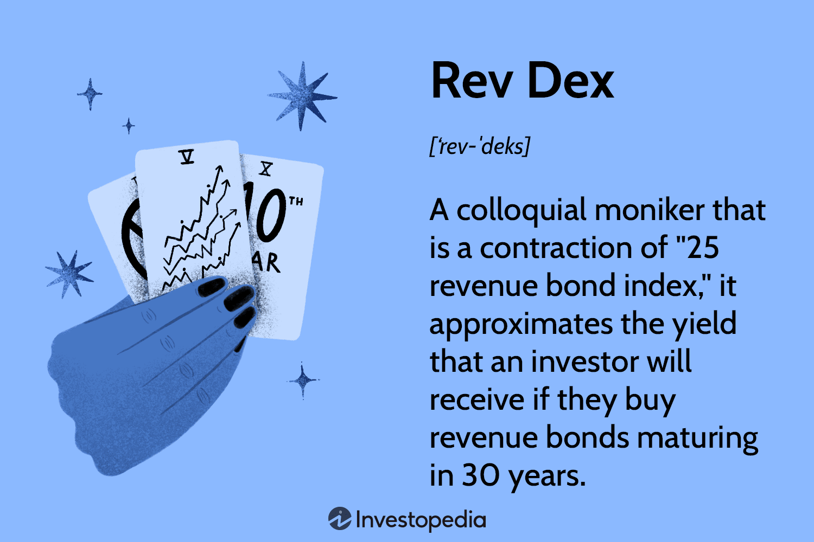

## Table of Contents

## What is Revdex in the context of fixed income?

Revdex is a type of bond index that tracks the performance of revenue bonds. Revenue bonds are a kind of municipal bond where the money to pay back the bond comes from the earnings of a specific project, like a toll road or a hospital, rather than from general taxes. The Revdex index helps investors see how well these kinds of bonds are doing in the market.

Investors use the Revdex index to understand trends and make decisions about buying or selling revenue bonds. It's like a scoreboard that shows how revenue bonds are performing compared to other types of bonds. By looking at the Revdex, investors can get a sense of whether revenue bonds are a good investment at that time or if they should look at other options.

## How does Revdex function within fixed income markets?

Revdex serves as a benchmark in the fixed income market, specifically for revenue bonds. It helps investors track how well these bonds are doing over time. Revenue bonds are different because they're paid back from money made by specific projects, like bridges or water systems, not from general taxes. By looking at the Revdex, people can see if revenue bonds are a good investment compared to other types of bonds.

In the fixed income market, having a tool like Revdex is important because it gives investors a clear picture of how revenue bonds are performing. This can help them decide if they should buy more of these bonds or if they should invest in something else. The Revdex index updates regularly, so investors can keep up with changes and make smart choices about their money.

## What are the primary benefits of using Revdex for fixed income investments?

Using Revdex for fixed income investments helps investors see how well revenue bonds are doing. Revenue bonds are special because the money to pay them back comes from specific projects, not taxes. By looking at the Revdex, investors can understand if these bonds are a good choice compared to other types of bonds. This makes it easier for them to decide where to put their money.

Revdex also updates regularly, so investors can keep up with the latest changes in the market. This means they can make quick decisions if something important happens. Knowing how revenue bonds are performing through Revdex helps investors feel more confident about their choices and manage their investments better.

## Can you explain the basic components that make up Revdex?

Revdex is made up of a bunch of revenue bonds. These are bonds where the money to pay them back comes from things like toll roads, hospitals, or water systems, not from taxes. To be part of Revdex, a bond has to meet certain rules. For example, it needs to be a certain size and have a good credit rating. This makes sure that the bonds in Revdex are similar to each other, so it's fair to compare them.

The way Revdex works is by looking at the prices of these revenue bonds every day. It then calculates an average to show how well all these bonds are doing together. This average is what people call the Revdex index. It's like a scoreboard that tells investors if revenue bonds are going up or down in value. By keeping an eye on this index, investors can see trends and make smarter choices about buying or selling these bonds.

## How does Revdex impact the yield of fixed income securities?

Revdex helps investors see how revenue bonds are doing, which can change the yield of fixed income securities. When the Revdex index goes up, it means revenue bonds are doing well, and this can make their yields go down. This happens because when bonds do well, their prices go up, and the yield, which is like the interest you get, goes down. On the other hand, if the Revdex index goes down, it can mean the yields on revenue bonds might go up because their prices are lower.

Investors use the Revdex to understand these changes and make choices about their investments. If they see that the Revdex is going up, they might think about selling their revenue bonds to take advantage of the higher prices. If the Revdex is going down, they might buy more because the higher yields could mean more money for them in the future. By watching the Revdex, investors can try to get the best yields on their fixed income securities.

## What role does Revdex play in risk management for fixed income portfolios?

Revdex helps people who manage fixed income portfolios by giving them a way to see how risky revenue bonds are. Revenue bonds are different because they're paid back from money made by specific projects, not taxes. By looking at the Revdex index, investors can see if these bonds are doing well or not. If the Revdex is going up, it means the bonds are less risky, and if it's going down, it might mean the bonds are riskier.

Knowing the risk of revenue bonds through Revdex helps investors make their portfolios safer. They can decide to buy more revenue bonds if they think the risk is low, or they can sell some if they think the risk is too high. By keeping an eye on the Revdex, investors can adjust their investments to manage risk better and keep their money safer.

## How is Revdex integrated into trading platforms and systems?

Revdex is added to trading platforms and systems to help people see how revenue bonds are doing. When you use a trading platform, you can look at the Revdex index to make smart choices about buying or selling these bonds. The platform shows the Revdex numbers in real-time, so you always know what's happening with revenue bonds. This helps traders and investors decide if they want to put their money into revenue bonds or if they should look at other types of investments.

The Revdex index is also used in trading systems to help with automatic trading. These systems can be set up to buy or sell revenue bonds based on what the Revdex is doing. For example, if the Revdex goes up, the system might buy more revenue bonds because they're doing well. If the Revdex goes down, the system might sell some to avoid losing money. This way, Revdex helps trading systems make quick decisions without needing a person to watch the market all the time.

## What are the differences between Revdex and other indices used in fixed income?

Revdex is different from other fixed income indices because it only tracks revenue bonds. Revenue bonds are special because the money to pay them back comes from specific projects, like toll roads or hospitals, not from general taxes. Other indices might include different types of bonds, like general obligation bonds, which are paid back from taxes. So, Revdex gives a very focused look at how revenue bonds are doing, while other indices give a broader picture of the bond market.

Another way Revdex is different is that it helps investors see trends specifically in revenue bonds. For example, if someone wants to know how revenue bonds are doing compared to other bonds, they would look at Revdex. Other indices, like the Bloomberg Barclays Aggregate Bond Index, include a mix of different bonds, so they show a more general view of the bond market. This makes Revdex a useful tool for investors who are only interested in revenue bonds and want to make decisions based on how well those bonds are performing.

## How can Revdex be used to enhance portfolio diversification?

Revdex can help make your investment portfolio more diverse by focusing on revenue bonds. When you look at the Revdex, you see how well these special bonds are doing. Revenue bonds are different because they're paid back from money made by projects like toll roads or hospitals, not from taxes. By adding revenue bonds to your portfolio, you're not just sticking with the usual bonds that are paid back by taxes. This can help spread out your risk because if something goes wrong with tax-backed bonds, your revenue bonds might still be doing okay.

Using Revdex to check on revenue bonds can also help you decide when to buy or sell them. If the Revdex is going up, it means revenue bonds are doing well, and you might want to add more to your portfolio. If it's going down, you might want to sell some to avoid losing money. By keeping an eye on the Revdex, you can make sure your portfolio has a good mix of different kinds of bonds, which can help protect your money and maybe even make more of it.

## What are some advanced strategies for utilizing Revdex in fixed income trading?

One advanced strategy for using Revdex in fixed income trading is to use it for timing your trades. By watching the Revdex closely, you can see when revenue bonds are doing really well or not so good. If the Revdex is going up, it might be a good time to buy more revenue bonds because their prices are high and you can get a good deal. On the other hand, if the Revdex is going down, you might want to sell some of your revenue bonds to avoid losing money. This way, you can make quick decisions based on the latest trends in the revenue bond market.

Another strategy is to use Revdex for hedging. This means you can use revenue bonds to balance out the risk in your portfolio. If you have a lot of other types of bonds, adding revenue bonds can help spread out your risk. When you see the Revdex going up or down, you can adjust how many revenue bonds you have to keep your portfolio safe. For example, if the Revdex is going down, you might buy more revenue bonds to take advantage of higher yields, which can help protect your money if other parts of your portfolio are not doing well.

A third strategy is to use Revdex for sector rotation. This means moving your money between different types of revenue bonds based on what the Revdex is showing. If the Revdex shows that certain sectors, like water systems or toll roads, are doing better than others, you can shift your investments to those sectors. By doing this, you can try to get the best returns from your revenue bonds. Watching the Revdex helps you stay on top of which sectors are hot and which ones are not, so you can make smart moves with your money.

## How does Revdex adapt to changes in the economic environment?

Revdex changes with the economy because it looks at how well revenue bonds are doing. Revenue bonds get paid back from money made by projects like toll roads or hospitals. If the economy is doing well, people might use toll roads more or go to hospitals more, so these projects make more money. This makes the revenue bonds do better, and the Revdex goes up. But if the economy is not doing well, people might use these projects less, so the revenue bonds might not do as well, and the Revdex might go down.

Revdex helps investors see these changes and make smart choices. If the Revdex is going up because the economy is good, investors might want to buy more revenue bonds. If the Revdex is going down because the economy is bad, they might want to sell some to avoid losing money. By watching the Revdex, investors can keep up with what's happening in the economy and adjust their investments to stay safe and maybe even make more money.

## What future developments or innovations are expected in Revdex for fixed income markets?

In the future, Revdex might get better at showing more detailed information about revenue bonds. This could mean adding more data about different projects, like toll roads or hospitals, so investors can see how each type of project is doing. Revdex might also start using new technology, like [artificial intelligence](/wiki/ai-artificial-intelligence), to predict how revenue bonds will do in the future. This could help investors make even smarter choices about buying or selling these bonds.

Another thing that might happen is Revdex could become part of more trading platforms and systems. This would make it easier for more people to use Revdex when they're making decisions about their money. Also, Revdex might work with other indices to give a fuller picture of the whole bond market. By doing this, investors could see how revenue bonds fit into the bigger picture and make better plans for their investments.

## References & Further Reading

[1]: Bergstra, J., Bardenet, R., Bengio, Y., & Kégl, B. (2011). ["Algorithms for Hyper-Parameter Optimization."](https://dl.acm.org/doi/10.5555/2986459.2986743) Advances in Neural Information Processing Systems 24.

[2]: ["Advances in Financial Machine Learning"](https://www.amazon.com/Advances-Financial-Machine-Learning-Marcos/dp/1119482089) by Marcos Lopez de Prado

[3]: Zhao, Y., & Zhang, X. (2015). ["Algorithmic Trading in Fixed-Income Markets: Opportunities and Challenges."](https://www.sciencedirect.com/science/article/pii/S0360319924052996) S&P Global.

[4]: Hendershott, T., & Moulton, P. C. (2011). ["Automation, speed, and stock market quality: The NYSE's Hybrid."](https://www.sciencedirect.com/science/article/pii/S138641811100005X) The Review of Financial Studies, Volume 24, Issue 8.

[5]: ["Quantitative Trading: How to Build Your Own Algorithmic Trading Business"](https://www.amazon.com/Quantitative-Trading-Build-Algorithmic-Business/dp/1119800064) by Ernest P. Chan

[6]: ["Machine Learning for Algorithmic Trading"](https://github.com/stefan-jansen/machine-learning-for-trading) by Stefan Jansen