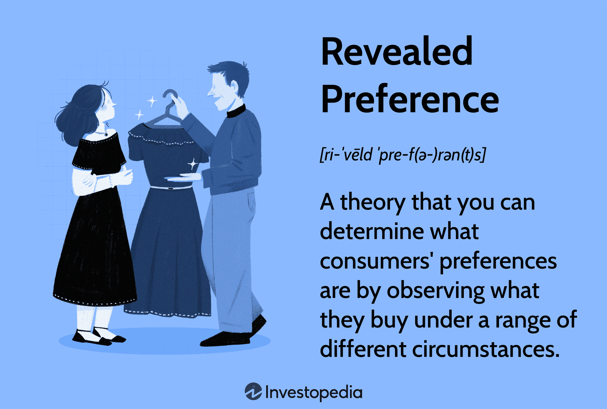

Consumer behavior has long been a focal point in economics, serving as a critical framework for comprehending market dynamics. Within this domain, the revealed preference theory, introduced by economist Paul Samuelson in 1938, stands out as a key concept that connects consumer choices with their underlying preferences. This theory posits that one can infer a consumer's preferences by observing their purchasing decisions, thus shedding light on their decision-making processes more effectively than abstract utility functions.

This article investigates the parallels and interconnections between revealed preference theory and algorithmic trading within financial markets. Algorithmic trading, which employs computer algorithms to execute trades at optimal prices and speeds, can draw valuable insights from consumer behavior models. By using the principles of revealed preferences, trading algorithms can potentially enhance their predictive capabilities, aligning more closely with market trends driven by consumer actions.



The axioms of revealed preference provide a systematic approach to interpret consumer decisions, offering practical implications in both economics and finance. Understanding these axioms helps elucidate how consumer choices can be systematically anticipated and, consequently, integrated into sophisticated trading strategies. By leveraging insights from consumer behavior, algorithmic trading can refine its strategies, aiming for improved efficiency and adaptability in ever-changing markets.

This exploration sets the stage for a deeper understanding of the practical implications of revealed preference theory in both economic theory and financial practice. By examining this intriguing relationship, the potential for significant advancements in algorithmic trading strategies becomes evident, highlighting the value of integrating economic theories with modern computational techniques to navigate the complexities of global markets effectively.

## Table of Contents

## Understanding Revealed Preference Theory

Revealed preference theory posits that an individual's choices can serve as accurate indicators of their underlying preferences, more so than speculative or theoretical utility models. This concept, introduced by economist Paul Samuelson in 1938, operates on several foundational principles that assume consumers consistently act to maximize their utility, a reflection of the rational behavior model in economics.

The cornerstones of Samuelson’s theory are encapsulated in key axioms that progressively elaborate on consumer choice consistency. The Weak Axiom of Revealed Preference (WARP), for instance, states that if a consumer chooses a bundle of goods $A$ over another bundle $B$ given their budget, then the choice is revealed preference for $A$ as long as $B$ remains an available option. In mathematical terms, if $A$ is revealed preferred to $B$, then $B$ cannot be revealed preferred to $A$ in any subsequent time period under the same prices and income:

$$
\text{If } A \succ B, \text{ then not } B \succ A.
$$

Building further on this axiom is the Strong Axiom of Revealed Preference (SARP), which extends WARP by assuming transitivity in consumer choices. It suggests that if a sequence of choices indicates preferences $A \succ B$ and $B \succ C$, it follows logically that $A \succ C$.

To encompass broader scenarios, the Generalized Axiom of Revealed Preference (GARP) interprets consumer behavior over a variety of prices and bundles. GARP allows for more flexibility, accommodating minimal inconsistencies in choices, yet maintains that there shouldn't be any cyclical patterns in preference revelation given different budget constraints.

A critical assumption in revealed preference theory is that consumer preferences remain stable and consistent amidst changes in income and prices. This provides a simplified model of decision-making but also exposes the limitations and critiques the theory faces. Primarily, it assumes rationality and static preference structures, disregarding how preferences may shift due to behavioral factors, market trends, or psychological impulses. Consequently, while the axioms provide a structured approach to understanding consumer preferences, they may not fully capture real-world complexities where choices may not always reflect rationality or consistency. 

The theory’s limitations have been pointed out by various researchers who argue that it fails to account for irrational consumer behaviors and dynamically evolving preferences, crucial factors in today's intricate economic environments. Nonetheless, revealed preference theory remains an influential tool in economic analysis, providing a foundational framework for examining and deducing consumer behavior in standard market scenarios.

## Algorithmic Trading: An Overview

Algorithmic trading is a sophisticated method of trading that employs computer algorithms to automate the process of buying and selling securities. These algorithms are designed to execute trades at the most optimal prices and speeds by taking advantage of various market variables and conditions. The primary advantage of [algorithmic trading](/wiki/algorithmic-trading) is its ability to process and analyze vast quantities of data far more quickly and effectively than a human trader ever could.

Central to algorithmic trading is the reliance on quantitative models and computational data analysis. These models are used to identify market trends, calculate risk, and predict price movements. They can be as simple or complex as necessary, ranging from straightforward rule-based systems to advanced [machine learning](/wiki/machine-learning) algorithms. At their core, these models often seek to capitalize on statistical [arbitrage](/wiki/arbitrage) opportunities, [momentum](/wiki/momentum) trading, or mean reversion strategies, among others.

Algorithms in trading incorporate extensive market data, including historical price patterns, trading volumes, and real-time market news, to make informed trading decisions. The process often involves setting predefined criteria or rules for trade execution—such as the timing, price, or quantity of a trade—that the algorithm follows. For example, an algorithm might be programmed to execute a buy order when a stock’s 50-day moving average crosses above its 200-day moving average, a common signal for a bullish market trend.

The efficiency and accuracy of algorithmic trading are major contributors to its growing prevalence in financial markets. Algorithms can execute trades without the delay of human intervention, reducing the response time to market changes and enhancing the likelihood of achieving favorable trade prices. Furthermore, the absence of emotional decisions—often a [factor](/wiki/factor-investing) in manual trading—can result in more consistent and rational trade execution.

One emerging area within algorithmic trading is the integration of behavioral economics. By incorporating insights from behavioral economics, algorithms can potentially improve decision-making processes. Understanding human behavior trends, such as how investors tend to react to market news or economic indicators, can add another layer of sophistication to these trading systems. For instance, algorithms might adjust trading strategies in anticipation of increased [volatility](/wiki/volatility-trading-strategies) when significant economic reports are expected, thus optimizing trading outcomes.

Overall, the fusion of advanced algorithmic techniques and behavioral insights holds the promise of enabling more nuanced and effective trading strategies, potentially leading to greater market efficiencies and enhanced profitability.

## Applying Revealed Preference Theory in Algorithmic Trading

Incorporating insights from revealed preference theory into algorithmic trading involves utilizing consumer behavior to enhance trading strategies. This approach leverages the foundational concept that consumer choices can effectively reveal preferences, which in turn, can be analyzed to predict market dynamics. Algorithms designed with these insights can identify patterns in consumer spending and economic conditions, thereby anticipating shifts in market trends.

One practical application is harnessing data on historical purchasing behavior to forecast future market activities. By analyzing consumption data, algorithms can discern patterns that signal impending changes in supply and demand, offering an informed basis for trading decisions. For instance, when there is an uptick in consumer spending on durable goods, it might indicate broader economic confidence, prompting algorithms to adjust portfolios accordingly.

Moreover, assumptions of rational behavior—central to revealed preference theory—can inform the creation of trading algorithms that seek to mimic or anticipate the decision-making processes of market participants. These algorithms aim to optimize trades based on the presumption that market participants act consistently to maximize utility, akin to consumers seeking to maximize their satisfaction within their budget constraints.

The ability to align trading strategies with consumer preferences, particularly under volatile market conditions, can confer a significant competitive edge. By anticipating changes in consumer preferences, traders can preemptively adjust their positions, mitigating risks and capitalizing on emerging opportunities. For example, if consumer data indicates a growing preference for sustainable goods, trading algorithms could prioritize investments in eco-friendly companies.

Overall, the integration of revealed preference insights into algorithmic trading offers a sophisticated method for enhancing decision-making processes. By analyzing both static historical data and dynamic market conditions, these algorithms can provide a comprehensive understanding of market trends, thereby reinforcing their effectiveness in both stable and fluctuating market environments. As technology and data analytics evolve, the refinement and accuracy of these algorithms are expected to improve, amplifying their impact on financial markets.

## Challenges and Limitations

Integrating consumer preference insights into algorithmic trading strategies offers innovative potential, yet the path is not without its obstacles. One of the primary challenges is the inherent uncertainty of financial markets, compounded by the fluid nature of consumer preferences. These variables can significantly affect the accuracy and effectiveness of predictive trading algorithms. Markets are influenced by a myriad of factors—political events, economic indicators, and technological changes—making them inherently unpredictable. Coupled with this, consumer preferences can shift rapidly due to social trends, economic conditions, and cultural changes, presenting a further challenge to achieving reliable market predictions.

Another significant limitation arises from the potential overreliance on historical consumer behavior patterns. While past actions provide valuable insights, they may not always accurately forecast future market conditions. Algorithmic models heavily relying on historical data might fail to capture emerging trends or structural changes in markets, leading to suboptimal trading decisions. This reliance is often premised on the assumption that future behaviors will mimic past patterns—an assumption that does not always hold true in dynamic markets.

The fast-paced nature of modern financial environments and continuously evolving consumer preferences require trading algorithms to be highly adaptive. Traditional algorithmic models, which function well under stable conditions, may not perform effectively in environments characterized by rapid change and volatility. To address these challenges, there is a growing need to develop more flexible algorithmic models that can adjust to new information swiftly and accurately.

Looking ahead, enhancing algorithmic trading systems through advanced behavioral insights and real-time data analysis could be pivotal. As access to big data and sophisticated analytics tools increases, there is potential to design algorithms that better interpret the nuances of consumer behavior and market dynamics. Incorporating machine learning techniques that can analyze patterns and predict shifts in consumer preferences might improve model accuracy. Real-time data integration could enable quicker response to market fluctuations, thus positioning traders to make more informed decisions.

In summary, while the integration of consumer preference insights into trading strategies is rife with potential, it also necessitates overcoming challenges related to market volatility, the complexity of human behavior, and the limitation of relying solely on historical data. Advances in technology and data analysis hold promise for navigating these issues, ensuring that trading algorithms remain robust and responsive in a fast-evolving market landscape.

## The Future of Revealed Preference Theory in Trading

Advancements in data analytics and machine learning are paving the way for a more refined integration of economic theories like revealed preference theory into trading strategies. As these technologies continue to evolve, they offer the potential to incorporate real-time data and behavioral trends, thereby enhancing the accuracy and adaptability of trading algorithms. The use of machine learning models can allow for the analysis of vast and continuously updated datasets, helping to capture subtle consumer behavioral patterns that could previously have gone unnoticed.

Incorporating real-time data into trading algorithms enables the immediate adaptation to changes in market conditions and consumer preferences. This dynamic approach contrasts with traditional models that rely on historical data and fixed assumptions. For example, machine learning algorithms can be trained to recognize patterns in consumer behavior and adjust trading strategies accordingly, potentially leading to more efficient and profitable outcomes.

Ongoing research into consumer behaviors and market dynamics is crucial for maximizing the synergistic use of revealed preferences in trading. By better understanding how consumers' choices and spending habits evolve, traders can refine their strategies to anticipate and respond to shifts in market behavior. This approach requires a robust analytical framework capable of integrating multi-dimensional data sources, including social media, transaction records, and macroeconomic indicators.

The evolution of this intersection between revealed preference theory and algorithmic trading holds promise for redefining trading strategies and market behavior understanding. As both fields progress, the potential for improved efficiency and profitability in markets becomes increasingly attainable. The continuous iteration and refinement of these algorithms, supported by machine learning advancements, ensure that trading strategies remain responsive and relevant in a constantly changing environment.

Python, with its rich ecosystem of data analysis and machine learning libraries such as pandas, scikit-learn, and TensorFlow, can be instrumental in developing these sophisticated trading models. For instance, a basic implementation of a trading strategy incorporating consumer behavior insights might look like this in Python:

```python
import pandas as pd
from sklearn.ensemble import RandomForestRegressor
from sklearn.model_selection import train_test_split

# Load data
data = pd.read_csv('consumer_behavior.csv')

# Preprocess and split data
X = data[['feature1', 'feature2', 'feature3']]  # Features from consumer behavior data
y = data['market_trend']  # Target variable
X_train, X_test, y_train, y_test = train_test_split(X, y, test_size=0.2, random_state=42)

# Train machine learning model
model = RandomForestRegressor(n_estimators=100, random_state=42)
model.fit(X_train, y_train)

# Predict and adapt trading strategy
predictions = model.predict(X_test)
```

As this code snippet illustrates, integrating and analyzing consumer data can enhance decision-making processes in trading using machine learning. Future developments will likely focus on increasing the granularity and timeliness of data inputs, as well as the sophistication of algorithmic outputs, to remain competitive in the rapidly evolving financial markets landscape.

## Conclusion

Revealed preference theory serves as an important framework within economic theory for deciphering consumer behavior. It offers insights into how choices manifest preferences, emphasizing the rational decisions made by consumers in an effort to maximize utility. In the domain of algorithmic trading, which predominantly hinges on extensive data and trend analysis, the implications of consumer preferences can be profoundly beneficial. By harnessing these preferences, algorithmic systems can be fine-tuned to better predict market movements and act accordingly.

Despite certain challenges, such as the unpredictability of market conditions and evolving consumer behaviors, the integration of revealed preference concepts into trading algorithms holds promise for enhancing both understanding and strategy within financial markets. These systems can be adapted to reflect changing consumer and market landscapes, fostering an improved capacity to anticipate and react to complex situations.

Aligning trading strategies with consumer preferences allows for more responsive and effective navigation through market intricacies. Such alignment ensures that market participants are better positioned to handle shifts and transitions in market dynamics. As algorithmic models continue to embrace the interplay between revealed preferences and data-driven trading techniques, significant advancements in the efficiency and profitability of financial markets are expected. This fusion illustrates the potential of economic theories when applied to practical, technology-driven financial activities, pointing toward a future where markets operate with increased accuracy and understanding.

## References & Further Reading

[1]: Samuelson, P. A. (1938). ["A Note on the Pure Theory of Consumer's Behaviour"](https://www.jstor.org/stable/2548836). Economica, 5(17), 61-71.

[2]: Varian, H. R. (1982). ["The Nonparametric Approach to Demand Analysis"](https://bpb-us-e1.wpmucdn.com/sites.psu.edu/dist/c/13885/files/2014/07/Varian1982_Nonparametric-Approach-to-Demand-Analysis.pdf). Econometrica: Journal of the Econometric Society, 50(4), 945-973.

[3]: Grinold, R. C., & Kahn, R. N. (2000). ["Active Portfolio Management: A Quantitative Approach for Producing Superior Returns and Controlling Risk"](https://www.amazon.com/Active-Portfolio-Management-Quantitative-Controlling/dp/0070248826). McGraw-Hill Education.

[4]: Dorman, K. D. (2020). ["The Little Book of Data Science, 2020 Edition"](https://www.goodreads.com/book/show/36060562-2020). New York: Xlibris US.

[5]: ["Algorithmic and High-Frequency Trading"](https://www.cambridge.org/us/universitypress/subjects/mathematics/mathematical-finance/algorithmic-and-high-frequency-trading) by Álvaro Cartea, Sebastián Jaimungal, and José Penalva.

[6]: Jarrow, R. A., & Protter, P. (2016). ["Rethinking Portfolio Optimisation: A Gaussian Approach"](https://www.semanticscholar.org/paper/ASSET-PRICE-BUBBLES-IN-INCOMPLETE-MARKETS-*-Jarrow-Protter/4656986ac676a2c4404ddeccb2f93d1001114b37). Quantitative Economics, 7, 479–517.

[7]: Kahneman, D., & Tversky, A. (1979). ["Prospect Theory: An Analysis of Decision under Risk"](https://www.jstor.org/stable/1914185). Econometrica, 47(2), 263-291.