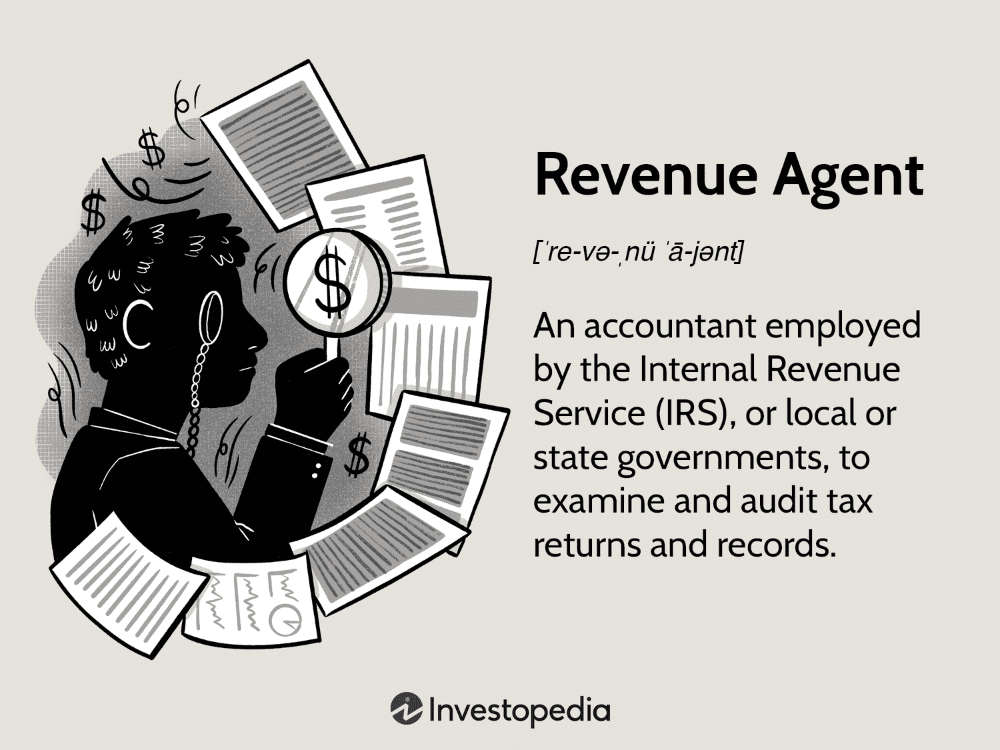

Understanding the role of a revenue agent is crucial for various stakeholders in the field of tax compliance and financial management. Revenue agents are pivotal in maintaining the integrity of financial systems by ensuring that individuals and corporations adhere to tax regulations. With the advent of algorithmic trading, the task of revenue agents has become increasingly complex. Algorithmic trading, which involves the use of sophisticated mathematical models and algorithms to execute trades at high speed, poses unique challenges and opportunities for those tasked with ensuring compliance with tax laws.

Algorithmic trading can result in numerous transactions occurring within seconds, requiring revenue agents to possess specialized skills to track and audit these activities effectively. The complexity of these transactions necessitates a deep understanding of financial instruments and applicable tax regulations to ensure that profits and losses are reported accurately. Revenue agents must also be adept in using advanced technology and data analytics tools to evaluate trading activities efficiently.



As financial markets continue to evolve with advancements in technology, the role of revenue agents is expanding beyond traditional auditing tasks. They are now expected to manage intricate tax compliance requirements, particularly those arising from innovative trading methods like algorithmic trading. This article will provide an overview of the skills required by revenue agents, their responsibilities, and how they contribute to maintaining the integrity of financial markets. This comprehensive guide aims to shed light on what is expected from revenue agents as they navigate an ever-changing financial landscape.

## Table of Contents

## What is a Revenue Agent?

A revenue agent is a specialized accountant employed by the Internal Revenue Service (IRS) or other governmental organizations to ensure that individuals and businesses comply with tax obligations. These agents are tasked with auditing tax returns and analyzing financial records to ensure that tax liabilities are accurately reported and paid. Their work is crucial in upholding the integrity of tax systems by preventing and identifying discrepancies or fraudulent activities.

In addition to scrutinizing tax returns, revenue agents perform detailed audits that may sometimes necessitate on-site visits to verify the accuracy and authenticity of the submitted financial information. These in-person audits help to confirm that the taxpayer's reported data aligns with their actual financial activities. The agents' expertise in accounting and tax law allows them to detect anomalies and inconsistencies, which aids in maintaining a fair tax system.

A comprehensive analysis of tax documents by revenue agents ensures that individuals, small businesses, and larger organizations adhere to established tax laws. This process involves a thorough examination of various records, including income statements, balance sheets, and expense logs. Revenue agents thus play a pivotal role in ensuring that all tax-related transactions are transparent and that entities are accountable for their fiscal responsibilities. 

Through diligent examination and reporting, revenue [agents](/wiki/agents) safeguard the public interest by enforcing compliance and contributing to the overall financial stability and integrity of governmental revenue systems. Their work helps deter tax evasion and ensures that governmental bodies receive appropriate funding to support public services and infrastructure.

## Key Responsibilities and Specializations

Revenue agents perform a crucial role in ensuring tax compliance through a range of responsibilities that cater to diverse tax-related issues. Their primary function involves examining tax returns to verify their accuracy. This process extends from assessing straightforward individual tax filings to scrutinizing intricate corporate tax accounts. By ensuring that tax liabilities are properly reported, revenue agents contribute to the integrity and reliability of the taxation system.

Certain revenue agents develop expertise in specialized areas of tax compliance. For instance, some may focus on employment tax, validating that businesses comply with regulations on payroll taxes and employee benefits. Others specialize in international transactions, a growingly complex field requiring a deep understanding of cross-border financial activities and treaties that impact taxation. Another area of specialization involves computer audits, which are essential for dealing with the vast amount of data in digital formats and the increasing use of technology in business operations. This field requires revenue agents to understand computer systems and software used in digital accounting.

Additionally, revenue agents often investigate the financial activities associated with criminal undertakings, such as tax evasion or money laundering. In such cases, they meticulously analyze financial records to identify any discrepancies or suspicious transactions that could indicate illegal activities. Their work in this domain is critical to combating fraud and enforcing adherence to tax laws.

In scenarios where criminal tax offenses are uncovered, revenue agents may be called upon to provide expert testimony in legal settings. This responsibility requires not only a thorough understanding of tax law but also effective communication skills to present complex information clearly and convincingly in court. Engaging in these varied tasks, revenue agents prove indispensable in safeguarding the system's legal and ethical standards, ensuring that both individuals and corporations meet their fiscal responsibilities.

## Requirements for Revenue Agents

A revenue agent position typically requires a solid educational foundation, heralded primarily by a bachelor's degree in accounting. This educational benchmark equips candidates with essential financial analysis and tax knowledge, forming the bedrock for competent tax auditing and compliance enforcement. In certain circumstances, an associate’s degree may suffice, provided it is complemented by relevant coursework that covers critical areas such as taxation principles, financial accounting, and auditing practices.

For a revenue agent role, proficiency in accounting is paramount. As such, candidates are often expected to have completed at least 30 semester hours in accounting courses. These courses usually encompass a comprehensive curriculum, including areas like introductory and intermediate accounting, cost accounting, and advanced taxation. However, requirements can vary, particularly for certified public accountants (CPAs), who might be subject to different educational prerequisites or may receive waivers due to their professional certification.

The Internal Revenue Service (IRS) has specific education and experience criteria for revenue agents. These criteria often demand a fusion of formal education and practical accounting experience. Professional experience involves roles in auditing or financial analysis, where candidates have developed skills in examining financial documents, preparing comprehensive reports, and understanding complex tax codes.

Although CPA certification is not mandatory for all revenue agent positions, it is frequently preferred or required by certain employers, given the credential’s indication of expertise and commitment to the field. Candidates with a CPA designation typically bring a higher level of understanding and professionalism, which can be advantageous in tackling the intricacies of tax regulations and compliance issues.

This education and experience framework ensures that revenue agents possess not only theoretical knowledge but also practical skills to efficiently perform their duties, contributing to maintaining compliance and integrity within financial systems.

## Revenue Agent vs. Revenue Officer

Distinguishing between revenue agents and revenue officers is essential to understanding their distinct but complementary roles in tax enforcement. Revenue agents primarily focus on audits and accurately determining tax liabilities. They are tasked with meticulous examinations of tax returns and financial records to ensure individuals, businesses, and organizations adhere to tax laws. Their work involves a thorough analysis of financial data, validation of reported income and deductions, and accurate computation of tax obligations. As part of their duties, revenue agents often require a strong accounting background to scrutinize complex financial transactions and verify compliance with tax regulations.

On the other hand, revenue officers are predominantly engaged in tax collection. Their responsibilities kick in when standard collection efforts have been ineffective. Revenue officers manage cases involving delinquent accounts, where they may need to negotiate payment plans, collect overdue taxes, and execute legal actions like asset seizures to recover unpaid liabilities. Unlike revenue agents, revenue officers do not necessarily require an accounting background. Their role demands proficiency in negotiation and enforcement skills to handle non-compliance cases and secure tax payments efficiently.

In sum, while revenue agents and revenue officers share a commitment to maintaining the integrity of the tax system, their approaches and necessary skill sets differ significantly. Revenue agents serve as auditors who ensure compliance through detailed assessments of financial records, whereas revenue officers act as enforcers addressing non-compliance and securing the collection of taxes due.

## Improving Tax Compliance in Algo Trading

Algorithmic trading, characterized by its high-speed and high-frequency transaction capabilities, poses unique challenges for tax compliance. The sheer [volume](/wiki/volume-trading-strategy) and complexity of transactions executed by sophisticated algorithms mean that revenue agents must be equipped with specialized knowledge to effectively oversee and ensure compliance with tax regulations. This is particularly crucial in verifying that profits and losses from [algorithmic trading](/wiki/algorithmic-trading) activities are reported accurately, which can be complicated by the rapid nature of trading and the variety of financial products involved.

Revenue agents working with algorithmic trading transactions need to possess a strong understanding of both trading algorithms and the tax laws applicable to these financial transactions. Given the technical and complex nature of algorithmic trading, agents must understand how these algorithms operate, their market impact, and how they generate taxable events. This specialized knowledge enables them to scrutinize algorithmic trades effectively to confirm adherence to tax laws, ensuring that no discrepancies go unnoticed.

One area of focus for revenue agents is the accurate reporting of gains and losses from algorithmic trading. Due to the high volume of transactions, ensuring accurate calculation and reporting can be challenging. This often entails verifying the correct application of accounting methods such as the Last In, First Out (LIFO) or First In, First Out (FIFO) methods for cost basis calculations, which are crucial for determining capital gains or losses. Here is how such calculations might be handled programmatically in Python:

```python
def calculate_fifo(transactions):
    """Calculate gains and losses using FIFO method."""
    total_gain_loss = 0
    holdings = []

    for t in transactions:
        if t['type'] == 'buy':
            holdings.append(t)
        elif t['type'] == 'sell':
            amount_to_sell = t['quantity']
            while amount_to_sell > 0 and holdings:
                buy_transaction = holdings.pop(0)
                quantity_from_buy = min(buy_transaction['quantity'], amount_to_sell)
                gain_loss = quantity_from_buy * (t['price'] - buy_transaction['price'])
                total_gain_loss += gain_loss
                amount_to_sell -= quantity_from_buy
                buy_transaction['quantity'] -= quantity_from_buy
                if buy_transaction['quantity'] > 0:
                    holdings.insert(0, buy_transaction)

    return total_gain_loss

# Example usage
transactions = [
    {'type': 'buy', 'quantity': 100, 'price': 10},
    {'type': 'sell', 'quantity': 50, 'price': 15},
    {'type': 'sell', 'quantity': 50, 'price': 20},
]

print("Total Gain/Loss:", calculate_fifo(transactions))
```

This script helps in maintaining transparency and compliance by accurately computing gains or losses, which are crucial for detailed tax reporting.

Furthermore, continuous learning and adaptation are essential for revenue agents dealing with the rapidly evolving landscape of financial technology. As algorithmic trading strategies advance and diversify, ongoing training and specialization become paramount. Revenue agents must stay abreast of technological advancements and regulatory changes to perform their duties effectively. This need for continuous education ensures that revenue agents are well-prepared to navigate the complexities of modern financial markets and uphold the integrity of tax compliance in an increasingly digital world.

## Conclusion

Revenue agents are integral to maintaining the tax compliance framework, notably as they confront the challenges presented by algorithmic trading. With rapid technological advances and the increasing complexity of financial transactions, these professionals are essential in safeguarding the financial markets' integrity. They ensure that businesses and individual traders accurately report their financial activities, adhering to the tax laws designed to promote fairness and accountability.

Meeting rigorous educational and professional standards, such as obtaining degrees in accounting and possibly certifications like the CPA, provides revenue agents with the skills necessary to navigate the intricate world of financial markets. This foundation empowers them to scrutinize the accuracy of tax filings and the validity of financial records. The precision and diligence they bring to their audits fortify the trustworthiness of tax systems and help prevent and detect instances of tax evasion.

The role of revenue agents is not static; it evolves in parallel with the fast-paced development of financial technologies. Algorithmic trading, characterized by rapid and complex transactions, requires revenue agents to possess specialized knowledge that includes understanding the technical aspects of algorithms and the financial products they deal with. This demands a commitment to continuous learning and adaptation, ensuring they remain proficient in handling new trading techniques and the accompanying tax implications.

Through their work, revenue agents affirm the principle of tax fairness, ensuring that all entities, from individual traders to large corporations, fulfill their tax obligations. This commitment upholds the integrity of the tax system and contributes to a level playing field where compliant behavior is the norm. As they continue to adapt and refine their skills, revenue agents will remain indispensable to the robust enforcement of tax laws in the ever-evolving landscape of modern finance.

## References & Further Reading

[1]: Bergstra, J., Bardenet, R., Bengio, Y., & Kégl, B. (2011). ["Algorithms for Hyper-Parameter Optimization."](https://dl.acm.org/doi/10.5555/2986459.2986743) Advances in Neural Information Processing Systems 24.

[2]: ["Advances in Financial Machine Learning"](https://www.amazon.com/Advances-Financial-Machine-Learning-Marcos/dp/1119482089) by Marcos Lopez de Prado

[3]: ["Evidence-Based Technical Analysis: Applying the Scientific Method and Statistical Inference to Trading Signals"](https://www.amazon.com/Evidence-Based-Technical-Analysis-Scientific-Statistical/dp/0470008741) by David Aronson

[4]: ["Machine Learning for Algorithmic Trading"](https://github.com/stefan-jansen/machine-learning-for-trading) by Stefan Jansen

[5]: ["Quantitative Trading: How to Build Your Own Algorithmic Trading Business"](https://www.amazon.com/Quantitative-Trading-Build-Algorithmic-Business/dp/1119800064) by Ernest P. Chan