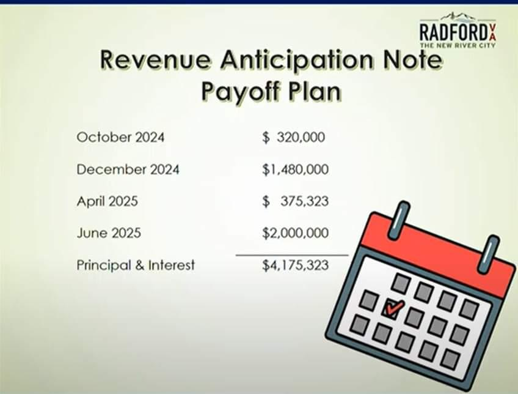

In the rapidly evolving world of finance, municipalities are increasingly turning to innovative solutions to address their short-term fiscal needs. Revenue Anticipation Notes (RANs) provide municipalities the flexibility to secure necessary funding by borrowing against anticipated future revenue. These financial instruments are crucial for maintaining the cash flow required for essential community projects without waiting for revenue cycles to complete. RANs exemplify the intersection of public finance and strategic borrowing, offering municipalities a means to manage their working capital effectively.

This article will explore the role of RANs within municipal finance, focusing on the advantages they offer to local governments. By leveraging RANs, municipalities can bridge temporary revenue shortfalls, thereby ensuring continuity in their project funding and service delivery. We will also examine how RANs intersect with algorithmic trading, a technology-driven approach that is reshaping financial markets. Algorithmic trading employs computer algorithms to optimize trading decisions, ultimately influencing the management and pricing of financial instruments like RANs.



Technological advancements, particularly in analytics and data processing, have revolutionized how financial instruments are traded and managed. Understanding the synergy between short-term municipal borrowing through RANs and algorithmic trading provides valuable insights into developing more efficient financial strategies. Such insights can aid local governments in minimizing borrowing costs while maximizing investment opportunities.

Overall, comprehending this convergence of short-term borrowing with state-of-the-art trading techniques highlights a progressive shift in municipal finance management. As cities and towns navigate financial complexities, the integration of RANs and algorithmic trading represents an innovative approach to achieving fiscal sustainability and efficiency.

## Table of Contents

## Understanding Revenue Anticipation Notes

Revenue Anticipation Notes (RANs) are a specific category of municipal bonds utilized primarily for short-term borrowing to bridge fiscal gaps caused by timing discrepancies between revenue inflows and expenditure outflows. These instruments are issued by municipalities to fund projects in anticipation of receiving the revenues necessary to repay the notes. RANs are typically issued for terms not exceeding one year, allowing municipalities to manage cash flow effectively.

The primary mechanism behind RANs involves borrowing against expected future revenues. For instance, a city might anticipate receiving substantial income from property taxes or federal grants within the upcoming fiscal year. To finance its immediate needs, such as infrastructure projects or operational expenses, the city can issue RANs with the intention of repaying these obligations when the anticipated revenues are received.

A key advantage of RANs is the tax-exempt status of the interest income at the federal level, making these notes an attractive investment for individuals seeking tax-efficient returns. This tax exemption lowers the effective cost of borrowing for municipalities, as investors are often willing to accept lower interest rates on tax-exempt bonds compared to taxable alternatives.

The issuance of RANs allows governments to initiate and continue essential projects without postponement due to cash flow constraints. By smoothing out the timing mismatch between revenue collections and expenditures, RANs enable municipalities to maintain operational continuity and proactively address community needs.

To summarize, RANs serve as a vital tool in municipal finance by offering a flexible, short-term funding solution that supports financial stability and project implementation. They not only help in managing short-term fiscal challenges but also provide investors with a tax-advantaged investment vehicle.

## Role of Algorithmic Trading in Municipal Finance

Algorithmic trading has increasingly influenced the municipal bond market, including instruments such as Revenue Anticipation Notes (RANs). This form of trading involves the use of computer algorithms to execute trades at speeds and frequencies that are beyond human capabilities. The adoption of [algorithmic trading](/wiki/algorithmic-trading) in municipal finance is attributed to its potential to significantly enhance [liquidity](/wiki/liquidity-risk-premium) and optimize pricing. By automating trading decisions, algorithms provide investors with the ability to conduct transactions based on real-time data and sophisticated analytical models.

One of the core advantages of algorithmic trading is its precision and speed, which are critical in managing the relatively lower liquidity of municipal bonds compared to other securities. Algorithms can analyze vast amounts of market data in microseconds, allowing them to identify trends and execute trades at optimal times. This capability not only improves the efficiency of transactions but also contributes to better pricing mechanisms for municipal bonds, including RANs.

The integration of Artificial Intelligence (AI) and big data analytics further enhances the effectiveness of trading algorithms in the municipal bond market. AI can process and analyze complex datasets to generate insights that might not be apparent through traditional analysis. For instance, [machine learning](/wiki/machine-learning) algorithms can adapt to new information and adjust trading strategies accordingly, which helps in predicting market movements more accurately.

Here's a simple Python code snippet illustrating a basic concept of algorithmic trading, where moving averages are used to make buy or sell decisions:

```python
import numpy as np

def moving_average(prices, window_size):
    return np.convolve(prices, np.ones(window_size), 'valid') / window_size

def trade_decision(prices, short_window, long_window):
    short_ma = moving_average(prices, short_window)
    long_ma = moving_average(prices, long_window)

    if short_ma[-1] > long_ma[-1]:
        return "Buy"
    elif short_ma[-1] < long_ma[-1]:
        return "Sell"
    else:
        return "Hold"

prices = [100, 102, 104, 103, 105, 110, 107, 109, 111, 115]  # example price data
decision = trade_decision(prices, short_window=2, long_window=5)
print(f"Trade Decision: {decision}")
```

Municipalities that utilize algorithmic trading strategies can potentially gain a competitive edge by improving the efficiency and cost-effectiveness of their borrowing processes. As technology continues to evolve, it is anticipated that algorithmic trading will play an increasingly pivotal role in the municipal bond market, offering innovative ways for municipalities to access capital markets with improved terms and conditions.

Moreover, the reduction in transaction costs associated with algorithmic trading can offer significant savings for municipalities, enabling them to allocate financial resources more effectively. This technological advancement represents a strategic opportunity for local governments to enhance their financial strategies and achieve better outcomes in terms of fiscal management and project funding.

## Comparing RANs with Other Municipal Notes

Revenue Anticipation Notes (RANs) are an integral component of the short-term municipal borrowing landscape, but they are not the only instruments available to local governments. Municipalities also employ Tax Anticipation Notes (TANs) and Bond Anticipation Notes (BANs), each tailored to address specific financial needs associated with different revenue streams.

TANs are issued against anticipated tax revenues and serve as a bridge for municipalities to meet immediate expenses while awaiting incoming tax collections. For instance, if property taxes are expected at a later date, TANs provide the necessary liquidity to fund current operations until the tax income is realized. This ensures continuity in service provision without dipping into reserves or cutting essential services.

BANs, on the other hand, are used in anticipation of a future bond issuance. These notes provide upfront capital for projects that are intended to be financed through long-term bonds. For example, a municipality may decide to initiate construction on a public infrastructure project and finance the upfront costs with BANs, which are later paid off with the proceeds from the sale of the long-term bonds. This strategy allows for immediate project commencement while deferring substantial funding to a later date when long-term financing becomes available.

The decision on which type of note to issue is underpinned by the specific revenue streams expected by the municipality. RANs are ideal when future revenues are tied to specific governmental operations or project-generated funds. TANs align best with tax revenue cycles, whereas BANs are more appropriate when long-term debt issuance is planned but immediate funding is necessary. 

Understanding these distinctions empowers municipal finance officers to make strategic decisions that optimize cash flow management and financial stability. By choosing the appropriate instrument, municipalities can ensure efficient funding of their projects while maintaining fiscal prudence and stability.

## Challenges and Risks Associated with RANs

Revenue Anticipation Notes (RANs) serve as an essential financial mechanism for municipalities seeking short-term borrowing solutions. However, their utilization is accompanied by specific challenges and risks that require careful management. The primary risk associated with RANs is the potential non-materialization of anticipated revenues. This risk arises when the expected revenue streams, which are earmarked for repaying the notes at maturity, fail to materialize as projected. Such discrepancies can lead to fiscal strains, compelling municipalities to explore alternative refinancing methods or budget adjustments to fulfill their debt obligations.

Market [volatility](/wiki/volatility-trading-strategies) further compounds the risks associated with RANs. Fluctuations in interest rates can significantly impact the cost-effectiveness of issuing RANs. Rising interest rates may render these notes less attractive to investors, thereby increasing the borrowing costs for municipalities. Conversely, falling rates might benefit issuers by reducing interest expenses. However, predicting market conditions is inherently uncertain, thus necessitating robust financial forecasting and risk assessment frameworks.

Municipalities must also judiciously manage the interplay between their short-term obligations and long-term fiscal health. Over-reliance on RANs to bridge budgetary gaps without sustainable revenue sources can jeopardize financial stability. Such practices might lead to cyclical borrowing, where new RANs are issued to cover previous liabilities, resulting in mounting debt levels.

To mitigate these challenges, municipalities must employ effective risk management strategies. This involves implementing comprehensive financial planning that accounts for revenue variability and potential market fluctuations. Diversifying revenue streams and maintaining adequate reserve funds are prudent measures that can buffer against unforeseen deficits. Additionally, leveraging financial technologies and analytics can enhance predictive accuracy concerning revenue generation and [interest rate](/wiki/interest-rate-trading-strategies) trends.

In summary, while RANs provide a flexible financial instrument for addressing short-term fiscal needs, managing their associated risks requires meticulous planning and strategic foresight. Municipal governments must carefully balance immediate financial requirements with long-term debt sustainability to ensure prudent fiscal management.

## Future Perspectives

As technology continues to advance, the integration of [artificial intelligence](/wiki/ai-artificial-intelligence) (AI) in finance is likely to have profound implications for how municipalities approach borrowing. AI's potential to enhance data processing and decision-making means that its application in municipal finance could lead to more efficient, data-driven borrowing practices. One area of significant impact could be algorithmic trading, which could become even more important for improving market access and pricing accuracy for municipal notes, including Revenue Anticipation Notes (RANs).

Algorithmic trading in municipal bonds operates through pre-defined rules encoded in complex algorithms capable of executing trades at speeds and efficiencies far beyond traditional methods. These algorithms analyze vast datasets to optimize trading decisions, thereby offering municipalities potentially lower borrowing costs and better market penetration. As these systems employ increasingly sophisticated machine learning techniques, their ability to adapt to turbulent market conditions will also improve, making them more reliable and effective for managing municipal finance portfolios.

Moreover, the progress in fintech is set to drive the development of innovative financial instruments specifically designed for local governments. This could involve the creation of more tailored borrowing options that align closely with the unique fiscal needs and revenue timelines of municipalities. Such innovations might include hybrid instruments that blend elements of RANs with other bond types or completely novel forms of digital assets secured through blockchain technology.

However, for municipalities to effectively harness these technological advancements, there must be a dedicated effort towards ongoing education and the adoption of new technological tools. This involves training financial officers to understand and manage AI-driven systems, as well as ensuring that infrastructure is capable of integrating with these advanced financial technologies. Education initiatives focused on technology in finance will be crucial in making sure that municipal staff are equipped to leverage these innovations for enhanced financial governance.

Looking forward, the most successful strategies in municipal finance will likely involve a combination of traditional financial acumen and cutting-edge technology. This approach will ensure that municipalities not only remain competitive in the face of evolving financial markets but also maintain fiscal responsibility. The fusion of long-standing financial principles with technological innovations offers an exciting path forward, promising more efficient management of public funds and ultimately benefiting the communities these municipalities serve.

## Conclusion

Revenue Anticipation Notes (RANs) are indispensable for municipalities pursuing short-term fiscal solutions. These financial instruments enable local governments to effectively manage budgetary discrepancies and enhance project funding by borrowing against anticipated revenues. The integration of algorithmic trading within this context has the potential to transform the issuance and management of RANs. By utilizing sophisticated algorithms, municipalities can achieve lower transaction costs and heightened efficiency, as these systems optimize trading patterns and market interactions. This technological assistance necessitates municipal finance professionals to develop a comprehensive grasp of both RANs and algorithmic trading strategies.

Such an understanding facilitates the navigation of contemporary financial complexities, maximizing the benefits of these innovations. However, the application of algorithmic solutions in municipal finance requires meticulous oversight and strategic foresight to actualize its full potential. Financial leaders must ensure that the blend of traditional fiscal practices and cutting-edge technology aligns with economic goals and governance standards. As the financial landscape evolves, the success of municipal finance will increasingly depend on adapting to technological progress while ensuring fiscal prudence and responsibility. This balance promises not only to enhance municipal financial strategies but also to safeguard the interests of the communities they serve.

## References & Further Reading

[1]: Fabozzi, F. J. (2007). ["Municipal Bond Portfolio Management."](https://www.amazon.com/Municipal-Portfolio-Management-Frank-Fabozzi/dp/1556236727) John Wiley & Sons.

[2]: ["Advances in Financial Machine Learning"](https://www.amazon.com/Advances-Financial-Machine-Learning-Marcos/dp/1119482089) by Marcos Lopez de Prado

[3]: ["Evidence-Based Technical Analysis: Applying the Scientific Method and Statistical Inference to Trading Signals"](https://www.amazon.com/Evidence-Based-Technical-Analysis-Scientific-Statistical/dp/0470008741) by David Aronson

[4]: ["Algorithmic Trading: Winning Strategies and Their Rationale"](https://www.wiley.com/en-us/Algorithmic+Trading%3A+Winning+Strategies+and+Their+Rationale-p-9781118746912) by Ernie Chan

[5]: Shackleton, M. (2004). ["Municipal Bond Taxation: Issues and Options,"](https://www.researchgate.net/profile/Junbo-Wang/publication/239570597_Liquidity_and_the_Pricing_of_Municipal_Bonds/links/0c96052984b5d9050a000000/Liquidity-and-the-Pricing-of-Municipal-Bonds.pdf) American Economic Review.