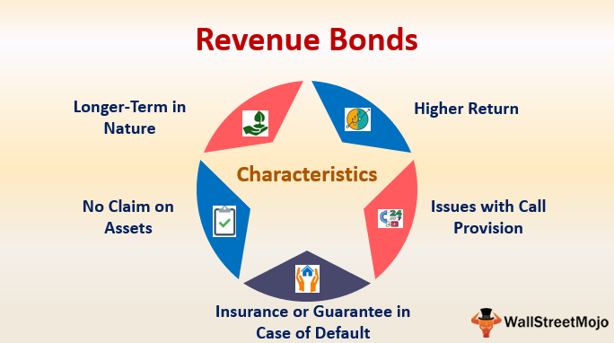

## Table of Contents

## What is a revenue bond?

A revenue bond is a type of bond that is used to fund specific projects, like building a new hospital or a highway. The money to pay back these bonds comes from the income or revenue that the project generates. For example, if a new toll road is built with revenue bonds, the money collected from tolls will be used to pay back the bondholders.

These bonds are different from general obligation bonds, which are backed by the full faith and credit of the issuing government. This means that with general obligation bonds, the government promises to use its tax revenues to pay back the bondholders if needed. Revenue bonds, on the other hand, are riskier because their repayment depends on the success of the project. If the project doesn't make enough money, the bondholders might not get paid back fully or on time.

## How do revenue bonds differ from general obligation bonds?

Revenue bonds and general obligation bonds are two ways that governments can borrow money. Revenue bonds are used to pay for specific projects, like a new bridge or a water treatment plant. The money to pay back these bonds comes from the money the project makes. For example, if a new parking garage is built with revenue bonds, the money from parking fees will be used to pay back the people who bought the bonds.

General obligation bonds are different. They are backed by the full promise of the government that issued them. This means the government will use its tax money to pay back the bondholders if it has to. These bonds are seen as safer because the government's taxes are usually a steady source of money. If a government issues a general obligation bond, it's promising to use all its resources to make sure the bondholders get paid back.

The main difference is where the money comes from to pay back the bonds. Revenue bonds rely on the success of the project they fund, which can be risky if the project doesn't make enough money. General obligation bonds are less risky because they are supported by the government's tax revenues, which are more predictable.

## What are the main types of revenue bonds?

There are a few main types of revenue bonds. One type is called a utility revenue bond. These bonds are used to build things like water systems, electric power plants, or sewage treatment plants. The money to pay back these bonds comes from the fees that people pay for using these services. For example, the money you pay on your water bill might be used to pay back the bondholders who helped build the water system.

Another type is called a transportation revenue bond. These bonds help pay for things like highways, bridges, or airports. The money to pay back these bonds usually comes from tolls or fees that people pay when they use these transportation systems. For instance, if you drive on a toll road, the toll you pay might go towards paying back the bondholders who helped build that road.

A third type is called a housing revenue bond. These bonds are used to build or improve housing, often for people who can't afford to buy a home on their own. The money to pay back these bonds can come from the rent that people pay to live in these homes. So, if you live in a housing project that was built with revenue bonds, your rent might be used to pay back the bondholders.

## Can you explain utility revenue bonds with an example?

Utility revenue bonds are a type of bond used to build things like water systems, electric power plants, or sewage treatment plants. The money to pay back these bonds comes from the fees that people pay for using these services. So, when you pay your water bill, part of that money might be used to pay back the bondholders who helped build the water system.

For example, let's say a city wants to build a new water treatment plant. They decide to use utility revenue bonds to get the money they need. The city issues the bonds, and people buy them, giving the city the money to build the plant. Once the plant is built, the city charges people for the water they use. The money from these water bills goes towards paying back the people who bought the bonds. If the water treatment plant works well and people keep paying their bills, the city can pay back the bondholders over time.

## What are transportation revenue bonds and how are they used?

Transportation revenue bonds are a type of bond that helps pay for things like highways, bridges, or airports. They are used to get the money needed to build these big projects. When a government wants to build a new road, for example, it can issue transportation revenue bonds. People buy these bonds, giving the government the money it needs to start building.

Once the project is finished, like a new highway, the government collects money from people who use it. This money comes from tolls or fees that drivers pay when they drive on the highway. The money collected from these tolls is then used to pay back the people who bought the bonds. So, if you drive on a toll road, the toll you pay might be used to pay back the bondholders who helped build that road.

## How do housing revenue bonds work, and what is an example of their use?

Housing revenue bonds are a way for governments to get money to build or fix up homes, especially for people who can't afford to buy a house on their own. The money to pay back these bonds comes from the rent that people pay to live in these homes. So, when someone pays rent in a housing project that was built with these bonds, part of that rent goes towards paying back the people who bought the bonds.

For example, a city might want to build new apartments for low-income families. They decide to use housing revenue bonds to get the money they need. The city issues the bonds, and people buy them, giving the city the money to build the apartments. Once the apartments are built, the city charges rent to the families who live there. The rent money is used to pay back the bondholders. If the apartments are well-managed and people keep paying their rent, the city can pay back the bondholders over time.

## What are industrial development revenue bonds and what industries typically use them?

Industrial development revenue bonds are a type of bond that helps businesses get the money they need to build or expand their facilities. These bonds are issued by a government, like a city or a state, but the money goes to the business. The business then pays back the bondholders using the money it makes from its operations. This can be a good way for businesses to get the money they need without having to borrow directly from a bank.

Industries that often use these bonds include manufacturing, like factories that make cars or electronics, and energy, like companies that build power plants. These bonds can also help businesses in other areas, like health care, where a hospital might use them to build a new wing, or in education, where a school might use them to build a new campus. The key is that the business has to make enough money to pay back the bondholders, so it's important for the project to be successful.

## Can you describe how healthcare revenue bonds are structured and provide an example?

Healthcare revenue bonds are a type of bond used to help hospitals and other healthcare facilities get the money they need to build new buildings or buy new equipment. When a hospital wants to build a new wing, for example, it can ask the government to issue these bonds. People buy the bonds, and the money goes to the hospital. The hospital then uses this money to build the new wing. Once the new wing is finished, the hospital charges patients for the services they get there. The money from these charges is used to pay back the people who bought the bonds. If the new wing is successful and the hospital keeps making money, it can pay back the bondholders over time.

For example, let's say a hospital wants to build a new cancer treatment center. They decide to use healthcare revenue bonds to get the money they need. The hospital works with the government to issue the bonds, and people buy them, giving the hospital the money to start building. Once the cancer treatment center is finished, the hospital starts treating patients there and charges them for the care they receive. The money from these charges goes towards paying back the people who bought the bonds. If the cancer treatment center is successful and patients keep coming, the hospital can pay back the bondholders over time.

## What are the risks associated with investing in revenue bonds?

Investing in revenue bonds can be risky because the money to pay back these bonds comes from the project they help build. If the project doesn't make enough money, like if not enough people use a new toll road, the bondholders might not get paid back on time or at all. This means that the success of the project is really important. If the project fails, the bondholders could lose money.

Another risk is that the interest rates might change. If interest rates go up after you buy a revenue bond, new bonds might offer higher interest rates. This can make your bond less valuable because people might want to buy the new bonds instead. Also, some revenue bonds might be harder to sell quickly if you need your money back sooner than expected. This can make them less flexible if your financial situation changes.

## How does the creditworthiness of a revenue bond issuer affect its interest rates?

The creditworthiness of a revenue bond issuer is really important because it can affect the interest rates they have to pay. If a bond issuer is seen as very reliable and likely to pay back the money they borrow, they can offer bonds with lower interest rates. This is because people trust that the issuer will be able to pay back the bondholders using the money from the project. So, if a city has a good track record of building successful projects and paying back bondholders, they might be able to borrow money at a lower cost.

On the other hand, if the issuer is seen as risky or less likely to pay back the money, they will have to offer higher interest rates to attract people to buy their bonds. This is because investors want to be rewarded for taking on more risk. For example, if a new project seems like it might not make enough money to pay back the bondholders, the issuer might have to pay a higher interest rate to convince people to invest. This means that the cost of borrowing money can be higher for issuers who are seen as less creditworthy.

## What are some advanced strategies for analyzing the financial viability of revenue bond projects?

When analyzing the financial viability of revenue bond projects, one important strategy is to look at the project's revenue projections. This means trying to figure out how much money the project will make once it's finished. You can do this by looking at similar projects and seeing how much money they made. It's also important to think about things that might change how much money the project makes, like changes in the economy or new laws. By looking at all these things, you can get a better idea of whether the project will make enough money to pay back the bondholders.

Another strategy is to do a sensitivity analysis. This means figuring out what would happen if things don't go as planned. For example, what if fewer people use the new toll road than expected? Or what if the cost of building the project goes up? By thinking about these different scenarios, you can see how the project might do under different conditions. This can help you understand how risky the project is and whether it's a good investment.

## How do legal and regulatory frameworks impact the issuance and performance of different types of revenue bonds?

Legal and regulatory frameworks play a big role in how revenue bonds are issued and how well they do. When a government wants to issue a revenue bond, it has to follow certain rules set by laws and regulations. These rules can affect things like how much money the government can borrow, what the money can be used for, and how the project has to be managed. For example, some states have laws that say how much debt a city can take on. If a city wants to build a new water treatment plant with revenue bonds, it has to make sure it's not going over its debt limit. These rules are there to make sure that the government is being responsible with its borrowing and that the projects it funds are likely to succeed.

Regulations can also affect how well a revenue bond project does after it's built. For example, if a new law changes how much people have to pay for water, it can change how much money a water treatment plant makes. This can affect whether the plant can pay back its bondholders on time. Also, some regulations require the government to do things like hold public meetings or get certain approvals before starting a project. These steps can make the process take longer and cost more, but they can also help make sure that the project is well-planned and more likely to succeed. So, understanding the legal and regulatory framework is really important for anyone thinking about investing in revenue bonds.

## What are the different types of bonds and their unique features?

Bonds are financial instruments that represent a loan made by an investor to a borrower, typically corporate or governmental entities. Beyond revenue bonds, which are specific to financing public projects through the income generated by these projects, several other bond types cater to diverse investment needs. These include corporate bonds, government bonds, municipal bonds, and zero-coupon bonds, each with unique characteristics that cater to different segments of the investment community.

Corporate bonds are issued by companies to raise capital for various business activities such as expansion, operations, or debt refinancing. These bonds tend to offer higher yields compared to government bonds due to their higher risk [factor](/wiki/factor-investing). The risk associated with corporate bonds is primarily tied to the company’s financial health and credit rating. Investors often analyze these bonds using metrics like the interest coverage ratio and debt-to-equity ratio to assess risk.

Government bonds, often referred to as sovereign bonds, are issued by national governments and are considered among the safest investments, as they are backed by the government's stability and ability to tax. Within government bonds, there are different types such as Treasury bonds (T-bonds) in the United States, which have different maturities and interest payment schedules. These bonds are typically used to finance government spending and are a tool for monetary policy implementation.

Municipal bonds, or "munis," are issued by local governments or agencies. They are used to fund public projects such as schools, roads, and infrastructure. A key feature of municipal bonds is their tax-exempt status on the interest income earned, making them attractive to investors in higher tax brackets. However, municipal bonds [carry](/wiki/carry-trading) default risk, which varies with the economic health of the issuing municipality.

Zero-coupon bonds differ from other bonds as they do not pay periodic interest. Instead, they are issued at a discount to their face value, with the full face value paid at maturity. This makes them appealing for investors looking for a lump sum payment in the future. The yield of a zero-coupon bond can be calculated using the formula:

$$
Y = \left( \frac{F}{P} \right)^{\frac{1}{n}} - 1
$$

where $Y$ is the yield, $F$ is the face value, $P$ is the purchase price, and $n$ is the number of years until maturity.

**Comparative Analysis: Risk and Return**

The risk and return profiles of these bond types vary significantly. Corporate bonds generally offer higher returns due to their higher risk, linked to the issuing company's stability. Government bonds provide lower returns, reflecting their safety and [liquidity](/wiki/liquidity-risk-premium). Municipal bonds offer unique tax advantages, influencing their net return for investors. Zero-coupon bonds emphasize return based on capital appreciation rather than periodic income, appealing during periods of anticipated [interest rate](/wiki/interest-rate-trading-strategies) changes.

In summary, each bond type presents a mix of risk, return, and tax implications, enabling investors to tailor their bond investments to specific financial goals and risk appetites.

## References & Further Reading

[1]: Municipal Securities Rulemaking Board. ["Introduction to Municipal Bonds."](https://www.msrb.org/sites/default/files/2023-11/Municipal-Bond-Basics.pdf) 

[2]: Fabozzi, F. J. (Editor). ["Handbook of Fixed-Income Securities."](https://www.amazon.com/Handbook-Fixed-Income-Securities-Ninth/dp/1260473899) 

[3]: Lopez de Prado, M. (2018). ["Advances in Financial Machine Learning."](https://www.amazon.com/Advances-Financial-Machine-Learning-Marcos/dp/1119482089)

[4]: Malkiel, B. G. (2019). ["A Random Walk Down Wall Street."](https://yourknowledgedigest.org/wp-content/uploads/2020/04/a-random-walk-down-wall-street.pdf)

[5]: Chan, E. P. (2009). ["Quantitative Trading: How to Build Your Own Algorithmic Trading Business."](https://github.com/ftvision/quant_trading_echan_book)

[6]: Jansen, S. (2018). ["Machine Learning for Algorithmic Trading: Predictive models to extract signals from market and alternative data for systematic trading strategies in Python."](https://www.amazon.com/Machine-Learning-Algorithmic-Trading-alternative/dp/1839217715)