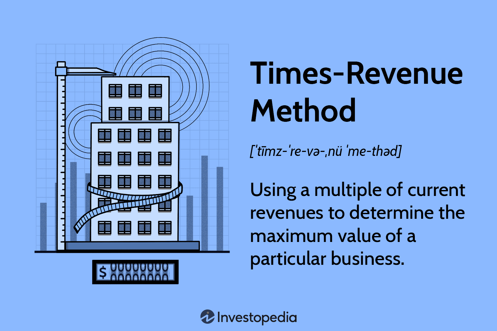

## Table of Contents

## What is revenue and why is it important for businesses?

Revenue is the total amount of money a business earns from selling its products or services. It's like the money that comes into the business from customers. For example, if a store sells 100 T-shirts at $10 each, the revenue would be $1,000.

Revenue is important for businesses because it shows how well the business is doing. If a business has a lot of revenue, it means many people are buying what it sells. This money helps the business pay for things like rent, employee salaries, and other costs. Without enough revenue, a business might struggle to stay open. So, keeping an eye on revenue helps business owners make smart decisions about how to grow and manage their company.

## What are the basic methods for calculating revenue?

There are two basic methods for calculating revenue: the cash method and the accrual method. The cash method is simple. It counts revenue when the business actually receives the money from customers. For example, if a store sells a toy and gets paid right away, that money is counted as revenue for that day.

The accrual method is a bit different. It counts revenue when a sale is made, even if the money hasn't been received yet. For instance, if a business sells something on credit, it counts that sale as revenue right away, even though the payment might come later. This method can give a better picture of how the business is doing over time, but it's a bit more complicated to keep track of.

## How do you calculate revenue for a product-based business?

For a product-based business, calculating revenue is straightforward. You just need to multiply the number of products sold by the price of each product. For example, if you sell 50 hats and each hat costs $20, your revenue would be 50 multiplied by $20, which equals $1,000. This total amount is your revenue from selling hats.

Sometimes, a business might sell different products at different prices. In that case, you calculate the revenue for each product separately and then add them all together. Let's say you sell 30 T-shirts at $15 each and 20 pairs of socks at $5 each. The revenue from T-shirts would be 30 multiplied by $15, which is $450. The revenue from socks would be 20 multiplied by $5, which is $100. Adding these together, your total revenue would be $450 plus $100, which equals $550.

## How do you calculate revenue for a service-based business?

For a service-based business, calculating revenue is similar to a product-based business but focuses on the services provided instead of products sold. You multiply the number of services provided by the price charged for each service. For example, if you run a cleaning company and you charge $100 for each cleaning job, and you complete 20 jobs in a month, your revenue for that month would be 20 multiplied by $100, which equals $2,000.

Sometimes, a service-based business might offer different services at different prices. In this case, you calculate the revenue for each type of service separately and then add them all together. Let's say you run a tutoring service where you charge $50 per hour for math tutoring and $40 per hour for English tutoring. If you provide 10 hours of math tutoring and 15 hours of English tutoring in a month, the revenue from math tutoring would be 10 multiplied by $50, which is $500. The revenue from English tutoring would be 15 multiplied by $40, which is $600. Adding these together, your total revenue for the month would be $500 plus $600, which equals $1,100.

## What is the difference between gross revenue and net revenue?

Gross revenue is the total amount of money a business makes from selling its products or services before taking away any costs. It's like the starting point of money coming in. For example, if a store sells 100 toys at $10 each, the gross revenue is $1,000, no matter what other costs the store has.

Net revenue, on the other hand, is what's left after you subtract certain costs from the gross revenue. These costs can include things like discounts, returns, or allowances given to customers. So, if that same store had to give back $100 because some toys were returned, the net revenue would be $900. Net revenue gives a clearer picture of how much money the business really keeps from sales.

## How can seasonality affect revenue calculations?

Seasonality can really change how much money a business makes at different times of the year. Some businesses, like ice cream shops, make a lot more money in the summer when it's hot outside. People want ice cream more then, so the shop's revenue goes up. But in the winter, when it's cold, fewer people buy ice cream, and the shop's revenue goes down. This means that when you're looking at the revenue numbers, you have to think about the time of year to understand if the business is doing well or not.

To calculate revenue correctly with seasonality in mind, businesses need to compare numbers from the same time of year. For example, if you want to see if your ice cream shop did better this summer than last summer, you would look at the revenue from June, July, and August of both years. This way, you're comparing apples to apples. If you just look at the whole year, the winter months might make it seem like the business is doing worse, even if the summer was great. So, understanding and accounting for seasonality helps businesses make better plans and decisions.

## What are some common revenue recognition methods?

Revenue recognition methods are ways businesses decide when to count money from sales as part of their revenue. The most common method is the accrual method, where businesses count revenue as soon as they make a sale, even if they haven't gotten the money yet. For example, if a company sells something on credit, they count that sale as revenue right away. This method helps show how the business is doing over time, but it can be tricky to keep track of.

Another common method is the cash method, where businesses only count revenue when they actually get the money. This is simpler because you just wait until the money is in your hands before you count it as revenue. For instance, if a store sells a toy and gets paid right away, that money is counted as revenue for that day. This method is easier to manage but might not show the full picture of how the business is doing if a lot of sales are on credit.

Some businesses also use the percentage-of-completion method, especially for long projects. This method counts revenue as the project goes along, based on how much of the work is done. For example, if a construction company is building a house and they're halfway done, they might count half of the total project price as revenue. This method helps show progress on big projects but can be complicated to figure out.

## How do subscription models impact revenue calculation?

Subscription models change how businesses calculate their revenue. Instead of getting all the money from a customer at once when they buy something, businesses get smaller amounts of money regularly over time. For example, if someone pays $10 every month for a streaming service, the business counts that $10 as revenue every month the person keeps their subscription. This means the business has to keep track of how many people are subscribed each month and how much they're paying.

Because of this, the revenue from subscriptions can be more predictable than from one-time sales. Businesses can look at how many people are likely to keep their subscription and guess how much money they'll make each month. But, they also have to think about people canceling their subscriptions, which can make the revenue go down. So, businesses need to keep an eye on both how many new subscribers they get and how many they lose to understand their total revenue.

## What role does accounting software play in revenue calculation?

Accounting software makes calculating revenue a lot easier for businesses. It keeps track of all the money coming in from sales, whether it's from selling products, services, or subscriptions. This means businesses don't have to do all the math by hand, which can be a big help, especially for bigger companies with a lot of sales to keep track of. The software can also handle different ways of counting revenue, like the cash method or the accrual method, depending on what the business needs.

Plus, accounting software can help businesses see their revenue over time and understand how things like seasonality or subscription changes affect it. It can make reports and graphs that show how much money is coming in each month or year, which helps business owners make smart decisions. By using accounting software, businesses can spend less time on math and more time on growing their company.

## How do international sales complicate revenue calculations?

International sales can make calculating revenue more complicated because of things like different currencies and taxes. When a business sells something in another country, they might get paid in that country's money, like euros or yen instead of dollars. They have to change that money into their own currency to know how much they really made. Also, different countries have different taxes and fees that can change how much money the business keeps after a sale.

Another thing that can make international sales tricky is the time it takes to get paid. Sometimes, it can take longer to get money from customers in other countries because of shipping or banking rules. This can mess up the timing of when the business counts that money as revenue. Plus, if the business uses the accrual method, they have to keep track of sales and payments in different countries carefully to make sure everything is counted right.

## What advanced metrics should be considered alongside revenue?

When looking at how a business is doing, it's good to look at more than just revenue. One important metric is profit margin, which shows how much money the business keeps after paying for things like making products or providing services. If a business has a high profit margin, it means they're good at keeping costs low or charging enough for what they sell. Another useful metric is customer lifetime value (CLTV), which helps businesses understand how much money they can expect to make from a customer over time. This is especially important for businesses with subscriptions or repeat customers.

Another metric to consider is the churn rate, which shows how many customers stop using a business's products or services. A high churn rate can mean the business is losing customers faster than they're gaining new ones, which can hurt future revenue. It's also helpful to look at the cost of customer acquisition (CAC), which tells a business how much it costs to get a new customer. If the CAC is too high compared to the revenue from that customer, the business might need to find cheaper ways to attract customers. Together, these metrics give a fuller picture of a business's health and help guide decisions for growth and improvement.

## How can predictive analytics be used to forecast future revenue?

Predictive analytics helps businesses guess how much money they might make in the future by looking at data from the past. It uses math and computer programs to find patterns in things like how many products were sold, what time of year sales were highest, and how customers behaved. For example, if a store sees that it sells a lot more ice cream in the summer, predictive analytics can help them guess how much ice cream they might sell next summer. This way, the business can plan better and make sure they have enough ice cream in stock.

By using predictive analytics, businesses can also see how changes might affect their future revenue. If they're thinking about raising prices or starting a new ad campaign, they can use past data to predict what might happen. This helps them make smart choices and avoid surprises. For instance, if they see that a new ad campaign usually brings in more customers, they can guess how much extra revenue that campaign might bring in next time. Predictive analytics turns guessing into something more like knowing, which is a big help for planning and growing a business.

## What is involved in decoding corporate earnings?

Corporate earnings, a key indicator of a company's financial performance, represent the profits a company generates after all expenses have been deducted from total revenue. The accurate reporting of these earnings is essential for assessing a company's financial health and for making informed decisions by investors and stakeholders. Earnings reports are typically released on a quarterly and annual basis, providing transparency and insight into the company's financial outcomes and business operations.

A widely recognized metric for evaluating corporate earnings is Earnings Per Share (EPS). EPS is calculated by dividing the net income by the total number of outstanding shares:

$$
\text{EPS} = \frac{\text{Net Income}}{\text{Number of Outstanding Shares}}
$$

This measure provides stakeholders with an understanding of the company's profitability on a per-share basis, making it easier to compare across companies and industries. A higher EPS often indicates better profitability, which can lead to increased investor confidence and potentially raise the company's stock price.

Corporate earnings are not just critical for existing investors but also attract potential investors and partners. They serve as a reflection of how efficiently a company can convert its revenues into profits while managing its expenses. Companies that consistently report strong earnings are generally seen as stable and reliable investments, attracting more capital and fostering growth opportunities.

Additionally, maximizing earnings is a primary objective for companies, as it contributes to enhancing market value and fulfilling shareholder expectations. This commitment often entails innovative strategies, cost management, and strategic investments to bolster earnings growth. Firms that succeed in optimizing their earnings are better positioned in their markets, enjoying competitive advantages and improved sustainability.

Considering these factors, data accuracy and compliance with industry standards in earnings reporting are non-negotiable. Misstating earnings may not only result in legal ramifications but also damage a company's reputation, eroding investor trust. Therefore, a firm grasp of corporate earnings is vital for stakeholders to evaluate investment opportunities effectively and ensure the long-term viability of their investments.

## References & Further Reading

[1]: Bergstra, J., Bardenet, R., Bengio, Y., & Kégl, B. (2011). ["Algorithms for Hyper-Parameter Optimization."](https://papers.nips.cc/paper/4443-algorithms-for-hyper-parameter-optimization) Advances in Neural Information Processing Systems 24.

[2]: ["Advances in Financial Machine Learning"](https://www.amazon.com/Advances-Financial-Machine-Learning-Marcos/dp/1119482089) by Marcos Lopez de Prado

[3]: ["Evidence-Based Technical Analysis: Applying the Scientific Method and Statistical Inference to Trading Signals"](https://www.amazon.com/Evidence-Based-Technical-Analysis-Scientific-Statistical/dp/0470008741) by David Aronson

[4]: ["Machine Learning for Algorithmic Trading"](https://github.com/stefan-jansen/machine-learning-for-trading) by Stefan Jansen

[5]: ["Quantitative Trading: How to Build Your Own Algorithmic Trading Business"](https://www.amazon.com/Quantitative-Trading-Build-Algorithmic-Business/dp/1119800064) by Ernest P. Chan