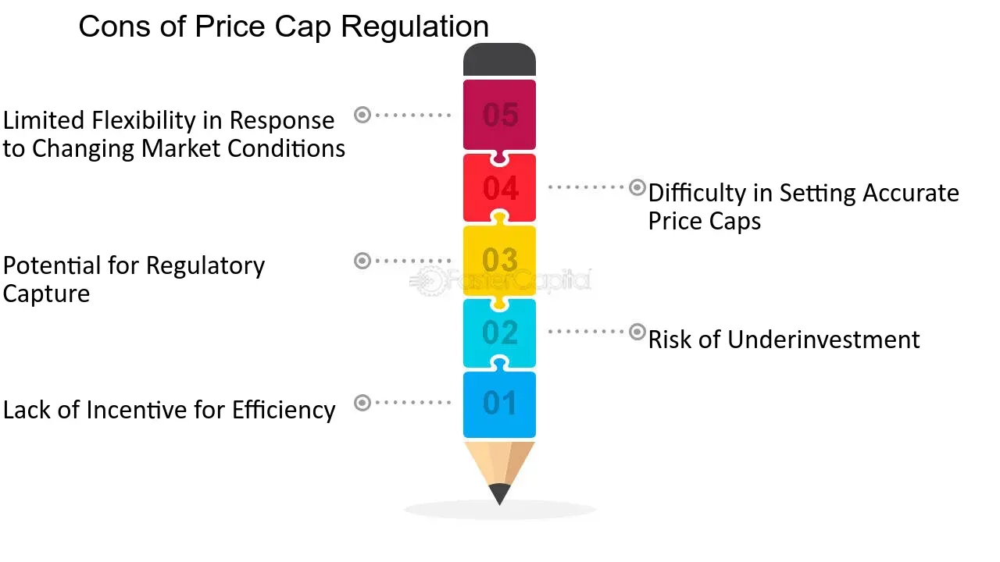

## Table of Contents

## What is revenue cap regulation?

Revenue cap regulation is a way to control how much money a company, usually a utility like an electricity or water provider, can make. Instead of setting prices for each service, this method sets a total amount of money the company can earn over a certain time. This total amount is called the revenue cap. The idea is to make sure the company doesn't charge too much but still has enough money to run well and improve services.

The revenue cap is figured out by looking at things like how many customers the company has, how much it costs to run the business, and how much money it needs to invest in improvements. If the company does a good job and keeps costs down, it can keep any extra money it makes up to the cap. But if it goes over the cap, it has to give the extra money back to customers. This encourages the company to work efficiently and keep prices fair for everyone.

## How does revenue cap regulation differ from other regulatory mechanisms?

Revenue cap regulation is different from other regulatory methods because it focuses on the total amount of money a company can earn, rather than setting specific prices for each service. For example, in price cap regulation, the government sets a maximum price that the company can charge for its services. This means the company can make more money if it can sell more services, but it can't charge more than the set price. On the other hand, with revenue cap regulation, the company has a limit on its total earnings, so it has to think about how to use its resources efficiently to stay within that limit.

Another way revenue cap regulation differs is in how it encourages efficiency and investment. In rate of return regulation, the company is allowed to earn a certain percentage of profit on its investments. This can sometimes lead to over-investment because the more the company spends, the more profit it can make. Revenue cap regulation, however, motivates the company to keep costs down and invest wisely because any savings can increase their profit up to the cap. This method helps balance the need for fair pricing with the company's need to make enough money to keep services running well.

Overall, revenue cap regulation provides a flexible approach that can adapt to changes in demand and costs, unlike fixed price or rate of return methods. By focusing on total revenue, it encourages companies to find efficient ways to operate and deliver services, which can benefit both the company and its customers in the long run.

## What are the basic mechanisms of revenue cap regulation?

Revenue cap regulation works by setting a limit on how much money a company can make over a certain period. This limit, or cap, is based on things like how many customers the company has, how much it costs to run the business, and how much money it needs to invest in improvements. The company can keep any extra money it makes up to the cap, which encourages it to work efficiently and keep costs down. If the company makes more money than the cap allows, it has to give the extra back to customers, making sure prices stay fair.

This type of regulation is different from other methods because it focuses on the total amount of money the company can earn, not on setting specific prices for each service. For example, with price cap regulation, the government sets a maximum price for services, but the company can make more money by selling more services. With revenue cap regulation, the company has to balance how it uses its resources to stay within the total earnings limit. This approach helps make sure the company doesn't overcharge customers while still having enough money to run well and improve services.

## How is the revenue cap calculated and set?

The revenue cap is figured out by looking at a few important things. First, they think about how many customers the company has and how much those customers use the services. Then, they look at how much it costs the company to run its business, including things like paying workers, keeping equipment working, and other daily expenses. They also consider how much money the company needs to spend on big projects to improve or expand its services. All these pieces of information help decide what the revenue cap should be.

Once all the numbers are put together, the revenue cap is set for a certain time, usually a few years. During this time, the company can try to make money up to the cap. If it can keep its costs down and work efficiently, it can keep any extra money it makes up to the cap. But if it goes over the cap, it has to give the extra money back to customers. This way, the company is encouraged to run well and keep prices fair for everyone.

## What are the key components of a revenue cap formula?

The revenue cap formula is made up of a few important parts. First, it looks at how many customers the company has and how much they use the services. This helps figure out how much money the company should be able to make. Then, it considers the costs of running the business, like paying workers, keeping equipment working, and other daily expenses. These costs are important because they show how much money the company needs to keep going.

Another big part of the formula is the money the company needs to spend on big projects. These projects can be things like building new facilities or improving old ones, which help the company grow and serve customers better. All these pieces of information are put together to decide what the revenue cap should be. The cap is set for a certain time, and during that time, the company can try to make money up to the cap. If it can keep costs down and work efficiently, it can keep any extra money it makes up to the cap.

## How does revenue cap regulation impact pricing and service quality?

Revenue cap regulation can help keep prices fair for customers. Instead of setting a price for each service, it sets a total amount of money the company can make. This means the company has to think about how to use its resources well to stay within the cap. If the company can keep its costs down, it can keep any extra money it makes up to the cap. But if it makes more money than the cap allows, it has to give the extra back to customers. This way, the company is encouraged to not charge too much and to keep prices fair.

This type of regulation also affects how well the company runs its services. Because the company can keep any savings it makes up to the cap, it has a reason to work efficiently and keep costs low. This can lead to better service because the company might spend money on things like new equipment or better training for workers. But, if the company doesn't manage its money well, it might not have enough to spend on improvements, which could make service quality go down. So, revenue cap regulation tries to balance keeping prices fair with making sure the company can still provide good service.

## What are the main advantages of implementing revenue cap regulation?

Revenue cap regulation helps keep prices fair for customers. Instead of setting a specific price for each service, it sets a total amount of money the company can make. This means the company has to think about how to use its resources well to stay within the cap. If the company can keep its costs down, it can keep any extra money it makes up to the cap. But if it goes over the cap, it has to give the extra money back to customers. This encourages the company to not charge too much and to keep prices fair for everyone.

This type of regulation also helps the company work better and improve its services. Because the company can keep any savings it makes up to the cap, it has a reason to work efficiently and keep costs low. This can lead to better service because the company might spend money on things like new equipment or better training for workers. Revenue cap regulation tries to balance keeping prices fair with making sure the company can still provide good service, which is good for both the company and its customers.

## Can you provide examples of industries where revenue cap regulation is commonly used?

Revenue cap regulation is often used in industries that provide important services to the public, like electricity and water. These services are called utilities, and they are usually run by big companies that need a lot of money to keep everything working. By using revenue cap regulation, the government can make sure these companies don't charge too much for their services while still having enough money to run well and make improvements.

For example, in the electricity industry, the company might have a limit on how much money it can make from selling power to customers. If it can keep its costs down, like by using less expensive ways to make electricity, it can keep any extra money it makes up to the cap. This encourages the company to work efficiently and keep prices fair for people who need electricity.

## What are the potential disadvantages or challenges of revenue cap regulation?

Revenue cap regulation can be tricky because it's hard to set the right cap. If the cap is too low, the company might not have enough money to keep services running well or make improvements. This could lead to bad service quality, like power outages or water shortages. On the other hand, if the cap is too high, the company might not work as hard to keep costs down, and customers might end up paying more than they should.

Another challenge is that the company might try to game the system. For example, it might cut back on spending in ways that hurt service quality just to make more profit up to the cap. This can make it hard for the government to keep an eye on everything and make sure the company is doing a good job. It's a balancing act to make sure the company has enough money to do well but not so much that it doesn't care about keeping costs low and services good.

## How do regulatory bodies monitor and adjust revenue caps over time?

Regulatory bodies keep an eye on how well companies are doing under revenue cap regulation by looking at their reports and checking their finances. They want to make sure the company is following the rules and not charging too much. If the company is doing a good job and keeping costs down, the regulatory body might leave the cap the same or even raise it a little to help the company keep improving. But if the company is making too much money or not providing good service, the regulatory body might lower the cap to make prices fairer for customers.

Over time, the regulatory body might need to change the revenue cap because things can change. For example, if the cost of running the business goes up because of higher prices for equipment or materials, the cap might need to go up too. Or if the company gets a lot more customers, the cap might need to be adjusted to make sure the company can still make enough money to serve everyone well. The regulatory body tries to keep the cap fair and balanced so the company can do a good job and customers don't have to pay too much.

## What advanced strategies can be used to optimize the effectiveness of revenue cap regulation?

To make revenue cap regulation work better, regulatory bodies can use smart ways to check how companies are doing. One way is to use performance-based incentives. This means if a company does a really good job, like keeping costs down or improving service, it can get a little extra money on top of the cap. This encourages the company to work hard and do well. Another way is to use regular reviews and adjustments. Instead of setting the cap for a long time, the regulatory body can check it more often, like every year or two. This helps make sure the cap stays fair and up-to-date with changes in costs or the number of customers.

Another strategy is to use better data and technology to keep an eye on things. With good data, the regulatory body can see exactly how the company is doing and make better decisions about the cap. For example, they can use smart meters to see how much electricity or water customers are using, which helps set a fair cap. Also, using computer models can help predict what might happen in the future, so the cap can be set just right. By using these advanced strategies, revenue cap regulation can be more effective and help keep prices fair while making sure the company can still do a good job.

## How does revenue cap regulation adapt to economic changes and technological advancements?

Revenue cap regulation can change to fit new economic situations and technology by using regular reviews and adjustments. If the economy changes, like if things get more expensive or if there are more customers, the regulatory body can look at the cap again and change it to make sure it's still fair. For example, if the cost of running the business goes up because of higher prices for equipment or materials, the cap might need to go up too. This way, the company can still make enough money to keep services running well and make improvements.

Technology can also help make revenue cap regulation work better. With new tools like smart meters, the regulatory body can see exactly how much electricity or water customers are using. This helps them set a fair cap that matches what people are actually using. Also, using computer models can help predict what might happen in the future, so the cap can be set just right. By keeping up with technology and making changes when the economy shifts, revenue cap regulation can stay effective and help keep prices fair for everyone.

## References & Further Reading

[1]: Armstrong, M., & Sappington, D. (2007). ["Recent Developments in the Theory of Regulation."](https://www.sciencedirect.com/science/article/pii/S1573448X06030275) Handbook of Industrial Organization, Volume 3.

[2]: Cartea, Á., Jaimungal, S., & Penalva, J. (2015). ["Algorithmic and High-Frequency Trading."](https://assets.cambridge.org/97811070/91146/frontmatter/9781107091146_frontmatter.pdf) Cambridge University Press.

[3]: Joskow, P. L. (2008). ["Incentive Regulation and Its Application to Electricity Networks."](https://economics.mit.edu/sites/default/files/2022-09/Incentive%20Regulation%20and%20its%20Application%20to%20Electricity%20Networks.pdf) Review of Network Economics, 7(4).

[4]: O'Hara, M. (2015). ["High Frequency Market Microstructure."](https://www.sciencedirect.com/science/article/pii/S0304405X15000045) Journal of Financial Economics, 116(2).

[5]: Vázquez, C., Rivier, M., & Pérez-Arriaga, I. J. (2002). ["A Market Approach to Long-term Security of Supply."](https://typeset.io/pdf/a-market-approach-to-long-term-security-of-supply-1k1l2kf0mi.pdf) Energy Policy, 30(13).