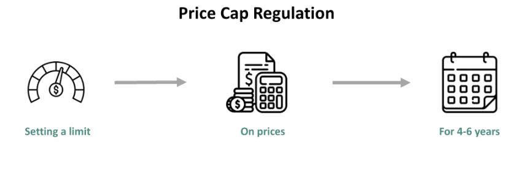

The interplay between revenue cap regulation, economic regulation, and algorithmic trading forms a complex framework impacting both financial and utility sectors. In industries often characterized by monopolistic conditions, such as utilities, revenue caps play a critical role. These caps are designed to prevent companies from setting excessive fees by limiting the total revenue they can earn, which encourages efficiency and better service quality. By capping revenue, regulators aim to keep prices reasonable for consumers while ensuring firms have the incentive to control costs and innovate.

On the other side of the spectrum lies the financial market, where algorithmic trading holds significant importance. This form of trading uses computer algorithms to automate and optimize trading strategies, drastically increasing the speed and efficiency of transactions. Algorithmic trading accounts for a substantial portion of trading volume in modern markets, influencing liquidity and price discovery processes. However, its sheer speed and scale bring about regulatory challenges to ensure market stability and fairness.



Economic regulations like revenue caps influence market behaviors and efficiencies by controlling the prices and conditions under which companies operate. These regulations play a crucial role in addressing market failures and protecting consumer interests by fostering competition and efficiency, even in less competitive market structures. In monopolistic and oligopolistic markets, regulation acts as a counterbalance to market power, ensuring fair access and pricing for consumers.

Thus, the relationship between revenue cap regulation, economic policy, and algorithmic trading embodies the broader challenges of balancing regulatory frameworks with technological advances and market efficiencies. Understanding this intersection is vital for stakeholders aiming to navigate the complex dynamics of regulated industries and rapidly evolving financial markets.

## Table of Contents

## Understanding Revenue Cap Regulation

Revenue cap regulation is a form of economic regulation employed primarily in monopolistic industries, such as utilities, where there is little or no competition. The primary purpose of revenue cap regulation is to limit the total amount of revenue that a company can earn over a specific period. This regulatory approach aims to prevent excessive profits while ensuring that consumers receive services at fair prices. Revenue caps are critical in industries where companies have a natural monopoly, such as electricity transmission or water supply, allowing regulators to control monopoly power and protect consumers from price exploitation.

Revenue cap regulation differs from other forms of regulation, such as price cap and rate of return regulation. Price cap regulation sets a maximum price that a firm can charge for its services, allowing the company to increase its efficiency and retain some of the resulting cost savings. Conversely, the rate of return regulation permits a company to earn a specified return on its investments, which can sometimes lead to overinvestment as firms seek to increase their asset base to justify higher returns.

The primary objective of revenue cap regulation is to balance revenue limits with incentives for efficiency and service quality. By capping total revenue instead of prices, firms are encouraged to reduce costs and improve efficiency, as they retain any surplus if they manage to provide services at lower costs than the cap allows. However, unlike price caps, revenue caps provide less of an incentive to aggressively cut prices, potentially maintaining a stable pricing environment for consumers. 

Revenue cap regulation is commonly applied in sectors such as utilities, where companies often operate as regional monopolies. For example, in electricity distribution, regulators may establish a revenue cap based on expected efficient costs and demand forecasts. This cap typically considers necessary operational and capital expenditures, incorporating an efficiency [factor](/wiki/factor-investing) to ensure that customers benefit from productivity improvements over time.

In summary, revenue cap regulation is a vital tool for overseeing monopolistic industries, promoting efficiency, and safeguarding consumer interests. It encourages companies to operate efficiently while providing high-quality services, creating a balanced approach to economic regulation in otherwise uncompetitive markets.

## Economic Regulation and Market Structure

Economic regulation plays a pivotal role in ensuring market stability, particularly in industries characterized by imperfect competition, such as monopolies and oligopolies. By implementing regulatory frameworks, governments and regulatory bodies attempt to curb the natural tendencies of dominant market players to exploit their positions. These regulations are crucial for preventing price gouging, ensuring fair competition, and safeguarding consumer interests.

Monopolistic and oligopolistic conditions arise when one or a few firms dominate the market. In these scenarios, the absence of competition can lead to uninhibited price increases and reduced incentives for innovation or efficiency. Economic regulation addresses these concerns by imposing rules and limits designed to mimic competitive outcomes. One common regulatory approach includes setting maximum prices that firms can charge, thereby preventing exploitative pricing strategies.

The effects of economic regulation on market dynamics are multifaceted. Regulation aims to foster competition by creating an environment where more firms can enter the market, which can lead to a wider variety of choices for consumers and potentially lower prices. Additionally, these regulations often include provisions for maintaining transparency and enforcing anti-competitive practices, which enhances consumer protection.

However, implementing effective economic regulation is not without its challenges and criticisms. Critics argue that overregulation can stifle innovation and efficiency by creating compliance burdens and limiting the ability of firms to respond swiftly to market changes. Furthermore, determining the optimal level of regulation is complex, as excessive intervention can lead to unintended consequences such as reduced incentives for firms to lower costs or improve service quality.

In some cases, regulation can inadvertently protect incumbent firms, particularly when new entrants face significant barriers to entry due to regulatory costs or requirements. This protectionism can perpetuate existing oligopolistic structures rather than encouraging genuine competition. Additionally, the dynamic nature of many industries means that regulatory frameworks often lag behind technological advancements, rendering them less effective over time.

Balancing the need for regulation with the benefits of free-market operations remains a central challenge for policymakers. Effective regulation requires continuous monitoring and adaptability to changing market conditions, ensuring that the objectives of promoting fair competition and protecting consumers are consistently met. This balance is essential for fostering competitive markets that operate efficiently while safeguarding public interest.

## Algorithmic Trading: An Overview

Algorithmic trading refers to the use of computer algorithms to automate trading decisions and execute orders in financial markets. This method employs complex mathematical models and formulas to make high-speed, high-frequency trading decisions without the delay of human intervention. Algorithmic trading is significant in financial markets because it enhances the speed, efficiency, and [liquidity](/wiki/liquidity-risk-premium) of market transactions. It accounts for a substantial [volume](/wiki/volume-trading-strategy) of trades on stock exchanges around the world and has transformed the dynamics of trading.

Several technologies underpin [algorithmic trading](/wiki/algorithmic-trading). High-frequency trading ([HFT](/wiki/high-frequency-trading-strategies)) is a popular subset that involves executing a large number of orders at extremely fast speeds. This is possible due to the use of sophisticated programs and powerful computing systems situated as close as possible to exchange servers. Common strategies in algorithmic trading include statistical [arbitrage](/wiki/arbitrage), [market making](/wiki/market-making), and [trend following](/wiki/trend-following), each employing specific mathematical models and historical data to predict and capitalize on market movements. Machine learning algorithms are increasingly adopted to enhance these strategies with improved predictions and adaptability to market changes.

The benefits of algorithmic trading are numerous. It provides increased accuracy and speed in order execution, reduces transaction costs, and minimizes errors associated with human trading. Additionally, algorithmic trading improves market liquidity and allows traders to analyze vast amounts of data instantly. However, there are risks associated with algo trading. The speed and efficiency of algorithms can exacerbate market [volatility](/wiki/volatility-trading-strategies), as evidenced during the "Flash Crash" of May 6, 2010, when the Dow Jones Industrial Average plummeted radically within minutes before recovering just as quickly. Moreover, the reliance on sophisticated software makes the market susceptible to technical failures and cybersecurity threats.

Regulation plays a critical role in the context of algorithmic trading. Financial regulatory bodies aim to ensure transparency, stability, and fairness in markets influenced by high-frequency trading. For instance, regulatory frameworks may impose limitations on the speed and frequency of trades, require detailed reporting of algorithmic strategies, and mandate the implementation of circuit breakers to prevent extreme volatility. These regulations aim to mitigate systemic risks while preserving the benefits of algorithmic innovations. Nevertheless, striking a balance between encouraging technological advancements and maintaining robust market safeguards remains a challenging regulatory task.

## Interplay Between Revenue Cap Regulation and Algo Trading

Revenue cap regulations are designed to limit the total revenue that a company can earn in industries where monopoly conditions exist, such as utility sectors. These caps are meant to ensure fair pricing, encourage efficiency, and maintain high service quality. However, the introduction of algorithmic trading strategies into such regulated markets adds a layer of complexity, potentially influencing pricing and market dynamics.

**Revenue Cap Regulations and Trading Practices**

Revenue cap regulations necessitate companies to focus on cost efficiency and service delivery within the predefined revenue limits. In sectors like electricity or gas utilities, where these caps are common, companies aim to optimize their operations to remain profitable despite revenue constraints. This environment sets a specific context for the deployment of algorithmic trading strategies, which can both align with and challenge regulatory goals.

Algorithmic trading, characterized by automated and high-speed decision processes, can affect trading practices under revenue cap regulations in various ways:

1. **Efficiency Enhancement**: Algorithms can optimize the scheduling and dispatch of resources (e.g., electricity generation or natural gas supply) to minimize costs. By analyzing data on consumption patterns, algorithms can suggest operational adjustments that keep costs within the capped revenue structure, thereby aiding compliance while maximizing allowable profit margins.

2. **Market Manipulation Risks**: While algorithmic trading can enhance efficiency, it also poses risks of market manipulation or excessive volatility, which are critical concerns under revenue cap scenarios. For instance, in a market where electricity prices are subject to revenue caps, algorithms might exploit pricing models to predict periods of price spikes, leveraging these predictions for arbitrage. This could lead to unintended market fluctuations, hampering the regulatory goal of price stability.

**Pricing and Market Dynamics**

Algorithmic trading significantly impacts pricing and market dynamics even under strict regulatory constraints. In volatile markets, algorithms quickly exploit price discrepancies, making arbitrage opportunities fleeting and market conditions highly dynamic. This characteristic is particularly evident in energy markets where real-time pricing can be influenced by factors such as weather, demand surges, or generator outages.

The primary concern for regulators is maintaining a balance between enabling efficient market behavior facilitated by algorithms, while avoiding potentially destabilizing practices. Revenue caps are intended to prevent excessive charges to consumers, but the speed and complexity of algorithmic trading can sometimes outpace regulatory oversight, creating a challenging environment for maintaining this balance.

**Conflicts and Synergies**

The integration of algorithmic trading in industries governed by revenue cap regulation can result in both conflicts and synergies:

- **Conflicts**: One potential conflict arises when trading algorithms drive market behavior in ways not anticipated by regulatory frameworks. For example, if algorithms exploit loopholes in market rules to generate profit opportunities that were not intended by the structure of revenue caps, this could necessitate regulatory intervention or adjustments.

- **Synergies**: On the other hand, algorithmic trading aligns well with regulatory goals when it promotes efficiency. Algorithms can assist in better demand forecasting, optimal resource allocation, and rapid response to market changes, all contributing to lower operational costs and enhanced service delivery within the constraints of revenue caps. By doing so, they help achieve the primary objectives of regulation: cost efficiency and service quality.

In summary, while the presence of revenue caps might initially appear to restrict trading freedom, the deployment of sophisticated algorithmic trading strategies can navigate these limitations, achieving compliance alongside market efficiency. This interplay requires continuous adaptation by regulators to address new trading strategies and ensure that the benefits of algorithmic trading do not come at the expense of market stability and consumer protection.

## Case Studies and Practical Examples

### Case Studies and Practical Examples

#### Revenue Cap Regulation in Utility Sectors

One prominent example of revenue cap regulation can be found in the utility sector, specifically within electricity and gas distribution companies. In these industries, revenue caps are designed to limit the total revenue that a utility can earn, based on predefined formulas that account for factors such as inflation, efficiency targets, and investment needs. For instance, the UK’s Office of Gas and Electricity Markets (Ofgem) employs a regulatory framework known as RIIO (Revenue = Incentives + Innovation + Outputs) to set price controls. This framework aims to encourage efficient investment and the delivery of high-quality service, balancing revenue caps with performance-based incentives.

In this setting, companies are encouraged to enhance operational efficiencies and deliver better customer service, rather than simply maximizing their revenue. This approach has led to significant improvements in infrastructure resilience and service quality, offering a model for other sectors looking to implement revenue caps effectively.

#### Algorithmic Trading in Regulated Markets

Algorithmic trading, which refers to the use of computerized systems to execute trades based on predetermined criteria, has had a noticeable impact on regulated markets, including those under revenue cap conditions. High-frequency trading (HFT), a subset of algorithmic trading, leverages speed and efficiency to capitalize on market inefficiencies that arise from regulatory and market structure complexities.

One pertinent example is the impact of algorithmic trading on the electricity market. The presence of algorithms can lead to more efficient pricing, as they quickly respond to supply and demand changes, yet they may also introduce volatility. For instance, algorithms can exploit discrepancies between spot and futures market prices, thereby influencing the spot market trends to align closer to the regulatory prices. Here is an outline of a simple Python algorithm that could be used for such purposes:

```python
# Simple algorithmic strategy to exploit price discrepancies
import numpy as np

def calculate_spread(spot_prices, futures_prices):
    return np.array(futures_prices) - np.array(spot_prices)

def execute_trades(spreads, threshold):
    trades = []
    for i, spread in enumerate(spreads):
        if spread > threshold:
            trades.append(f"Sell at futures, Buy at spot, time {i}")
        elif spread < -threshold:
            trades.append(f"Buy at futures, Sell at spot, time {i}")
    return trades

spot_prices = [50, 51, 52, 53]
futures_prices = [53, 52, 55, 54]
spreads = calculate_spread(spot_prices, futures_prices)
trades = execute_trades(spreads, threshold=1)
print(trades)
```

This algorithm calculates the spread between spot and futures prices and suggests trading strategies based on a threshold, illustrating one way algorithms influence the market.

#### Lessons Learned and Best Practices

From these examples, several lessons emerge that combine regulatory frameworks with market behaviors:

1. **Balancing Regulation and Innovation**: Revenue cap regulation and algorithmic trading can coexist if there is a careful balance that fosters innovation while maintaining market stability.

2. **Incentivizing Efficiency**: Models such as Ofgem's RIIO demonstrate the effectiveness of incentivizing firms through performance-based regulation rather than purely capping revenues, leading to better outcomes in service delivery and infrastructure development.

3. **Monitoring and Adaptation**: The integration of algorithmic trading necessitates continuous monitoring and adaptive regulations that can mitigate risks such as market volatility and ensure fair trading practices.  

4. **Collaborative Approach**: Stakeholders, including regulatory bodies, companies, and traders, should work collaboratively to ensure that regulations keep pace with technological advancements while protecting consumer interests.

These practices underscore the importance of adaptive and responsive regulatory frameworks in managing the complexities of modern markets, where digital technologies and traditional economic regulations intersect.

## Future Trends and Developments

Revenue cap regulation is positioned to evolve significantly as industries and regulatory frameworks adapt to rapid technological advancements. Future changes in revenue cap regulation practices are likely to incorporate more dynamic and flexible methodologies to better align with the fast-paced developments in technology and market structures. Emerging practices, such as performance-based regulations, are anticipated to gain traction, allowing for more nuanced approaches that consider real-time data and analytics to set revenue limits more effectively. These regulations could integrate mechanisms that account for economic fluctuations and consumer demand, potentially employing [machine learning](/wiki/machine-learning) models to predict and adjust caps dynamically.

Advancements in technology and data analytics hold substantial potential to reshape algorithmic trading. The utilization of big data and [artificial intelligence](/wiki/ai-artificial-intelligence) (AI) in trading algorithms is expected to enhance decision-making precision and execution speed, allowing traders to capitalize on market inefficiencies with greater accuracy. AI-driven models could be used to process vast amounts of market data, identifying patterns and making trades based on predictive analytics rather than solely reactive strategies. This shift towards data-intensive trading can lead to more sophisticated risk management techniques, where algorithms adapt swiftly to changing market conditions. For instance, Python libraries such as NumPy, Pandas, and TensorFlow may be employed to develop advanced trading models that learn from historical data and adjust strategies in real-time:

```python
import numpy as np
import pandas as pd
from tensorflow import keras

# Example of a simple feedforward neural network for trading strategy
def create_model(input_shape):
    model = keras.Sequential([
        keras.layers.Dense(64, activation='relu', input_shape=input_shape),
        keras.layers.Dropout(0.5),
        keras.layers.Dense(32, activation='relu'),
        keras.layers.Dropout(0.5),
        keras.layers.Dense(1, activation='sigmoid')
    ])

    model.compile(optimizer='adam',
                  loss='binary_crossentropy',
                  metrics=['accuracy'])
    return model

# Usage of the model to predict buy/sell signals
def prepare_data(df):
    # Process data to get input features and labels
    X = df.drop('target', axis=1).values
    y = df['target'].values
    return X, y

df = pd.read_csv('market_data.csv')  # Placeholder for actual market data
X, y = prepare_data(df)
model = create_model(X.shape[1:])
model.fit(X, y, epochs=10, batch_size=32)
```

As algorithmic trading continues to develop, regulatory frameworks are likely to adapt to ensure fair trading practices are maintained while protecting market integrity and investor interests. Regulations might evolve to address issues such as market manipulation through algorithmic strategies and ensure transparency in trading activities. Enhanced regulatory oversight could include mandatory disclosures of algorithmic trading strategies, real-time monitoring of trading activities by regulatory bodies, and comprehensive audits of trading algorithms to prevent unethical practices. Furthermore, regulators might develop collaborative frameworks with technology firms to harness AI's potential in improving market efficiency while safeguarding against systemic risks.

In conclusion, the future landscape of revenue cap regulation and algorithmic trading will be shaped by technological innovation and regulatory adaptations. The challenge lies in striking a balance between fostering technological advancements and maintaining robust regulatory frameworks that protect market participants. As industries continue to evolve, ongoing dialogue between regulators, technology developers, and market participants will be critical to achieve these goals.

## Conclusion

The interplay between revenue cap regulation, economic policies, and algorithmic trading represents a complex relationship crucial for the modern financial and utility sectors. Revenue cap regulation serves as an economic tool designed to limit the total revenue that a utility can earn, particularly in monopolistic markets. This encourages efficiency while striving not to compromise service quality. However, these caps must be delicately balanced against market efficiency and innovation, particularly as algorithmic trading becomes more prevalent.

Algorithmic trading has revolutionized financial markets by using advanced technology and data analytics to execute substantial volumes of trades at high speed. Its rise highlights the importance of dynamic regulatory frameworks capable of fostering innovation while ensuring market stability and consumer protection. The integration of such trading strategies within regulated sectors such as utilities could lead to enhanced price discovery and liquidity, yet it also presents potential challenges, like increased market volatility and systemic risk.

Key insights into this interaction underline the necessity of a balanced regulatory approach that recognizes the dual goals of efficacy and innovation. Economic policies should be flexible enough to adapt to rapid technological advancements while maintaining their commitment to safeguarding public interest and promoting fair competition. This ongoing evolution will likely require collaboration between policymakers, industry players, and technologists to navigate the complexities of contemporary markets effectively.

The future is poised to witness further developments in both regulatory practices and algorithmic trading techniques, shaped by advancements in artificial intelligence, machine learning, and data analytics. As these domains continue to interconnect, stakeholders must engage proactively to devise strategies that anticipate upcoming challenges while capitalizing on new opportunities for market efficiency and sectoral growth.

## References & Further Reading

[1]: Armstrong, M., & Sappington, D. (2007). ["Recent Developments in the Theory of Regulation."](https://www.sciencedirect.com/science/article/pii/S1573448X06030275) Handbook of Industrial Organization, Volume 3.

[2]: Cartea, Á., Jaimungal, S., & Penalva, J. (2015). ["Algorithmic and High-Frequency Trading."](https://assets.cambridge.org/97811070/91146/frontmatter/9781107091146_frontmatter.pdf) Cambridge University Press.

[3]: Joskow, P. L. (2008). ["Incentive Regulation and Its Application to Electricity Networks."](https://economics.mit.edu/sites/default/files/2022-09/Incentive%20Regulation%20and%20its%20Application%20to%20Electricity%20Networks.pdf) Review of Network Economics, 7(4).

[4]: O'Hara, M. (2015). ["High Frequency Market Microstructure."](https://www.sciencedirect.com/science/article/pii/S0304405X15000045) Journal of Financial Economics, 116(2).

[5]: Vázquez, C., Rivier, M., & Pérez-Arriaga, I. J. (2002). ["A Market Approach to Long-term Security of Supply."](https://typeset.io/pdf/a-market-approach-to-long-term-security-of-supply-1k1l2kf0mi.pdf) Energy Policy, 30(13).