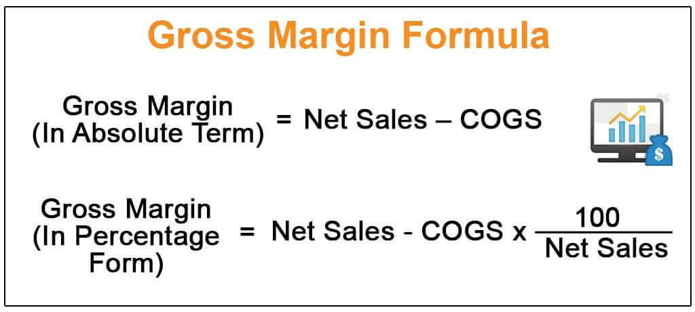

Algorithmic trading, also known as algo trading, represents a significant advancement in the financial markets by utilizing technology to automate trades at unprecedented speeds and frequencies. This innovative approach offers numerous advantages, including precise execution and the ability to adapt to real-time data, resulting in potentially higher returns and reduced trading errors. To capitalize on these benefits, understanding and analyzing financial metrics is essential for refining trading strategies.

One critical financial metric in this context is the gross margin. Gross margin indicates the percentage of revenue that exceeds the cost of goods sold (COGS), serving as an indicator of a company's financial health and operational efficiency. For algorithmic traders, evaluating financial factors such as revenue, gross margin, and costs can significantly enhance the profitability of trading strategies. By carefully analyzing these metrics, traders can identify areas where costs can be minimized and profits maximized.

This article aims to explore the integration of financial metrics analysis, like gross margin, into algorithmic trading strategies. It will highlight how these metrics are indispensable for optimizing strategies to achieve higher profitability in an ever-evolving financial landscape. Through advanced analytical techniques, traders can fine-tune their algorithms to not only execute trades effectively but also ensure they are financially advantageous after considering all associated costs.

## Table of Contents

## Understanding Gross Margin

Gross margin is a fundamental financial metric indicating the portion of revenue remaining after subtracting the cost of goods sold (COGS). It provides insight into a company's efficiency in managing its production costs relative to its revenue. The gross margin is usually expressed as a percentage and is calculated using the formula:

$$
\text{Gross Margin} = \left(\frac{\text{Revenue} - \text{COGS}}{\text{Revenue}}\right) \times 100
$$

This calculation reveals how much of each dollar of revenue a company retains as gross profit after accounting for the direct costs associated with producing its goods or services. For example, if a company has a revenue of $500,000 and COGS of $300,000, the gross margin would be computed as follows:

$$
\text{Gross Margin} = \left(\frac{500,000 - 300,000}{500,000}\right) \times 100 = 40\%
$$

A higher gross margin indicates better efficiency in transforming revenue into actual profit, which suggests robust control over production expenses. Conversely, a lower gross margin might suggest that production costs are too high relative to revenue, signaling potential issues in pricing, production management, or market competitiveness. Understanding gross margin is crucial for assessing a company's financial health and is a critical metric for investors and management to consider when analyzing a company's cost structure and profitability. The metric can aid in financial forecasting and strategic planning, supporting decisions that enhance operational efficiency and financial performance.

## Role of Financial Metrics in Trading

Financial metrics provide crucial insights into the performance of trading strategies by offering a comprehensive view of various aspects of market behavior and trade effectiveness. One of the primary financial metrics, gross margin, reflects the efficiency with which a company manages its production costs relative to its revenues. In trading, gross margin can similarly signify the cost-efficiency of trading operations, offering a measure of how much revenue from trades is retained after accounting for trading costs.

Another vital metric is Return on Investment (ROI), which is calculated as:

$$
\text{ROI} = \left( \frac{\text{Net Profit}}{\text{Total Investment}} \right) \times 100
$$

This metric assesses the profitability of trading strategies by comparing the gains from investments relative to their cost, providing a snapshot of efficiency in capital utilization.

Volatility is another key metric, important for evaluating the potential risk and reward of trades. High [volatility](/wiki/volatility-trading-strategies) can lead to larger price swings, which may result in increased potential for both gains and losses. Traders often use volatility to adjust their risk management practices, ensuring that strategies are aligned with their risk tolerance and market conditions.

In [algorithmic trading](/wiki/algorithmic-trading), these financial metrics are crucial for guiding adjustments and optimizations. Trading algorithms can be programmed to analyze these metrics in real-time, allowing for quick responses to market changes. For instance, algorithms can be designed to adjust trade sizes based on current volatility levels or to modify strategy parameters to maintain desired ROI and gross margin levels.

The integration of financial metrics into trading strategies enables more informed decision-making and the continuous improvement of algorithmic models. By focusing on cost-efficiency and profitability through metrics like gross margin and ROI, traders can enhance their strategies' performance, leading to greater success in the dynamic world of financial markets.

## Essential Metrics for Algorithmic Trading Performance

Metrics play a significant role in evaluating and optimizing the performance of algorithmic trading strategies. Among the most important metrics are the Sharpe Ratio, Maximum Drawdown, and Win Rate. These metrics provide a comprehensive view of the risk, return, and reliability of trading strategies, allowing traders to make informed decisions.

The Sharpe Ratio is a measure of risk-adjusted return, helping traders understand how much excess return is generated for each unit of risk taken. It is calculated using the formula:

$$

\text{Sharpe Ratio} = \frac{R_p - R_f}{\sigma_p} 
$$

where $R_p$ is the return of the portfolio, $R_f$ is the risk-free rate, and $\sigma_p$ is the standard deviation of the portfolio's return. A higher Sharpe Ratio indicates a more favorable risk-adjusted performance.

Maximum Drawdown measures the largest peak-to-trough decline in the value of an investment portfolio. This metric is crucial for understanding the potential risk and is defined as:

$$

\text{Maximum Drawdown} = \frac{\text{Trough value - Peak value}}{\text{Peak value}}
$$

This metric helps traders assess the potential downside of an investment strategy and its ability to recover from substantial losses.

Win Rate is the proportion of profitable trades to the total number of trades executed. It is a straightforward metric that indicates the frequency of successful trades and can be calculated as:

$$

\text{Win Rate} = \frac{\text{Number of Winning Trades}}{\text{Total Number of Trades}} \times 100\%
$$

While a high Win Rate implies frequent successful trades, it should be considered alongside other metrics, as it does not account for the size of wins relative to losses.

By analyzing these metrics, traders can refine their algorithmic trading strategies, balancing returns with risk, minimizing potential losses, and ensuring reliable performance. Through iterative testing and optimization, these metrics guide traders to enhance their strategies for improved effectiveness and profitability.

## Integrating Gross Margin into Algo Trading

Integrating gross margin analysis into algorithmic trading strategies significantly enhances the focus on cost efficiency, an essential aspect of maximizing profitability. Gross margin, which is calculated by the formula:

$$
\text{Gross Margin} = \left(\frac{\text{Revenue} - \text{COGS}}{\text{Revenue}}\right) \times 100
$$

serves as a vital indicator of how well a company manages its production costs relative to its revenue. By incorporating this metric into trading algorithms, traders are better equipped to configure their strategies towards achieving desired margin targets while minimizing associated costs.

Algorithmic trading systems can automatically adjust their decision-making parameters based on real-time gross margin data. For instance, if the gross margin falls below a certain threshold, algorithms can be programmed to either restrict trading activity or switch to alternative strategies that are designed to operate more cost-effectively. This dynamic adjustment helps ensure that the strategies not only seek profitable opportunities but also remain agile in the face of variable cost structures.

Furthermore, integrating gross margin analysis into trading systems prompts traders to pay closer attention to underlying cost factors that could impact overall profitability. As trading activities accumulate transaction costs and other expenses, ensuring that the gross margin remains favorable is crucial. By continuously monitoring and analyzing this metric, traders can make informed decisions about which strategies to pursue, hold, or discard.

The goal of using gross margin in algo trading is to maintain a balance where strategies are effective in exploiting market opportunities and simultaneously profitable after all expenses have been accounted for. This requires a thorough understanding of both the cost components involved in trading and the revenue expectations, facilitating more refined and effective trading systems that sustain long-term profitability.

## Challenges and Considerations

In algorithmic trading, two of the primary challenges encountered are overfitting and high transaction costs. Both can significantly hinder the effectiveness and profitability of trading strategies if not managed appropriately.

Overfitting in algorithmic trading refers to the scenario where a trading model is excessively tailored to historical data, capturing noise instead of genuine underlying patterns. This excessive fitting results in poorer performance when the model is applied to unseen, real-time data. To mitigate overfitting, traders can employ techniques such as cross-validation, which helps to ensure that the model generalizes well to new data rather than simply memorizing historical patterns. Additionally, complexity penalties or regularization techniques can be integrated into model development to prevent overfitting by discouraging overly complex models.

High transaction costs present another significant challenge, as they can considerably erode trading profits. These costs include broker fees, taxes, bid-ask spreads, and slippage, all of which can accumulate rapidly, especially when executing high-frequency trades. Hence, optimizing trade execution to minimize these costs is crucial. Techniques such as algorithmic execution strategies, including VWAP (Volume Weighted Average Price) and TWAP (Time Weighted Average Price), can be deployed to execute orders more efficiently, thereby reducing the price impact and the associated costs. 

Implementing strategies to improve [liquidity](/wiki/liquidity-risk-premium) utilization and market participation while minimizing adversarial price movements is essential. This also involves the judicious selection of trading venues and times to execute trades when liquidity is high, which helps to manage costs and improve overall trading performance. 

By addressing these challenges, traders can significantly enhance the resilience and effectiveness of their algorithmic trading strategies, ensuring that both predictive accuracy and profit optimization are achieved.

## Conclusion

Gross margin serves as a vital indicator for evaluating the profitability and efficiency of algorithmic trading strategies. It measures how effectively a strategy generates revenue relative to the cost of execution, providing insights into cost management and potential profit margins. This financial metric, when aligned with other analytical tools and performance metrics, can guide traders in optimizing their algorithms for superior outcomes.

Continuous refinement and adaptation of trading strategies are indispensable in responding to the ever-evolving financial markets. Market dynamics fluctuate due to various factors, including economic changes, political events, and technological advancements. Therefore, static strategies may quickly become obsolete. Regular updates and modifications, aided by comprehensive [backtesting](/wiki/backtesting) and real-time analysis, ensure that strategies remain competitive and resilient against market volatility.

Integrating financial metrics, such as gross margin, into algorithmic trading systems enhances the trader's ability to make informed decisions. By systematically analyzing these metrics, traders can adjust parameters and optimize execution, ultimately improving both performance and profitability. Algorithmic trading benefits significantly from data-driven decision-making processes, where financial metrics serve as pivotal components for strategy recalibration and risk management.

Through vigilant monitoring and strategic adjustments based on financial metrics, traders can not only mitigate risks but also amplify returns. This practice ensures that algorithmic trading strategies are not only aligned with market conditions but also poised to exploit opportunities efficiently. Consequently, effectively integrating financial metrics like gross margin into trading algorithms is essential for enhancing overall trading strategy performance and achieving sustainable profitability.

## References & Further Reading

Explore more about financial metrics in trading through additional resources and articles. 

1. **Academic Journals and Papers**: 
   - *The Journal of Finance* and *Financial Analysts Journal* frequently publish papers that provide insights into the application of financial metrics in algorithmic trading. These journals often feature research on topics like market microstructure, trading algorithms, and risk management metrics, which are crucial for understanding and developing robust trading strategies.

2. **Trading Books**:
   - Books such as "Algorithmic Trading: Winning Strategies and Their Rationale" by Ernie Chan offer practical perspectives on trading strategies and metrics. These resources cover various aspects of trading, from the implementation of different algorithms to assessing their performance using financial metrics.
   - "Quantitative Trading: How to Build Your Own Algorithmic Trading Business" by Ernie Chan is another valuable resource that provides guidance on setting up and optimizing trading strategies utilizing quantitative analysis.

3. **Financial Websites and Online Resources**:
   - Websites like Investopedia (www.investopedia.com) and Seeking Alpha (www.seekingalpha.com) offer articles and tutorials on trading metrics and financial analysis. These platforms provide an extensive array of articles, tutorials, and papers that cater to both novice and expert traders.
   - Online forums and communities such as those found on Reddit's quantfinance community and QuantConnect's forums can be excellent resources for real-world algorithmic trading discussions and insights.

4. **Online Courses and Webinars**:
   - MOOCs (Massive Open Online Courses) from platforms like Coursera and edX offer courses on financial analytics and algorithmic trading. These courses typically encompass a range of content, including the integration of financial metrics into trading strategies.
   - Webinars hosted by financial analysts and trading professionals often cover the latest trends and techniques in algorithmic trading. Participating in such webinars can provide valuable insights into the practical application of financial metrics.

Through these resources, traders and researchers can gain a deeper understanding of financial metrics and their impact on algorithmic trading strategies, leading to more informed decision-making and enhanced trading performance.

