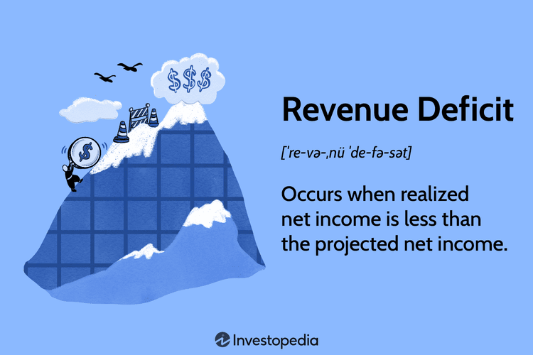

Understanding the concepts of budget deficit, fiscal policy, revenue deficit, and algorithmic trading is vital for assessing economic and financial scenarios. A budget deficit arises when government expenditures surpass revenues, leading to borrowing and impacting national debt levels. Fiscal policy, encompassing government strategies on expenditure and taxation, is employed to manage these deficits and stimulate economic growth. The relationship between government revenue and expenses can also result in a revenue deficit, where actual income falls short of projections, often prompting fiscal adjustments.

Algorithmic trading, or algo trading, utilizes advanced algorithms to assess market trends and execute trades rapidly. It has become increasingly prominent in capitalizing on economic conditions, including those shaped by budget and revenue deficits. The integration of fiscal data into trading models can enhance strategy execution, offering competitive advantages in volatile markets.



Through the exploration of these topics, this article seeks to illuminate their significance and interrelations, guiding readers towards a comprehensive understanding of the financial mechanisms that influence national economies and trading strategies. It is our objective that by the conclusion of this discussion, the complex interplay between fiscal policies and market dynamics will be clearer, allowing for informed decision-making in both economic policy formulation and investment activities.

## Table of Contents

## What is a Budget Deficit?

A budget deficit occurs when a government's spending surpasses its income within a given fiscal period. This imbalance necessitates borrowing, often by issuing government bonds, to cover the shortfall. Budget deficits are a critical concern for governments as they impact financial stability and economic policy.

### Causes of Budget Deficits

1. **Increased Government Spending**: Government spending can rise due to factors like infrastructure projects, healthcare obligations, and social security programs, particularly in response to public demands or welfare improvements. For instance, during economic crises, increased expenditure on unemployment benefits and economic stimulus packages can significantly raise government spending.

2. **Economic Downturns**: Recessions or slow economic growth can lead to reduced tax revenues due to lower household incomes and corporate profits. This scenario, coupled with potentially increased spending to buffer economic hardship, often results in budget deficits.

3. **Tax Policy**: Reduction in tax rates or inefficient tax collection mechanisms can weaken government revenues. Tax cuts intended to stimulate economic growth may lead to short-term revenue drops, conflicting with long-term fiscal balance.

### Consequences of Budget Deficits

1. **National Debt Accumulation**: Persistent budget deficits contribute to an increasing national debt as governments borrow to finance the shortfall. The accumulation of debt can lead to higher future interest payments, potentially crowding out essential public expenditures.

2. **Inflationary Pressure**: Financing deficits by printing additional money can lead to inflation. While moderate inflation may be considered stimulative, excessive inflation undermines economic stability, eroding purchasing power.

3. **Policy Constraints**: Large budget deficits can limit governmental fiscal-policy flexibility. High debt levels may reduce the ability to effectuate new policy measures, as financial resources are pre-allocated to debt servicing.

Understanding budget deficits is crucial for analyzing both the health of national finances and the formulation of fiscal policies. Measures to control budget deficits, such as prudent management of expenditures and reforms in tax policies, enhance fiscal sustainability and economic resilience.

## Exploring Fiscal Policy

Fiscal policy is a central tool by which governments seek to influence economic activity and achieve objectives like economic growth, inflation control, and employment generation. At its core, fiscal policy is the use of government spending and taxation to influence the economy. These adjustments can significantly impact a nation's financial ecosystem over both the short and long term.

**Addressing Budget Deficits through Fiscal Policy**

When faced with a budget deficit, where expenditures exceed revenues, governments employ various fiscal strategies to bridge this gap. Typically, the two broad approaches are reduction in government spending or increase in revenue through taxation. By altering these levers, governments can attempt to control budget deficits and align fiscal policy to economic goals.

For example, if a government decides to reduce its deficit by cutting down on expenditure, it may reduce spending on public services, subsidies, or defense. Conversely, increasing taxes on income, corporate profits, or value-added goods can drive higher revenues.

**Stimulating Economic Growth**

Fiscal policy is also employed to stimulate economic growth during periods of recession or economic downturn. An expansionary fiscal policy, characterized by increased government spending and reduced taxes, aims to increase aggregate demand, thereby boosting economic output. For instance, government expenditure on infrastructure can create jobs, spur business for suppliers, and generally increase money flow into the economy. Lowering taxes similarly increases disposable income for consumers and businesses, which can lead to more spending and investment.

Python snippet to illustrate the calculation of government multiplier effect:

```python
def calculate_multiplier(mpc):
    """
    Calculate the government spending multiplier effect.

    :param mpc: Marginal Propensity to Consume as a decimal.
    :return: Multiplier effect.
    """
    return 1 / (1 - mpc)

# Example usage
mpc = 0.8  # If the marginal propensity to consume is 0.8
multiplier = calculate_multiplier(mpc)
print(f"Government Spending Multiplier is {multiplier:.2f}")
```

**Impact of Expansionary and Contractionary Fiscal Policies**

Expansionary policies generally boost economic activity but may worsen budget deficits if increased spending isn't matched by increased revenues. Conversely, contractionary fiscal policies involve increasing taxes or cutting government spending to reduce inflation or budget deficits. While these can stabilize inflation, they often slow economic growth and increase unemployment in the short term.

**Role in Economic Stability**

Fiscal policy is integral to maintaining economic stability. In times of rapid economic growth, contractionary policy may help cool down the economy and prevent inflation. During economic slowdowns, fiscal stimuli can help rejuvenate demand and drive growth.

Governments need to carefully balance their fiscal approaches, weighing the immediate economic benefits against long-term impacts such as national debt sustainability and interest burden. Thus, fiscal policy serves not just as a response mechanism to economic conditions but as a proactive tool to steer national economies toward their growth targets and sustainable development paths.

Overall, prudent use of fiscal policy enables governments to manage cyclical economic variations and long-term structural changes, thereby fostering stable economic environments conducive to growth and prosperity.

## Understanding Revenue Deficit

A revenue deficit occurs when the actual collected revenue falls short of the projected revenue. This type of deficit distinctly differs from a fiscal deficit, which accounts for the total borrowings requirement of the government for a given fiscal year. Revenue deficits are critical indicators of fiscal health and can arise due to several factors, primarily stemming from the underperformance of expected revenue streams or inefficient management of expenses.

### Causes of Revenue Deficits

1. **Lower-than-expected Tax Revenue**: One of the main contributors to revenue deficits is the underperformance of tax revenue collections. This can result from economic downturns, legislative changes leading to reduced tax rates, or inefficiencies in tax collection mechanisms. A weak economic environment generally contracts the taxable income base and, consequently, the revenue realized from both direct and indirect taxes.

2. **Mismanaged Expenses**: Another significant factor is the misalignment between estimated and actual expenditures. Poor budget planning or unforeseen circumstances leading to increased government spending without a corresponding rise in revenue can widen the revenue deficit.

3. **Subsidy Burden**: Governments often provide subsidies to promote various sectors or to maintain socio-economic equality. If these subsidies exceed the budgeted allocation, they can contribute significantly to revenue deficits.

### Impacts on Government Operations

The presence of a revenue deficit can severely strain government operations. It limits the government's ability to invest in developmental projects or essential services, affecting socio-economic infrastructure and growth. Additionally, it may compel the government to borrow funds to meet its operational expenses, which in turn enhances the national debt burden.

### Potential Remedies

To mitigate revenue deficits, governments can implement a variety of strategies:

- **Improving Tax Administration**: Enhancing the efficiency and effectiveness of tax collection systems can significantly aid in optimizing revenue streams.

- **Cost-Cutting Measures**: Implementing stringent cost control measures and prioritizing essential spending can help align expenditures with actual revenue.

- **Rationalizing Subsidies**: Reviewing and rationalizing subsidy policies to ensure they are targeted and efficient can reduce unnecessary fiscal burdens.

- **Broadening the Revenue Base**: Diversifying and expanding the revenue base through new forms of taxation or by optimizing existing revenue sources is essential.

### Understanding Fiscal Responsibility and Economic Efficiency

Analyzing revenue deficits offers insights into the government's fiscal responsibilities and its economic efficiency. A persistent revenue deficit is indicative of structural issues within the revenue and expenditure framework, signaling the need for fiscal reforms. It prompts an assessment of economic policies to enhance revenue productivity and ensure the sustainable management of public finances. By addressing these challenges, nations can work toward improving their financial health and achieving economic stability.

## Algorithmic Trading and Economic Deficits

Algorithmic trading leverages modern technology to execute trades at speeds and volumes beyond human capacity, utilizing programmable logic and quantitative analysis of market conditions. This approach enables traders to react to economic indicators, such as budget and revenue deficits, with precision. These deficits provide critical information on government fiscal health, influencing investor sentiment and market trends.

Algorithmic trading systems can incorporate economic deficit data to optimize trading strategies. For example, fiscal deficits may lead to anticipations of inflation or [interest rate](/wiki/interest-rate-trading-strategies) changes, which, in turn, affect market pricing dynamics. An algorithm designed to respond to these conditions must assess such data swiftly and accurately. Suppose a government's budget deficit expands significantly, potentially leading to inflationary pressures. In such a case, an algorithm might increase positions in commodities or foreign currencies that are historically resilient to inflation.

A simplistic model integrating deficit data into trading might involve regression analysis to predict the impacts of deficit announcements on stock prices. Consider the following Python snippet:

```python
import numpy as np
from sklearn.linear_model import LinearRegression

# Sample data: Budget deficit (in billions) vs. stock index change (percentage)
budget_deficit = np.array([[50], [45], [60], [55], [70]])
stock_index_change = np.array([0.5, 0.3, 0.6, 0.4, 0.7])

# Create regression model
model = LinearRegression()
model.fit(budget_deficit, stock_index_change)

# Predict stock index change for a new budget deficit value
new_deficit = np.array([[65]])
predicted_change = model.predict(new_deficit)

print(f"Predicted stock index change: {predicted_change[0]:.2f}%")
```

This basic example illustrates using linear regression to correlate changes in budget deficits with stock index movements, helping traders adjust their strategies accordingly. More sophisticated models may integrate macroeconomic variables and sentiment analysis to enhance accuracy and responsiveness.

Moreover, [algorithmic trading](/wiki/algorithmic-trading) systems must account for the cascading effects of economic deficits. For instance, an expanding budget deficit may increase government borrowing, influencing bond yields and ultimately affecting currency valuations. In this context, algorithms could deploy [arbitrage](/wiki/arbitrage) strategies across different asset classes to exploit inefficiencies resulting from these ripple effects.

The role of algorithmic trading amid economic deficits is not merely reactive. These technologies can predict potential market shifts based on advanced statistical analyses and [machine learning](/wiki/machine-learning) models. By incorporating deficit-related insights, algorithms can preemptively adjust portfolios to mitigate risks and capitalize on emerging opportunities. This capability showcases the potential of algorithmic trading to navigate complex financial landscapes shaped by government fiscal policies, offering traders competitive advantages in an ever-evolving market environment.

## Conclusion

Budget and revenue deficits are integral to shaping fiscal policy and guiding economic strategies. A budget deficit occurs when a government spends more than it earns, influencing policy decisions to bridge the financial gap. Revenue deficits, indicative of a government's inefficiency in managing its income against expenses, necessitate careful economic planning to maintain fiscal health.

Algorithmic trading has emerged as a sophisticated tool for navigating financial markets, especially when economic deficits present complex market scenarios. Algo trading, which employs pre-defined algorithms to execute trades, can analyze deficit-related data to predict market fluctuations and optimize trade strategies. For instance, during periods of fiscal imbalance, changes in interest rates or monetary policies can be swiftly integrated into trading models, enabling better anticipatory actions.

A comprehensive understanding of budget and revenue deficits, along with algorithmic trading capabilities, is crucial for informed decision-making and economic policy formulation. Recognizing the implications of fiscal imbalances helps identify policy levers that can stabilize or stimulate economic growth. Concurrently, algorithmic trading provides a technological advantage by leveraging data-driven insights to exploit financial opportunities, thus enhancing strategic market engagement.

To effectively navigate these financial dynamics, continuous learning and adaptation are vital. Economic conditions constantly evolve, requiring updated knowledge and strategies to address emerging challenges and optimize market opportunities. By staying informed and agile, financial professionals and policymakers can better manage economic uncertainties and leverage the potential benefits that arise in the process.

## References & Further Reading

[1]: ["Fiscal Policy, Public Debt and Monetary Policy in EMEs: An Overview"](https://papers.ssrn.com/sol3/papers.cfm?abstract_id=2205188) by Bank for International Settlements

[2]: ["Government Finance Statistics Manual 2014"](https://www.imf.org/en/Publications/Manuals-Guides/Issues/2016/12/31/Government-Finance-Statistics-Manual-2014-Manual-41592) by International Monetary Fund

[3]: ["The Deficit Myth: Modern Monetary Theory and the Birth of the People's Economy"](https://www.amazon.com/Deficit-Myth-Monetary-Peoples-Economy/dp/1541736184) by Stephanie Kelton

[4]: ["Algorithmic Trading and DMA"](https://www.amazon.com/Algorithmic-Trading-DMA-introduction-strategies/dp/0956399207) by Barry Johnson

[5]: ["Fiscal Deficits and Debt"](https://www.investopedia.com/ask/answers/021015/what-effect-fiscal-deficit-economy.asp) by John H. Cochrane

[6]: ["JavaScript for Algorithmic Traders"](https://algoscript.io/) by Stuart Gordon Reid