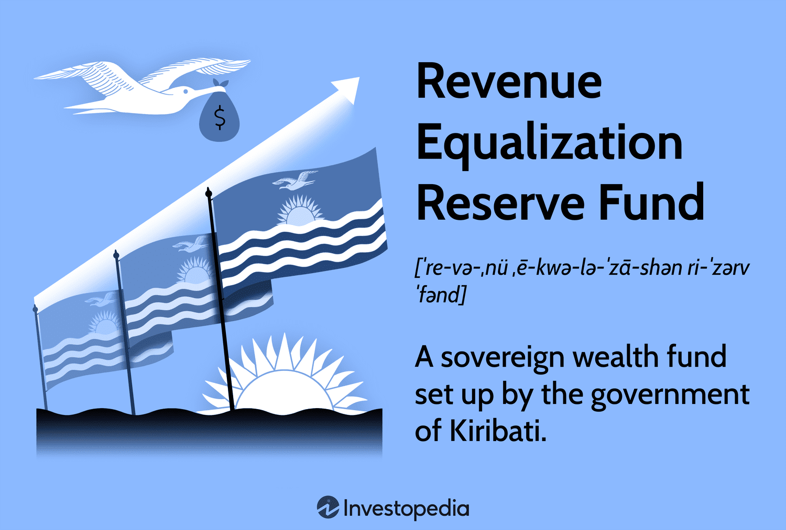

The Revenue Equalization Reserve Fund (RERF) serves as a pivotal instrument in fiscal policy, designed to stabilize economies against the unpredictability of revenue streams and economic disruptions. As nations grapple with the increasing volatility of global markets, the importance of mechanisms like the RERF cannot be overstated. By acting as a financial buffer, the RERF enables governments to effectively manage fluctuations in revenue, particularly those derived from natural resources and other volatile sectors. 

Understanding the RERF's role offers insights into its capacity to support fiscal stability. It achieves this by accumulating surpluses during periods of high revenue and deploying these reserves during downturns, thereby smoothing the fiscal impact of economic cycles. Such a strategy is crucial for maintaining consistent government spending, which in turn supports overall economic stability.



An additional dimension to the modern management of RERFs is the integration of algorithmic trading strategies. This technology-driven approach is reshaping financial markets through increased efficiency and minimized human error. By potentially incorporating algorithmic trading, countries can optimize the management of their RERFs. This involves automating complex trading decisions to take advantage of market conditions while adhering to the long-term goals of the fund. 

This article will explore these aspects, examining the mechanisms behind RERFs, the challenges they face, and their prospects amidst evolving financial technologies. By doing so, it provides a comprehensive overview of how RERFs serve as essential tools for fiscal policymakers in both traditional roles and within the rapidly advancing landscape of algorithmic trading.

## Table of Contents

## Understanding the Revenue Equalization Reserve Fund (RERF)

The Revenue Equalization Reserve Fund (RERF) functions as a sovereign wealth fund, designated by certain governments to manage economic instabilities in an effective manner. Initially, RERFs were created to deal with revenues derived from natural resources. For example, Kiribati established its own RERF to manage the revenues obtained from its phosphate mining operations. This model of financial management allows countries to harness the wealth generated from finite resources and mitigate the volatility associated with such revenue streams.

The fundamental objective of an RERF is to act as a financial cushion, which allows governments to maintain economic stability despite fluctuations in revenue. This is particularly critical for countries heavily reliant on resources whose prices can be volatile, such as oil, minerals, or other raw materials. By creating a buffer, these governments can plan fiscal expenditures and investments without being subject to sudden downturns in income due to price drops or resource depletion.

Globally, various countries have implemented RERFs with differing objectives and strategies based on their unique economic situations. For Kiribati, the RERF provides an essential mechanism to offset budgetary constraints by offering a steady stream of financial resources that can be tapped into when needed. This approach not only aids in managing resource reserves but also enables better financial planning and reduces dependency on a single resource or revenue stream.

In terms of fiscal policy, the RERF plays a pivotal role by ensuring that revenue fluctuations do not destabilize the economy. It provides a strategic reserve that can be strategically employed to support national budgets, especially during economic downturns or unexpected financial obligations. Consequently, RERFs contribute significantly to the broader fiscal stability and sustainability of nations that adopt them.

In conclusion, the RERF is a strategic financial instrument utilized by governments to safeguard their economies against the unpredictability of resource-based revenues. By effectively balancing current fiscal needs with future economic security, these funds underscore their importance in global fiscal policy frameworks.

## The Role of Algorithmic Trading

Algorithmic trading, often referred to as algo trading, utilizes automated systems to execute trading strategies based on predefined criteria. This methodology has significantly altered the trading environment by enhancing operational efficiency and minimizing the likelihood of human error. In [algorithmic trading](/wiki/algorithmic-trading), complex mathematical models and formulas are applied to decision-making processes, allowing for rapid trades that humans simply cannot replicate manually.

Countries with Revenue Equalization Reserve Funds (RERFs), such as Norway with its Government Pension Fund Global and the Alaska Permanent Fund, have begun integrating algorithmic trading into their fund management strategies. These sovereign wealth funds aim to achieve greater returns and risk diversification by leveraging the capabilities of algorithmic trading.

Algorithmic trading systems analyze vast amounts of data in real-time and can adjust their trading strategies in response to market fluctuations. This becomes particularly valuable for RERFs, which must manage large pools of capital across diverse assets. For instance, the integration of predictive models that assess market sentiments and trends can enhance decision-making, ultimately maximizing returns while maintaining the risk profile aligned with the fund's objectives.

The synergies between RERFs and algorithmic trading lie in the optimization of sovereign wealth management. By deploying algorithmic strategies, these funds can potentially increase their financial performance due to the following advantages:

1. **Enhanced Speed and Precision**: Automated systems execute trades in microseconds, taking advantage of even the smallest market inefficiencies.

2. **Data-Driven Decision Making**: Algorithmic models utilize historical and real-time data to predict market movements, enabling more informed trading strategies.

3. **Risk Management**: Algorithms can be programmed to incorporate risk management techniques, such as stop-loss orders, to protect against adverse market movements.

4. **Scalability**: As algorithms operate with minimal human intervention, scaling operations up or down based on fund size or market conditions becomes manageable.

A potential Python implementation that could be used by an RERF for simple moving average crossover strategy might look as follows:

```python
import pandas as pd

# Load data
data = pd.read_csv('market_data.csv')

# Calculate moving averages
data['SMA_20'] = data['Close'].rolling(window=20).mean()
data['SMA_50'] = data['Close'].rolling(window=50).mean()

# Generate trading signals
data['Signal'] = 0
data.loc[data['SMA_20'] > data['SMA_50'], 'Signal'] = 1
data.loc[data['SMA_20'] < data['SMA_50'], 'Signal'] = -1

# Calculate returns
data['Returns'] = data['Close'].pct_change() * data['Signal'].shift(1)

# Evaluate strategy performance
performance = data['Returns'].cumsum()
print("Cumulative Return:", performance.iloc[-1])
```

This basic example demonstrates how an RERF might employ a moving average strategy to decide when to enter or [exit](/wiki/exit-strategy) positions in the market, thereby optimizing the management of its assets.

Thus, with algorithmic trading, RERFs can potentially enhance their management efficiencies and financial outcomes, aligning investment strategies with their economic and financial goals.

## Mechanisms and Operations of the RERF

The Revenue Equalization Reserve Fund (RERF) operates as a financial mechanism designed to stabilize national economies by managing fluctuations in revenue, particularly from volatile sources like natural resource exports. The operation of RERFs involves several critical components: the collection of funds, investment strategies, and the utilization of these funds to maintain fiscal health.

### Fund Collection
The primary source of RERF funding typically originates from surplus revenues, often derived from natural resources. Governments allocate these excess revenues to the RERF during periods of economic prosperity. By doing so, countries aim to mitigate the impact of economic downturns when revenues may decline sharply. For instance, Kiribati established its RERF to manage revenues from phosphate mining, setting a precedent for how such funds are structured.

### Investment Strategies
Once collected, the funds within the RERF are strategically invested to generate returns that support economic stability and growth. The investment strategies vary depending on the risk tolerance and long-term economic objectives of the country. Common investment avenues include:

1. **Equities**: Stocks offer the potential for high returns, making them a popular choice for long-term growth within RERFs. The diversification of stock portfolios helps mitigate risks associated with market volatility.

2. **Fixed Income Securities**: Bonds and other fixed income investments provide stable returns with lower risk, balancing the potential volatility of equities.

3. **Alternative Investments**: These include assets such as real estate, commodities, and infrastructure projects. They offer diversification benefits and can be particularly advantageous in periods of stock market uncertainty.

The strategic allocation across these asset classes is fundamental to achieving a balance between risk and reward. For quantitative modeling, the Mean-Variance Optimization framework, developed by Harry Markowitz, is often employed to construct an efficient frontier. This frontier represents portfolios that deliver the highest expected return for a given level of risk.

```python
import numpy as np
import scipy.optimize as sco

# Sample returns and covariance
returns = np.array([0.10, 0.15, 0.12])
cov_matrix = np.array([[0.005, -0.010, 0.004], 
                       [-0.010, 0.040, -0.002], 
                       [0.004, -0.002, 0.023]])

# Portfolio optimization function
def portfolio_optimization(expected_returns, cov_matrix):
    weights = np.random.random(len(expected_returns))
    weights /= np.sum(weights)

    def portfolio_perf(weights, expected_returns, cov_matrix):
        port_return = np.sum(expected_returns * weights)
        port_vol = np.sqrt(np.dot(weights.T, np.dot(cov_matrix, weights)))
        return port_vol

    constraints = ({'type': 'eq', 'fun': lambda x: np.sum(x) - 1})
    bounds = tuple((0, 1) for _ in range(len(expected_returns)))
    optimized = sco.minimize(portfolio_perf, weights, args=(expected_returns, cov_matrix), 
                             method='SLSQP', bounds=bounds, constraints=constraints)

    return optimized

optimized_portfolio = portfolio_optimization(returns, cov_matrix)
print("Optimized Portfolio Weights:", optimized_portfolio.x)
```

### Fund Utilization
The utilization of RERF funds is meticulously planned to address fiscal challenges and stimulate economic activity when necessary. These funds can be mobilized during economic downturns to support government budgets, maintain public services, and invest in infrastructure projects that may not be feasible under constrained revenue conditions.

### Balancing Risk and Reward
Balancing the fine line between risk and reward is crucial for RERF operations, especially in volatile markets. This balance is achieved through diversified investment portfolios that aim to protect the fund’s capital while providing opportunities for growth. Implementing robust governance structures ensures the fund’s objectives align with long-term fiscal sustainability.

In summary, the mechanisms and operations of RERFs involve a comprehensive approach to fund collection, strategic investment, and prudent utilization, positioning them as vital tools in safeguarding economic stability.

## Challenges and Criticisms of the RERF

The Revenue Equalization Reserve Fund (RERF) is widely acknowledged for its capability to stabilize national economies by buffering against revenue fluctuations. However, its implementation is fraught with several challenges and criticisms. Primarily, political interference poses a significant challenge. Governments may be tempted to use the RERF to fund political projects or to cover budget deficits, particularly during election cycles. This could compromise the fund's long-term objective of ensuring economic stability and sustainability.

Another pressing issue is economic dependency. Sovereign wealth funds like the RERF are sometimes seen as an easy solution to economic woes, which can lead to over-reliance. This economic dependency can stifle the development of diversified income streams for a country, potentially creating a precarious economic situation if the primary source of revenue—often natural resources such as oil or minerals—experiences a downturn in market value.

Transparency and governance are critical points of scrutiny. In nations where governance structures are weak, the RERF could be subject to misuse or mismanagement. Lack of transparency in how funds are allocated and managed can lead to corruption and a loss of public trust. To mitigate these risks, it is essential for the RERF to operate with clear regulatory frameworks and independent oversight bodies that ensure accountability and transparency in fund operations.

A further debate surrounds the balance between current withdrawals and long-term savings. While short-term economic stimulation via fund withdrawals might be necessary during economic downturns, excessive reliance on such measures could deplete the fund, undermining future economic stability. The concept is generally driven by the trade-off between using the fund to support present-day economic needs and preserving it for future generations. This balance can be expressed in mathematical terms using a basic withdrawal rule:

$$
W_t = \begin{cases} 
F_t \cdot r, & \text{if } r_t \leq R_t \\
\text{min}(F_t \cdot r, S_t), & \text{if } r_t > R_t
\end{cases}
$$

where $W_t$ is the withdrawal amount at time $t$, $F_t$ is the fund's value at time $t$, $r$ is the standard withdrawal rate, $r_t$ is the required rate of withdrawal at time $t$, $R_t$ is the maximum sustainable rate, and $S_t$ is the sum required to sustain economic viability. Such formulas help in planning sustainable withdrawals that are aligned with both current economic conditions and the long-term health of the fund.

In conclusion, while RERFs provide critical support for stabilizing national economies, they are not immune to significant challenges. Ensuring political neutrality, reducing economic dependency, enhancing transparency, and striking a balance between immediate and future needs are vital for the fund’s success.

## Rotational Implementation and Future Enhancements

The Revenue Equalization Reserve Fund (RERF) plays a critical role in stabilizing national economies, but its effectiveness can be impacted by management practices. To enhance its functionality, reforms focusing on transparency and strategic allocation are essential. By ensuring open governance, stakeholders gain confidence in the fund's operations, minimizing the risk of political interference and misuse. A transparent RERF facilitates accountability, which is crucial for maintaining public trust and ensuring the funds are used as intended for economic stabilization and growth.

Strategic allocation of RERF assets involves careful planning to balance short-term economic stabilization with long-term fiscal sustainability. This involves optimizing the investment portfolio to achieve a reliable source of revenue without exposing the fund to undue risks. Diversification is a key strategy here, as it spreads investments across a variety of assets and reduces reliance on a single revenue stream, particularly valuable for economies heavily dependent on volatile resources like oil and minerals.

The integration of advanced technologies such as [artificial intelligence](/wiki/ai-artificial-intelligence) (AI) and [machine learning](/wiki/machine-learning) into RERF management has the potential to revolutionize fund operations. These technologies can analyze vast quantities of financial data to identify trends and predict market movements, enhancing decision-making processes. For instance, machine learning algorithms can develop predictive models to optimize investment strategies, improving returns while managing risk. Here's a simple Python example to illustrate how AI could be applied in this context:

```python
import numpy as np
from sklearn.ensemble import RandomForestRegressor

# Simulate some RERF data
X = np.random.rand(100, 5)  # Features: market conditions, resource prices, etc.
y = np.random.rand(100)     # Target: predicted fund returns

# Initialize and train the model
model = RandomForestRegressor(n_estimators=100)
model.fit(X, y)

# Predict future returns based on current conditions
current_conditions = np.random.rand(1, 5)
predicted_return = model.predict(current_conditions)
print("Predicted RERF return:", predicted_return)
```

Balancing short-term economic stabilization with long-term fiscal sustainability is a complex task for RERF managers. Immediate fiscal challenges require access to funds, but excessive withdrawals can deplete reserves intended for future generations. A prudent approach involves setting withdrawal limits based on anticipated economic needs and the fund's long-term objectives. This often requires simulating various economic scenarios to inform policy decisions, ensuring that funds remain adequate for addressing unforeseen future economic shocks.

Sustaining the RERF's effectiveness also means adapting to changing global economic conditions. As economies become more interconnected, the impact of international market shifts can significantly affect national reserves. Consequently, RERF strategies must remain flexible, adjusting investment policies in response to global economic indicators and forecasts.

In summary, rotating the implementation of RERF practices involves embracing transparency, utilizing advanced technology, and strategically managing fund allocations to maintain economic stability and sustainability. By focusing on these areas, governments can ensure that RERFs continue to serve as valuable instruments for economic resilience.

## The Continued Relevance of the RERF in Fiscal Policy

Revenue Equalization Reserve Funds (RERFs) continue to assert their importance as economic stabilizers, crucially supporting fiscal policy in a world marked by economic uncertainty. In situations where market fluctuations and geopolitical dynamics challenge fiscal stability, RERFs provide a buffer that enables countries to maintain economic order and avert crises.

RERFs reflect a strategic approach to counteracting economic volatilities, particularly for resource-rich economies that are vulnerable to market price swings. The Kiribati RERF offers a case study in successfully utilizing resource-derived wealth to secure economic stability. By effectively managing its resource revenues, Kiribati not only ensures a fiscal buffer but also invests in future development, thus embodying a principle of best practice.

Another exemplary instance is Norway's Government Pension Fund Global, which demonstrates how RERFs can be skillfully integrated into broader economic strategies. Norway's fund does not merely stabilize the economy in adverse conditions; it is a key component in promoting long-term prosperity through its adherence to robust governance structures, transparency, and prudent investment strategies. The allocation of funds adheres to a strategic asset allocation plan that balances risk with expected returns, underpinning its success and providing valuable lessons in fund management.

The experience of countries with successful RERF practices underscores the strategic role these funds play in a comprehensive fiscal strategy. They not only address immediate fiscal challenges but also play a part in long-term economic resilience. The prudent management of RERFs involves ensuring that funds are deployed in a manner that promotes economic growth while preserving capital for future generations. This dual function requires that RERFs maintain an equilibrium between saving for future stability and addressing present fiscal needs, a delicate balance that requires sound governance and strategic foresight.

The relevance of RERFs is further accentuated by their ability to integrate advanced financial management tools, including algorithmic trading. By leveraging these innovations, RERFs enhance their capacity to optimize asset allocation and improve outcomes, ensuring that they remain effective tools under varied economic conditions.

In summary, today's economic challenges necessitate the strategic utilization of RERFs as part of broader fiscal strategies. Lessons learned from the effective management of these funds highlight the critical importance of governance, transparency, and strategic foresight in maintaining economic resilience.

## Conclusion

The Revenue Equalization Reserve Fund (RERF) holds a vital place in contemporary fiscal strategy, serving as both a stabilizing force and a tool for economic resilience. By acting as financial buffers, RERFs allow governments to manage revenue [volatility](/wiki/volatility-trading-strategies), ensuring budget stability during economic fluctuations. This function is increasingly relevant in today's unpredictable global economy. As fiscal strategies evolve, incorporating advanced technologies such as algorithmic trading into RERF management presents a promising pathway to enhance fund performance. Algorithmic trading can optimize asset allocation and improve risk management by automating processes and leveraging data-driven insights.

To fully realize its potential, effective governance is paramount. This requires robust oversight mechanisms to prevent political interference and misuse, ensuring the fund's objectives are met. Transparency also plays a crucial role, fostering public trust and enabling stakeholders to hold fund managers accountable. Strategic foresight is essential in balancing short-term economic needs with long-term fiscal sustainability. This involves careful planning and adjusting fund strategies in response to changing economic conditions. By prioritizing these elements, RERFs can continue to be powerful instruments in maintaining fiscal health and economic stability in the future.

## References & Further Reading

[1]: Bergstra, J., Bardenet, R., Bengio, Y., & Kégl, B. (2011). ["Algorithms for Hyper-Parameter Optimization."](https://dl.acm.org/doi/10.5555/2986459.2986743) Advances in Neural Information Processing Systems 24.

[2]: ["Advances in Financial Machine Learning"](https://www.amazon.com/Advances-Financial-Machine-Learning-Marcos/dp/1119482089) by Marcos Lopez de Prado

[3]: ["Evidence-Based Technical Analysis: Applying the Scientific Method and Statistical Inference to Trading Signals"](https://www.amazon.com/Evidence-Based-Technical-Analysis-Scientific-Statistical/dp/0470008741) by David Aronson

[4]: ["Machine Learning for Algorithmic Trading"](https://github.com/stefan-jansen/machine-learning-for-trading) by Stefan Jansen

[5]: ["Quantitative Trading: How to Build Your Own Algorithmic Trading Business"](https://www.amazon.com/Quantitative-Trading-Build-Algorithmic-Business/dp/1119800064) by Ernest P. Chan