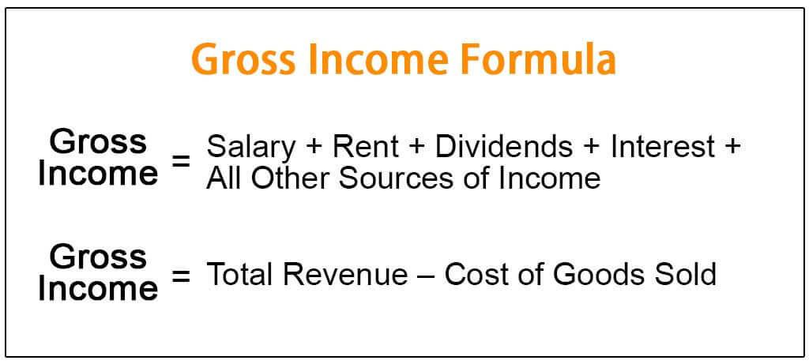

In today's financial landscape, revenue calculation plays a pivotal role in determining the success and growth of a business. Revenue, commonly referred to as the top line, is the income generated from goods or services before deducting any expenses. It serves as a primary indicator of a company's financial health, impacting its ability to invest, expand, and innovate. Furthermore, revenue figures are crucial for investors and stakeholders as they assess a company's market performance.

The advent of algorithmic trading introduces a fresh dynamic to revenue generation. This method employs mathematical models and high-speed computations to optimize trading strategies, aiming to maximize returns and minimize risks. Unlike traditional trading, which relies heavily on human judgment, algorithmic trading can process large volumes of data at an accelerated pace, making swift decisions that enhance revenue potential.



This article aims to explore the intricacies of revenue calculation, providing examples from diverse industries to illustrate its complexity. Additionally, the impact of algorithmic trading on financial markets will be examined, highlighting how it reshapes revenue streams. As financial markets become increasingly complex, understanding the dual facets of revenue and algorithmic trading becomes essential for businesses striving to maintain a competitive edge.

## Table of Contents

## Understanding Revenue

Revenue, commonly referred to as the top line, is the total income generated from the sale of goods and services by a business before any expenses are deducted. This metric serves as a critical indicator of a company's operational success and is an essential measure for assessing industry position and growth potential. The components of revenue can be broadly categorized into operating and non-operating revenues. 

Operating revenue originates from a company's core business activities. For instance, a retailer's operating revenue comes from selling merchandise, while a software company generates operating revenue through software sales and services. Non-operating revenue, on the other hand, comes from secondary sources not related to the company's main business activities. Examples include rental income, dividends from investments, and royalties.

Revenue recognition is a fundamental accounting concept and can be carried out using different methods, with accrual accounting and cash accounting being the most prevalent. In accrual accounting, revenue is recognized when it is earned, regardless of when the payment is received. This method provides a more accurate financial picture by matching revenues to the periods in which they are incurred. Conversely, cash accounting recognizes revenue only when the cash is received. While this approach is simpler and reflects cash flow, it might not always depict the true timing of revenue generation.

It is important to distinguish revenue from profit. Profit, also known as the bottom line, accounts for all expenses incurred in the process of generating income. Profit is calculated as revenue minus total expenses, including cost of goods sold (COGS), operating expenses, interest, taxes, and other costs. This distinction is vital because a company might show substantial revenue while operating at a loss if its costs outweigh its income.

Understanding the nuances of revenue is crucial for investors and stakeholders who rely on these figures to make informed decisions. Accurate revenue recognition not only ensures compliance with financial regulations but also enhances the reliability of a company’s financial statements, aiding in proper market analysis and valuation.

## Financial Calculations for Revenue

The core calculation of revenue involves using the formula:

$$
\text{Net Revenue} = (\text{Quantity Sold} \times \text{Unit Price}) - \text{Discounts} - \text{Allowances} - \text{Returns}
$$

This formula provides a foundation for understanding how much revenue a company generates from its sales. The quantity sold multiplied by the unit price provides the total gross revenue before any deductions. From this amount, businesses must subtract any discounts offered to customers, allowances for defective or unsatisfactory goods, and returns from customers. The resulting figure, net revenue, reflects the actual revenue earned by the company.

The application of this formula varies significantly across industries. Businesses need to tailor this approach based on their unique industry characteristics and financial practices. For instance, a manufacturing company selling physical goods might directly apply this formula, while a service-oriented business might adopt a different methodology. Service companies often have diverse product lines and revenue streams that necessitate adjustments to the basic formula, factoring in elements like time-based billing or subscription models.

The analysis of revenue can be extended using financial metrics such as the price-to-sales ratio (P/S ratio). This ratio provides insights into how a company's revenue performance relates to its market valuation. The formula for the price-to-sales ratio is:

$$
\text{Price-to-Sales Ratio} = \frac{\text{Market Capitalization}}{\text{Total Sales or Revenue}}
$$

A high P/S ratio could indicate that investors expect strong future growth and revenue generation, while a low P/S ratio might suggest undervaluation or potential issues in revenue expansion. Evaluating this ratio helps investors and analysts assess whether a company’s stock is appropriately priced relative to its sales.

In practice, these calculations assist businesses and stakeholders in understanding the fiscal health of an organization. By continually adapting and analyzing revenue calculations, companies can optimize their financial strategies to align with market demands and financial reporting standards. Integrating detailed revenue analysis with other financial tools enables a comprehensive evaluation of a company's performance and its market positioning. 

Here is a simple Python code snippet to calculate net revenue:

```python
def calculate_net_revenue(quantity_sold, unit_price, discounts, allowances, returns):
    gross_revenue = quantity_sold * unit_price
    net_revenue = gross_revenue - discounts - allowances - returns
    return net_revenue

# Example usage:
quantity_sold = 1000
unit_price = 50
discounts = 500
allowances = 200
returns = 300

net_revenue = calculate_net_revenue(quantity_sold, unit_price, discounts, allowances, returns)
print(f"Net Revenue: ${net_revenue}")
```

This code calculates the net revenue by subtracting the total deductions from the gross revenue, giving a clear picture of actual earnings from sales.

## Revenue Examples in Practice

Microsoft serves as a quintessential example of a company with extensive multi-channel revenue streams. By offering a wide array of products, such as the Office suite and cloud services like Azure, Microsoft has effectively diversified its revenue sources. The company's ability to generate income from different platforms and services allows it to maintain financial robustness and agility in rapidly changing markets. This diversification strategy not only mitigates risk but also maximizes revenue potential. Such a model of multi-channel revenue generation enables a business to maintain steady growth, even if one product line undergoes a temporary decline in sales.

Toyota exemplifies another strategic approach to revenue classification by segmenting its revenue based on vehicle type and geographic location. This strategy provides nuanced insights into regional market demands and allows Toyota to tailor its production and marketing strategies effectively. By categorizing revenue in this manner, the company can allocate resources more strategically and forecast future trends with greater accuracy. Such classification is beneficial for stakeholders looking to understand the specific factors driving a company's financial performance. This also facilitates strategic decision-making, enabling Toyota to optimize its product offerings and expand its market presence according to the demand trends observed in specific areas or categories.

In the real estate sector, revenue generation primarily stems from rental income, distinguishing itself from traditional product sales. Real estate investments focus on acquiring properties that generate consistent, long-term cash flows through tenant leases. This approach provides a steady income stream, which is particularly attractive to investors seeking reliability over high-risk, high-reward scenarios. Unlike product sales, which can fluctuate with market trends, rental income tends to offer greater stability. Real estate investors must, however, consider factors such as property maintenance costs, occupancy rates, and market conditions, which can impact overall revenue. 

Each of these cases highlights distinct methodologies in revenue reporting and generation, illustrating how businesses in different industries can optimize their financial practices to achieve sustained economic success.

## The Role of Algorithmic Trading in Revenue

Algorithmic trading uses computer systems to conduct trades at high speeds, offering several advantages in both market analysis and execution. This type of trading harnesses sophisticated algorithms to make split-second trading decisions, capturing profit opportunities that arise from price fluctuations faster than human traders ever could. By optimizing trading strategies and reducing human error, [algorithmic trading](/wiki/algorithmic-trading) significantly enhances revenue generation for financial institutions and individual traders alike.

One of the primary benefits of algorithmic trading is the ability to capitalize on market inefficiencies. Algorithms are designed to identify and exploit patterns or trends that may indicate profitable trades. For example, statistical [arbitrage](/wiki/arbitrage) uses mathematical models to identify discrepancies between the expected prices and market prices of financial instruments, executing trades that statistically guarantee a profit over time. High-frequency trading, a subset of algorithmic trading, involves executing thousands of trades per second, capturing small price movements that accumulate into substantial profits.

Python, along with other programming languages like C++ and Java, plays a crucial role in the development and testing of [quantitative trading](/wiki/quantitative-trading) strategies. Python's extensive libraries, such as NumPy, pandas, and scikit-learn, facilitate data analysis, manipulation, and [machine learning](/wiki/machine-learning), making it a popular choice among quantitative analysts and traders. Here is a simple example of a Python script that uses historical stock data to backtest a basic moving average crossover strategy:

```python
import pandas as pd

# Load historical data
data = pd.read_csv('stock_data.csv')

# Calculate moving averages
data['SMA_50'] = data['Close'].rolling(window=50).mean()
data['SMA_200'] = data['Close'].rolling(window=200).mean()

# Generate trading signals
data['Signal'] = 0
data.loc[data['SMA_50'] > data['SMA_200'], 'Signal'] = 1

# Calculate returns
data['Daily Return'] = data['Close'].pct_change()
data['Strategy Return'] = data['Signal'].shift(1) * data['Daily Return']

# Output cumulative returns
cumulative_return = (1 + data['Strategy Return']).cumprod() - 1
print(f"Cumulative Strategy Return: {cumulative_return.iloc[-1]:.2%}")
```

The script calculates a simple moving average (SMA) crossover strategy, generating buy signals whenever the 50-day moving average crosses above the 200-day moving average. While basic, this example illustrates how algorithmic strategies are backtested and refined before deployment in live markets.

The rise of algorithmic trading has fundamentally altered revenue streams in financial markets, allowing participants to execute complex strategies that were once impossible to implement manually. By leveraging technology and data-driven insights, algorithmic trading continues to shape financial landscapes, providing those who harness its power a significant competitive edge.

## Conclusion

Revenue calculation remains a foundational aspect of financial health and business strategy. It serves as a critical metric for determining a company's capacity to sustain operations, invest in growth, and provide returns to shareholders. Accurate revenue measurement and reporting enable sound financial planning and competitive analysis, ensuring that businesses align their strategic objectives with market opportunities.

Algorithmic trading introduces a refined approach to increasing revenue potential through sophisticated, data-driven decision making. By leveraging advanced mathematical models and computational power, algorithmic trading strategies can optimize trade execution and capital allocation. These algorithms, often implemented in Python or similar programming languages, allow for rapid analysis and execution, capturing profit opportunities presented by market fluctuations. This computational efficiency reduces the margin for human error and capitalizes on market inefficiencies, ultimately enhancing revenue streams.

In today's rapidly evolving financial landscapes, businesses must adopt innovative strategies and technologies. The integration of algorithmic trading and other technological advancements in financial operations is not merely advantageous but essential for remaining competitive. Companies capable of adapting to dynamic market conditions through technology stand to gain a substantial edge in revenue generation and market positioning.

For investors and analysts, scrutinizing revenue figures in conjunction with advancements in algorithmic trading is imperative for accurate market predictions and informed investment decisions. A comprehensive assessment of a company's revenue performance, augmented by an understanding of its use of algorithmic trading, offers deeper insight into its potential for growth and value creation. By evaluating these elements, stakeholders can make more strategic decisions, aligning investments with companies poised to leverage technological advancements effectively.

## References & Further Reading

[1]: Bergstra, J., Bardenet, R., Bengio, Y., & Kégl, B. (2011). ["Algorithms for Hyper-Parameter Optimization."](https://papers.nips.cc/paper/4443-algorithms-for-hyper-parameter-optimization) Advances in Neural Information Processing Systems 24.

[2]: ["Advances in Financial Machine Learning"](https://www.amazon.com/Advances-Financial-Machine-Learning-Marcos/dp/1119482089) by Marcos Lopez de Prado

[3]: ["Evidence-Based Technical Analysis: Applying the Scientific Method and Statistical Inference to Trading Signals"](https://www.amazon.com/Evidence-Based-Technical-Analysis-Scientific-Statistical/dp/0470008741) by David Aronson

[4]: ["Machine Learning for Algorithmic Trading"](https://github.com/PacktPublishing/Machine-Learning-for-Algorithmic-Trading-Second-Edition) by Stefan Jansen

[5]: ["Quantitative Trading: How to Build Your Own Algorithmic Trading Business"](https://books.google.com/books/about/Quantitative_Trading.html?id=j70yEAAAQBAJ) by Ernest P. Chan