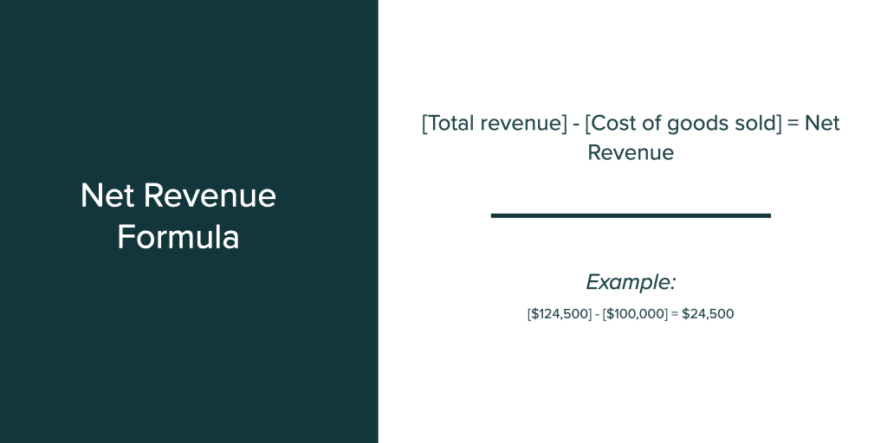

## Table of Contents

## What is revenue and why is it important for a business?

Revenue is the total amount of money a business earns from selling its products or services. It's like the money that comes into the business from customers. For example, if a store sells 100 shirts at $10 each, the revenue would be $1,000.

Revenue is important for a business because it is the main source of income. Without enough revenue, a business can't pay its bills, employees, or invest in new projects. It's like the lifeblood of the business, keeping everything running smoothly. If a business wants to grow or stay healthy, it needs to keep an eye on its revenue and make sure it's bringing in enough money.

## How is revenue different from profit and income?

Revenue is the total money a business gets from selling things or services. It's like all the cash that comes in from customers. Profit is different because it's what's left after a business pays all its bills and costs. So, if a store makes $1,000 from selling shirts but has to pay $800 for making them, the profit would be $200. Revenue is the starting point, and profit is what you have after everything is paid.

Income can mean different things depending on who you ask. For a person, income is usually the money they earn from their job or investments. For a business, income can be similar to revenue, but it's often used to talk about money earned before some costs are taken out, like taxes. So, while revenue is all the money coming in, income might be a bit less because some expenses are already subtracted. It's important to know these differences to understand how a business or a person is doing financially.

## What is the basic formula for calculating revenue?

The basic formula for calculating revenue is very simple. It's just the number of things you sell times the price you sell them for. For example, if you sell 50 apples and each apple costs $2, your revenue would be 50 times $2, which equals $100.

This formula works the same way for any business, whether you're selling apples, cars, or offering a service. If you offer haircuts and charge $20 per haircut, and you give 10 haircuts in a day, your revenue for that day would be 10 times $20, which is $200. It's all about multiplying the quantity sold by the price per item or service.

## Can you explain the difference between gross revenue and net revenue?

Gross revenue is the total amount of money a business makes from selling its products or services before any costs are taken out. It's like the full amount of money that comes into the business from customers. For example, if a bakery sells 200 cakes at $10 each, the gross revenue would be $2,000.

Net revenue, on the other hand, is what's left after you take away some costs from the gross revenue. These costs can include things like discounts, returns, or allowances. So, if that same bakery had to give $200 back because some cakes were returned, the net revenue would be the gross revenue of $2,000 minus the $200 in returns, which equals $1,800. Net revenue gives you a better idea of the actual money the business gets to keep after these adjustments.

## What are some common sources of revenue for different types of businesses?

Different types of businesses have different ways to make money. For stores like supermarkets or clothing shops, the main way they earn revenue is by selling products to customers. They buy things like food or clothes at a lower price and then sell them for more. Restaurants and cafes make money by selling food and drinks. They might also earn from catering services or selling special dishes.

Service businesses, like hair salons or cleaning companies, earn revenue by charging for the services they provide. A hair salon makes money by cutting hair or doing other beauty treatments, while a cleaning company earns from cleaning houses or offices. Tech companies often make money by selling software, apps, or offering services like cloud storage. They might also earn from ads or subscriptions.

Some businesses have multiple ways to earn revenue. For example, a gym might make money from membership fees, personal training sessions, and selling fitness products. Online platforms like social media sites can earn from ads, sponsored content, and sometimes by selling user data. Each business finds the best way to bring in money based on what they offer and who their customers are.

## How can a business track and record its revenue accurately?

A business can track and record its revenue accurately by using a good accounting system. This can be a computer program or even just a simple notebook, but it needs to keep track of every sale. Every time a business sells something, it should write down the date, what was sold, how much it was sold for, and who bought it. This helps the business know exactly how much money is coming in. It's also important to keep all the receipts and invoices, because they show proof of the sales and help make sure nothing is missed.

Another way to make sure revenue is tracked accurately is by using a point-of-sale (POS) system. Many stores and restaurants use these machines to ring up sales. The POS system keeps a record of every sale and can even break down the revenue by different products or services. This makes it easier to see where the money is coming from and helps catch any mistakes. It's also good to check the records regularly to make sure everything is correct and to fix any errors quickly. By doing these things, a business can keep a clear and accurate record of its revenue.

## What are the key factors that can affect a company's revenue?

A company's revenue can be affected by many things. One big thing is how much people want to buy what the company is selling. If a lot of people want the product or service, the company will make more money. But if not many people want it, the company will make less money. The price of what the company sells also matters. If the price is too high, fewer people might buy it, and if it's too low, the company might not make enough money even if a lot of people buy it.

Another important thing is how well the company can reach its customers. If a company can easily sell its products or services in many places, like online or in different stores, it might make more money. Competition is also a big [factor](/wiki/factor-investing). If there are a lot of other companies selling similar things, it can be harder to make money because customers have more choices. Finally, things like the economy or even the weather can affect how much money a company makes. If people have less money to spend because of a bad economy, they might buy less, and if bad weather stops people from going out, it can hurt sales too.

## How does revenue recognition impact financial reporting?

Revenue recognition is really important for financial reporting because it decides when a company can say it made money. It's like a rulebook that tells businesses when they can write down the money they got from selling things or services. If a company follows these rules correctly, it helps everyone who looks at the financial reports, like investors or banks, to trust the numbers. They can see a clear picture of how well the company is doing. If the rules aren't followed right, it can make the reports confusing or even wrong, which can cause big problems.

The way revenue is recognized can also change how a company looks on paper. For example, if a company gets paid for a big project but has to wait to say it made that money until the project is done, it might look like it's not doing as well as it really is. On the other hand, if a company can say it made money right away, even if the work isn't finished, it might look better than it really is. So, getting revenue recognition right is key to making sure the financial reports show the true story of the business.

## Can you provide examples of how to calculate revenue for a product-based business?

Let's say you own a toy store and you sell toy cars. Each toy car costs $5, and in one month, you sell 200 toy cars. To calculate your revenue, you just multiply the number of toy cars sold by the price of each one. So, 200 toy cars times $5 each equals $1,000. That means your revenue for the month from selling toy cars is $1,000.

Now, imagine you also sell toy trucks in your store. Each toy truck costs $10, and in the same month, you sell 100 toy trucks. To find out the revenue from toy trucks, you multiply the number of toy trucks sold by the price of each one. So, 100 toy trucks times $10 each equals $1,000. If you want to know the total revenue from both toy cars and toy trucks for the month, you add the revenue from each: $1,000 from toy cars plus $1,000 from toy trucks equals $2,000 total revenue for the month.

## How do service-based businesses calculate their revenue differently from product-based businesses?

Service-based businesses calculate their revenue by adding up all the money they earn from providing services to customers. For example, if a hair salon charges $30 for a haircut and they do 50 haircuts in a month, their revenue for that month would be $30 times 50, which equals $1,500. They might also have other services, like hair coloring or styling, and they would add up the money from all those services to get the total revenue. The main difference from product-based businesses is that service-based businesses are selling time and skills instead of physical items.

Product-based businesses, on the other hand, calculate their revenue by adding up the money they get from selling products. If a store sells 100 shirts at $10 each, their revenue would be $10 times 100, which equals $1,000. The key difference is that product-based businesses are selling tangible items that customers can take home, while service-based businesses are selling experiences or expertise that customers use right away. Both types of businesses use the same basic formula of multiplying the number of items or services sold by the price, but what they are selling is different.

## What advanced metrics can be used alongside revenue to assess business performance?

Alongside revenue, businesses often look at profit margins to see how well they're doing. Profit margin tells you how much money is left after paying all the costs to make or provide what you're selling. For example, if a business makes $1,000 from selling something but it cost them $800 to make it, their profit margin would be $200. This is important because it shows if the business is making enough money to cover all its costs and still have some left over. A high profit margin means the business is doing well, but a low one might mean they need to find ways to cut costs or raise prices.

Another useful metric is customer lifetime value (CLTV), which helps businesses understand how much money they can expect to make from a customer over time. If a customer keeps coming back to buy things or use services, they're worth more to the business than someone who only buys once. For example, if a gym member pays $50 a month and stays for a year, their CLTV would be $600. Knowing this helps businesses decide how much to spend on keeping customers happy and coming back. By looking at both revenue and these other metrics, a business can get a fuller picture of its performance and make better decisions.

## How can businesses use revenue data to forecast future performance and make strategic decisions?

Businesses can use revenue data to forecast future performance by looking at past sales and trends. If they see that sales go up every summer, they might guess that next summer will be the same. They can also look at how different things affect their sales, like if a new ad campaign made more people buy their products. By understanding these patterns, businesses can make smart guesses about how much money they might make in the future. This helps them plan better and make sure they have enough money to do things like buy more supplies or hire more workers.

Using revenue data also helps businesses make strategic decisions. For example, if they see that one product is making a lot of money, they might decide to focus more on selling that product. Or if they notice that sales drop in the winter, they might plan a special sale or promotion to bring in more customers during that time. By looking at the numbers, businesses can figure out what's working and what's not, and then make choices that help them grow and stay strong. This way, they can keep making money and stay ahead of their competition.

## What are the financial calculations for revenue?

The core calculation of revenue involves using the formula:

$$
\text{Net Revenue} = (\text{Quantity Sold} \times \text{Unit Price}) - \text{Discounts} - \text{Allowances} - \text{Returns}
$$

This formula provides a foundation for understanding how much revenue a company generates from its sales. The quantity sold multiplied by the unit price provides the total gross revenue before any deductions. From this amount, businesses must subtract any discounts offered to customers, allowances for defective or unsatisfactory goods, and returns from customers. The resulting figure, net revenue, reflects the actual revenue earned by the company.

The application of this formula varies significantly across industries. Businesses need to tailor this approach based on their unique industry characteristics and financial practices. For instance, a manufacturing company selling physical goods might directly apply this formula, while a service-oriented business might adopt a different methodology. Service companies often have diverse product lines and revenue streams that necessitate adjustments to the basic formula, factoring in elements like time-based billing or subscription models.

The analysis of revenue can be extended using financial metrics such as the price-to-sales ratio (P/S ratio). This ratio provides insights into how a company's revenue performance relates to its market valuation. The formula for the price-to-sales ratio is:

$$
\text{Price-to-Sales Ratio} = \frac{\text{Market Capitalization}}{\text{Total Sales or Revenue}}
$$

A high P/S ratio could indicate that investors expect strong future growth and revenue generation, while a low P/S ratio might suggest undervaluation or potential issues in revenue expansion. Evaluating this ratio helps investors and analysts assess whether a company’s stock is appropriately priced relative to its sales.

In practice, these calculations assist businesses and stakeholders in understanding the fiscal health of an organization. By continually adapting and analyzing revenue calculations, companies can optimize their financial strategies to align with market demands and financial reporting standards. Integrating detailed revenue analysis with other financial tools enables a comprehensive evaluation of a company's performance and its market positioning. 

Here is a simple Python code snippet to calculate net revenue:

```python
def calculate_net_revenue(quantity_sold, unit_price, discounts, allowances, returns):
    gross_revenue = quantity_sold * unit_price
    net_revenue = gross_revenue - discounts - allowances - returns
    return net_revenue

# Example usage:
quantity_sold = 1000
unit_price = 50
discounts = 500
allowances = 200
returns = 300

net_revenue = calculate_net_revenue(quantity_sold, unit_price, discounts, allowances, returns)
print(f"Net Revenue: ${net_revenue}")
```

This code calculates the net revenue by subtracting the total deductions from the gross revenue, giving a clear picture of actual earnings from sales.

## References & Further Reading

[1]: Bergstra, J., Bardenet, R., Bengio, Y., & Kégl, B. (2011). ["Algorithms for Hyper-Parameter Optimization."](https://papers.nips.cc/paper/4443-algorithms-for-hyper-parameter-optimization) Advances in Neural Information Processing Systems 24.

[2]: ["Advances in Financial Machine Learning"](https://www.amazon.com/Advances-Financial-Machine-Learning-Marcos/dp/1119482089) by Marcos Lopez de Prado

[3]: ["Evidence-Based Technical Analysis: Applying the Scientific Method and Statistical Inference to Trading Signals"](https://www.amazon.com/Evidence-Based-Technical-Analysis-Scientific-Statistical/dp/0470008741) by David Aronson

[4]: ["Machine Learning for Algorithmic Trading"](https://github.com/PacktPublishing/Machine-Learning-for-Algorithmic-Trading-Second-Edition) by Stefan Jansen

[5]: ["Quantitative Trading: How to Build Your Own Algorithmic Trading Business"](https://books.google.com/books/about/Quantitative_Trading.html?id=j70yEAAAQBAJ) by Ernest P. Chan