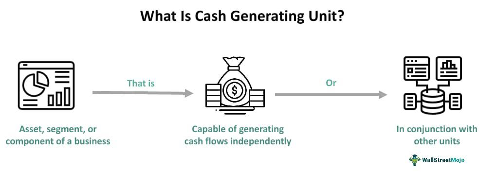

In today's data-driven world, understanding the right business metrics is crucial for companies striving for growth and sustainability. As businesses seek to enhance their decision-making processes, Revenue Generating Units (RGUs) emerge as a vital metric, particularly for subscription-based enterprises. RGUs represent a unit of product or service that contributes to a company's recurring revenue, making them invaluable for assessing the financial health and potential of a company.

The significance of RGUs is amplified when integrated with algorithmic trading, a process that uses complex algorithms and large datasets to inform trading decisions and optimize financial outcomes. This strategic combination enables companies to predict revenue streams and adapt swiftly to changing market conditions. By leveraging RGUs alongside algorithmic trading, businesses can protect and increase their revenue streams, thus boosting overall performance.

This article focuses on understanding RGUs, their critical role in business metrics, and how, when paired with algorithmic trading, they can drive strategic decisions that elevate business performance. The exploration of these concepts will provide insights into optimizing revenue strategies and staying competitive in an ever-evolving market landscape.

## Table of Contents

## What Are Revenue Generating Units (RGUs)?

A Revenue Generating Unit (RGU) is fundamentally defined as any discrete product or service that consistently generates income for a company. Predominantly encountered in industries such as telecommunications, media, and streaming, RGUs offer a detailed perspective on the contribution of various services to a company’s financial success. For instance, in telecommunications, each subscriber to a mobile, fixed-line, or internet service counts as an RGU, thereby providing a measurable indicator of revenue influx from each distinct service line.

The utility of RGUs extends beyond mere counting; it allows businesses to comprehend which customer segments generate the highest value. By segmenting their customer base according to RGUs, companies can identify patterns and preferences among specific groups, enabling them to tailor services and offerings to meet market demand more effectively. This strategy not only enhances customer satisfaction but also boosts market acceptance and retention rates, forming a critical component of competitive positioning.

Furthermore, tracking RGU data facilitates strategic decision-making. Companies can analyze fluctuations in their RGUs to gauge market dynamics and consumer behavior trends. This analysis, often conducted through advanced data analytics tools, empowers organizations to refine their product offerings and promotional strategies, ensuring alignment with consumer expectations and maximizing revenue potential. In essence, understanding and effectively managing RGUs is vital for businesses aiming to optimize their revenue streams and maintain sustainable growth trajectories.

## Importance of RGUs in Business Metrics

Revenue Generating Units (RGUs) play a significant role in understanding and interpreting business metrics. They are instrumental in offering a detailed perspective on a company's revenue streams, effectively highlighting its market position and growth potential. By focusing on RGUs, businesses can gain crucial insights into customer engagement and retention levels. Through careful monitoring of these metrics, companies are better positioned to gauge their overall health and trajectory, providing a comprehensive picture to investors and stakeholders interested in the long-term viability of the enterprise.

The value of RGU analysis extends beyond mere measurement; it enables a deep evaluation of marketing campaigns and strategic initiatives. By examining RGU data, businesses can determine the effectiveness of their marketing efforts, facilitating data-driven adjustments that align with consumer behavior and market trends. This analysis helps in identifying successful strategies and areas that require improvement, directly influencing a company's financial performance.

Furthermore, RGUs provide a basis for comparative analysis across time periods, allowing businesses to track changes in customer acquisition and retention. This comparative analysis is essential for understanding seasonal trends, competitive dynamics, and the impact of external factors on revenue. An effective RGU measurement system can become a predictive tool, suggesting future revenue patterns based on historical data. Businesses often employ statistical methods, such as time series analysis, to forecast future RGUs, assisting in strategic planning and resource allocation.

In summary, RGUs are not just a measure of current success; they are a forward-looking indicator that can inform strategic business decisions. By integrating RGU analysis into their overall business metrics framework, companies can ensure an agile response to market demands, optimize customer retention strategies, and drive sustained growth.

## RGUs and Average Revenue Per Unit (ARPU)

Average Revenue Per Unit (ARPU) is a critical metric derived from Revenue Generating Units (RGUs), offering valuable insights into the financial performance of businesses, particularly those operating with subscription-based models. ARPU reflects the revenue generated per subscriber or user, providing a clear picture of how effectively a company is monetizing its customer base.

The computation of ARPU is straightforward. It involves dividing the total revenue for a specific period by the average number of RGUs for the same period. Mathematically, it can be represented as:

$$
\text{ARPU} = \frac{\text{Total Revenue}}{\text{Average Number of RGUs}}
$$

This calculation serves as a vital tool for assessing a company’s pricing and profitability strategies. Companies can track ARPU over time to gauge the effectiveness of their pricing models and to identify trends in revenue generation.

Analyzing ARPU allows businesses to pinpoint areas for enhancing profitability. For instance, if ARPU is lower than expected, it may indicate that pricing strategies need adjustment or that additional value-added services should be considered to boost revenue per user. Conversely, a rising ARPU might suggest successful implementation of premium service offerings or effective customer retention strategies.

Moreover, a detailed examination of ARPU can help businesses tailor their service offerings to better align with customer preferences and willingness to pay. This could involve offering tiered services, personalized packages, or introducing innovative product features that justify a higher price point, ultimately driving increased ARPU and improved business outcomes.

By understanding and optimizing ARPU, companies can enhance their revenue strategies, ensuring they are competitive and sustainable in rapidly evolving market environments.

## Integrating RGUs with Algorithmic Trading

Algorithmic trading, which leverages sophisticated algorithms and mathematical models to facilitate decision-making in financial markets, can be effectively integrated with Revenue Generating Units (RGUs) to optimize business revenue strategies. By combining RGUs with these advanced trading techniques, businesses gain the ability to better predict revenue streams and emerging market trends, thus allowing for refined data-driven strategies.

One significant advantage of this integration lies in its ability to facilitate advanced data analytics. Through the application of algorithms, companies can process vast amounts of RGU data at an unprecedented speed and scale. This rapid analysis enables businesses to discern patterns and correlations between various customer segments and their respective revenue contributions. Consequently, companies can use this intelligence to tailor their service offerings and pricing structures to enhance profitability.

The integration also supports dynamic decision-making processes. By maintaining an ongoing analysis of RGU data, businesses can swiftly adapt to fluctuations in market conditions and evolving customer behaviours. For instance, if a sudden uptick in RGUs is detected in a particular demographic, a company can respond by adjusting its marketing efforts or resource allocation to capitalize on the opportunity. Conversely, a downturn in RGUs could prompt a reassessment of service offerings or engagement strategies to recapture market interest.

The adaptation to real-time data is enhanced by [machine learning](/wiki/machine-learning) algorithms, which can be employed to continuously learn from RGU data. These algorithms refine predictive models over time, improving their accuracy and the efficiency of subsequent business strategies. An example of such a model could be a time-series forecasting algorithm that projects future RGU trends based on historical data, enabling proactive business tactics.

In summary, integrating RGUs with [algorithmic trading](/wiki/algorithmic-trading) equips businesses with sophisticated analytical tools capable of improving prediction accuracy for revenue streams and market trends. This, in turn, facilitates a proactive and dynamic approach to decision-making, optimizing the overall revenue strategy while maintaining the flexibility needed to respond rapidly to changing market demands and customer preferences.

## Case Studies: Successful RGU Strategies

Telecommunication companies, such as AT&T and Verizon, have effectively utilized Revenue Generating Units (RGUs) to refine service bundles, thereby increasing customer retention and boosting both RGUs and Average Revenue Per Unit (ARPU). By analyzing RGU metrics, these companies gain detailed insights into customer preferences and usage patterns, allowing them to design more appealing service packages. This approach not only enhances customer satisfaction but also encourages users to subscribe to additional services, driving an increase in RGUs. For instance, AT&T regularly evaluates RGU data to optimize its product offerings, ensuring that its service bundles align with evolving customer needs and technological advancements. Similarly, Verizon employs RGU metrics to identify high-value subscriber segments and tailor its offerings to retain these crucial customers, thus maintaining a steady revenue flow.

In the streaming industry, companies like Netflix have mastered the use of RGUs to refine content strategies and adjust subscription models, leading to heightened user engagement and improved billing processes. By meticulously tracking RGUs, Netflix can pinpoint which content drives subscriber interactions and retention, allowing for strategic content investments that enhance viewing experiences. Additionally, this data informs subscription pricing strategies and package offerings, enabling Netflix to efficiently balance revenue growth with market competitiveness. For instance, by analyzing RGU trends, Netflix might decide to invest more in genres or series with proven customer appeal, thereby reinforcing its subscriber base and maximizing revenue opportunities.

These case studies underscore the pivotal role of RGUs in informing business strategies. Through comprehensive RGU analysis, both telecommunication and streaming giants can enhance customer satisfaction, optimize service offerings, and ultimately improve financial performance.

## Challenges and Considerations in RGU Measurement

Accurate tracking of Revenue Generating Units (RGUs) is crucial for businesses seeking to optimize their revenue and ensure strategic alignment. However, this process is fraught with challenges and considerations that can impact the quality and reliability of the insights obtained.

One primary challenge lies in ensuring data quality. The effectiveness of RGU analytics depends on precise and reliable data input. Errors or inconsistencies in the data collection process can result in flawed analytics, leading to misguided strategic decisions. To combat this, businesses must establish rigorous data management protocols, investing in advanced data verification and validation techniques to maintain data integrity.

A further complexity is the definition of what constitutes an RGU, especially in scenarios involving bundled service offerings. Bundles, which may include various combinations of products and services, create ambiguities in revenue attribution. Each component of the bundle might generate different levels of income and have distinct life cycles, complicating the identification of a singular RGU. Businesses must therefore adopt a nuanced approach to revenue attribution, possibly implementing weighted allocation models to accurately reflect the contribution of each service within a bundle.

Market differences also play a significant role in RGU measurement. Variations in consumer behavior, regional regulations, and market maturity can alter how RGUs are interpreted and utilized. Consequently, businesses need to maintain flexibility in their RGU measurement approaches, developing standardized yet adaptable frameworks capable of accommodating diverse market conditions. Implementing adaptive algorithms and localized metrics might mitigate these differences, ensuring that RGU insights remain relevant across varied contexts.

In summary, while RGUs are a vital metric in assessing business performance, their accurate measurement demands rigorous data quality control, careful consideration of revenue attribution, and an adaptable approach to account for market variances. These challenges, if not addressed, can undermine the integrity of RGU-based strategies and impact a company's ability to make informed decisions.

## Conclusion

Revenue Generating Units (RGUs) stand as a fundamental component in shaping an effective business strategy by offering crucial insights into revenue streams and customer behaviors. These insights enable businesses to dissect the composition and performance of their income sources, thereby allowing for a more granular understanding of how different customer segments contribute to overall financial health.

By integrating RGUs with algorithmic trading, companies gain the ability to forecast revenue streams with enhanced accuracy. Algorithmic trading leverages sophisticated data analytics to facilitate dynamic decision-making, which allows businesses to swiftly adapt to fluctuations in market conditions and shifts in consumer preferences. This synergy between RGUs and algorithmic trading fosters the development of more flexible strategies, tailored to meet the demands of an ever-changing market landscape.

Furthermore, an emphasis on RGU analysis ensures that organizations make informed decisions, harnessing insights to optimize customer engagement and retention strategies. Such a focus aids in fostering growth, as it equips businesses to react proactively rather than reactively, adjusting their offerings to better align with market expectations and opportunities.

In conclusion, RGUs provide a strategic toolset essential for maintaining a competitive edge in fast-evolving markets. By thoroughly analyzing these units, businesses not only safeguard their current revenue streams but also pave the way for sustainable long-term growth and innovation. This comprehensive approach in managing RGUs and leveraging algorithmic trading positions companies to not just survive, but thrive amidst market challenges.

## References & Further Reading

[1]: Coussement, K., Van den Bossche, F., & De Bock, K. W. (2014). ["Data Accuracy's Impact on Segmentation Performance: Benchmarking RFM Analysis, Logistic Regression, and Decision Trees"](https://www.sciencedirect.com/science/article/abs/pii/S0148296312002615). Journal of Business & Industrial Marketing.

[2]: Lopez de Prado, M. (2018). ["Advances in Financial Machine Learning"](https://www.amazon.com/Advances-Financial-Machine-Learning-Marcos/dp/1119482089). Wiley.

[3]: Jansen, S. (2020). ["Machine Learning for Algorithmic Trading: Predictive Models to Extract Signals from Market and Alternative Data for Systematic Trading Strategies"](https://www.amazon.com/Machine-Learning-Algorithmic-Trading-alternative/dp/1839217715). Packt Publishing.

[4]: Chan, E. P. (2009). ["Quantitative Trading: How to Build Your Own Algorithmic Trading Business"](https://github.com/egorpe/EPChan-QuantitativeTrading/blob/master/example7_6.m). Wiley.

[5]: Aronson, D. R. (2007). ["Evidence-Based Technical Analysis: Applying the Scientific Method and Statistical Inference to Trading Signals"](https://onlinelibrary.wiley.com/doi/book/10.1002/9781118268315). Wiley.